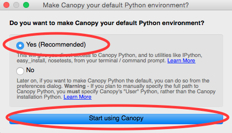

OS X and macOS install from source instructions
^^^^^^^^^^^^^^^^^^^^^^^^^^^^^^^^^^^^^^^^^^^^^^^^
.. _macsource:

#.  Install Enthought Canopy python distribution

    *   Download the free Canopy installer from:
        `https://store.enthought.com/downloads/#default <https://store.enthought.com/downloads/#default>`_

        *   We recommend the 64-bit version, unless you know you need the 32-bit version.

    *   Open the downloaded disk image, and drag the Canopy application into the Applications folder

    *   Start the Canopy application (for example, double click on it in the Applications folder).

        *   Canopy may not open, depending on user security settings. You have two
            options if it doesn’t open:

            *   Open canopy by right clicking on it in the applications folder and selecting :menuselection:`Open`.

            *   Change security settings by going to System Settings -> Security and Privacy,
                and selecting Allow apps downloaded from ‘Anywhere’.

        *   Accept the default environment install location

    *   The first time you run Canopy, it will ask you if you want to make it the
        default environment. Select Yes and Start using Canopy

    |10000201000001D70000010F57B2663BC0211A98_png|

        *   *Note:* In recent installation attempts I haven't seen this dialog. In that case you
            have to add the following to your :file:`.bash_profile`:
            ``source /Users/<username>/Library/Enthought/Canopy/edm/envs/User/bin/activate``

    *   More detailed install instructions are available here:
        `http://docs.enthought.com/canopy/quick-start/install_macos.html <http://docs.enthought.com/canopy/quick-start/install_macos.html>`_

#.  Install xcode command lines tools

    *   Opening a Terminal window by starting the Terminal app.

        *   Using the Launcher, it is located in the Other section.

        |10000201000006900000041A52DBF3453A0EEDE9_png|

        |10000201000007800000043899D84AD76212B4C9_png|

        *   Browsing the Applications folder in Finder, Terminal is in the Utilities folder.

    *   In the terminal window type ``xcode-select --install``

    |10000201000002370000016C05BA7C6C2536380E_png|

    *   Hit enter

    *   In the popup window, select install (you don’t need the whole xcode installation)

    |10000201000001CB000000BFFCB4D40B510BC3CE_png|

    *   Close the terminal window.

#.  Install the fabio, pyFAI, hdf5plugin, and weave python packages using pip

    *   Open a terminal window as in step 2.

    *   Type ``pip install --upgrade pip``

    *   Hit enter

    *   Once that installs, type ``pip install fabio pyFAI hdf5plugin weave``

    |100002010000023A0000016E415256FEF0DBA0B3_png|

    *   Hit enter

    *   Once the installation finishes, close the terminal window.

*   Download RAW from sourceforge

    *   `http://sourceforge.net/projects/bioxtasraw <http://sourceforge.net/projects/bioxtasraw>`_

    *   Navigate to the :guilabel:`Files` tab and download the latest source code,
        :file:`RAW-{x}.{y}.{z}-Source.zip`. Or download the latest development version
        from the git by navigating to the :guilabel:`Code` tab.

#.  Expand the downloaded zip file in the Downloads folder by double clicking on it.

    *   This step may not be necessary, some browsers may automatically expand zip files.

#.  Check if the top level directory contains files that look like the following image.

    |10000201000002880000025725B5A3369B69462C_png|

    *   If you see only a single folder, navigate down through the folders until you find
        a folder with all of the files in it, as in the above image.

        *   An example of this is shown below, where the expanded files has an :file:`src`
            directory in it, which contains all of the downloaded files.

        |1000020100000273000001C472F5D3F5C469CFE2_png|

#.  Move these files to Applications folder

    *   Move the folder that contains all of the RAW files to the :file:`Applications` folder.
        In the above image, this would be the :file:`src` folder.

    *   Rename the folder that you just moved to :file:`raw`.

#.  Run RAW from the terminal.

    *   Open a terminal window as in step 2.

    *   Type ``cd /Applications/raw``

    *   Hit enter

    *   Type ``python RAW.py``

    *   Hit enter

    *   When you start RAW for the first time, it compiles various extensions. This may
        take some time. Please be patient.

#.  Enjoy!

    *   In the future, you can start RAW as in the previous step.

    *   If you want, see the section on making a :ref:`clickable shortcut for RAW <macshrt>`

    *   If RAW doesn’t work, check out the :ref:`solutions to common problems <mactrb>`

**Setting up a RAW shortcut**

.. _macshrt:

The easiest way to set up a RAW shortcut is to expand the :file:`RunRAW.zip` file in the RAW
:file:`MacLib` folder, and move the :file:`RunRAW` app to wherever you want to have it. Start raw
by double clicking on the :file:`RunRAW` app.

    *   Note: since this is an application from an unknown developer (the RAW team!),
        you may have to give it permission to run. You can do this by right clicking on
        it and selecting :guilabel:`Open` or by changing your security settings by going to System
        Settings -> Security and Privacy, and selecting Allow apps downloaded from ‘Anywhere’.

If the shortcut doesn’t work, and/or you would rather not change your security settings,
you can follow these instructions to make your own shortcut:

#.  Expand the :file:`RunRAW.zip` file as above.

#.  Open the Automator app

    *   Automator is located in Applications folder.

#.  Select :guilabeL:`Open an Existing Document`

    |100002010000021F0000020B846426B3BC1F1FB4_png|

#.  Open the :file:`RunRAW` app (located in :file:`Applications/raw/MacLib`)

    |10000201000002C30000022C28B14ADDA1B8FC97_png|

#.  You should see a window like this:

    |10000201000003E40000036173138DAB0B7BE00D_png|

    *   Note: If you didn’t install RAW in the recommended location, you will need to
        change the line ``do script “python /Applications/raw/RAW.py”`` to have the appropriate
        path.

#.  Select :menuselection:`File --> Duplicate` from the menu.

#.  In the duplicate window (should be named RunRAW copy or Untitled), select :menuselection:`File --> Save`.

#.  Save the file as :file:`RunRAW` (:file:`.app`, if you are showing extensions) wherever
    you want to have the shortcut.

    *   Note: you can name it whatever you want. RunRAW is just the default name.

#.  Now you can launch raw just by double clicking the RunRAW icon.

    *   If it doesn’t work, make sure that you saved the duplicate, rather than the original!

.. |10000201000002C30000022C28B14ADDA1B8FC97_png| image:: images/mac_install/10000201000002C30000022C28B14ADDA1B8FC97.png

.. |10000201000007800000043899D84AD76212B4C9_png| image:: images/mac_install/10000201000007800000043899D84AD76212B4C9.png

.. |100002010000021F0000020B846426B3BC1F1FB4_png| image:: images/mac_install/100002010000021F0000020B846426B3BC1F1FB4.png

.. |10000201000003E40000036173138DAB0B7BE00D_png| image:: images/mac_install/10000201000003E40000036173138DAB0B7BE00D.png

.. |10000201000002370000016C05BA7C6C2536380E_png| image:: images/mac_install/10000201000002370000016C05BA7C6C2536380E.png

.. |1000020100000273000001C472F5D3F5C469CFE2_png| image:: images/mac_install/1000020100000273000001C472F5D3F5C469CFE2.png

.. |10000201000001CB000000BFFCB4D40B510BC3CE_png| image:: images/mac_install/10000201000001CB000000BFFCB4D40B510BC3CE.png

.. |10000201000006900000041A52DBF3453A0EEDE9_png| image:: images/mac_install/10000201000006900000041A52DBF3453A0EEDE9.png

.. |10000201000002880000025725B5A3369B69462C_png| image:: images/mac_install/10000201000002880000025725B5A3369B69462C.png

.. |100002010000023A0000016E415256FEF0DBA0B3_png| image:: images/mac_install/100002010000023A0000016E415256FEF0DBA0B3.png
