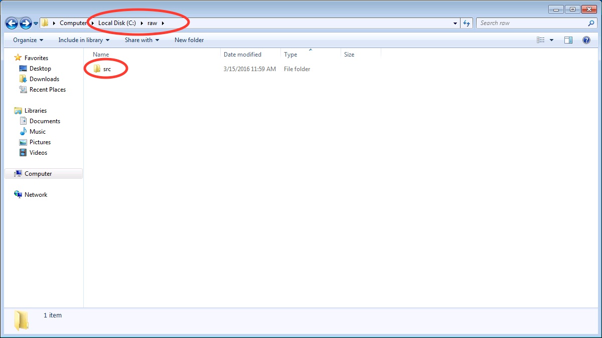
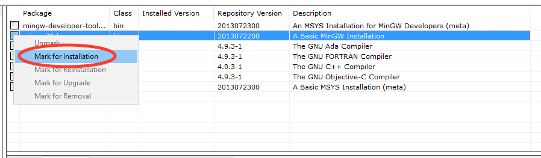
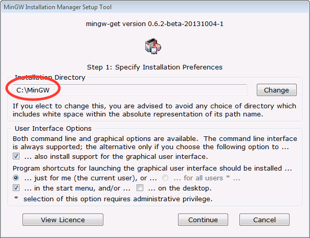
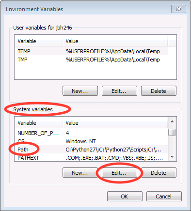
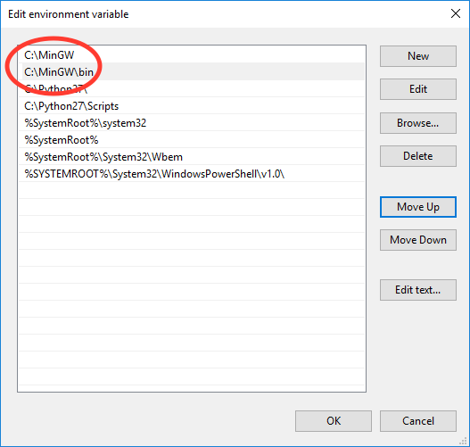
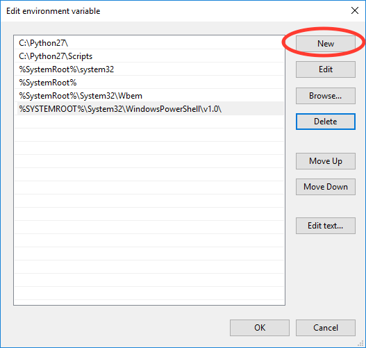
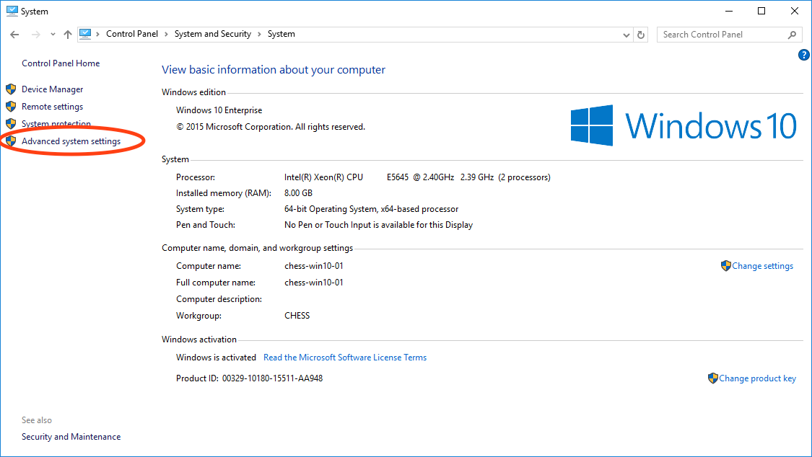

Windows 7, 8.1, and 10 install from source instructions
^^^^^^^^^^^^^^^^^^^^^^^^^^^^^^^^^^^^^^^^^^^^^^^^^^^^^^^
.. _winsource:

#.  Download and install the Microsoft Visual C++ Compiler for Python 2.7.

    *   Download from
        `https://www.microsoft.com/en-us/download/details.aspx?id=44266 <https://www.microsoft.com/en-us/download/details.aspx?id=44266>`_

    *   Run the installer with the default options.

#.  Download and install the Microsoft Visual C++ 2008 SP1 Redistributable Package (x86).

    *   Download from
        `https://www.microsoft.com/en-us/download/details.aspx?id=5582 <https://www.microsoft.com/en-us/download/details.aspx?id=5582>`_

    *   Run the installer with the default options.

#.  Install 32 bit python 2.7 from python.org. Make sure pip is installed, and add
    python to the windows path.

    *   Download the 32 bit python 2.7 installer for windows from
        `https://www.python.org/downloads/windows/ <https://www.python.org/downloads/windows/>`_

        *   Select the latest release (2.7.14 as of 3/16/18).

        *   Download the **Windows x86 MSI Installer** (NOT the x86-64 MSI Installer).

    *   Run the installer

    |10000201000001F3000001ACD121D31605B42F38_png|

    *   Accept the default installation location

    |10000201000001F3000001AC19F9C4CBF3C8339D_png|

    *   At the customization option, make sure that pip is installed and that you add python.exe to Path.

    |10000201000001F3000001AC231A6A61FD1E38C9_png|

#.  Download and install the MinGW compiler

    *   Download :file:`mingw-get-setup.exe` from
        `https://sourceforge.net/projects/mingw/ <https://sourceforge.net/projects/mingw/>`_

        *   The download button should default to the correct file for windows.

    *   Run the installer.

    |100002010000025E000001D2E196E75CF8A1C879_png|

    *   Install to the default location

    |100002010000025E000001D2A77894BD5D8E3872_png|

    *   Once the installer is finished, click continue

    |100002010000025E000001D2F3CB403BD4DC21F4_png|

    *   You will see this screen:

    |10000201000005A0000002F8958D1763BA7D6A5F_png|

    *   Click the boxes for ``mingw32-base`` and ``mingw32-gcc-g++`` and select mark
        for installation.

    |100002010000038200000107CA2FEA23D76FEFFA_png|

    *   Once selected, they should look like this:

    |100002010000047A000000C3630704E775D3E787_png|

    *   Click on the Installation menu and click Apply Changes.

    |10000201000001C90000012EB288A64B1B2F0AA5_png|

    *   In the windows that pops up, click Apply.

    |100002010000026A0000019A18D1DBE0E7432884_png|

    *   Close the MinGW installer.

#.  Add ``mingw`` and ``mingw\bin`` to the start of the global path variable. Use part a
    for Windows 7, part b for Windows 8.1, and part c for Windows 10.

    *   Windows 7:

        #.  Click on the Start Menu and click on Computer.

        #.  In the window that opens, click on System properties

            |10000201000004B0000002A39D9F7B9AAF7199ED_png|

        #.  In the window that opens, click on Advanced system settings

            |10000201000004B0000002A399479280B2C14985_png|

        #.  In the window that opens, click on Environment Variables…

            |10000201000001AA000001DA530895693A9AFBFA_png|

        #.  In the window that opens, In the System variables area, select the Path
            variable and click Edit…

            |100002010000018A000001B44A97BA7F3822CD71_png|

        #.  In the window that opens, add the following to the start of the path:
            ``C:\MinGW;C:\MinGW\bin;``

            |10000201000001650000009960C7066D18E91A52_png|

        #.  Click Ok several times to save and exit out of the settings.

        #.  Note: You can modify the User variable path instead of the System variable
            path if you want to only modify the setup for your user account, rather than
            the entire system. The same steps apply, but if you do not already have a
            use path variable, you will have to create one using the New button.

    *   Windows 8.1:

        #.  Open a file browser window and click on This PC. At the top, click on
            System properties.

            |1000020100000400000002A3DABD211FEEECB79E_png|

        #.  Continue with steps 3 and onward in the Windows 7 section above.

    *   Windows 10:

        #.  Click on the windows/start menu and click File Explorer.

        #.  In the file explorer window, click on This PC and then Computer

            |10000201000004650000027A03BF18E020461FAE_png|

        #.  Then click on System properties in the new menu

            |10000201000004650000027AD3998AF9790FC983_png|

        #.  In the window that opens, click on Advanced system settings

            |10000201000004650000027AE2E290525DBD0B1C_png|

        #.  In the window that opens, click on Environment Variables…

            |10000201000001AA000001DA530895693A9AFBFA_png|

        #.  In the window that opens, In the System variables area, select the
            Path variable and click Edit…

            |100002010000026A00000249E225CEB83B942F92_png|

        #.  In the window that opens, use the New button to add these items to the path:

            *   ``C:\MinGW``

            *   ``C:\MinGW\bin;``

            |100002010000020F000001F513FE0A5C8F181099_png|

        #.  Use the Move Up button to move the items to the start of the path

            |100002010000020F000001F51F1D34081877255E_png|

            |100002010000020F000001F5824FFFD405BF36E6_png|

        #.  Click Ok several times to save and exit out of the settings.

        #.  Note: You can modify the User variable path instead of the System
            variable path if you want to only modify the setup for your user account,
            rather than the entire system. The same steps apply, but if you do not
            already have a user path variable, you will have to create one using the New button.

#.  Restart your computer.

#. Downgrade the gcc compilers.
    *   Open a command prompt

        *   Windows 7: Click on the start menu, search for ``cmd``, then run the
            ``cmd`` program.
        *   Windows 8: Click on the windows tile and search for ``cmd``, then run the
            ``Command Prompt`` program.
        *   Windows 10: Click on the windows/start menu, select All Files, select
            Windows System, and click on ``Command Prompt``.

    *   Type ``mingw-get upgrade "gcc<6"`` and hit enter.
    *   Type ``mingw-get upgrade "g++<6"`` and hit enter.

#. Upgrade pip, setuptools, and wheel.
    *   Open a command prompt window as in the previous step (if necessary).
    *   Type ``python -m pip install --upgrade pip``
    *   Hit enter
    *   Once that finishes, type ``pip install --upgrade setuptools wheel``
    *   Hit enter

    |10000201000002A5000001562A234A434AEB65B5_png|

#.  Download and install numpy+mkl, scipy, and wxpython prebuilt versions.

    *   Go to
        `http://www.lfd.uci.edu/~gohlke/pythonlibs/ <http://www.lfd.uci.edu/~gohlke/pythonlibs/>`_
        and download:

        *   :file:`numpy-{x}.{y}.{z}+mkl-cp27-cp27m-win32.whl` (where :file:`{x}.{y}.{z}` is the version number).
        *   :file:`scipy-{x}.{y}.{z}-cp27-cp27m-win32.whl` (where :file:`{x}.{y}.{z}` is the version number).
        *   :file:`wxPython_common‑3.0.2.0‑py2‑none‑any.whl`
        *   :file:`wxPython‑3.0.2.0‑cp27‑none‑win32.whl`

    *   Note: It is important to download the cp27 win32 version, otherwise installation will fail!

    *   Open a command prompt window as in the previous step (if necessary).

    *   Navigate to the folder where you downloaded these files.

        *   The easiest way to do this is to type ``cd`` followed by a space, then drag
            the folder from the Explorer window into the command prompt window. You should see
            the path to the folder appear in the command prompt. Hit enter after that.

        *   Alternatively, in Explorer right click on the folder in the title bar and
            select :menuselection:`Copy address`. Then right click on the command prompt
            and select :menuselection:`Paste`.

    *   Type :file:`pip install numpy-{x}.{y}.{z}+mkl-cp27-cp27m-win32.whl`, replacing
        the :file:`{x}.{y}.{z}` with the appropriate version number. Hit enter.

    *   Type :file:`pip install scipy-{x}.{y}.{z}-cp27-cp27m-win32.whl`, replacing
        the :file:`{x}.{y}.{z}` with the appropriate version number. Hit enter.

    *   Type ``pip install wxPython_common‑3.0.2.0‑py2‑none‑any.whl`` and hit enter.
    *   Type ``pip install wxPython‑3.0.2.0‑cp27‑none‑win32.whl`` and hit enter.

#   Install matplotlib, pillow, lxml, h5py, fabio, weave, hdf5plugin, and pyfai using pip.

    *   Type ``pip install matplotlib pillow lxml h5py fabio weave hdf5plugin pyfai``
        and hit enter.

#.  Download RAW from sourceforge (
    `http://sourceforge.net/projects/bioxtasraw <http://sourceforge.net/projects/bioxtasraw>`_)

    *   Go to the Files tab on the linked website and download the :file:`RAW-{x}.y.z-Source.zip`
        file, where :file:`{x}.{y}.{z}` is the version number (for example, 1.0.0).

#.  Expand the downloaded zip file into the downloads folder

    *   Right click on the download and select :menuselection:`Extract All`

    *   Accept the default location for files to be extracted.

    |1000020100000274000001CAC03003E6F7E944B5_png|

#.  Check that the files are located at the top of the directory, as in the following image:

    *   Windows 7: Browse to Computer -> Local Disk -> raw

    *   Windows 8 and 10: Browse to This PC -> Local Disk -> raw

    |10000201000004B0000002A34A8866D873399BD8_png|

    *   You may have only a single subfolders, named something like :file:`raw` or :file:`src`.

    |10000201000004B0000002A3554A1F12D8C7CB87_png|

    *   If so, browse down levels until you find the directory containing files that
        look like the top image on this page, and copy everything in that folder to
        the top level :file:`raw` directory.

    |10000201000004B0000002A3E91BB88ED0783D2A_png|

#.  Run :file:`RAW.py` from the command line

    *   Open a command prompt as in Step 6 of these instructions.

    *   Type ``cd C:\raw``

    *   Hit enter

    *   Type ``python RAW.py``

    |10000201000002A50000015664F52DDA0E80AA97_png|

    *   Hit enter

    *   When you start RAW for the first time, it compiles various extensions, this
        may take a while. Please be patient.

#.  Enjoy!

    *   After running RAW for the first time, you can start it without using the command
        line simply by double clicking on :file:`RAW.py` in the :file:`C:\raw` folder.

    *   If you want to create a desktop shortcut, right click on :file:`RAW.py` and select
        :menuselection:`Send To --> Desktop`.

    *   If you have trouble with the installation, please see the
        :ref:`solutions to common problems <wintrb>` section below.

.. |100002010000026A00000249E225CEB83B942F92_png| image:: images/win_install/100002010000026A00000249E225CEB83B942F92.png

.. |10000201000004B0000002A34A8866D873399BD8_png| image:: images/win_install/10000201000004B0000002A34A8866D873399BD8.png

.. |100002010000025E000001D2F3CB403BD4DC21F4_png| image:: images/win_install/100002010000025E000001D2F3CB403BD4DC21F4.png

.. |10000201000001C90000012EB288A64B1B2F0AA5_png| image:: images/win_install/10000201000001C90000012EB288A64B1B2F0AA5.png

.. |10000201000005A0000002F8958D1763BA7D6A5F_png| image:: images/win_install/10000201000005A0000002F8958D1763BA7D6A5F.png

.. |1000020100000274000001CAC03003E6F7E944B5_png| image:: images/win_install/1000020100000274000001CAC03003E6F7E944B5.png

.. |100002010000026A0000019A18D1DBE0E7432884_png| image:: images/win_install/100002010000026A0000019A18D1DBE0E7432884.png

.. |10000201000001F3000001ACD121D31605B42F38_png| image:: images/win_install/10000201000001F3000001ACD121D31605B42F38.png

.. |10000201000002A50000015664F52DDA0E80AA97_png| image:: images/win_install/10000201000002A50000015664F52DDA0E80AA97.png

.. |100002010000047A000000C3630704E775D3E787_png| image:: images/win_install/100002010000047A000000C3630704E775D3E787.png

.. |10000201000001F3000001AC231A6A61FD1E38C9_png| image:: images/win_install/10000201000001F3000001AC231A6A61FD1E38C9.png

.. |10000201000001F3000001AC19F9C4CBF3C8339D_png| image:: images/win_install/10000201000001F3000001AC19F9C4CBF3C8339D.png

.. |10000201000001AA000001DA530895693A9AFBFA_png| image:: images/win_install/10000201000001AA000001DA530895693A9AFBFA.png

.. |10000201000001650000009960C7066D18E91A52_png| image:: images/win_install/10000201000001650000009960C7066D18E91A52.png

.. |10000201000004B0000002A399479280B2C14985_png| image:: images/win_install/10000201000004B0000002A399479280B2C14985.png

.. |10000201000004650000027A03BF18E020461FAE_png| image:: images/win_install/10000201000004650000027A03BF18E020461FAE.png

.. |10000201000004B0000002A3E91BB88ED0783D2A_png| image:: images/win_install/10000201000004B0000002A3E91BB88ED0783D2A.png

.. |10000201000004B0000002A39D9F7B9AAF7199ED_png| image:: images/win_install/10000201000004B0000002A39D9F7B9AAF7199ED.png

.. |100002010000020F000001F51F1D34081877255E_png| image:: images/win_install/100002010000020F000001F51F1D34081877255E.png

.. |1000020100000400000002A3DABD211FEEECB79E_png| image:: images/win_install/1000020100000400000002A3DABD211FEEECB79E.png

.. |100002010000025E000001D2E196E75CF8A1C879_png| image:: images/win_install/100002010000025E000001D2E196E75CF8A1C879.png

.. |10000201000004650000027AD3998AF9790FC983_png| image:: images/win_install/10000201000004650000027AD3998AF9790FC983.png

.. |10000201000002A5000001562A234A434AEB65B5_png| image:: images/win_install/10000201000002A5000001562A234A434AEB65B5.png

