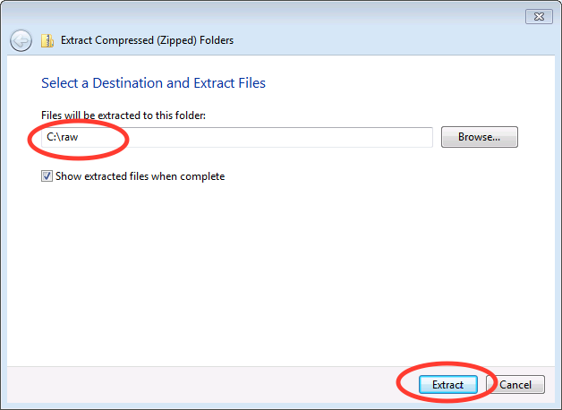

Windows 7, 8.1, and 10 install from source instructions
^^^^^^^^^^^^^^^^^^^^^^^^^^^^^^^^^^^^^^^^^^^^^^^^^^^^^^^
.. _winsource:

#.  RAW on windows can be installed using 64 bit (x64) or 32 bit (x86) python. Unless you know
    you need a 32 bit build, you should install the 64 bit version.

#.  Download and install the Microsoft Visual C++ 2008 SP1 Redistributable Package.

    *   Download the 64 bit version from:
        `https://www.microsoft.com/en-us/download/details.aspx?id=2092 <https://www.microsoft.com/en-us/download/details.aspx?id=2092>`_

    *   Download the 32  bit version from:
        `https://www.microsoft.com/en-us/download/details.aspx?id=29 <https://www.microsoft.com/en-us/download/details.aspx?id=29>`_

    *   Run the installer with the default options.

#.  Install Miniconda python distribution

    *   Download the free miniconda python 2.7 installer from:
        `https://conda.io/miniconda.html <https://conda.io/miniconda.html>`_

        *   Make sure you get the python 2.7 version!

        *   Pick the appropriate 64 bit/32 bit version that matches the redistributable
            you downloaded in the previous step.

    *   Run the installer with the default options.

    *   More detailed install instructions are available here:
        `https://conda.io/docs/user-guide/install/windows.html <https://conda.io/docs/user-guide/install/windows.html>`_

#.  Install the necessary python packages

    *   Open an anaconda prompt by clicking on the start menu -> All Programs -> Anaconda2 -> Anaconda Prompt

    *   Run the following commands in the anaconda prompt:

    *   ``conda upgrade conda pip wheel setuptools``

    *   ``conda install numpy scipy matplotlib pillow wxpython numba h5py lxml cython numexpr``

    *   ``pip install hdf5plugin silx fabio "pyfai<0.16"``

#.  Download RAW from sourceforge (
    `http://sourceforge.net/projects/bioxtasraw <http://sourceforge.net/projects/bioxtasraw>`_)

    *   Go to the Files tab on the linked website and download the :file:`RAW-{x}.y.z-Source.zip`
        file, where :file:`{x}.{y}.{z}` is the version number (for example, 1.0.0).

#.  Expand the downloaded zip file into the downloads folder

    *   Right click on the download and select :menuselection:`Extract All`

    *   Accept the default location for files to be extracted.

    |1000020100000274000001CAC03003E6F7E944B5_png|

#.  In Windows Explorer, confirm that the file named :file:`setup.py`
    is in your top level expanded raw directory. If it isn’t, it’s likely that
    when you expanded the RAW download, you ended up with unnecessary layers of
    directories. Find the directory with :file:`setup.py` in it, and make that
    the top level folder.

#.  Build the extensions

    *   Open an anaconda prompt as in Step 4 of these instructions.

    *   Type ``cd C:\raw``

    *   Hit enter

    *   Type ``python setup.py build_ext --inplace``

    *   Hit enter

#.  Run :file:`RAW.py` from the command line

    *   Open an anaconda prompt as in Step 4 of these instructions.

    *   Type ``cd C:\raw\bioxtasraw``

    *   Hit enter

    *   Type ``python RAW.py``

    *   Hit enter

#.  Enjoy!

    *   If you have trouble with the installation, please see the
        :ref:`solutions to common problems <wintrb>` section below.

