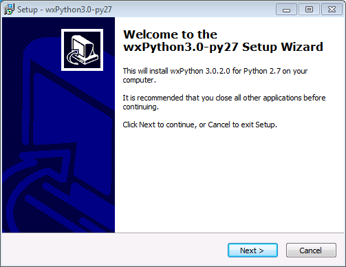
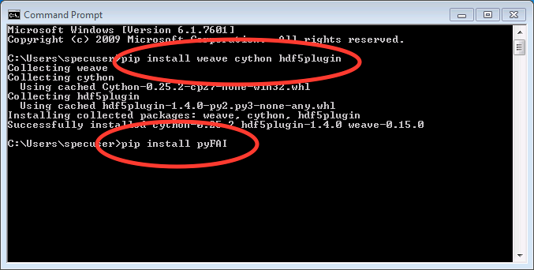

RAW Install Guide for Microsoft Windows
----------------------------------------

Introduction
^^^^^^^^^^^^^^

There are two ways to install RAW on Windows. The easiest, and recommended, way is to
use a prebuilt installer (**.msi** file). If you want to install a version for which
there is no prebuilt installer, you will need to install RAW from the source code.

This guide contains instructions for:

*   Using a prebuilt installer **(recommended):**

    *   :ref:`Windows 7, 8.1, and 10 <winprebuilt>`

*   :ref:`General instructions to install from source for advanced users <wingen>`

*   Detailed instructions to install from source for:

    *   :ref:`Windows 7 8.1, and 10 <winsource>`

It also provides :ref:`solutions to common problems <wintrb>` with the installation
from source.

Some of the downloads needed to install RAW from source are available in the
**RAW-Windows-Source-Install-Essentials** file on
`sourceforge <https://sourceforge.net/projects/bioxtasraw/files/>`_. Others you will have
to download yourself, due to licensing restrictions.

Conventions: things to type are in *italics*, file paths and file names are in
**bold**. OS version specific instructions are started in red.

Using a prebuilt installer
^^^^^^^^^^^^^^^^^^^^^^^^^^^^
.. _winprebuilt:

The recommend way to install RAW on Windows is using a prebuilt installer. To install
from a prebuilt installer, simply download the **RAW-X.Y.Z-win32.msi** (where X.Y.Z is the
version number) file from sourceforge (
`http://sourceforge.net/projects/bioxtasraw <http://sourceforge.net/projects/bioxtasraw>`_),
and double click it to run the installer. You may need to navigate to the ‘Files’
tab on the sourceforge project website to find the latest **.msi** installer.

**Important Notes:**

*   Because the RAW team is an ‘unknown’ developer, you will probably see some security
    warnings when you install RAW. When you do, just give the installer and program
    permission to run on your computer.

*   RAW is used by (relatively) few people, which means many virus scanners have not seen
    the RAW software before. Occasionally virus scanners will mark a file (typically RAW.exe)
    as a threat (it will usually be in the ‘general malware’ category). If this happens,
    please do the following:

    *   Upload the file to `https://www.virustotal.com/ <https://www.virustotal.com/>`_
        and see if any other virus scanners identify it as a virus (it is always possible
        someone hijacked the installer somehow!).

    *   If most or all of the virus scanners on virustotal.com clear the file, make an
        exception for it in your virus scanner.

    *   Contact the RAW developers, so we can report the false identification to the
        virus scanner company and get the file whitelisted in future definitions files.

General instructions for installing from source (advanced users)
^^^^^^^^^^^^^^^^^^^^^^^^^^^^^^^^^^^^^^^^^^^^^^^^^^^^^^^^^^^^^^^^
.. _wingen:

#.  Install the Microsoft Visual C++ compiler for Python 2.7

#.  Install Python 2.7 (if it isn’t already installed) and add it to your system path.

#.  Install a C compiler (such as the gcc c++ compiler) and add it to your system path.

#.  Install the following Python packages (version indicated if less than most recent):

    *   numpy

    *   matplotlib

    *   scipy

    *   pillow

    *   wxpython

    *   fabio

    *   lxml

    *   h5py

    *   rfoo

    *   cython

    *   hdf5plugin

    *   pyFAI

    *   weave

#.  Download the RAW source file (RAW-x.y.z-Source where x.y.z is the version number)
    from sourceforge (
    `http://sourceforge.net/projects/bioxtasraw <http://sourceforge.net/projects/bioxtasraw>`_)

#. Extract RAW to a directory of your choice and run **RAW.py** using python.

    *   Note: the first time you run RAW.py it may need to be run from the command line
        in order to successfully compile various extensions. It may take some time to compile
        the extensions, be patient.

    *   After you run RAW for the first time, you can run it by double clicking the
        RAW.py file, assuming .py files are associated with your python executable.

#.  Enjoy!

    *   If you have problems, please consult the detailed installation guides and the
        :ref:`solutions to common problems <wintrb>` below. If that doesn’t help,
        please contact the developers.

Windows 7, 8.1, and 10 install from source instructions
^^^^^^^^^^^^^^^^^^^^^^^^^^^^^^^^^^^^^^^^^^^^^^^^^^^^^^^
.. _winsource:

#.  Download and install the Microsoft Visual C++ Compiler for Python 2.7.

    *   Download from
        `https://www.microsoft.com/en-us/download/details.aspx?id=44266 <https://www.microsoft.com/en-us/download/details.aspx?id=44266>`_

    *   Run the installer with the default options.

#.  Download and install the Microsoft Visual C++ 2008 SP1 Redistributable Package (x86).

    *   Download from
        `https://www.microsoft.com/en-us/download/details.aspx?id=5582 <https://www.microsoft.com/en-us/download/details.aspx?id=5582>`_

    *   Run the installer with the default options.

#.  Install 32 bit python 2.7 from python.org. Make sure pip is installed, and add
    python to the windows path.

    *   Download the 32 bit python 2.7 installer for windows from
        `https://www.python.org/downloads/windows/ <https://www.python.org/downloads/windows/>`_

        *   Select the latest release (2.7.13 as of 3/13/17).

        *   Download the **Windows x86 MSI Installer** (NOT the x86-64 MSI Installer).

        *   Also available in the **RAW-Windows-Source-Install-Essentials** file.

    *   Run the installer

    |10000201000001F3000001ACD121D31605B42F38_png|

    *   Accept the default installation location

    |10000201000001F3000001AC19F9C4CBF3C8339D_png|

    *   At the customization option, make sure that pip is installed and that you add python.exe to Path.

    |10000201000001F3000001AC231A6A61FD1E38C9_png|

#.  Download and install wxpython 3.0 for 32-bit python 2.7.

    *   Download from
        `http://www.wxpython.org/download.php#msw <http://www.wxpython.org/download.php#msw>`_

        *   Download the **wxPython3.0-win32-3.0.2.00-py27.exe** file

        *   Make sure you download win32/py27 file!

        *   Also available in the **RAW-Windows-Source-Install-Essentials** file.

    *   Run the installer

    |10000201000001F700000184FEB70AD63B64E70A_png|

    *   Accept the default install location

    |10000201000001F7000001845E44643D152C855F_png|

    *   Accept the default components

    |10000201000001F700000184CC1269CE94FF045C_png|

    *   Make sure to compile Python .py files to .pyc when the installation is finished.

    |10000201000001F70000018474C33F656AA9623C_png|

#.  Download and install the MinGW compiler

    *   Download **mingw-get-setup.exe** from
        `https://sourceforge.net/projects/mingw/ <https://sourceforge.net/projects/mingw/>`_

        *   The download button should default to the correct file for windows.

        *   Also available in the **RAW-Windows-Source-Install-Essentials** file.

    *   Run the installer.

    |100002010000025E000001D2E196E75CF8A1C879_png|

    *   Install to the default location

    |100002010000025E000001D2A77894BD5D8E3872_png|

    *   Once the installer is finished, click continue

    |100002010000025E000001D2F3CB403BD4DC21F4_png|

    *   You will see this screen:

    |10000201000005A0000002F8958D1763BA7D6A5F_png|

    *   Click the boxes for **mingw32-base** and **mingw32-gcc-g++** and select mark
        for installation.

    |100002010000038200000107CA2FEA23D76FEFFA_png|

    *   Once selected, they should look like this:

    |100002010000047A000000C3630704E775D3E787_png|

    *   Click on the Installation menu and click Apply Changes.

    |10000201000001C90000012EB288A64B1B2F0AA5_png|

    *   In the windows that pops up, click Apply.

    |100002010000026A0000019A18D1DBE0E7432884_png|

    *   Close the MinGW installer.

#.  Add mingw and mingw\\bin to the start of the global path variable. Use part a
    for Windows 7, part b for Windows 8.1, and part c for Windows 10.

    *   Windows 7:

        #.  Click on the Start Menu and click on Computer.

        #.  In the window that opens, click on System properties

            |10000201000004B0000002A39D9F7B9AAF7199ED_png|

        #.  In the window that opens, click on Advanced system settings

            |10000201000004B0000002A399479280B2C14985_png|

        #.  In the window that opens, click on Environment Variables…

            |10000201000001AA000001DA530895693A9AFBFA_png|

        #.  In the window that opens, In the System variables area, select the Path
            variable and click Edit…

            |100002010000018A000001B44A97BA7F3822CD71_png|

        #.  In the window that opens, add the following to the start of the path:
            *C:\MinGW;C:\MinGW\bin;*

            |10000201000001650000009960C7066D18E91A52_png|

        #.  Click Ok several times to save and exit out of the settings.

        #.  Note: You can modify the User variable path instead of the System variable
            path if you want to only modify the setup for your user account, rather than
            the entire system. The same steps apply, but if you do not already have a
            use path variable, you will have to create one using the New button.

    *   Windows 8.1:

        #.  Open a file browser window and click on This PC. At the top, click on
            System properties.

            |1000020100000400000002A3DABD211FEEECB79E_png|

        #.  Continue with steps 3 and onward in the Windows 7 section above.

    *   Windows 10:

        #.  Click on the windows/start menu and click File Explorer.

        #.  In the file explorer window, click on This PC and then Computer

            |10000201000004650000027A03BF18E020461FAE_png|

        #.  Then click on System properties in the new menu

            |10000201000004650000027AD3998AF9790FC983_png|

        #.  In the window that opens, click on Advanced system settings

            |10000201000004650000027AE2E290525DBD0B1C_png|

        #.  In the window that opens, click on Environment Variables…

            |10000201000001AA000001DA530895693A9AFBFA_png|

        #.  In the window that opens, In the System variables area, select the
            Path variable and click Edit…

            |100002010000026A00000249E225CEB83B942F92_png|

        #.  In the window that opens, use the New button to add these items to the path:

            *   *C:\MinGW*

            *   *C:\MinGW\bin;*

            |100002010000020F000001F513FE0A5C8F181099_png|

        #.  Use the Move Up button to move the items to the start of the path

            |100002010000020F000001F51F1D34081877255E_png|

            |100002010000020F000001F5824FFFD405BF36E6_png|

        #.  Click Ok several times to save and exit out of the settings.

        #.  Note: You can modify the User variable path instead of the System
            variable path if you want to only modify the setup for your user account,
            rather than the entire system. The same steps apply, but if you do not
            already have a user path variable, you will have to create one using the New button.

#.  Restart your computer.

#.  Install numpy, maptlotlib, pillow, fabio using pip

    *   Open a command prompt

        *   Windows 7: Click on the start menu, search for *cmd* and running the
            **cmd** program.

        *   Windows 8: Click on the windows tile and search for *cmd*, then run the
            **Command Prompt** program.

        *   Windows 10: Click on the windows/start menu, select All Files, select
            Windows System, and click on **Command Prompt**.

    *   Type *python -m pip install --upgrade pip*

    *   Hit enter

    *   Once that finishes, type *pip install --upgrade setuptools wheel*

    *   Hit enter

    |10000201000002A5000001562A234A434AEB65B5_png|

    *   Once that finishes, type *pip install numpy*

    *   Hit enter

    *   Once that finishes, type *pip install matplotlib pillow fabio*

    |10000201000002A5000001560499E4F7F72D933B_png|

    *   Hit enter

    *   Once that finishes, close the command prompt window

#.  Install scipy for 32bit python 2.7 from binary

    *   Download scipy from
        `https://sourceforge.net/projects/scipy/files/scipy/0.16.1/ <https://sourceforge.net/projects/scipy/files/scipy/0.16.1/>`_

        *   Download **scipy-0.16.1-win32-superpack-python2.7.exe**

        *   Make sure it is the python2.7 file!

        *   Also available in the **RAW-Windows-Source-Install-Essentials** file.

    *   Run the installer, accepting the default options.

#.  Download and install the lxml, h5py, and rfoo packages.

    *   Go to
        `http://www.lfd.uci.edu/~gohlke/pythonlibs/ <http://www.lfd.uci.edu/~gohlke/pythonlibs/>`_
        and download:

        *   lxml-x.y.z-cp27-cp27m-win32.whl (where x.y.z is the version number).

        *   h5py-x.y.z-cp27-cp27m-win32.whl (where x.y.z is the version number).

        *   rfoo-x.y.z-cp27-non-win32.whl (where x.y.z is the version number).

        *   Note: These are available in the RAW windows install essentials zip file.

        *   Note: It is important to download the cp27 win32 version, otherwise installation will fail!

        *   Also available in the
            **RAW-Windows-Source-Install-Essentials**
            file.

    *   Open a command prompt window as in Step 6.

    *   Navigate to the folder where you downloaded these files.

        *   The easiest way to do this is to type “cd” followed by a space, then drag
            the folder from the desktop into the command prompt window. You should see
            the path to the folder appear in the command prompt. Hit enter after that.

    *   Install the files using pip.

        *   Type *pip install lxml-x.y.z-cp27-cp27m-win32.whl* and hit enter (where
            x.y.z is the version number).

        *   Type *pip install h5py-x.y.z-cp27-cp27m-win32.whl* and hit enter (where
            x.y.z is the version number).

        *   Type *pip install rfoo-x.y.z-cp27-non-win32.whl* and hit enter (where
            x.y.z is the version number).

    |10000201000002A500000156ACFF07324D3BB21D_png|

#.  Install the weave, cython, hdf5plugin, and pyFAI packages.

    *   If it is not already open from the previous step, open a command prompt
        window as in Step 6.

    *   Install cython

        *   Type *pip install weave cython hdf5plugin* and hit enter.

    *   Install pyFAI

        *   Type *pip install pyFAI* and hit enter.

        *   On Windows 8 and 10, two windows may pop up, one saying that “mt.exe has
            topped working” and anther that “an app on your PC needs the following
            Windows feature: .Net Framework 3.5”. If that happens, in the mt.exe
            window click “Close Program” and in the other window click “Download and
            install this feature.” Once the download and installation is done, rerun
            the pyfai installation using the *pip install pyFAI* command.

    |10000201000002A5000001563C5CC4C2C8CB2F0A_png|

#.  Download RAW from sourceforge (
    `http://sourceforge.net/projects/bioxtasraw <http://sourceforge.net/projects/bioxtasraw>`_)

    *   Go to the Files tab on the linked website and download the ‘RAW-x.y.z-Source file, where x.y.z is the version number (for example, 1.0.0).

#.  Expand the downloaded zip file into the downloads folder

    *   Right click on the download and select ‘Extract All’

    *   Accept the default location for files to be extracted.

    |1000020100000274000001CAC03003E6F7E944B5_png|

#.  Check that the files are located at the top of the directory, as in the following image:

    *   Windows 7: Browse to Computer -> Local Disk -> raw

    *   Windows 8 and 10: Browse to This PC -> Local Disk -> raw

    |10000201000004B0000002A34A8866D873399BD8_png|

    *   You may have only a single subfolders, named something like **raw** or **src**.

    |10000201000004B0000002A3554A1F12D8C7CB87_png|

    *   If so, browse down levels until you find the directory containing files that
        look like the top image on this page, and copy everything in that folder to
        the top level **raw** directory.

    |10000201000004B0000002A3E91BB88ED0783D2A_png|

#.  Run **RAW.py** from the command line

    *   Open a command prompt as in Step 6 of these instructions.

    *   Type *cd C:\raw*

    *   Hit enter

    *   Type *python RAW.py*

    |10000201000002A50000015664F52DDA0E80AA97_png|

    *   Hit enter

    *   When you start RAW for the first time, it compiles various extensions, this
        may take a while. Please be patient.

#.  Enjoy!

    *   After running RAW for the first time, you can start it without using the command
        line simply by double clicking on **RAW.py** in the **C:\raw** folder.

    *   If you want to create a desktop shortcut, right click on **RAW.py** and select
        Send To -> Desktop.

    *   If you have trouble with the installation, please see the
        :ref:`solutions to common problems <wintrb>` section below.

Common problems/troubleshooting
^^^^^^^^^^^^^^^^^^^^^^^^^^^^^^^^
.. _wintrb:

**Prebuilt installer:**

*   Because the RAW team is an ‘unknown’ developer, you will probably see some
    security warnings when you install RAW. When you do, just give the installer
    and program permission to run on your computer.

*   RAW is used by (relatively) few people, which means many antivirus programs
    have not seen the RAW software before. Occasionally virus scanners will mark
    a file (typically RAW.exe) as a threat (it will usually be in the ‘general
    malware’ category). If this happens, please do the following:

    *   Upload the file to
        `https://www.virustotal.com/ <https://www.virustotal.com/>`_
        and see if any other antivirus programs identify it as a problem (it is
        always possible someone hijacked the installer somehow!).

    *   If most or all of the antivirus programs on virustotal.com clear the file, make an
        exception for it in your virus scanner.

    *   Contact the RAW developers, so we can report the false identification to the
        virus scanner company and get the file whitelisted in future definitions files.

**From source:**

*   The compiler can fail if there are any spaces in the directory paths. Make sure raw,
    the compiler (MinGW), and python are all installed in directory paths without spaces
    in the names.

*   The compiler can fail if it tries to compile the modules when some of them are
    already compiled. If the compilation is failing, try deleting all **.pyd** files in
    the raw directory.

*   The compiler can fail if you try to compile when you’re not using the command line.
    This most commonly happens if someone tries to run **RAW.py** for the first time by
    double clicking on it, rather than using the *python RAW.py* command in the command
    prompt window.

*   If the extensions won’t compile properly (you’ll get a popup message when you start
    RAW warning you of this), you can try copying the precompiled extensions (**.pyd**
    files) from the appropriate WinLib folder into the main raw folder.

*   If you are updating your RAW installation, you should completely delete the old RAW
    source files, and then replace them with the new ones.

*   You may have trouble with various pieces of the installation if your path variable
    isn’t set right. The windows PATH variable cannot have spaces. That is, your path
    should look like: item1;item2;item3 not: item1; item2; item3. For Windows 10,
    where you enter separate entries in your path variable (which Windows automatically
    concatenates), make sure that you don’t have leading or training spaces in any
    of the items.

*   On some systems, we’ve found it necessary to install the packages from pip in multiple
    steps. If a *pip install* fails, trying running it on each package separately. For example,
    if *pip install matplotlib pillow fabio* fails, try running:

    *   *pip install matplotlib*

    *   *pip install pillow*

    *   *pip install fabio*

.. |100002010000026A00000249E225CEB83B942F92_png| image:: images/win_install/100002010000026A00000249E225CEB83B942F92.png

.. |10000201000001F70000018474C33F656AA9623C_png| image:: images/win_install/10000201000001F70000018474C33F656AA9623C.png

.. |10000201000004B0000002A34A8866D873399BD8_png| image:: images/win_install/10000201000004B0000002A34A8866D873399BD8.png

.. |100002010000025E000001D2F3CB403BD4DC21F4_png| image:: images/win_install/100002010000025E000001D2F3CB403BD4DC21F4.png

.. |10000201000001C90000012EB288A64B1B2F0AA5_png| image:: images/win_install/10000201000001C90000012EB288A64B1B2F0AA5.png

.. |10000201000005A0000002F8958D1763BA7D6A5F_png| image:: images/win_install/10000201000005A0000002F8958D1763BA7D6A5F.png

.. |10000201000001F700000184CC1269CE94FF045C_png| image:: images/win_install/10000201000001F700000184CC1269CE94FF045C.png

.. |10000201000004B0000002A3554A1F12D8C7CB87_png| image:: images/win_install/10000201000004B0000002A3554A1F12D8C7CB87.png

.. |1000020100000274000001CAC03003E6F7E944B5_png| image:: images/win_install/1000020100000274000001CAC03003E6F7E944B5.png

.. |100002010000038200000107CA2FEA23D76FEFFA_png| image:: images/win_install/100002010000038200000107CA2FEA23D76FEFFA.png

.. |10000201000002A5000001560499E4F7F72D933B_png| image:: images/win_install/10000201000002A5000001560499E4F7F72D933B.png
    :width: 6in
    :height: 3.0311in

.. |100002010000026A0000019A18D1DBE0E7432884_png| image:: images/win_install/100002010000026A0000019A18D1DBE0E7432884.png

.. |10000201000001F3000001ACD121D31605B42F38_png| image:: images/win_install/10000201000001F3000001ACD121D31605B42F38.png

.. |10000201000002A50000015664F52DDA0E80AA97_png| image:: images/win_install/10000201000002A50000015664F52DDA0E80AA97.png

.. |10000201000001F7000001845E44643D152C855F_png| image:: images/win_install/10000201000001F7000001845E44643D152C855F.png

.. |100002010000047A000000C3630704E775D3E787_png| image:: images/win_install/100002010000047A000000C3630704E775D3E787.png

.. |100002010000025E000001D2A77894BD5D8E3872_png| image:: images/win_install/100002010000025E000001D2A77894BD5D8E3872.png

.. |10000201000001F3000001AC231A6A61FD1E38C9_png| image:: images/win_install/10000201000001F3000001AC231A6A61FD1E38C9.png

.. |10000201000001F3000001AC19F9C4CBF3C8339D_png| image:: images/win_install/10000201000001F3000001AC19F9C4CBF3C8339D.png

.. |10000201000001AA000001DA530895693A9AFBFA_png| image:: images/win_install/10000201000001AA000001DA530895693A9AFBFA.png

.. |10000201000002A500000156ACFF07324D3BB21D_png| image:: images/win_install/10000201000002A500000156ACFF07324D3BB21D.png

.. |100002010000018A000001B44A97BA7F3822CD71_png| image:: images/win_install/100002010000018A000001B44A97BA7F3822CD71.png

.. |10000201000001650000009960C7066D18E91A52_png| image:: images/win_install/10000201000001650000009960C7066D18E91A52.png

.. |100002010000020F000001F5824FFFD405BF36E6_png| image:: images/win_install/100002010000020F000001F5824FFFD405BF36E6.png

.. |100002010000020F000001F513FE0A5C8F181099_png| image:: images/win_install/100002010000020F000001F513FE0A5C8F181099.png

.. |10000201000004B0000002A399479280B2C14985_png| image:: images/win_install/10000201000004B0000002A399479280B2C14985.png

.. |10000201000004650000027A03BF18E020461FAE_png| image:: images/win_install/10000201000004650000027A03BF18E020461FAE.png

.. |10000201000004B0000002A3E91BB88ED0783D2A_png| image:: images/win_install/10000201000004B0000002A3E91BB88ED0783D2A.png

.. |10000201000004B0000002A39D9F7B9AAF7199ED_png| image:: images/win_install/10000201000004B0000002A39D9F7B9AAF7199ED.png

.. |100002010000020F000001F51F1D34081877255E_png| image:: images/win_install/100002010000020F000001F51F1D34081877255E.png

.. |1000020100000400000002A3DABD211FEEECB79E_png| image:: images/win_install/1000020100000400000002A3DABD211FEEECB79E.png

.. |100002010000025E000001D2E196E75CF8A1C879_png| image:: images/win_install/100002010000025E000001D2E196E75CF8A1C879.png

.. |10000201000004650000027AD3998AF9790FC983_png| image:: images/win_install/10000201000004650000027AD3998AF9790FC983.png

.. |10000201000002A5000001562A234A434AEB65B5_png| image:: images/win_install/10000201000002A5000001562A234A434AEB65B5.png

.. |10000201000004650000027AE2E290525DBD0B1C_png| image:: images/win_install/10000201000004650000027AE2E290525DBD0B1C.png

