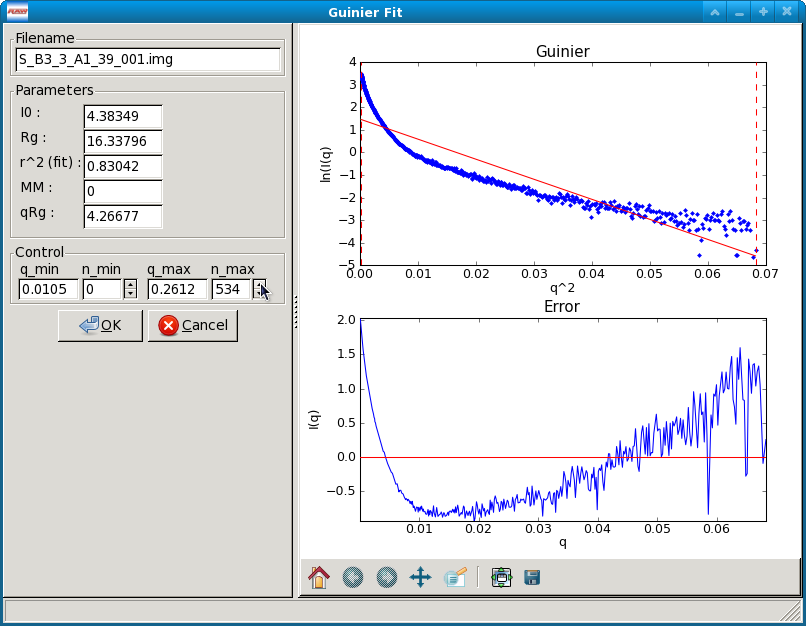

Analysis windows
================

.. _analysiswindows:

There are a variety of analysis windows in RAW: the Guinier Fit window, the Molecular
Weight window, the BIFT window, the GNOM window, the AMBIMETER window, the DAMMIF window,
the SVD window, and the EFA window. In this chapter we will cover how to open these windows
and carry out the analysis.

|100000000000032600000272911687F043FA6AEB_png|

Guinier Fit window
------------------

.. _guinierwindow:

Data that has been properly background subtracted can be analyzed in the standard
fashion via a Guinier Fit to yield the radius of gyration and the scattering intensity
at zero angle. The Guinier Fit window allows you to interactively do the fit.

Opening the Guinier fit window
~~~~~~~~~~~~~~~~~~~~~~~~~~~~~~

The Guinier fit window can be opened by selecting a data item in the Manipulation Panel
and either right clicking and selecting “Guinier fit” or selecting “Guinier fit” from
the “Tools” menu. Whichever data item is selected will be the one that is being analyzed.
If multiple items are selected, the first (top item in the list) will be sent to the
Guinier Fit panel.

Once the window opens you will see two panels. The left panel has the filename of the data
loaded into the Guinier Fit panel, the fit parameters, and the fit controls. The right panel
has two plots that show the fit and residual. If no previous Guinier fit analysis has been
saved for the data item, the fit range defaults to the whole scattering profile. If a previous
Guinier fit analysis was saved for the data item, the fit range will be the range of that analysis.

Once you have completed a satisfactory Guinier fit, clicking the “OK” button will save the fit
for the data item selected. That will allow you to save the Guinier analysis parameters when
:ref:`saving all results <saveresults>`, view the results in the information window, and save it with
the scattering profile if that is saved as a “.dat” file. Clicking the “Cancel” button (or
the close window button from the operating system, typically in the upper left or right corner)
will exit the window without saving the analysis results.

**Note 1:** Only one Guinier Fit window can be open at once. If a window is already open and
you try to open a new one, it will close the current window and open a new one.

**Note 2:** RAW will automatically attempt to automatically determine the Rg when the Guinier
window is opened, if no previous Guinier fit has been done. If a previous Guinier fit has
been done, RAW will set the q min and q max to the previous values.

Guinier Fit Controls
~~~~~~~~~~~~~~~~~~~~

The Guinier Fit Controls allow you to manually set the q_min and q_max values over which the
Guinier fit is done. You can do this in two ways. First, if you type a value into the q_min
or q_max box and hit enter, RAW will find the nearest q point, and set the q value to that
nearest point. Second, you can adjust the n_min and n_max values either by typing an integer
value in the appropriate box or using the spin controls. The n_min and n_max controls change
the minimum and maximum points of the q vector used (zero indexed), and the q_min and q_max
are updated to match. For example if n_min is set to 5 and n_max is set to 130, the 5th
indexed point through the 130th indexed point in the q vector (so points 6-131, because of the z
ero indexing) will be used in the Guinier fit.

The AutoRG button calls a function that attempts to automatically determine the best range of
data to use for the Guinier fit. It considers the following criteria: q_min*Rg as small as possible,
q_max*Rg as close to 1.3 as possible, smallest fit error in the Rg, smallest fit error in
the I(0) possible, r^2 of the fit as close to one as possible, and the largest range of q
values used as possible.

Guinier Fit Plots
~~~~~~~~~~~~~~~~~

There are two plots in the Guinier fit window. The top plot is the standard Guinier plot,
ln(I(q)) vs. q\ :sup:`2`\ , shown in the range of n_min -20 to n_max +3 (if possible)
as set in the Guinier Control panel. The scattering profile is marked by the blue points,
the fit is shown as the solid straight red line, the fit extrapolated to q=0 is shown
by the green dashed line, and the range of the fit, q_min and q_max, are shown by vertical
red dashed lines.

The bottom plot has the residual between each point in the scattering profile and the fit,
plotted as a Δln(I(q)) vs. q\ :sup:`2`\ . The red line is a line at zero. Note that the
x range of this plot may be slightly reduced compared to the top plot, as it only displays
the fit, while the top plot can display points beyond the limits of the fit.

**Note:** There are no controls available on right click for these plots, but there is a
standard :ref:`plot control bar <navbar>`.

Guinier Fit Parameters
~~~~~~~~~~~~~~~~~~~~~~

The fit parameters available in the Guinier Fit window are:

*   I(0), the extrapolated scattering intensity at zero angle

*   Rg, the radius of gyration

*   r\ :sup:`2`\  (fit), the r\ :sup:`2`\  value of the fit

*   qRg, which is q_min*Rg and q_max*Rg for the left and right boxes respectively.

Molecular weight
----------------

.. _molweightwindow:

Data that has been background subtracted and had a Guinier fit carried out can
be analyzed to find the molecular weight of the macromolecule. RAW provides four
different ways of calculating the molecular weight, which are described below.

Opening the Molecular Weight Window
~~~~~~~~~~~~~~~~~~~~~~~~~~~~~~~~~~~

The Molecular Weight window can be opened by selecting a data item in the
Manipulation Panel and either right clicking and selecting “Molecular Weight”
or selecting “Molecular Weight” from the “Tools” menu. Whichever data item is
selected will be the one that is being analyzed. If multiple items are selected,
the first (top item in the list) will be the one analyzed.

The window has two parts. The top part is a description of the MW methods and
a panel with the Guinier fit parameters. The bottom part is four panels providing
the calculated MW from each method, and the ability to see more details and learn
more about each method. All of the MW methods require a Guinier fit to have been
done, as they rely on the I(0) value. Two of the methods require knowing the sample
concentration, and the same two methods also depend on (different) calibration of
the scattering profile.

Once you are satisfied with the molecular weight analysis, clicking the “OK” button
will save the analysis for the data item selected. That will allow you to save the
molecular weight analysis parameters when :ref:`saving all results <saveresults>`, view the results
in the information window, and save the results with the scattering profile if that is
saved as a “.dat” file. Clicking the “Cancel” button (or the close window button from
the operating system, typically in the upper left or right corner) will exit the window
without saving the analysis results.

**Note:** Only one molecular weight window can be open at once. If a window is
already open and you try to open a new one, it will close the current window and
open a new one.

The molecular weight controls
~~~~~~~~~~~~~~~~~~~~~~~~~~~~~

There are several controls available in the molecular weight panel. In the top panel,
the Guinier Fit button can be used to open the Guinier panel and (re)analyze the
scattering profile using that method, so that an I(0) value is available for the
molecular weight panel.

Each of the four lower panels has a “Show Details” and “More Info” button. The “More
Info” button simply provides an extended description of the method used, and, when
relevant, a citation. The “Show Details” button provides extended information on the
parameters used to calculate the MW for a given method. None of these parameters are
editable in the molecular weight panel. When the “Show Details” button is clicked, it
becomes a “Hide Details” button, which hides the extra parameters.

The concentration box in both the first and fourth panels can have the sample concentration
entered, if it has not already been (for example, in the Information panel). These are
linked, so that any change to one also changes the other. Sample concentration should be in mg/ml.

The volume of correlation method uses different parameters for Proteins and RNA,
and the drop down menu can be used to toggle between those two sets of parameters.
The default setting can be changed in the Options window.

If RAW is set to normalize scattering profiles to an absolute scale, the “Intensity
on Absolute Scale” box will be checked in the fourth panel. If RAW is not normalizing
to an absolute scale, it will be unchecked. If that is set incorrectly for a particular
scattering profile for some reason, it can be manually toggled to the correct position.

At the bottom of the window there are three buttons. The “OK” and “Cancel” buttons
have been described above. The “Change Advanced Parameters” button opens the Options
window, with the Molecular Weight section shown. This allows you to change the
parameters used to calculate the molecular weight for each method of calculation.

The molecular weight parameters
~~~~~~~~~~~~~~~~~~~~~~~~~~~~~~~

There are a number of parameters listed in the molecular weight panel. In the top panel there are:

*Filename*

Gives the filename of the data item being analyzed.

*Guinier parameters*

Gives the I(0) and Rg from the Guinier fit.

In the I(0) Ref. MW panel there are:

*Concentration*

The sample concentration in mg/ml, this field accepts input.

*MW*

The sample MW calculated by this method, in kDa.

*Ref. I(0)*

The I(0) of the molecular weight standard set for RAW. This field corresponds
to the I(0) field in the “Molecular Weight Estimation Using a Standard” box in
the Molecular Weight section of the Options window, and can be changed there or
by :ref:`setting the MW standard <mwstandard>`.

*Ref. MW*

The molecular weight of the molecular weight standard set for RAW. This field
corresponds to the MW field in the “Molecular Weight Estimation Using a Standard”
box in the Molecular Weight section of the Options window, and can be changed there
or by :ref:`setting the MW standard <mwstandard>`.

*Ref. Concentration*

The concentration of the molecular weight standard set for RAW. This field
corresponds to the Conc. field in the “Molecular Weight Estimation Using a
Standard” box in the Molecular Weight section of the Options window, and can
be changed there or by :ref:`setting the MW standard <mwstandard>`.

*File*
– The data item name of the molecular weight standard set for RAW. This field
corresponds to the Filename field in the “Molecular Weight Estimation Using a
Standard” box in the Molecular Weight section of the Options window, and can
be changed there or by :ref:`setting the MW standard <mwstandard>`.

In the Vc MW panel there are:

*MW*

The sample molecular weight calculated by this method, in kDa.

*Vc*

The volume of correlation calculated by this method, in Å\ :sup:`2`\ .

*Qr*

The Qr parameter calculated by this method, in Å\ :sup:`3`\ .

*a*

The macromolecular type (protein/RNA) dependent “a” parameter used for the
calculation. This field corresponds to the “Protein (RNA) Coef. A” field
in the “Molecular Weight Estimation From Volume of Correlation” box in the
Molecular Weight section of the Options window, and can be changed there.
The value depends on whether Protein or RNA is selected in the drop down
menu at the top of this panel.

*b*

The macromolecular type (protein/RNA) dependent “b” parameter used for the
calculation. This field corresponds to the “Protein (RNA) Coef. B” field in
the “Molecular Weight Estimation From Volume of Correlation” box in the Molecular
Weight section of the Options window, and can be changed there. The value
depends on whether Protein or RNA is selected in the drop down menu at the
top of this panel.

This panel also has a plot which shows :math:`\int q I(q) dq` vs. q, over
the q-range of the scattering profile. For this method to be accurate, the
integral value needs to have converged at high q (the graph needs to be flat
at high q).

In the Vp MW panel there are:

*MW*

The sample molecular weight calculated by this method, in kDa.

*Vp*

The Porod volume calculated by direct integration of the scattering profile, in Å\ :sup:`3`\ .

*Corrected Vp*

The corrected Porod volume based on the method described :ref:`below <corvp>`, in Å\ :sup:`3`\ .

*Macromolecule Density*

The density of the macromolecule, used to calculate the molecular weight. This field
corresponds to the “Density” field in the “Molecular Weight Estimation from Corrected
Porod Volume” box in the Molecular Weight section of the Options window, and can be
changed there.

In the Abs. MW panel there are:

*Concentration*

The sample concentration in mg/ml, this field accepts input.

*MW*

The sample MW calculated by this method, in kDa.

*# electrons per mass dry macromolecule*

The dry mass number
density of electrons for the macromolecule, in e-/g. This field corresponds to
the “Electrons per dry mass of macromolecule” field in the “Molecular Weight Estimation
from Absolute Intensity Calibration” box in the Molecular Weight section of the Options
window, and can be changed there.

*# electrons per volume of buffer*

The number density of electrons for the protein buffer/solvent, in e-/cm\ :sup:`3`\ . This
field corresponds to the “Electrons per volume of aqueous solvent” field in the “Molecular
Weight Estimation from Absolute Intensity Calibration” box in the Molecular Weight section
of the Options window, and can be changed there.

*Protein partial specific volume*

The partial specific volume of the macromolecule, in cm\ :sup:`3`\ /g. This field corresponds
to the “Partial specific volume of the macromolecule” field in the “Molecular Weight Estimation
from Absolute Intensity Calibration” box in the Molecular Weight section of the Options window,
and can be changed there.

*Scattering length of an electron*

The scattering length of an electron in cm. This field corresponds to the “Scattering length
of an electron” field in the “Molecular Weight Estimation from Absolute Intensity Calibration”
box in the Molecular Weight section of the Options window, and can be changed there.

*Scattering contrast per mass*

.. _contrast:

The calculated scattering contrast per mass. This is calculated from the other parameters as
:math:`r_0(\rho_{Mmac}-\rho_{solv}\bar{\nu})` where :math:`r_0` is the scattering length of
an electron, :math:`\rho_{Mmac}` is the electrons per dry mass of macromolecule, :math:`\rho_{solv}`
is the electrons per volume of aqueous solvent, and :math:`\bar{\nu}` is the partial specific
volume of the protein.

The molecular weight methods
~~~~~~~~~~~~~~~~~~~~~~~~~~~~

.. _molweightmethods:

Four different methods are used to calculate the molecular weight of the macromolecule
from the background subtracted scattering profile.

*I(0) Referenced molecular weight calculation (I(0) Ref. MW panel)*

The scattering at zero angle, I(0) is proportional to the molecular weight of the
macromolecule, and the concentration and contrast of the macromolecule in solution.
If a reference sample of known molecular weight and concentration is measured, it
can be used to calibrate the molecular weight of any other scattering profile with
known concentration (assuming constant contrast between reference and sample, and
a monodisperse sample). Molecular weight is calculated as:

.. math:: MW_m=\left(\frac{I(0)_m}{c_m}\right)\left(\frac{MM_{st}}{I(0)_{st}/c_{st}}\right)

where MW is the molecular weight, c is the concentration, and the m and st subscripts denote
quantities from the macromolecule of interest and the standard respectively. For a reference
see, among many, Mylonas, E. & Svergun, D. I. (2007). J. Appl. Crystallogr. 40, s245-s249.

This method can yield inaccurate results if the reference is not properly calibrated, I(0)
is not well estimated from the Guinier fit, or the contrast between the macromolecule and
buffer is significantly different between the reference and sample.

*Volume of correlation based molecular weight calculation (Vc MW panel)*

This method uses the approach described in: Rambo, R. P. & Tainer, J. A. (2013). Nature.
496, 477-481. First, the volume of correlation, V\ :sub:`c`\ , is calculated as

.. math:: V_c=\frac{I(0)}{\int qI(q)dq}

Unlike the Porod volume, V\ :sub:`c` is expected to converge for both compact and flexible
macromolecules. Physically, V\ :sub:`c` can be interpreted as the particle volume per
self-correlation length, and has units of Å\ :sup:`2`\ . V\ :sub:`c` and the radius of gyration,
Rg, are then used to calculate a parameter :math:`Q_r=V_c^2/R_g`\ . The molecular weight is
then calculated as:

.. math:: MW=\left(\frac{Q_r}{b}\right)^a

where *a* and *b* are empirically determined constants that depend upon the type of
macromolecule. More details on the calculation are in the reference. The authors
claim the error in MW determination is ~5-10%.

This method can yield inaccurate results if the integral :math:`\int qI(q)dq` doesn't converge,
which may indicate the scattering profile is not measured to high enough q or that there is a
bad buffer match. It also requires accurate determination of I(0) and Rg. It doesn't work for
protein-nucleic acid complexes.

*Corrected Porod Volume method (Vp MW panel)*

.. _corvp:

This method uses the approach described in: Fischer, H., de Oliveira Neto, M., Napolitano, H. B., Polikarpov, I., & Craievich, A. F. (2009). J. Appl. Crystallogr. 43, 101-109. First, the Porod volume, V\ :sub:`p`\ ,
is determined. True determination of the Porod volume requires the scattering profile measured to
infinite q. A correction is applied to V\ :sub:`p` to account for the limited range of the
measurement. The authors report a maximum of 10% uncertainty for calculated molecular weight
from globular proteins.

This method can yield inaccurate results if the molecule is not globular. It requires accurate
determination of I(0). It also requires an accurate protein density. It only works for proteins.

Note: To do the integration, RAW extrapolates the scattering profile to I(0) using the Guinier
fit. The authors of the original paper used smoothed and extrapolated scattering profiles
generated by GNOM. This may cause discrepancy. To use this method on GNOM profiles, use the
online SAXS MoW calculator located at: `http://www.if.sc.usp.br/~saxs/ <http://www.if.sc.usp.br/~saxs/>`_

*Absolute calibrated intensity method (Abs. MW panel)*

This uses the absolute calibration of the scattering profile to determine the molecular
weight, as described in Orthaber, D., Bergmann, A., & Glatter, O. (2000). J. Appl.
Crystallogr. 33, 218-225. By determining the absolute scattering at I(0), if the sample
concentration is also known, the molecular weight is calculated as:

.. math:: MW=\frac{N_AI(0)/c}{\Delta \rho^2_M}

where N\ :sub:`A` is the Avagadro number, c is the concentration,  and :math:`\Delta \rho_M^2`
is the scattering contrast per mass described :ref:`above <contrast>`. The accuracy of this method was
assessed in Mylonas, E. & Svergun, D. I. (2007). J. Appl. Crystallogr. 40, s245-s249, and for most
proteins is <~10%.

This method can yield inaccurate results if the absolute calibration is off, or if the
partial specific volume of the macromolecule in solution is incorrect. I(0) and the
concentration in solution must be well determined. Unless the scattering contrast is
adjusted, this method will only work for proteins.

BIFT
-----

The BIFT window allows you to run a Bayesian Indirect Fourier Transform (BIFT) method on
background subtracted scattering profiles to find the P(r) function. The advantage to this
method over the method implemented by GNOM is that once the search parameters are set,
there is no subjective input required from the user, a single “best” solution is provided
by the algorithm. The BIFT algorithm being used to find the P(r) is that of: Hansen, S. (2000).
J. Appl. Crystallogr. 33, 1415-1421.

Opening the BIFT Window
~~~~~~~~~~~~~~~~~~~~~~~

The BIFT window can be opened by selecting a data item in the Manipulation Panel and either
right clicking and selecting “BIFT” or selecting “BIFT” from the “Tools” menu. Whichever
data item is selected will be the one that is being analyzed. If multiple items are selected,
the first (top item in the list) will be the one analyzed.

The window has two parts. The left part shows the file being analyzed, and the controls,
parameter outputs, and status for the BIFT. The right is two plots, the top showing the P(r)
function found by the BIFT and the bottom showing the experimental data and the scattering
profile generated from the P(r) function. The space allotted to each side can be adjusted
by clicking and dragging the separator bar. The whole window can be resized by clicking and
dragging an edge or corner.

When the window is first opened, it runs a BIFT analysis to find the P(r) function of the
data, based on the current settings. These settings can be altered from the
:ref:`BIFT panel <biftoptions>` in the Options window.

Once you are satisfied with the BIFT results, clicking the “OK” button will save the Dmax, real
space Rg, real space I(0), the χ\ :sup:`2` for the fit, and :math:`\log_{10}\alpha` for the data
item selected. That will allow you to save the BIFT analysis parameters when :ref:`saving all results <saveresults>` and save the results with the scattering profile if that is saved as a “.dat” file.
Additionally, a new IFT data item will be created, which will be shown in the
:ref:`IFT Control and Plot panels <iftpanel>`. Clicking the
“Cancel” button (or the close window button from the operating system, typically in the upper
left or right corner) will exit the window without saving the analysis results or new IFT item.
IFT items created by BIFT will have an extension “.ift”.

**Note:** Only one BIFT window can be open at once. If a window is already open and you try to
open a new one, it will close the current window and open the new one.

The BIFT Controls
~~~~~~~~~~~~~~~~~

A BIFT analysis of the scattering profile is automatically run when the window is opened. BIFT
has very few controls available to the user, though settings can be customized. The controls consist
of three buttons:

*Run*

Reruns the BIFT analysis. Needs to be done if the settings are changed after the BIFT panel is opened.

*Abort*

Aborts the BIFT analysis if it is currently running.

*Settings*

Opens the Options window and shows the settings for BIFT. If settings are changed, the Run button
 must be used to generate a new P(r) function with the changed settings.

The BIFT parameters
~~~~~~~~~~~~~~~~~~~

The BIFT panel displays the following parameters:

*Dmax*

The maximum dimension of the P(r) function found by the BIFT algorithm. This is in units of
1/q, which RAW assumes to be Å.

*Log(Alpha)*

The log base 10 of the alpha value found as optimal by the BIFT search.

*Rg (A)*

The radius of gyration in Å (assumed, actual units of 1/q). This is shown from the Guinier
fit (if available) and the P(r) function. The value from the P(r) function is the value calculated
in real space by

.. math:: R_g=\frac{\int_0^{D_{max}}r^2 P(r) dr}{2\int_0^{D_{max}} P(r)dr}

*I(0)*

The scattering at zero angle. This is shown from the Guinier fit (if available) and the
P(r) function. The value from the P(r) function is the value calculated in real space by

.. math:: I(0)=4\pi\int_0^{D_{max}} P(r) dr

*chi^2 (fit)*

The χ\ :sup:`2` value of the scattering profile from the P(r) function to the experimental data.

The BIFT status
~~~~~~~~~~~~~~~

The status box for the BIFT search shows parameters that update as the BIFT search is
performed. Once the search is over, they show the parameters of the final solution. The
status items displayed are:

*Status*

An overall status, which can be: Performing search grid, Performing Fine Search, BIFT done,
or BIFT canceled.

*Evidence*

The evidence value for a given search point.

*Chi*

The χ\ :sup:`2` value of a given search point.

*Alpha*

The log base 10 of the alpha value of a given search point.

*Dmax*

The maximum dimension of the current search point.

*Current Search Point*

The current search point (numbered along the search grid, essentially arbitrary).

*Total Search Points*

The total number of search points, equal to the number of Dmax search points multiplied
by the number of alpha search points.

**Note:** The status window does not update the evidence, chi, alpha, or dmax values during
the fine search, only at the end of the fine search.

The BIFT plots
~~~~~~~~~~~~~~

There are two plots in the BIFT window. The top plot shows the P(r) function in red. The
units for the r (bottom) axis of this plot are 1/q, which RAW assumes to be Å. A black
line is displayed at zero on the plot for reference. The bottom plot shows the measured
scattering profile data as blue points, and the scattering profile generated from the P(r)
function in red.

**Note:** There are no controls available on right click for these plots, but there is a standard :ref:`plot control bar <navbar>`.

The BIFT algorithm
~~~~~~~~~~~~~~~~~~

The algorithm used is described in Hansen, S. (2000). J. Appl. Crystallogr. 33, 1415-1421.
In RAW, a coarse grid is used for an initial search, and then a fine optimization is performed
from the best point in that search space. The limits of the coarse grid and the number of
points in the coarse grid can be set in the Options window.

GNOM (ATSAS)
------------

.. _gnomwindow:

RAW allows you to run certain analyses using the ATSAS software package from within RAW.
One of the programs that can be run from RAW is GNOM, which performs an IFT to find the
P(r) function. Using the ATSAS package programs requires a :ref:`separate installation <atsas>` and
(possibly) some additional configuration of RAW.

Opening the GNOM Window
~~~~~~~~~~~~~~~~~~~~~~~

The GNOM window can be opened by selecting a data item in the Manipulation Panel
and either right clicking and selecting “GNOM (ATSAS)” or selecting “GNOM” from the
“Tools”->“ATSAS” menu. Whichever data item is selected will be the one that is being
analyzed. If multiple items are selected, the first (top item in the list) will be
the one analyzed.

The window has two parts. The left part shows the filename being analyzed, and the
controls and parameter outputs for GNOM. The right part has two plots, the top showing
the P(r) function found by the GNOM, and the bottom showing the experimental data and
the scattering profile generated from the P(r) function. The space allotted to each side
can be adjusted by clicking and dragging the separator bar. The whole window can be resized
by clicking and dragging an edge or corner.

When the window is first opened, if no previous GNOM analysis is available for the data
item, RAW runs DATGNOM from the ATSAS package analysis to find a P(r) function of the
data. Generally, better results are obtained from DATGNOM when an Rg value is available
from the Guinier fit. If GNOM analysis has previously be done on the data item, RAW will
display the P(r) function corresponding to the Dmax value found by that analysis.

Once you are satisfied with the GNOM results, clicking the “OK” button will save the Dmax,
Total Estimate, real space Rg, real space I(0), and the starting and ending q values for
the data item selected. That will allow you to save the GNOM analysis parameters when
:ref:`saving all results <saveresults>` and save the results with the scattering profile
if that is saved as a “.dat” file. Additionally, a new IFT data item will be created,
which will be shown in the :ref:`IFT Control and Plot panels <iftpanel>`. Clicking the
“Cancel” button (or the close window button from the operating system, typically in the upper
left or right corner) will exit the window without saving the analysis results or new IFT item.
IFT items created by GNOM will have an extension “.out”.

**Note 1:** Only one GNOM window can be open at once. If a window is already open and you try
to open a new one, it will close the current window and open the new one.

**Note 2:** If the GNOM option is unavailable in the right click menu for a data item, it
indicates that RAW is unable to find the :ref:`ATSAS programs <atsas>` on your computer.

The GNOM Controls
~~~~~~~~~~~~~~~~~

The GNOM Controls allow you to manually set the q_min and q_max values GNOM uses. You can
do this in two ways. First, if you type a value into the q_min or q_max box and hit enter,
RAW will find the nearest q point, and set the q value to that nearest point. Second, you
can adjust the n_min and n_max values either by typing an integer value in the appropriate
box or using the spin controls. The n_min and n_max controls change the minimum and maximum
points of the q vector used (zero indexed), and the q_min and q_max are updated to match. For
example if n_min is set to 5 and n_max is set to 130, the 5th indexed point through the 130th
indexed point in the q vector (so points 6-131, because of the zero indexing) will be used by
GNOM. The Dmax value can be either by typing an integer value in the appropriate box or using
the spin controls. Changing any of these values (q_min, q_max, and Dmax) automatically updates
the P(r) function.

The “Change Advanced Parameters” button opens the Options panel and shows the options for GNOM.
This allows you to change advanced parameters for your GNOM analysis.

The “DATGNOM” button runs the DATGNOM program from the ATSAS software package. The Dmax it finds
is rounded to the nearest integer, and GNOM is run with that Dmax value to generate the P(r) function.

The GNOM parameters
~~~~~~~~~~~~~~~~~~~

The GNOM panel displays the following parameters from the GNOM fit:

*Rg (A)*

The radius of gyration in Å (assumed, actual units of 1/q). This is shown from the
Guinier fit (if available) and the P(r) function. The value from the P(r) function is
the value calculated in real space by

.. math:: R_g=\frac{\int_0^{D_{max}}r^2 P(r) dr}{2\int_0^{D_{max}} P(r)dr}

*I(0)*

The scattering at zero angle. This is shown from the Guinier fit (if available) and the
P(r) function. The value from the P(r) function is the value calculated in real space by

.. math:: I(0)=4\pi\int_0^{D_{max}} P(r) dr

*Total Estimate*

The “Total Estimate” produced by GNOM. A value close to 1 is good.

*chi^2 (fit)*

The χ\ :sup:`2` value of the scattering profile from the P(r) function to the experimental data.

*GNOM says*

The subject interpretation of the quality of the P(r) function provided by GNOM.

The GNOM plots
~~~~~~~~~~~~~~

There are two plots in the GNOM window. The top plot shows the P(r) function in red.
The units for the r (bottom) axis of this plot are 1/q, which RAW assumes to be Å.
A black line is displayed at zero on the plot for reference. The bottom plot shows the
measured scattering profile data as blue points, and the scattering profile generated
from the P(r) function in red.

**Note:** There are no controls available on right click for these plots, but there is a
standard :ref:`plot control bar <navbar>`.

AMBIMETER (ATSAS)
-----------------

.. _ambimeterwindow:

RAW allows you to run certain analyses using the ATSAS software package from within RAW. One
of the programs that can be run from RAW is AMBIMETER, which provides an estimate of the
ambiguity a 3D shape reconstruction will have, based on the scattering profile generated
from the P(r) function. Using the ATSAS package programs requires equires a
:ref:`separate installation <atsas>` and (possibly) some additional configuration of RAW.

Opening the AMBIMETER Window
~~~~~~~~~~~~~~~~~~~~~~~~~~~~

The AMBIMETER window can be opened by selecting a data item in the IFT Panel and either
right clicking and selecting “Run AMBIMETER” or selecting “AMBIMETER” from the
“Tools” -> “ATSAS” menu. Whichever data item is selected will be the one that is being
analyzed. If multiple items are selected, the first (top item in the list) will be the
one analyzed. Currently, AMBIMETER only works on IFT items generated by GNOM (“.out” files
in the IFT panel). The AMBIMETER window shows the file it is being run on, the Rg (real
space form the P(r) function), and controls and results.

When the window is first opened, AMBIMETER is run on the data. Once you are satisfied with
the GNOM results, clicking the “OK” or “Cancel” will close the window. Because of the strict
save format required for “.out” files to be used by the ATSAS package, the AMBIMETER results
are not saved anywhere, and must be manually saved by the user (such as writing it down).

**Note 1:** Only one AMBIMETER window can be open at once. If a window is already open and
you try to open a new one, it will close the current window and open the new one.

**Note 2:** If the AMBIMETER option is unavailable in the right click menu for a
data item, it indicates that RAW is unable to find the :ref:`ATSAS programs <atsas>` on your computer
or that you do not have a recent enough version of the ATSAS package installed (version
2.7.1 or greater required for AMBIMETER).

The AMBIMETER Controls
~~~~~~~~~~~~~~~~~~~~~~

The AMBIMETER controls allow you to adjust the maximum q value used by AMBIMETER, by
adjusting the upper q*Rg limit between 3 and 7. Note that if the maximum q value of
the scattering profile times the Rg is less than the limit set, the whole curve is used.

The AMBIMETER program can also save output shapes. For more information about this, see
the AMBIMETER manual available with the ATSAS software. In the window, you can select
which shapes to save, None (default), Best (one shape, the best fit), or All (all of
the shapes that fit). If you are saving shapes, you should then select the output directory
to save them in, and provide an output prefix. The shapes will with the prefix value provided
in the Output prefix box, as described in the AMBIMETER manual. Clicking the Run button is
necessary to rerun AMBIMETER after any settings have been changed.

The AMBIMETER Results
~~~~~~~~~~~~~~~~~~~~~

The results section shows the output from AMBIMETER. It reports:

*Number of compatible shape categories*

The number of compatible shape categories, as described in the AMBIMETER manual.

*Ambiguity score*

Log base 10 of the number of compatible shape categories.

*AMBIMETER says*

The subjective interpretation of the ambiguity score provided by AMBIMETER.

DAMMIF (ATSAS)
--------------

.. _dammifwindow:

RAW allows you to run certain analyses using the ATSAS software package from within RAW.
One of the programs that can be run from RAW is DAMMIF and the accompanying programs DAMAVER
and DAMCLUST, which carry out 3D shape reconstructions based on the P(r) function and scattering
profile. Using the ATSAS programs requires equires a :ref:`separate installation <atsas>` and
(possibly) some additional configuration of RAW.

Opening the DAMMIF Window
~~~~~~~~~~~~~~~~~~~~~~~~~

The DAMMIF window can be opened by selecting a data item in the IFT Panel and either right
clicking and selecting “Run DAMMIF” or selecting “DAMMIF” from the “Tools”->“ATSAS” menu.
Whichever data item is selected will be the one that is being analyzed. If multiple items are
selected, the first (top item in the list) will be the one analyzed. Currently, DAMMIF only
works on IFT items generated by GNOM (“.out” files in the IFT panel).

The DAMMIF window shows current DAMMIF settings, controls, the log output for each separate
DAMMIF and DAMAVER run, and the overall status of the processing. The “Close” button closes
the window. If this is done before the DAMMIF processing is finished, it will abort the
processing.

**Note 1:** Only one DAMMIF window can be open at once. If a window is already open and you
try to open a new one, it will close the current window and open the new one.

**Note 2:** If the DAMMIF option is unavailable in the right click menu for a data item,
it indicates that RAW is unable to find the :ref:`ATSAS programs <atsas>` on your computer.

**Note 3:** The DAMMIF processing can be run in the background while further data processing
is done in RAW.

The DAMMIF settings
~~~~~~~~~~~~~~~~~~~

The DAMMIF window settings section allows you to change the most commonly used DAMMIF settings.
The “Change Advanced Settings” button allows you to change all of the advanced settings of DAMMIF.

*Output directory*

This sets the output directory for DAMMIF and DAMAVER results, and can be set either by typing a
directory into the box and hitting enter, or using the Select/Change Directory button. The directory
defaults to the directory showing the Files tab.

*Output prefix*

The output prefix will be appended to each DAMMIF and DAMAVER file. It defaults to the filename being
analyzed. This should contain no spaces.

*Number of reconstructions*

The total number of DAMMIF models to construct.

*Number of simultaneous runs*

The number of DAMMIF models to reconstruct simultaneously. DAMMIF runs on a single core, and typically
takes 100% of the resources of that core. On multicore machines, the number of simultaneous runs can
be set between 1 and the total number of cores. The default is the number of cores minus one.

*Mode*

Sets the Mode used by DAMMIF for the reconstructions. The “Fast” and “Slow” modes are as described
in the DAMMIF manual. The “Custom” mode is equivalent to the “Interactive” mode for DAMMIF, and
allows the use of the more advanced settings, as set in the Options panel in the “DAMMIF Advanced” section.

*Symmetry*

Allows the symmetry to be set, if known, as described in the DAMMIF manual.

*Anisometry*

Allows the anisometry to be set, if known, as described in the DAMMIF manual.

*Change Advanced Settings*

This opens the Options panel and shows the options for DAMMIF. This allows you to change advanced
parameters for your DAMMIF analysis.

*Align and average envelopes (damaver)*

If this is selected and two or more reconstructions are generated using DAMMIF, then once
all reconstructions are finished DAMAVER is automatically run on the DAMMIF reconstructions.
This runs in a mode equivalent to “damaver –a” at the command line.

*Align and cluster envelopes (damclust)*

If this is selected and two or more reconstructions are generated using DAMMIF, then once all
reconstructions are finished DAMCLUST is automatically run on the DAMMIF reconstructions.

**Note:** The damaver and damclust options are mutually exclusive, you can select DAMAVER or
DAMCLUST but not both.

The DAMMIF controls
~~~~~~~~~~~~~~~~~~~

There are only two control buttons, “Start”, which starts the DAMMIF reconstructions, and “Abort”,
which aborts the DAMMIF reconstructions. Start is only available if DAMMIF reconstructions are not
currently running. Abort is only available if DAMMIF reconstructions are running.

**Note:** DAMMIF requires that the P(r) function be written to disk as a “.out” file. RAW will
check whether there is an existing “.out” file with the same name that will be overwritten before
running. It will also check whether the DAMMIF files generated will overwrite any existing files.
In either case, it will provide a warning to let you know that is happening.

**Note 2:** DAMMIF gets the starting random seed value from the computer clock time in seconds.
In order to produce different reconstructions, the start of each reconstruction must occur at
least 1s after the previous one. This introduces a noticeable delay when starting up a large number
simultaneous reconstructions.

The DAMMIF status
~~~~~~~~~~~~~~~~~

The status panel provides an overview of the current status of the DAMMIF runs. It updates with the
following status:

*Starting Processing*

Indicates that the initial processing has started.

*Starting DAMMIF run <#>*

Here the <#> corresponds to the run number (1 up to the total number of reconstructions), and this
corresponds to the numbers in the Log panel. This indicates that the given DAMMIF run has started.

*Finished DAMMIF run <#>*

Here the <#> corresponds to the run number (1 up to the total number of reconstructions), and this
corresponds to the numbers in the Log panel. This indicates that the given DAMMIF run has finished.

*Starting DAMVER*

Indicates that the reconstructions are now being aligned and averaged by DAMAVER.

*Finished DAMAVER*

Indicates that the reconstructions have finished being aligned and averaged by DAMAVER.

*Finished Processing*

Indicates that all processing has finished.

*Processing Aborted!*

Indicates that the processing was aborted before everything finished.

If necessary, the status window is scrollable.

The DAMMIF log
~~~~~~~~~~~~~~

The log area provides details of the current and finished DAMMIF and DAMAVER processing.
This is the output that would be displayed in the console window if DAMMIF or DAMAVER were
run from the command line.

When the DAMMIF window is first opened, the log window will be empty. Once DAMMIF processing
is started, a set of different panels accessible via the tabs at the top will be opened. Any
tab with a number corresponds with a DAMMIF run (output from DAMMIF run 1 will display in tab
“1”, and so on). The runs are simply numbered sequentially starting with 1 and ending with the
total number of reconstructions. If DAMAVER will also be run, the last tab is “Damaver”, which
shows the output of that processing.

Before a given run is started, the window associated with the tab will be empty. Once it starts,
it will be updated with the output from DAMMIF or DAMAVER that would normally display in the console.
Once it finishes, it will no longer update, but the log can still be viewed. The long windows are
scrollable. You can change which output you are viewing by clicking on the tabs.

**Note:** The output in the log window is not saved, however by default DAMMIF writes this
output to a log file, and the DAMAVER output is available in a set of output files. See the
ATSAS manuals for each program for more details.

SVD
---

Singular value decomposition (SVD) is a mathematical technique that is a model independent
approach that provides information on the number of unique elements in a data set. Formally,
singular value decomposition of a mxn matrix M is a factorization of into three matrices such that

.. math:: M=U\Sigma V^*

where U is an mxm unitary matrix, called the left singular values; :math:`\Sigma` is a diagonal
mxn matrix, where the diagonal values are the singular values, and :math:`V^*` is the conjugate
transpose of an nxn unitary matrix V, the right singular vectors. A typical interpretation of
singular value decompositions is that the number of singular values significantly above the baseline
level represents the number of significant distinct components in the data set.

RAW allows the user to use either scattering profiles or P(r) functions as the data set. This is
typically applied to scattering profiles in a SEC-SAXS data set, and the number of significant singular
values corresponds to the number of distinct scatterers in the data set. For SVD done across a single
well-separated peak from the chromatograph, there would be two significant components: one from the
buffer and one from the protein. For SVD done on a poorly separated monomer-dimer peak, there would be
three significant components: buffer, monomer, and dimer. RAW allows users to select a range of scattering
profiles for SVD, and displays the singular values :math:`\sigma_i` and the autocorrelation of the left and
right singular vectors :math:`R_i` for each ith singular value defined as

.. math:: R_i=\Sigma_n X_{i,n}X_{i,n+1}
    :label: autocorr

where X is the U or V singular vector matrix.

Opening the SVD Window
~~~~~~~~~~~~~~~~~~~~~~

.. _svdwindow:

The SVD window can be opened by selecting a single data item in the SEC Panel or two or more data
items in the Manipulation or IFT Panels and either right clicking and selecting “SVD” or selecting
“SVD” from the “Tools” menu.

The SVD window shows current SVD settings, controls, and results. The “Okay” button closes the window
and saves the parameters used, the “Cancel” button closes the window and saves nothing.

**Note:** Only one SVD window can be open at once. If a window is already open and you try to open a
new one, it will close the current window and open the new one.

The SVD Controls
~~~~~~~~~~~~~~~~

The SVD controls give the user (up to) three items to control.

*Use*

This option allows the user to select whether they use Unsubtracted or Subtracted data. Note
that this choice is only available for SEC curves, where both unsubtracted and subtracted data
can exist within the same data item. Subtracted data can only be selected if the SEC curve has
had :ref:`structural parameters <secparams>` calculated for it.

*Use Frames*

This option changes the range of frames used for the SVD. If a SEC data item is selected, the frame
number corresponds to the frame number in the SEC Plot. If Manipulation or IFT data items are selected
in, the frame number is the same as how it would be displayed if the data were plotted on the
:ref:`SEC plot <secplot>`. The plot in the controls window shows the SEC curve of the selected.
The red points correspond to all of the data in the data set, the blue points correspond to the
data being used for SVD.

*Normalize by uncertainty*

If this option is selected, the intensity at a given q (SEC and Manipulation data) or r
(P(r) data) value is divided by the average uncertainty across all frames at that q or r
value. When doing EFA analysis, the data is normalized in this way, so this option allows
corresponding SVD analysis.

The SVD Results
~~~~~~~~~~~~~~~

The SVD results are plotted in the two plots on the right side of the SVD panel. The top plot
shows the singular values as a function of index (by default singular values are ordered from
largest to smallest). The bottom plot shows the autocorrelation, defined in equation :eq:`autocorr`,
of the left (red) and right (blue) singular vectors as a function of index.

The results control panel allows you to control which singular value indices are plotted. It
has two further controls:

*Save Plotted Values*

This saves the singular values and autocorrelation values as a function of index that are plotted
in the plots on the right. The data is saved as a comma separated value (.csv) file.

*Save All*

This saves all of the singular value information, which is to say, the full U, :math:`\Sigma`\ ,
and V\ :sup:`*` matrices. It also saves the autocorrelation values for all indices. The data is
saved as a comma separated value (.csv) file.

EFA
---

Evolving factor analysis (EFA) is a model independent approach that extends SVD to allow
separation of scattering profiles from mixed solutions, particularly overlapping
chromatographic peaks from different species. This method was recently applied to SEC-SAXS
data (see: Meisburger, S. P., Taylor, A. B., Khan, C. A., Zhang, S., Fitzpatrick, P. F., &
Ando, N. (2016). J. Am. Chem. Soc. jacs.6b01563). An improved version of the method described
by Meisburger et al. has been implemented in RAW. EFA in RAW starts with SVD, then proceeds
by finding the component start and end points in the EFA plot and then rotating the significant
singular value vectors into real scattering profiles. RAW implements two new methods for rotation
of the singular vectors besides the iterative approached described by Meisburger et al. The
first new method is the explicit calculation method described in: Maeder, M. (1987). Anal.
Chem. 59, 530–533, while the second is a hybrid method that uses the explicit calculation
as a seed for the iterative approach, allowing much faster convergence of the rotation.

Because EFA analysis is relative complex, it consists of three distinct screens in RAW, which
are reached by clicking the “Next” and “Back” buttons in the EFA window. These screens step
you through the EFA analysis. The window can be closed at any time with the “Cancel” button.
If the EFA analysis succeeds, the window can be closed with the “Done” button, which sends the
extracted scattering profiles to the Main plot, and saves information about the parameters used
in the SEC item (if a SEC item was selected).

Opening the EFA Window
~~~~~~~~~~~~~~~~~~~~~~

The EFA window can be opened by selecting a single data item in the SEC Panel or two or more
data items in the Manipulation or IFT Panels and either right clicking and selecting “EFA” or
selecting “EFA” from the “Tools” menu.

The EFA window shows current EFA settings, controls, and results. The “Okay” button closes the
window and saves the parameters used, the “Cancel” button closes the window and saves nothing.

**Note:** Only one EFA window can be open at once. If a window is already open and you try to
open a new one, it will close the current window and open the new one.

EFA Page 1 – SVD
~~~~~~~~~~~~~~~~

The first EFA page essentially reproduces the SVD window described :ref:`above <svdwindow>`.
The difference is that there is a panel for User Input, “# Significant SVs” where the user
inputs the number of significant singular values/vectors in the data set. RAW will automatically
attempt to determine that, but the user can adjust it. If the user changes any of the SVD
controls, RAW will not refine the guess for the number of significant singular values.

Once the user is happy with the data range and has determined number of significant singular
vectors in the data, they click the “Next” button to move to Page 2.

EFA Page 2 – Evolving Factors
~~~~~~~~~~~~~~~~~~~~~~~~~~~~~

The second EFA page presents the results of the Evolving Factor Analysis. The details are
described in the above referenced papers. In short, for Forward EFA, SVD is done on pieces
of the data set, starting with just the first two frames, then the first three frames, and
so on, until the entire data set is used. The singular values are then plotted as a function
of final frame index used in that particular SVD, the top plot in this second page. This
lets the user determine where certain components start in the data set, when there is a
strong increase in a singular value is when a component starts in the data set. For Backward
EFA, the same thing is done, except using the last two frames, then the last three frames,
etc. The Backward EFA plot, the bottom plot on this page, shows the user where components
exit the data set. Both the Forward and Backward EFA plots show one more value than the user
marked as significant in Page 1, so that the user can judge where the value diverges from the
baseline.

The User Input panel on the left side of the page consists of “Forward” and “Backward” sections
each with a number of values equal to the user input of significant singular values from Page 1.
These controls allow the user to set where each value diverges from the baseline.

Once the starting points for the values are set for both Forward and Backward EFA, clicking the
“Next” button will take the user to Page 3.

Clicking the “Back” button allows the user to go back to Page 1 and adjust the results there.

EFA Page 3 – Rotation
~~~~~~~~~~~~~~~~~~~~~

The third EFA page allows the user to control the rotation of the singular vectors into
scattering profiles and view the result of that rotation. There are several different control boxes:

*Component Range Controls*

These allow the user to adjust the ranges of the components in the scattering profile. There
are a number of controls equal to the number of significant singular vectors selected on Page
1. Each control allows you to set the start and end point of the range, and each control has
a “C>=0” checkbox. When checked, that forces the concentration profile for that component to
be never negative (a physical constraint that can help with rotation by may hide mathematical
errors). When the ranges are adjusted, the plot above this control is updated. The arrows and
dashed lines of this plot shown the component ranges, with colors that correspond to the colors
in the legend of the Scattering Profiles plot in the top right.

*Rotation Controls*

*Method*

This controls the rotation method. There are three choices. Iterative applies the approach
of Meisburger et al. (2016). Explicit applies the approach of Maeder (1987). Hybrid uses the
explicit approach to seed the iterative approach.

*Number of iterations*

This can only be set for the Hybrid and Iterative approaches, and sets the maximum number of
iterations the algorithm will attempt. If convergence is not reached by the end of these
iterations, the method will fail.

*Convergence Threshold*

This sets the threshold at which the iterative and hybrid solutions are said to be converged.
This threshold is defined in Meisburger et al. (2016), and for the nth rotation is the
absolute difference between the concentration profiles of the n-1 and n solutions.

*Status*

The status box displays the status of the rotation. If the rotation has succeeded it will
say “Rotation Successful.” If the rotation is in progress it will say “Rotation in progress.”
If the rotation has failed it will provide a message with some on the failure, that starts with
“Rotation failed.”

*Results*

*Save EFA Data (not profiles)*

This button saves the EFA data, including the SVD data, the number of significant values,
the ranges Forward and Backward EFA data, the ranges and concentration contraints for each
component, the rotation method and other parameters used, and the mean error weighted χ\ :sup:`2`
and concentration data. This is all saved as a .csv file.

In addition to the control boxes, there are also three plots. The top plot shows the scattering
profiles obtained via the rotation (if the rotation is successful). The bottom plots show: Left – the
mean error weighted χ\ :sup:`2` as a function of frame, which is a measure difference
between the scattering profiles in a given frame as measured and as produced from the
rotated scattering profiles and concentration profiles; Right – the concentration
profiles for each component, which are color as the scattering profile (top) plot.
The concentration profiles are normalized to an area of 1, and so are on an arbitrary scale.

