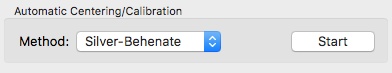

The Centering/Calibration panel
===============================

**WARNING:** The manual is current several versions out of date. While it may
still be useful for some users, please refer to the tutorial for the most
up-to-date information.

.. _centeringcalibration:

The Centering/Calibration panel allows you to set the beam center, x-ray wavelength
or energy, sample to detector distance, and detector pixel size. This allows RAW to
calibrate the q position for each pixel, and integrate the image into a one dimensional
scattering profile.

Opening the Centering/Calibration panel
---------------------------------------

Before opening the Centering/Calibration panel, you should make sure that an appropriate
image for calibration (such as the scattering from silver behenate) is :ref:`open <showimage>`
in the :ref:`Image panel <imageplotpanel>`. To open the Centering/Calibration panel, go
to the Tools menu and click on “Centering/Calibration”. The Centering/Calibration panel
will be placed (temporarily) over the control panel.

Setting calibration parameters
------------------------------

The Wavelength, Energy, Sample-Detector Distance, and Detector Pixel Size can all be
set in the Manual Centering/Calibration Adjustments panel of the Centering/Calibration
panel. For each, they can be set in one of two ways. First, a value can be directly
typed into the appropriate field. Second, the spin controls can be used to adjust the
value in the field. The spin controls only change the last digit of the value, so if
the sample detector distance is set at 1000, the up spin control will change it to 1001,
whereas if it is set at 1000.0, the up spin control will change it to 1000.1.

If a centering pattern is displayed on the image, changing these calibration will change
the pattern. In order for the pattern to update when a value is typed into a field, you
must either hit the enter key, or click out of the field.

*Note:* Setting the wavelength will automatically set the appropriate energy, and vice
versa. You only need to set one of these values.

Manually setting the beam center
--------------------------------

The beam center is displayed in x and y coordinates in the Manual Center/Calibration
Adjustments panel. These coordinates correspond with the x and y coordinates shown
on the image. If a centering pattern is selected in the Pattern drop down menu, the
eam center is also displayed on the image as a red dot 6 pixels in diameter.

The location of the beam center can be changed in three ways. First, values can be
directly entered into the X center and Y center fields. As with the calibration
parameters, in order to update the pattern display after entering a value in these fields,
you must either click out of the field or hit the enter key.

Second, the step size of the beam center in pixels can be set using the drop-down “Steps”
menu. The Steps menu is also a field you can type into, so you can set it to any numerical
value if the options available in the list are insufficient. Once you have set this, the
large red centering arrows on the right side of the Manual Center/Calibration Adjustments
box can be used to move the beam center <steps> pixels in the direction indicated by the
arrow, where <steps> is the value of the “Steps” field/menu. The arrows can be held down
for repeated motion in the same direction with the same step size.

Third, the target button in the center of the centering arrows can be clicked. You then click
on the image, and the beam center will be set to that position on the image, to the nearest pixel.

Automatic centering and distance calibration
--------------------------------------------

There are two different automated centering methods available in RAW. Which one is available in
your version depends on whether or not you have the *pyFAI* library installed. With either of
these methods, you will have the best chance to obtain accurate results if you manually calibrate
the center and distance first, so that the automated centering can refine on that starting position.

*With pyFAI (recommended)*

|10000201000001890000009175CE1B8F47D2AF8A_png|

In the Manual Centering/Calibration Adjustments panel:

#.  Select the appropriate Standard.

In the Automatic Centering/Calibration panel:

#.  Select the parameters to hold constant by checking boxes in the Fix section.

#.  Select the detector type to be used. If your detector is not in the list, select Other.

#.  Set the Ring # to the index of the first ring visible on the detector. The ring
    index starts at zero for the largest d-spacing ring (nearest the beam) and
    increments by one for each ring thereafter. *IMPORTANT:* The first ring visible
    on your detector image may not be ring 0!

#.  Click the Start button. Then click on the first ring in the image. Points in that
    ring will be automatically selected. Click on other parts of the ring as necessary to
    fill in points.

#.  Increment the ring number as appropriate for the next ring visible on the image (usually
    increment by 1, for example from 0 to 1), and click on the next ring on the image to select
    points there. Repeat for all visible rings.

#.  (If necessary) To remove points in a ring, set the Ring # to that ring, and click the
    Clear All Points In Ring button.

#.  Click the Done button once you have selected points in all of the visible standard rings.
    At this point, automatic centering and calibration will be carried out.

*Note:* Ring points cannot be selected if the Pan or Zoom tool are selected.

*Without pyFAI (not recommended)*

|10000201000001880000004957972A08CDA2E5BF_png|

This automated centering function attempts to position the center and find the sample-detector
distance based on the innermost ring of a Silver Behenate sample:

#.  Click the start button in the “Centering/Calibration Panel”

#.  Select at least 3 points just outside the innermost ring in the Silver Behenate image.

#.  Hit the “Done” button.

This function attempts to find the center of the circle that all of the points defined by your
clicks make. If that is found, it then uses the known wavelength, pixel size, and q value of the
first silver behenate ring to calculate the sample-detector distance.

Centering patterns
------------------

*With pyFAI (recommended)*

If the pyFAI library is installed, more than twenty different calibrants are available,
all of those supported by the pyFAI package (
`https://github.com/silx-kit/pyFAI/tree/master/pyFAI/resources/calibration <https://github.com/silx-kit/pyFAI/tree/master/pyFAI/resources/calibration>`_
), including Silver-Behenate (AgBh). Rings are displayed as red dashed lines at all appropriate q values.

*Without pyFAI (not recommended)*

Only one centering pattern is available in RAW. This is the Silver-Behenate pattern, which displays
red dashed rings on the detector corresponding to the expected rings from Silver-Behenate. RAW
displays the first 5 rings, which at q = 0.1076, 0.2152, 0.3229, 0.4305, and 0.538 Å:sup:`-1`\ .
The q values are labeled in RAW, but only show at the bottom of the rings, and so you typically have
to zoom out of the image to show the label.

.. |10000201000001890000009175CE1B8F47D2AF8A_png| image:: images/10000201000001890000009175CE1B8F47D2AF8A.png

