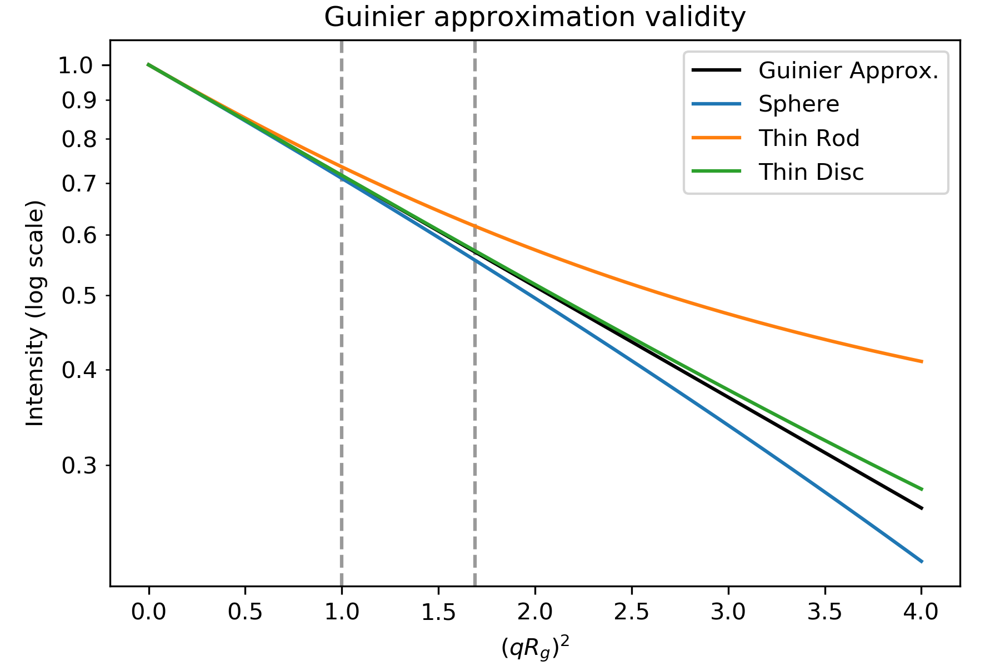
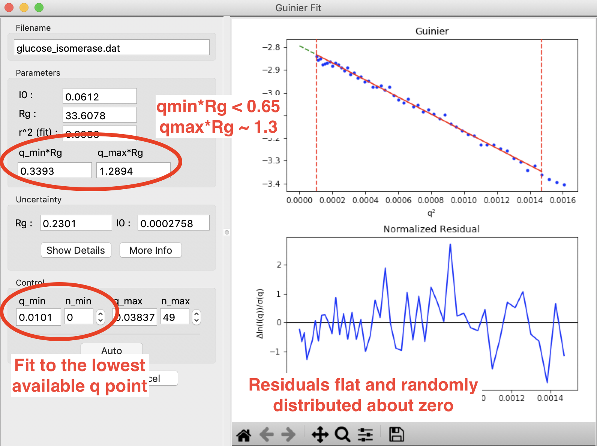
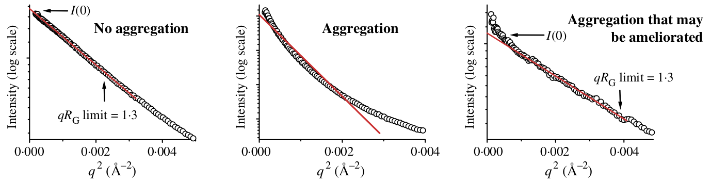
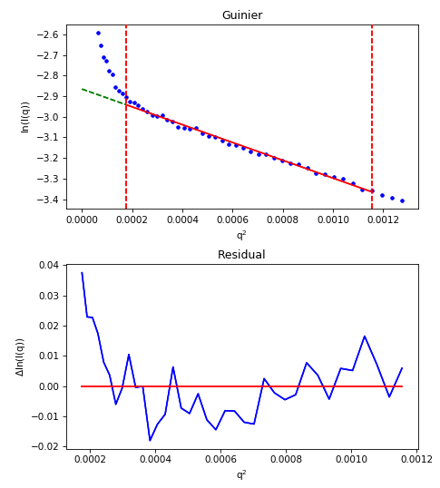
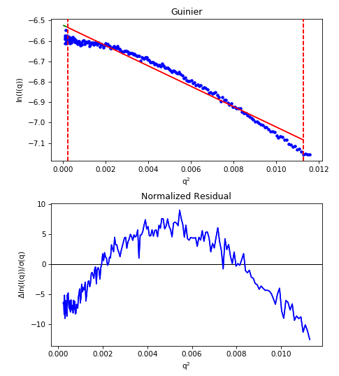

Guinier analysis
------------------
.. _saxs_guinier:

This tutorial covers basic principles and best practices for doing a
Guinier analysis. This is not a tutorial on how to use RAW for this type
of analysis. For that, please see the :ref:`RAW tutorial <s1p2>`.

Overview
^^^^^^^^^^^^^^^^^

Guinier’s approximation states that at low-*q* the scattering profile
can be approximated as follows:

.. math::

    I(q)\approx I(0) e^{-q^2 R_g^2 /3}

where |Rg| is the radius of gyration and I(0) is the intensity at zero scattering
angle (q=0). Because of the exponential in the Guinier approximation, |Rg| and I(0) can be
determined by performing a linear fit to a plot of :math:`\ln(I)`
vs. :math:`q^2`, called the Guinier plot. The region chosen for the linear
fit is called the "Guinier region."

The Guinier fit provides information on the overall size of the molecule, and
about the quality of your data.

Why do we do a Guinier fit?
^^^^^^^^^^^^^^^^^^^^^^^^^^^^^^^^

The Guinier fit is done for two reasons. First, you get the |Rg| and I(0) parameters.
The |Rg| tells you about the overall size of the molecule, while I(0) depends
on the molecular weight times the concentration. These parameters are useful
characterizations of your molecule, and are also needed to calculate
other information from the SAXS data, including molecular weight and
volume.

Second, and perhaps most importantly, many of the problems that can affect
your SAXS data will show up in the low q region, including:

*   Aggregation
*   Radiation damage
*   Interparticle interactions
*   Buffer mismatch (in some cases)

These data quality issues cause deviations from linearity in the Guinier region.
For this reason, having a good Guinier fit is one of the primary ways we assess
the quality of SAXS data. A good Guinier is a strong indicator that your data
is from a monodisperse sample and is otherwise free of artifacts. If you cannot
obtain a good Guinier fit, or you can only obtain a good Guinier fit by
excluding a significant amount of data at the lowest *q* values, then your
data probably has one or more of the problems listed above and usually should
not be used for further analysis.

How do we do a Guinier fit?
^^^^^^^^^^^^^^^^^^^^^^^^^^^^^

The Guinier approximation only holds when the exponential :math:`\exp(-q^2 R_g^2 /3)`
is small. This means that in order to do a good Guinier fit, we need
|qRg| to be sufficiently small. The |qRg| value at which the Guinier approximation
starts to fail for a given scattering profile depends on the overall shape
of the scatterer. Below is a figure showing the Guinier approximation (black),
and the scattering intensity for a sphere, thin rod, and thin disc (all with
the same |Rg|).

    Plot based on Figure 3.3 in [1]. Intensity for the geometric shapes
    from Table 3.4 in [1]. Dashed lines are at |qRg| of 1.0 and 1.3
    ((qR\ :sub:`g`) :sup:`2` of 1.0 and 1.69).

As you can see, the scattering intensity for the rod only agrees with the
Guinier approximation until :math:`qR_g\sim 1.0`, the sphere until :math:`qR_g\sim 1.3`,
and the disc until :math:`qR_g\sim 1.7`. Thus, depending on the overall particle shape, you
should fit different amounts of the low q data to have a good Guinier fit. (Note:
the plot's x axis is (qR\ :sub:`g`) :sup:`2`, so :math:`qR_g\sim 1.3` appears
as the dashed line at 1.69)

In practice, we fit both globular (sphere-like and disc-like) objects until :math:`qR_g\sim 1.3`.
while we fit highly extended (rod-like) objects until :math:`qR_g\sim 1.0`. These values were chosen to
have <10% error resulting from the deviation of actual shape from the Guinier approximation.
The reason we accept that much deviation is that you also get uncertainty from
fitting fewer points in your data, so there is a trade-off between how well
the approximation works (fitting to smaller maximum |qRg|) and how well you can
fit your data (fitting to larger maximum |qRg|).

The range of the Guinier fit is thus ideally from the earliest available *q*
value until a maximum |qRg| of 1.0 or 1.3. However, given that |Rg| is derived
from the Guinier fit, how do you determine the correct maximum q value for the
end of the fit? The answer is that the Guinier fit is done iteratively:

#.  Guess a starting maximum q value for the fit.
#.  Calculate the Guinier fit and get |Rg|.
#.  If |qRg| > 1.3 (or 1.0), reduce the maximum q. If |qRg| < 1.3 (or 1.0), increase the maximum q.
#.  Repeat steps 2 and 3 until you converge on a final maximum q.

Most software these days will do this iterative search for you, and for good
quality data will provide you with a reasonable maximum q value that may
need just a bit of manual refinement.

The minimum q value of a Guinier fit is usually determined by the minimum available
q value in your data, which is set by the instrument on which you make the measurement.
However, it is important to have a small enough minimum q to have a reasonable
range for the Guinier fit. Typically, the minimum |qRg| value should be
:math:`qR_g\leq 0.65`, though for globular systems it can be okay to have
:math:`qR_g\leq 1.0`. This means that the minimum q value required depends on the size
of the system measured. In some cases, with particularly large systems, you may
have to deliberately seek out an instrument that can measure to sufficiently low q.

If your data has quality issues at low q, which can be caused by the problems
listed above, you may find that excluding those data from the fit can improve
the quality of the fit. While this can be acceptable, you should proceed
with caution when doing that, and always show the full data range on plots.
The most acceptable case for this to happen is when the first few points
are either too high or too low, but the rest of the range fits perfectly
(see below for criteria for a good fit). In that case, those couple of points
closest to the beamstop may have poor statistics or higher instrumental
background scattering, and can usually be safely ignored.

Criteria for a good Guinier fit
^^^^^^^^^^^^^^^^^^^^^^^^^^^^^^^^^^^^

You are looking for four essential components in your Guinier fit:

#.  :math:`\mathbf{q_{min}R_g<0.65}` **.**

    *   The minimum q of your fit, q\ :sub:`min`, times the |Rg|  of your fit
        should be less than 0.65. This criteria ensures you have enough q range to
        properly calculate the |Rg| and I(0) values. For globular particles
        (sphere- or disk-like), you can get away with :math:`q_{min}R_g<1.0`.

#.  :math:`\mathbf{q_{max}R_g \sim 1.3}` **(globular) or**
    :math:`\mathbf{q_{max}R_g \sim 1.0}` **(extended).**

    *   The maximum *q* of your fit, q\ :sub:`max`, times the |Rg| of your fit
        should be less than 1.3 for globular (sphere- and disc-like) particles
        and less than 1.0 for extended (rod-like) particles. This ensures you
        remain in the linear range of the Guinier approximation for the fit.

#.  **The Guinier fit residuals should be flat and randomly distributed about zero.**

    *   If your residuals have a ‘smile’ (above zero near start and end of fit,
        below in the middle), or a ‘frown’ (below zero near start and end
        of fit, above in the middle), it indicates you have non-ideal data.
        The ‘smile’ is characteristic of aggregation, the ‘frown’ characteristic
        of interparticle repulsion.

#.  **The fit extends to the lowest available q point.**

    *   You shouldn’t have to excluded very many points at the start of the fit.
        A few is generally fine, as the points nearest the beamstop can be noisy
        (depending on the exact details of the measurement). Having to exclude
        more than 3-5 points at the low *q* may indicate a problem with your data.

    A Guinier fit done in RAW for glucose isomerase (available in the RAW
    Tutorial data). This shows what a good Guinier fit looks like. It has
    :math:`q_{min}R_g<0.65`, :math:`q_{max}R_g \sim 1.3`, the normalized fit
    residual (bottom plot) is flat and randomly distributed about zero,
    and the fit extends to the lowest *q* point available.

Having a good Guinier fit is a major quality check, and a good sign that
your data is from a monodisperse sample with no interparticle interactions.

What is a bad Guinier fit, and what does it mean?
^^^^^^^^^^^^^^^^^^^^^^^^^^^^^^^^^^^^^^^^^^^^^^^^^^^^^^^^^^^^^^^^^

Non-linearities in your Guinier fit are indicative or problems in your sample.
The type of non-linearity can indicate what the problem may be. The figure
below gives a quick summary off the most common pathologies, more detail is
available in the sections below.

.. figure:: images/guinier_overview_jacques.png
    :target: ../_images/guinier_overview_jacques.png

    Figure 3 from [2]. A and D show a good (monodisperse) scattering profile and
    Guinier fit. B and E show scattering profiles with varying degrees of
    interparticle interference. C and F show scattering profiles with varying
    degrees of aggregation.

Aggregation
*************************

Aggregation causes a characteristic upturn at low q. This can either be caused by
aggregates initially present in your sample, or by radiation induced aggregation
(radiation damage). The figure below shows what that might look like in your data.

    Figure 23 from [3], showing no (left panel), large (middle panel) and small
    (right panel) amounts of aggregates seen in the Guinier fit.

The effect of aggregation can also be clearly seen in the fit residual, where it
shows up as a 'smile', with the residual above zero near the start and end of the
fit and below zero in the middle. The figure below illustrates this.

    For an aggregated sample, even with the worst low *q* values cut off from the
    fit, the residual (bottom plot) show the characteristic 'smile', rather than
    being flat and randomly distributed about zero.

Repulsion
*************************

Repulsive interparticle interactions result in a structure factor that causes
a downturn in the scattering profile at low q. This is typically caused by
electrostatic interactions, and can often be remedied by either reducing the
sample concentration or adding more salt to the buffer. These effects are
also clearly seen in the fit residual, where it shows up as a 'frown', with the
residual below zero near the start and end of the fit and above zero in the
middle. This is shown in the figure below.

    For a repulsive sample, the residual (bottom plot) show the characteristic
    'frown', rather than being flat and randomly distributed about zero.

Note that the above figure is an extreme example of repulsion, the downward
curve may not be that obvious.

Bad buffer subtraction
*************************

Good SAXS data depends on subtracting away all scattering from the buffer and
instrument background. If this subtraction is not good, you can end up with
a downturn at low q (over subtraction) or an upturn at low q (under subtraction).
This will look similar to aggregation or repulsion in the Guinier fit.

FAQ
^^^^^^^^

What if I don't know my particle shape, should I fit to a maximum |qRg| 1.3 or 1.0?
*************************************************************************************

Very often, you don't know what your particle shape is before making a SAXS measurement
(in fact, this is often one of the purposes of a SAXS measurement). In that case,
start out by fitting to a maximum |qRg| of 1.3. If that has a non-flat residual,
reduce the fitting range to a maximum |qRg| of 1.0. If the residual becomes
flat upon reducing the maximum |qRg|, then your particle is likely more
extended than globular, and you should keep the maximum |qRg| at 1.0. If reducing
the maximum |qRg| still leaves a non-flat residual, your data is showing signs
of aggregation, repulsion, or some other issue.

My Guinier fit isn't great, can I still use my data?
******************************************************

If your Guinier fit isn't great, typically you shouldn't use the data. Even small
amounts of aggregation (<1%) can affect things like the measured maximum dimension,
and three dimensional reconstructions. While data with imperfect Guinier fits
can be used in some specific cases, my general recommendation is to collect the
data again.

My Guinier fit is a bit off, how can I fix it?
**************************************************

If your Guinier fit isn't ideal, typically the only way to fix this is to
collect the data again, improving your sample/solution conditions. Below are
a few things you can try to fix these issues.

For inherent aggregation:

#.  Spin down your sample in a centrifuge at high speeds (~16000 g) for 5-10
    minutes before data collection. In some cases, ultracentrifugation may help.

#.  Use size exclusion chromatography coupled to SAXS instead of batch mode SAXS
    for in-line sample purification.

#.  Reduce the concentration of your sample.

#.  Re-purify your sample using size exclusion or ion exchange chromatography
    immediately before the SAXS measurement.

For radiation damage (often aggregation):

#.  Add 1-5% glycerol.

#.  Increase the flow/oscillation speed of your sample.

#.  Reduce the exposure time and/or number of exposures.

#.  Add radical scavengers like DTT.

#.  Attenuate the incident x-ray beam.

For repulsion:

#.  Add salt to the buffer to reduce repulsion.

#.  Reduce the concentration of your sample.

#.  Change the pH of your buffer.

For bad buffer subtraction:

#.  Prepare matching buffer using dialysis.

#.  Exchange buffer across a sizing column or desalting column.

References
^^^^^^^^^^^^
1.  `Feigin, L., Svergun, Structure Analysis by Small-Angle X-ray and Neutron Scattering (1987).
    <https://www.embl-hamburg.de/biosaxs/reprints/feigin_svergun_1987.pdf>`_

2.  Jacques, D. A. & Trewhella, J. (2010). Protein Sci. 19, 642–657.
    DOI: `10.1002/pro.35 <https://doi.org/10.1002/pro.351>`_

3.  Putnam, C. D., Hammel, M., Hura, G. L. & Tainer, J. a (2007). Q. Rev.
    Biophys. 40, 191–285. DOI: `10.1017/S0033583507004635
    <https://doi.org/10.1017/S0033583507004635>`_

.. |Rg| replace:: R\ :sub:`g`

.. |qRg| replace:: qR\ :sub:`g`

