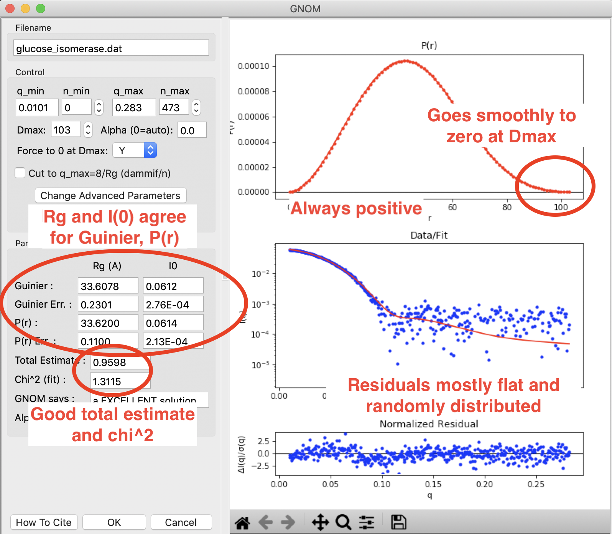
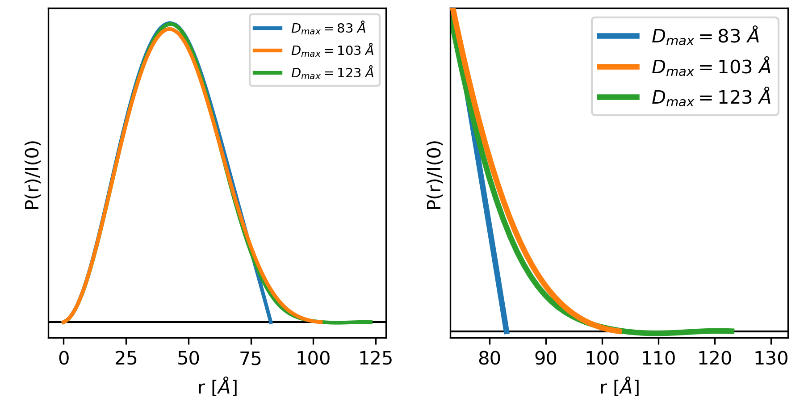
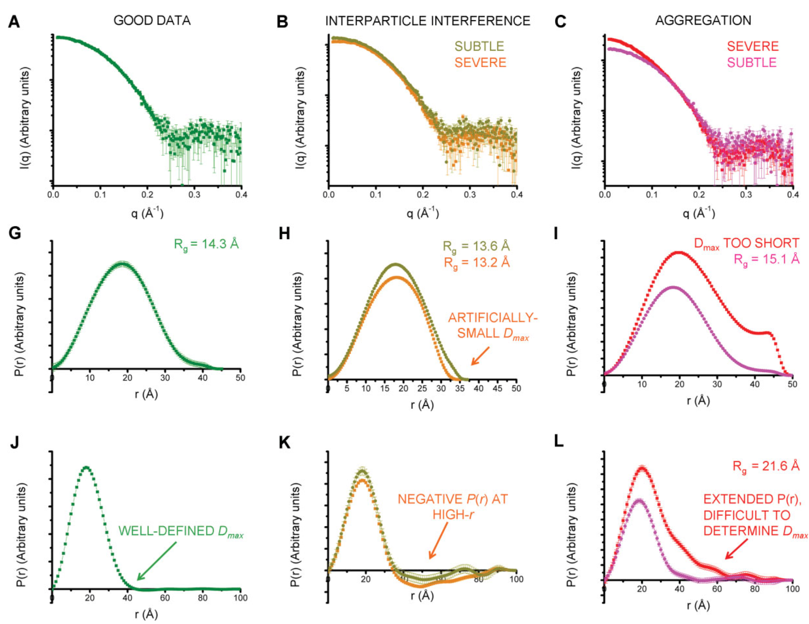
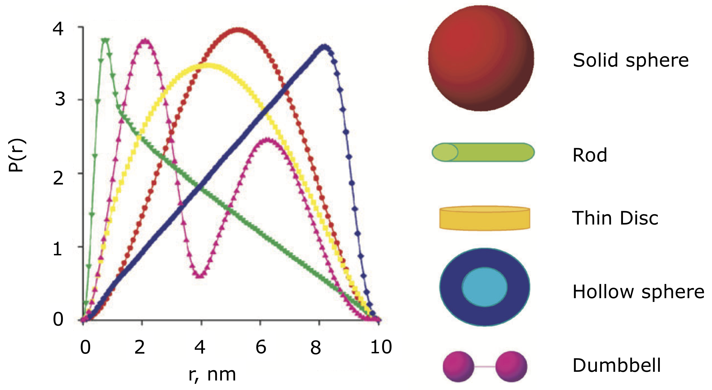
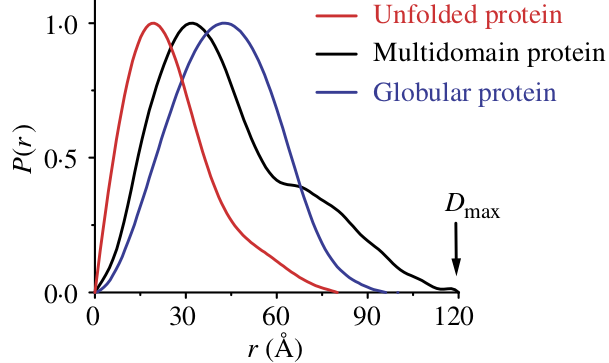

Indirect Fourier Transform (IFT) and the P(r) function
----------------------------------------------------------
.. _saxs_ift:

This tutorial covers basic principles and best practices for doing an
Indirect Fourier Transform (IFT) to get a P(r) function. This is not a tutorial
on how to use RAW for this type of analysis. For that, please see
the RAW tutorial for :ref:`GNOM <s2p1>` and :ref:`BIFT <bift_tutorial>`.

Overview
^^^^^^^^^^^^^^^^^

The SAXS scattering profile is measured in reciprocal distance space, as
I(q) where *q* has units of one over distance (usually 1/Angstrom or
1/nm). We can apply a Fourier transform to the data to get information
in real space about the macromolecule, as:

.. math::

    P(r) = \frac{r^2}{2\pi^2} \int_0^{\infty} q^2I(q) \frac{\sin(qr)}{qr}dq

This produces the P(r) function, also called the pair distance distribution function.
Essentially, the P(r) function is the r\ :sup:`2` weighted histogram of all
possible pairs of electrons in the sample.

Why do we do an IFT?
^^^^^^^^^^^^^^^^^^^^^^^^^^^^^^^^

The P(r) function contains valuable information about the shape and size of
a macromolecule. First, in doing the P(r) function we get an estimate of the
maximum dimension of the macromolecule (|Dmax|). It also provides another, potentially
more accurate, way to calculate the |Rg| and I(0). The shape of the P(r) function
can also be directly interpreted in terms of the shape of the macromolecule,
providing information about the overall shape, such as globular vs. rod-like,
or whether the macromolecule contains multiple domains. Also, the P(r) function
and derived parameters such as |Dmax| are required for many advanced analysis
techniques including ab-initio reconstructions of the shape.

Additionally, the P(r) function is sensitive to data quality issues, particularly
aggregation and interparticle interference. Thus, doing an IFT is another
quality check on your data. If you cannot obtain a good P(r) function, then
your data probably one of those issues and usually should not be used for
further analysis.

How do we do an IFT?
^^^^^^^^^^^^^^^^^^^^^^^^^^^^^

The equation above cannot be used to directly calculate the P(r) function.
The finite extent of our measurement (and measurement noise) means that a
direct Fourier transform of I(q) will distort the true P(r) function by
introducing truncation artifacts. Instead, the typical approach is to
fit the P(r) function against the data. First, you generate the scattering
intensity for a given P(r) function as:

.. math::

    I(q) = 4\pi \int_0^{D_{max}} P(r) \frac{\sin(qr)}{qr}dr

Using this equation you generate the P(r) function that yields the best fit
to the data. The fitting criteria include both the actual fit, usually as measured
by :math:`\chi^2`, and regularization parameters. These regularization parameters
allow you to add back in information to improve the P(r) function. Typical
examples of the regularization parameters include perceptual criteria such as:

*   Smoothness of the P(r) function.
*   Positivity of the P(r) function.
*   Whether the solution changes significantly when changing the weighting of
    the regularization parameters.

Determining a P(r) function in this way thus requires determining three things:

#.  The maximum dimension, |Dmax|, of the sample, as that determines the upper
    bound of the integral above.
#.  The weighting parameter, usually called :math:`\alpha`, that determines
    the relative contribution of :math:`\chi^2` and the perceptual criteria
    to the overall fit quality.
#.  The P(r) function that yields the best fit to the data, given the
    particular |Dmax| and :math:`\alpha` values.

This is a complicated problem, and there are a number of different programs
out there for finding a P(r) function. These programs all typically involve
searching a set of possible |Dmax| values and :math:`\alpha` values to find
which yields the best overall fit. RAW natively supports one method for
finding the P(r) function, the Bayesian Indirect Fourier Transform (BIFT)
[1], which provides a completely automated determination of |Dmax|
and :math:`\alpha`.

The most popular method for determining the P(r) function is the GNOM [2] software
in the ATSAS package, which RAW provides an interface to if ATSAS is installed.
Below we discuss how to determine a good P(r) function using GNOM, after discussing
the criteria for a good P(r) function.

Criteria for a good P(r) function
^^^^^^^^^^^^^^^^^^^^^^^^^^^^^^^^^^^^

We employ the following criteria to determine if a P(r) function is good:

#.  **The P(r) function falls gradually to zero at** :math:`\mathbf{D_{max}}`\ **.**
#.  **The P(r) function fits the measured scattering profile.**
#.  **The P(r) function goes to zero at** :math:`\mathbf{r=0}`
    **and** :math:`\mathbf{r=D_{max}}`\ **.**

Additionally, the following criteria usually apply:

#.  **The** :math:`\mathbf{R_{g}}` **and I(0) from the Guinier fit and the P(r) function agree well.**
#.  **The P(r) function is always positive.**

    A P(r) function done in RAW using GNOM for glucose isomerase (available
    in the RAW Tutorial data). This shows what a good P(r) function looks like.
    The function goes smoothly to zero at |Dmax|, it is always positive,
    there is good agreement between the Guinier and P(r) |Rg| and I(0) values,
    and the residuals are mostly flat and randomly distributed. You can see
    a small systematic deviation in the residuals below q~0.125. This
    could be smoothed out by reducing the :math:`\alpha` value, which may be slightly
    over weighting the regularization parameters vs. the actual fit to the
    data.

A more thorough discussion of each criterion is given below.

The P(r) function falls gradually to zero at |Dmax|
******************************************************

This is perhaps the most important and most subjective criterion for determining
whether you have a good P(r) function. The idea is straightforward: macromolecules
do not have perfectly sharp boundaries. Because they have side chains that stick
out, and have some amount of flexibility in solution (even if limited to
solvent exposed side chains), there is no distance at which you go from
many electrons pairs to no electron pairs within the macromolecule. As such,
the P(r) function should gradually approach zero at the maximum dimension,
rather than being cut off.

Essentially, if this criterion is met you have picked an appropriate |Dmax|
for the system. If you underestimate the |Dmax|, then the P(r) function
has an abrupt descent to zero, while an overestimated |Dmax| usually
shows an oscillation about zero. This is shown in the figure below.

    The left and right plots show three different P(r) functions for the same
    protein (glucose isomerase, available in the RAW Tutorial Data). The
    difference between the three is the |Dmax|, which is either 83 (blue),
    103 (orange) or 123 (green) Angstrom. The left plot shows the full
    P(r) function. The different |Dmax| values yield similar P(r) functions,
    so much so that they end up plotted on top of each other for most of their
    r values. The right plot is the same functions showing just the end,
    as P(r) approaches zero at |Dmax|.

In the plot above, we can clearly see that for a |Dmax| of 83, the P(r)
function is forced abruptly down. For a |Dmax| of 103, the function has a
smooth approach to zero. For a |Dmax| of 123 the function reaches zero and
then oscillates about it. From this we can conclude that 103 is a good
value for |Dmax|, whereas 83 is underestimated and 123 is overestimated.

The P(r) function fits the measured scattering profile
***********************************************************

This criterion is straightforward. The transformation of the P(r) function
to I(q) should fit the measured scattering profile. This can be evaluated
both through the :math:`\chi^2` value of the fit, which should be close to 1,
and the normalized residuals between the fit and the data, which should be flat
and randomly distributed about zero.

The P(r) function goes to zero at :math:`\mathbf{r=0}` and :math:`\mathbf{r=D_{max}}`.
****************************************************************************************

The reason for this criterion is straightforward. The P(r) function
should go to zero at r=0 because it is the r\ :sup:`2` weighted number
of electron pairs in the macromolecule. As r goes to zero, so does r\ :sup:`2`,
and thus so must P(r). The P(r) function should go to zero at :math:`r=D_{max}`
because |Dmax| is the maximum dimension of the particle. Beyond that distance
there should be no electron pairs in the particle. This criterion is usually
enforced by conditions in the IFT calculation.

The |Rg| and I(0) from the Guinier fit and the P(r) function agree well
***************************************************************************

The |Rg| and I(0) values can be determined directly from the P(r) function.
This provides a complementary approach to the Guinier fit. For well behaved
rigid systems, |Rg| and I(0) should agree well between both methods. If
they do not, it may suggest a problem in either the Guinier fit or the
P(r) function. However, for flexible and disordered systems, it has been
observed that the P(r) |Rg| and I(0) values are characteristically larger,
and more reliable, than the Guinier |Rg| and I(0) values [3].

The P(r) function is always positive
*************************************

This criterion usually applies, as for most macromolecules the presence of a negative
number of electron pairs has no meaning. However, when dealing with membrane
proteins that are encapsulated in lipids or detergents, this criterion is no
longer valid. In those cases, the lipid/detergent may have a lower electron
density than the buffer. As scattering is measured relative to the solvent,
this lower density will appear as negative electron pairs in the P(r) function.
For example, proteins embedded in lipid nanodiscs have a characteristic dip
in the P(r) function that can often go negative.

Determining a good P(r) function using GNOM
^^^^^^^^^^^^^^^^^^^^^^^^^^^^^^^^^^^^^^^^^^^^^^^^

While it takes some practice to learn how to properly evaluate the P(r) function,
there is a set of steps that I regularly follow when creating a P(r) function
using GNOM via the RAW interface:

#.  Open the GNOM interface. It defaults to what GNOM thinks is a reasonable
    |Dmax| (using datgnom).
#.  If necessary, set the starting q value for the P(r) function to match
    that of the Guinier fit (newer versions of RAW do this automatically).
#.  Set the |Dmax| value to 2-3 times larger than the initial value.
#.  Look for where the |Dmax| value drops to 0 naturally. Set the |Dmax|
    value to this point.
#.  Turn off the force to zero at |Dmax| condition.
#.  Tweak |Dmax| up and down until it naturally goes to zero (with the force
    to zero turned off).
#.  Turn the force to zero at |Dmax| condition back on.
#.  If needed, truncate the P(r) function to a maximum q of 8/R\ :sub:`g`,
    or 0.25-0.3 1/Angstrom, whichever is smaller, if using for bead model
    reconstructions with DAMMIF/N. You may have to tweak the |Dmax| a bit after
    truncation.

If you have good quality data, this ought to produce a good P(r) function.

Note that even for good quality data with a mostly rigid globular macromolecule
like glucose isomerase (shown in the plots above), there usually isn't a single
right value of |Dmax|. For this data, a best case scenario, you could reasonably
pick a |Dmax| value from ~99-104, which is a 5% variation. For macromolecules
with more flexibility, |Dmax| is even more poorly defined. As a rule of thumb,
|Dmax| is usually never determined to better than 5%, sometimes the uncertainty
is closer to 10%.

Other tips:

*   If the residual has too much systematic deviation, you can manually set
    the :math:`\alpha` to something smaller than the automatic value. Start
    with half the automatically determined value, and tweak from there.

*   Don't forget to check that the |Rg| and I(0) values agree (if you have a
    rigid system). Generally speaking, increasing |Dmax| will increase
    the P(r) |Rg| and I(0) values, so that can help guide your choice of |Dmax|.

*   Don't truncate your P(r) function for electron density reconstructions
    with DENSS.

What is a bad P(r) function, and what does it mean?
^^^^^^^^^^^^^^^^^^^^^^^^^^^^^^^^^^^^^^^^^^^^^^^^^^^^^^^^^^^^^^^^^

Even if you follow all of the guidelines above, sometimes you can end up with
a bad P(r) function. Typically what bad means is one of two things:

#.  You can't find a good |Dmax| value. You keep increasing |Dmax| and the P(r)
    function never smoothly goes to zero.

#.  If you increase |Dmax| the P(r) function goes negative.

In these cases, it is most likely that your data has a problem. The figure
below gives a quick summary of the most common pathologies, more detail is
available in the sections below.

    Figure 3 from [4]. A, G, and J show a good (monodisperse) scattering profile
    and P(r) function. B, H, and K show a scattering profile and P(r) function with
    varying degrees of interparticle interference. C, I, and L show a scattering
    profile and P(r) function with varying degrees of aggregation. the middle row
    shows the effect on the P(r) function, while the last row shows that to
    really judge the effect of the change on the P(r) function you should extend
    the |Dmax| value out significantly.

Note that both pathologies are easiest to see when you plot the P(r) function well
past the point where you think the correct |Dmax| value is (panels J-L in the
above figure). This means that it is important to always extend the |Dmax| value
when generating your P(r) function to verify that the P(r) function stays flat
and close to zero (usually small oscillations about zero), as in panel J, rather
than dipping negative (panel K, repulsive interparticle interference) or
staying slightly positive (panel L, aggregation).

Aggregation
*************

Aggregation in solution means some amount of larger particles are present.
The presence of these larger particles causes the |Dmax| to be hard to
determine. Typically this manifests as there being a significantly extended tail
on the P(r) distribution, which does not fall to zero naturally regardless of the
chosen |Dmax|. The P(r) function calculated |Rg| and I(0) will also be larger
than they would be for the monodisperse sample.

Small amounts of aggregation can look similar to the P(r) function for a flexible
system, so other methods should be used to determine the true state of the system.
The Guinier analysis will usually reveal the presence of aggregates, and Kratky
plot will show if the system is flexible. If you are unsure whether your P(r)
function is showing aggregation or flexibility, check with these other techniques.

Interparticle interference
******************************

Interparticle interference usually manifests as repulsion in solution. This
repulsive effect manifests as an artificially small |Dmax|. The P(r) function
calculated |Rg| and I(0) values are reduced compared to what they would be
for the non-interacting sample.

Since you usually don't know the |Dmax| of your sample prior to making the
measurement, it can be hard to tell if the |Dmax| is artificially small. In
this case, the easiest way to see this effect is to extend the |Dmax| out past
what you found to be a 'good' |Dmax|. If the P(r) function goes and stays negative,
as in K of the above figure, then you have a repulsive interaction. If it stays
near zero (possibly with some small oscillation about zero), as in J of the
above figure, then you are not seeing a repulsive interaction.

How to interpret features of a P(r) function
^^^^^^^^^^^^^^^^^^^^^^^^^^^^^^^^^^^^^^^^^^^^^^^^

The P(r) function provides a significant amount of information on particle
shape and size in solution. The easiest parameters to interpret are the
|Dmax|, |Rg|, and I(0), which all inform on particle size. The |Dmax| is simply
the maximum dimension of the particle. The |Rg| is the radius of gyration,
and I(0) is the scattering at zero angle, which is proportional to the
molecular weight and concentration. Beyond these parameters, the shape of
the P(r) function contains significant information about the particle shape.
This is seen clearly in the plot of P(r) functions for different
geometric bodies shown below.

    P(r) functions for geometric bodies, adapted from figure 5 of [5].

In the above figure, there are several things worth noting:

#.  In the P(r) function for a long rod, the initial peak at short distance
    comes from electron pairs across the short dimension of the rod. The long
    extend tail comes from electron pairs along the length of the rod.
#.  In the P(r) function for a dumbbell, the peak at lower r comes from the
    electron pairs within each individual domain of the dumbbell. The peak
    at longer distance comes from the electron pairs between the two domains
    of the dumbbell.
#.  For the hollow sphere, the peak at long distance is coming from the electron
    pairs across the diameter of the sphere.

While macromolecules do not have P(r) functions that exactly match those of
geometric bodies, the dominant features of the P(r) function can be used to
determine overall shape characteristics of the macromolecule. Most usefully:

*   Globular proteins tend to have P(r) functions similar to that of a solid
    sphere.
*   Long rigid rod-like systems, like duplex DNA, have P(r) functions very
    similar to that of a long rod.
*   Multi-domain proteins have two peaks, like that of a dumbbell. However,
    as the domains are not usually symmetric in size or widely separated,
    the peaks are usually more of a strong peak and an overlapping shoulder
    peak.

The plot below shows the P(r) function for several actual macromolecules.

    P(r) functions for flexible (unfolded), multidomain, and globular proteins.
    Figure 24 in [6].

FAQ
^^^^^^^^

Is a small change in |Dmax| significant?
*********************************************

Small changes in |Dmax| are usually not significant. Even for good quality data
with a mostly rigid globular macromolecule like glucose isomerase (shown in the
plots above), you could reasonably pick a |Dmax| value from ~99-104, which is
a 5% variation. For macromolecules with more flexibility, |Dmax| is even more
poorly defined. As a rule of thumb, |Dmax| is usually never determined to
better than 5%, sometimes the uncertainty is closer to 10%.

My P(r) function goes negative. Is that okay?
*************************************************

Generally speaking, no. However, if you have a system that is detergent or lipid
bound, such as a protein embedded in a nanodisc, then you may see a negative
dip in your P(r) function.

References
^^^^^^^^^^^^

1.  Hansen, S. J. Appl. Crystallogr.(2000) 33, 1415-1421. DOI:
    `10.1107/S0021889800012930 <https://doi.org/10.1107/S0021889800012930>`_

2.  Svergun D.I. (1992). J. Appl. Crystallogr. 25, 495-503. DOI:
    `10.1107/S0021889892001663 <https://doi.org/10.1107/S0021889892001663>`_

3.  Kikhney, A. G. & Svergun, D. I. (2015). FEBS Lett. 589, 2570–2577. DOI:
    `10.1016/j.febslet.2015.08.027 <https://doi.org/10.1016/j.febslet.2015.08.027>`_

4.  Jacques, D. A. & Trewhella, J. (2010). Protein Sci. 19, 642–657.
    DOI: `10.1002/pro.35 <https://doi.org/10.1002/pro.351>`_

5.  Svergun, D. I. & Koch, M. H. J. (2003). Reports Prog. Phys. 66, 1735–1782.
    DOI: `10.1088/0034-4885/66/10/R05 <https://doi.org/10.1088/0034-4885/66/10/R05>`_

6.  Putnam, C. D., Hammel, M., Hura, G. L. & Tainer, J. a (2007). Q. Rev.
    Biophys. 40, 191–285. DOI: `10.1017/S0033583507004635
    <https://doi.org/10.1017/S0033583507004635>`_

.. |Rg| replace:: R\ :sub:`g`

.. |Dmax| replace:: D\ :sub:`max`
