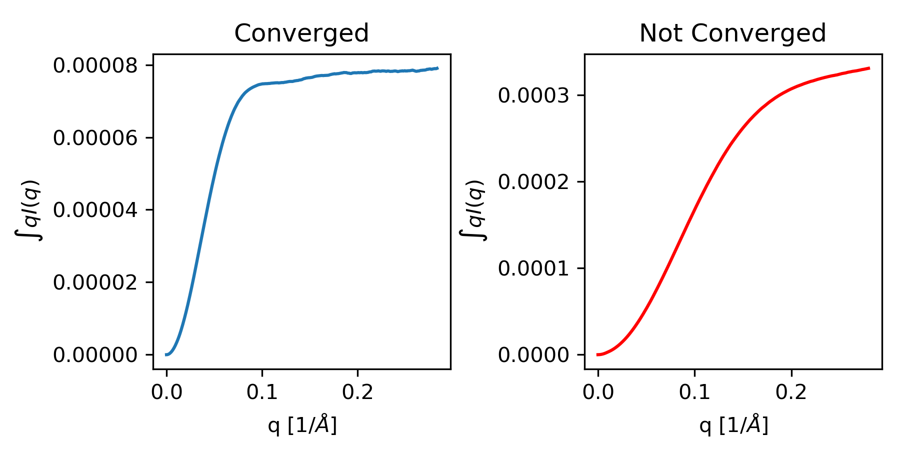

Molecular weight calculation
------------------------------
.. _saxs_mw:

This tutorial covers basic principles and best practices for calculating
molecular weight from SAXS data. This is not a tutorial on how to use RAW
for this type of analysis. For that, please see the :ref:`RAW tutorial <raw_mw>`.

Overview
^^^^^^^^^^^^^^^^^

There are a number of ways to calculate molecular weight from SAXS data. RAW
supports four of the most common methods natively:

#.  Molecular weight from absolute scaled I(0) [1].
#.  Molecular weight by comparing to a reference standard [1].
#.  Molecular weight from the Porod volume [2].
#.  Molecular weight from the volume of correlation [3].

There are two additional methods supported in the ATSAS software, which RAW
will show if ATSAS is installed:

#.  Molecular weight estimation by comparison of scattering to known structures [4].
#.  Molecular weight calculation by Bayesian inference from the other molecular
    weight methods [5].

All of these methods have advantages and disadvantages, and which to use and
trust depends to a certain extent on the details of your data. Regardless,
calculating molecular weight is important to verify the oligomeric state
of your sample.

Why do we do calculate molecular weight?
^^^^^^^^^^^^^^^^^^^^^^^^^^^^^^^^^^^^^^^^^

SAXS molecular weight calculations are not terribly accurate, a usual rule of thumb
is ~10% uncertainty (or more). For this reasons, SAXS should not be used to
determine the molecular weight of your sample, something like multi-angle
light scattering (MALS) is going to be much more accurate. The main reason
to calculate molecular weight from SAXS data is to determine the oligomeric
state of the protein in solution. Particularly if you're studying a system
that can form homodimers or higher order oligomers, the SAXS molecular
weight calculations should be accurate enough to tell what oligomeric state
you're measuring. For this reason, the molecular weight is an important diagnostic
for verifying that what you think is in solution is actually what's in solution.

How do we do calculate molecular weight?
^^^^^^^^^^^^^^^^^^^^^^^^^^^^^^^^^^^^^^^^^

Because there are so many methods for calculating molecular weight from SAXS data,
we will only present a short summary of the methods listed above here.
Generally speaking the methods can be broken up into two categories:
concentration dependent and concentration independent. The concentration
dependent methods require knowing the concentration of the sample in the SAXS cell,
which often means they are incompatible with SEC-SAXS measurements. The concentration
independent methods do not require knowledge of the concentration, and so are
useful for SEC-SAXS measurements.

Molecular weight from absolute scaled I(0)
********************************************

SAXS data is often put on an absolute scale, so that the intensity values have
units (by convention of cm\ :sup:`-1` ). This means that the I(0) value can be
directly related to the number of electrons in the sample and the concentration
and contrast of the sample [6]. If the concentration and contrast of the sample
is known, the total number of electrons can be calculated, and then that can be
used to determine the molecular weight of the sample. The accuracy of this
approach can be improved by measuring or calculating (for example, using `MULCh
<http://smb-research.smb.usyd.edu.au/NCVWeb/>`_) the protein partial specific
volume. If necessary, adjusting the electron densities of the sample and buffer
will also improve the accuracy. Molecular weight is calculated as:

.. math::

    MW = \left(\frac{N_A I(0)}{c \Delta \rho^2_M}\right)

where *MW* is the molecular weight, *c* is the concentration, :math:`N_A`
is Avagadro's constant, and :math:`\Delta \rho_M` is the scattering contrast
per mass.

The accuracy of this method was assessed in [1] where they found it to be <~10%
for most proteins.

Molecular weight by comparing to a reference standard
********************************************************

The scattering at zero angle, I(0) is proportional to the molecular weight of
the macromolecule, and the concentration and contrast of the macromolecule in
solution. If a reference sample of known molecular weight and concentration is
measured, it can be used to calibrate the molecular weight of any other
scattering profile with known concentration (assuming constant contrast between
reference and sample, and a monodisperse sample) [1]. Molecular weight is
calculated as:

.. math::

    MW_m = \left(\frac{I(0)_m}{c_m}\right)\left(\frac{MM_{st}}{\left(\tfrac{I(0)_{st}}{c_{st}}\right)}\right)

where *MW* is the molecular weight, *c* is the concentration, and the subscripts
*m* and *st* designate quantities from the macromolecule of interest and the standard
respectively.

Molecular weight from Porod volume
****************************************

The Porod volume is nominally the excluded volume of the macromolecule in
solution. It can be calculated directly from the scattering profile, first
by calculating the Porod invariant:

.. math::

    Q_p = \int^\infty_0 q^2 I(q) dq

where :math:`Q_p` is the Porod invariant. The Porod volume is then calculated as:

.. math::

    V_p = \frac{2\pi^2 I(0)}{Q_p}

where *I(0)* is the scattering at zero angle. Once this volume is determined,
the molecular weight is determined by simply multiplying by the macromolecule's
density.

Because :math:`Q_p` is determined by an integral from 0 to :math:`\infty`, the actual
integration must be approximated in some way. There are various approaches, including
the the 'Porod' and 'Qp' methods implemented in the ATSAS datmw program. RAW
uses the SAXSMoW 2 approach described in [2], which applies a correction factor
to the Porod volume based on the available range of data in the scattering profile.
Then an average protein density is used to calculate the molecular weight.
The accuracy of this method can be improved if a more accurate density
for the macromolecule is known.

In [2] they found a median uncertain of 12% for calculated molecular weight
from globular proteins. By contrast, in [5] they found using a large test set
of simulated curves that the median molecular weight of this method was 3% high,
and the median absolute deviation from this method was 5%. The uncertainty was higher
for data with simulated noise. It seems reasonable to say the uncertainty in
molecular weight is ~10% for most systems, though there are outliers.

Molecular weight from volume of correlation
**************************************************

In [3] they defined the volume of correlation as

.. math::

    V_c = \frac{I(0)}{\int_0^{\infty}qI(q)dq}

Based on an empirical relation observed between the ratio :math:`V_c^2/R_g`
is logarithmically proportional to molecular weight, and found the following
formula:

.. math::

    MW = \left(\frac{V_c^2/R_g}{c}\right)^k

where *c* and *k* are empirically determined constants via fitting results from
theoretical scattering profiles. They found different constants for proteins
and RNA. For proteins, :math:`c=0.1231` and :math:`k=1` while for RNA
:math:`c=0.00934` and :math:`k=0.808` (note: *c* and *k* are defined slightly
differently in the original paper).

In [3] they found a molecular weight uncertainty of ~5% from theoretical
profiles and ~10% from experimental profiles. By contrast, in [5] they found
using a large test set of simulated curves that the median molecular weight
of this method was 2% low, and the median absolute deviation from this method was 7%.
The uncertainty was higher for data with simulated noise. It seems reasonable to say
the uncertainty in molecular weight from this is ~10% for most systems, though there are outliers.

Molecular weight by comparison to known structures
*****************************************************

In [4] they describe a machine learning method that categories SAXS data into
shape categories based on comparison with a catalog of known structures from the PDB.
By finding the nearest structures in shape and size (also the name of the method:
Shape&Size), they can obtain estimates for the molecular weight of the sample.

In [4] they found that, for the theoretical scattering profiles used for testing,
the method calculated molecular weights within 10% of the expected value for 90%
test data. In [5] they found that for the test dataset the median molecular
weight was correct and the median absolute deviation was 4%. Again, it seems
reasonable to say that the uncertainty in molecular weight from this method is
~10% for most systems, though there are outliers.

Molecular weight from Bayesian inference
*******************************************
In [5] they describe a method for calculating a molecular weight using Bayesian
inference with the molecular weight calculations from the Porod volume, volume of
correlation, and comparison to known structures methods as the evidence.
Essentially, it takes a large test dataset of theoretical scattering profiles,
calculates the molecular weight for each using each method, then creates a
probability distribution for each method that describes the probability of obtaining
a particular calculated molecular weight given the true molecular weight. These
probabilities are combined across all the methods, and the most likely molecular
weight is thus estimated.

They found that for the theoretical scattering profiles used, the median molecular
weight from this method was accurate and the median absolute deviation was 4%.
Overall, they reported that it was more accurate than any individual method.
It may be that the uncertainty in this method is usually closer to ~5% than 10%
for the other methods.

What are the strengths and weaknesses of different MW methods?
^^^^^^^^^^^^^^^^^^^^^^^^^^^^^^^^^^^^^^^^^^^^^^^^^^^^^^^^^^^^^^^^^^^

Each method has distinct strengths and weaknesses, and tend to be better with
certain types of data. Every method requires a good determination of I(0),
and all of the concentration independent methods require R\ :sub:`g`, which generally
means a good Guinier fit is required in all cases. Also, in [5] it is reported that
all of the concentration independent methods struggle with flat and ring-shaped
proteins.

Molecular weight from absolute scaled I(0)
********************************************

**Advantages:**

*   Can be highly accurate when all parameters are well known.
*   With correct parameters can be used for proteins or RNA/DNA.

**Disadvantages:**

*   Requires accurate sample concentration.
*   Requires accurate absolute calibration.
*   Best when the scattering contrast of the macromolecule is well known.
*   Best when partial specific volume is well known.

Molecular weight by comparing to a reference standard
********************************************************

**Advantages:**

*   Can be highly accurate for similar standards and samples under the same conditions.
*   With correct standards can be used for proteins or RNA/DNA.

**Disadvantages:**

*   Requires accurate sample concentration.
*   The reference standard should have the same scattering contrast as the sample
    (i.e.. is in a similar buffer).
*   The standard and sample should be similar shapes (i.e. the same partial specific
    volume).

Molecular weight from Porod volume
****************************************

Particular to the MoW method described in [2].

**Advantages:**

*   Accurate for most molecule shapes [5].
*   More accurate than  the volume of correlation method when the signal to noise
    level of the data is reasonable [5].

**Disadvantages:**

*   Should struggle when the macromolecule is flexible or extended in solution
    (though [5] found this was not always the case).
*   May need to have the protein density adjusted in some cases (default: 0.83
    kDa/\ :sup:`3`)
*   Will fail if the macromolecule is not a protein.
*   Sensitive to subtraction errors.

Molecular weight from volume of correlation
**************************************************

**Advantages:**

*   More accurate than other methods when signal to noise is low [5].
*   More accurate than other methods when there are subtraction errors [5].
*   Should be accurate for flexible or extended extended macromolecules [3]
    (though [5] found that was not always the case).
*   Works for both proteins and RNA/DNA.

**Disadvantages:**

*   Less accurate than other methods for high signal to noise data [5].
*   Less accurate than the Porod volume MoW method for extended macromolecules [5].
*   Large uncertainty for macromolecules less than ~15-20 kDa (based on experience,
    and the fact that the empirical coefficients were generated from size ranges
    20 kDa and larger).
*   Doesn't work for protein nucleic acid complexes.
*   The integral of *qI(q)* needs to have converged (see figure below).

    Both plots show the integral of *qI(q)* as a function of *q*. The plot on
    the left shows data where the integrated value has converged, i.e. it is essentially
    unchanging at high q as q increases. The plot on the right shows data where
    the integrated value has not converged, i.e. it is increasing at high q
    as q increases. The data on the right will not give an accurate molecular weight
    by the volume of correlation method.

Molecular weight by comparison to known structures
*****************************************************

**Advantages:**

*   Most accurate individual concentration independent method except
    for low signal to noise data [5].
*   Relatively accurate when there are subtraction errors.

**Disadvantages:**

*   Provides no result for flexible systems.
*   Only works for proteins.

Molecular weight from Bayesian inference
*******************************************

**Advantages:**

*   More accurate than individual concentration independent methods in most
    cases [5].

**Disadvantages:**

*   Struggles with significant subtraction errors.
*   Only works for proteins.

FAQ
^^^^^^^^

I don't get the expected molecular weight from my SAXS data, what do I do?
*****************************************************************************

Molecular weight from good SAXS data has relatively large uncertainties (often
~10%), and for low signal to noise data can be significantly worse. What you
need to do in the case where it's wrong depends on what you're trying to determine.

If you know your sample is stable in solution (not prone to aggregation/degradation),
or you have evidence it was all in one state (such as elution in a single sharp
peak in a SEC-SAXS experiment), if your MW is a bit off that's okay. In this
case you're just trying to determine the oligomeric state of the sample. If you
can clearly make the distinction, then you're fine. If not, you need to measure
the molecular weight with a different method.

If your sample is unstable in solution (prone to aggregation/degradation),
you need to measure the molecular weight of your sample with another method.
Good methods include multi-angle light scattering (MALS) or analytical
ultra centrifugation (AUC). The best approach is to do a SEC-MALS-SAXS experiment,
where MALS data is collected on the same elution as the SAXS data, removing any
question about changes in the sample between the MALS and SAXS measurements.

I need to determine if *<small molecule>* is bound to *<big molecule>*. Or I want to determine the binding stoichiometry. Can I do that with SAXS?
*******************************************************************************************************************************************************

It depends to a certain extent on the relative sizes of your molecules. However,
if you have something that's small, say ~20 kDa, and something much larger, say
~250 kDa, SAXS data is unlikely to be reliable enough to accurately determine the difference
between bound and unbound (250 kDa or 270 kDa), or between 1:1 and 2:1 binding
(270 kDa or 290 kDa). In this case you should pursue additional characterization
of the molecular weight. The best approach is to do a SEC-MALS-SAXS experiment,
where MALS data is collected on the same elution as the SAXS data.

References
^^^^^^^^^^^^

1.  Mylonas, E. & Svergun, D. I. (2007). J. Appl. Crystallogr. 40, s245–s249.
    DOI: `10.1107/S002188980700252X <https://doi.org/10.1107/S002188980700252X>`_

2.  Piiadov, V., de Araújo, E. A., Oliveira Neto, M., Craievich, A. F. &
    Polikarpov, I. (2018). Protein Sci. 2–22. DOI: `10.1002/pro.3528
    <https://doi.org/10.1002/pro.3528>`_

3.  Rambo, R. P. & Tainer, J. A. (2013). Nature. 496, 477–481. DOI:
    `10.1038/nature12070 <https://doi.org/10.1038/nature12070>`_

4.  Franke, D., Jeffries, C. M. & Svergun, D. I. (2018). Biophys. J. 114,
    2485–2492. DOI: `10.1016/j.bpj.2018.04.018
    <https://doi.org/10.1016/j.bpj.2018.04.018>`_

5.  Hajizadeh, N. R., Franke, D., Jeffries, C. M. & Svergun, D. I. (2018).
    Sci. Rep. 8, 7204. DOI: `10.1038/s41598-018-25355-2
    <https://doi.org/10.1038/s41598-018-25355-2>`_

6.  Orthaber, D., Bergmann, A. & Glatter, O. (2000). J. Appl. Crystallogr.
    33, 218–225. DOI: `10.1107/S0021889899015216
    <https://doi.org/10.1107/S0021889899015216>`_

.. |Rg| replace:: R\ :sub:`g`

.. |qRg| replace:: qR\ :sub:`g`

