Loading configuration files and images, creating subtracted scattering profiles, saving profiles
^^^^^^^^^^^^^^^^^^^^^^^^^^^^^^^^^^^^^^^^^^^^^^^^^^^^^^^^^^^^^^^^^^^^^^^^^^^^^^^^^^^^^^^^^^^^^^^^^^^^^^^^
.. _s1p1:

A video version of this tutorial is available:

.. raw:: html

    <iframe width="560" height="315" src="https://www.youtube.com/embed/vLyAx7KkS8s" frameborder="0" allow="accelerometer; autoplay; encrypted-media; gyroscope; picture-in-picture" allowfullscreen></iframe>

The written version of the tutorial follows.

#.  Open RAW. The install instructions contain information on installing and running RAW.

#.  In the files tab, click on the folder button and navigate to the
    **Tutorial_Data/standards_data** folder. Click the open button to show that
    folder in the RAW file browser.

    |file_ctrl_1_png|

    *   *Tip:* You can navigate within the file list as well. Use the up arrow
        (filename: "**..**"") to move up a directory level or double click on a directory
        to open it.

#.  At the bottom of the File tab in the Control Panel, use the dropdown menu to
    set the file type filter to “CFG files (\*.cfg)”.

    |file_ctrl_3_png|

#.  Double click on the **SAXS.cfg** file to load the SAXS configuration.
    This loads the beamline configuration into the program.

    *   *Note:* Any time you are going to process images, you need to load the
        appropriate configuration!

#.  Change the file type filter to “TIFF files (\*.tiff)”.

#.  At the CHESS G1 station, where this data was taken, typically ~10 images
    were collected from a given sample. To load in the 10 images
    for the glucose isomerase (GI) sample, start by selecting the files
    **GI2_A9_19_001_xxxx.tiff**, where **xxxx** will range from **0000** to **0009**\ .
    These files are measured scattering from 0.47 mg/ml GI.

    *   *Tip:* you can hold down the ctrl key (apple key on macs) while
        clicking to select multiple files individually. You can also click on a
        file, and then shift click on another file to select those files and
        everything between them.

    *   *Warning:* Don’t load the files with **PIL3** in their name. Those are
        the wide-angle scattering (WAXS) data, which we will process separately later.

#.  Click the plot button to integrate all of the images and plot the integrated
    scattering profiles on the Profiles plot.

    *   *Note:* Typically, once the images are integrated we work only with the
        scattering profiles. However, it is useful to keep the images around in
        case you want to reprocess the data.

    |file_ctrl_2_png|

#.  Plot the **GIbuf2** scattering profiles from the images. These are measured
    scattering from the matching buffer, without any protein, for the GI sample.

#.  Click on the Profiles control tab. This is where you can see what scattering
    profiles are loaded into RAW, and manipulate/analyze them.

    *   *Checkpoint:* If you’ve successfully loaded the images given, you should see twenty
        scattering profiles in the profiles list, with names like **GI2_A9_19_001_0000.tiff**
        or **GIbuf2_A9_18_001_0000.tif**.

    |manip_items_1_png|

#.  Click on a filename to select the scattering profile. The background should
    turn blue, indicating it is selected.

    |manip_items_2_png|

#.  Select all of the GI scattering profiles

    *   *Tip:* Again, the ctrl(/apple) key or the shift key can be used
        to select multiple scattering profiles.

    *   *Warning:* Select only the GI profiles, not the GI buffer profiles.

    |manip_items_3_png|

#.  Use the average button to average all of the scattering profiles collected
    into a single curve.

    *   *Checkpoint:* The averaged scattering profile should appear at the bottom of
        the Profiles list. You may have to scroll down to see it. The filename
        will be in green, and will start with **A_**, indicating it is an averaged
        scattering profile.

#.  Average all of the GI buffer scattering profiles.

#.  In order to clearly see the averaged scattering profiles, you will need to hide the
    individual profiles from the plot. Clicking on the eye to the left of
    the filename will show/hide a scattering profile. When the eye is shown,
    the profile is shown on the plot, when the eye has a line through it, the
    profile is hidden. Hide all of the profiles except the two averaged curves.

    *   *Tip:* The eye and eye with the line through it at the top of the Profiles panel
        can be used to show/hide sets of loaded profiles at once. If no profiles are selected,
        these buttons show/hide all loaded profiles. If some profiles are selected, these buttons
        show/hide just the selected profiles. Try selecting all but the averaged files and using
        the show/hide all buttons.

    |manip_items_4_png|

#.  Next you need to subtract the buffer scattering profile from the measured
    protein scattering (which is really the scattering of the protein plus the
    scattering of the buffer). Star the averaged buffer file, and select the
    averaged protein file, then click the subtract button.

    |manip_items_5_png|

    *   *Checkpoint:* The subtracted scattering profile should be shown in the
        lower plot. A new profile should be shown in the Profiles list
        with the name in red and a **S_** prefix indicating it is a
        subtracted file.

    |manip_items_6_png|

#.  You don’t need the individual image scattering profiles any more. Select all of those
    (but not your averaged or subtracted profiles!) and click remove.

    *   *Note:* This only removes the scattering profiles from RAW. The images on your
        hard drive are unaffected.

#.  You can also load files into RAW by dragging and dropping files onto the RAW
    window. Load in the **lys2** images by selecting them in your file browser,
    then dragging them onto the top plot.

#.  Load in the **lysbuf2** files. Average both the lysozyme and buffer data,
    and subtract to create a subtracted lysozyme scattering profile. The
    concentration of this sample was 4.27 mg/ml. Remove all of the profiles
    that are not averaged or subtracted profiles.

    *   *Tip:* In order to tell which curve is which in a plot, click on the target icon in
        the Profiles list. This should bold that curve in the plot. Click the target icon
        again to return the curve to normal.

    |manip_items_7_png|

#.  We’re done with the averaged profiles. Select all of the averaged profiles and click the “Save”
    button to save them in the **standards_data** folder. Note that in the filename in the Profiles
    list, the * at the front goes away. This indicates there are no unsaved changes to those scattering
    profiles. You can now remove them.

    *   *Note:* This saves them with a **.dat** extension. This is the standard format for SAXS
        scattering profiles, and is also human readable.

    |manip_items_8_png|

#.  Right click on the subtracted plot, move the cursor over ‘Axes’ and select the Log-Log option.

    *   *Note:* It is best practice to display SAXS data, particularly in publications, on either
        a semi-log (Log-Lin, default option in RAW) or double-log plot (depending on the features
        of interest).

    *   *Note:* Well-behaved globular proteins will intersect the intensity axis roughly perpendicularly.

    |log_log_plot_png|

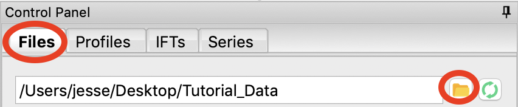

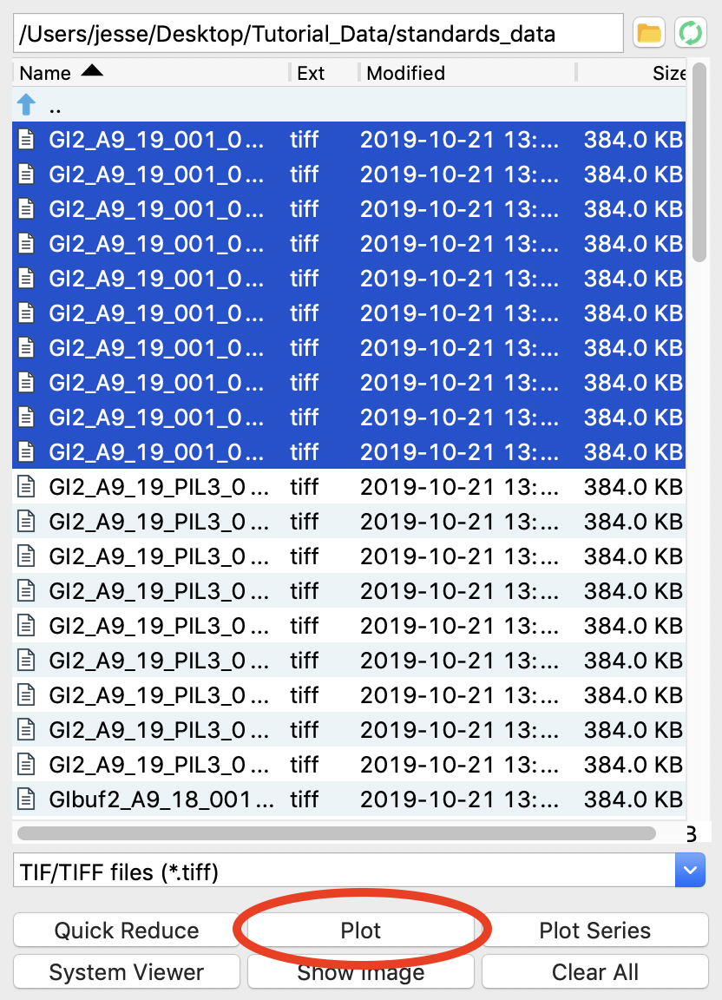

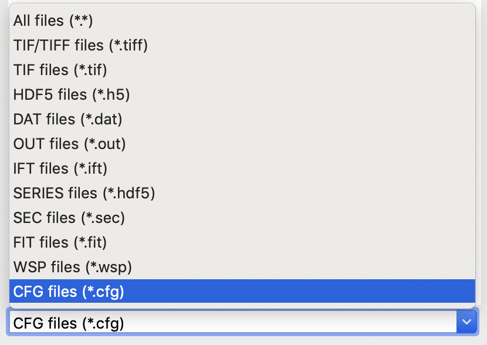

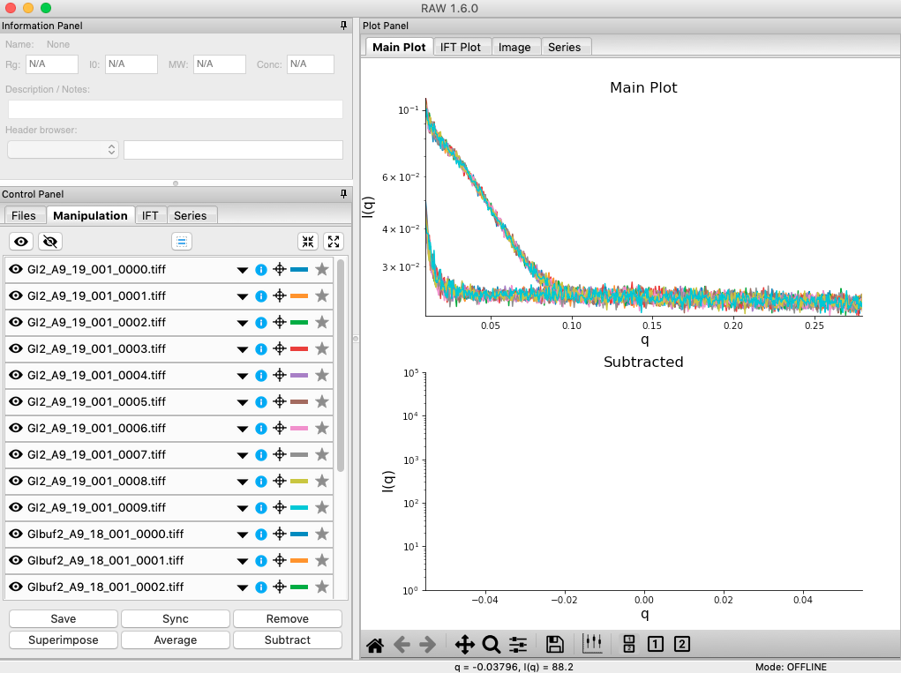

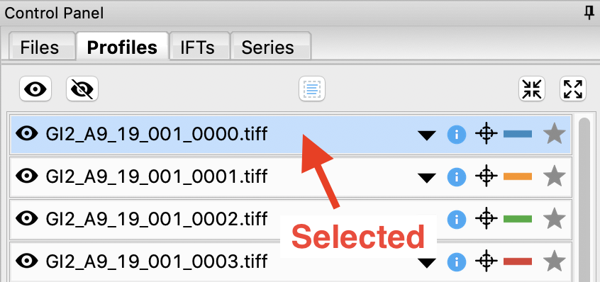

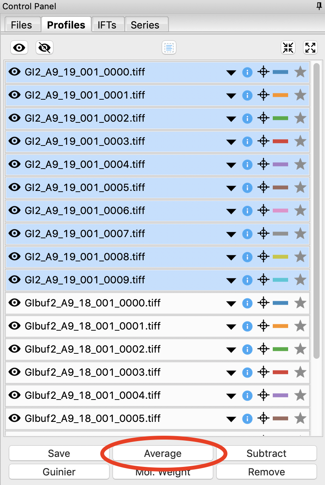

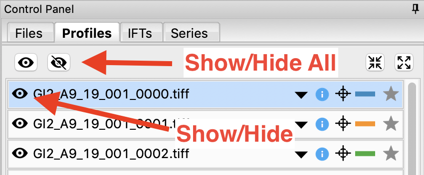

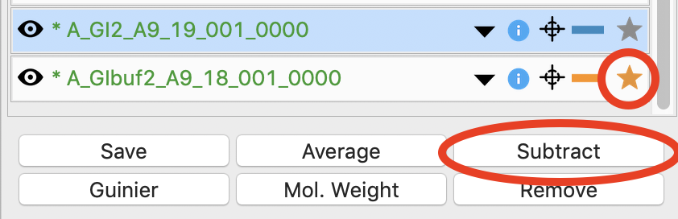

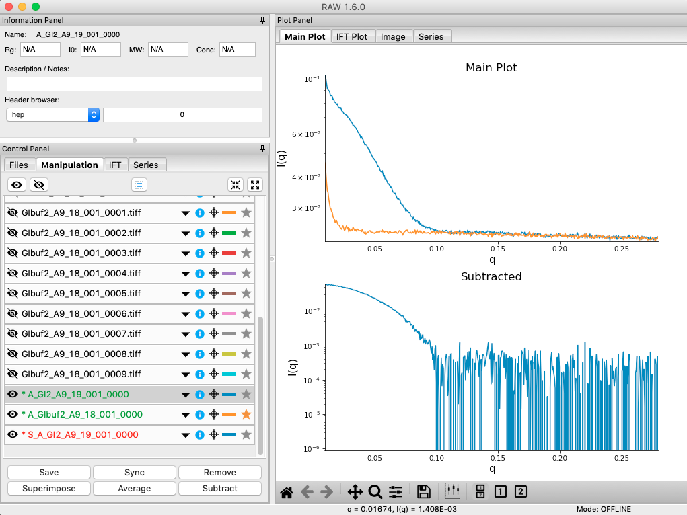

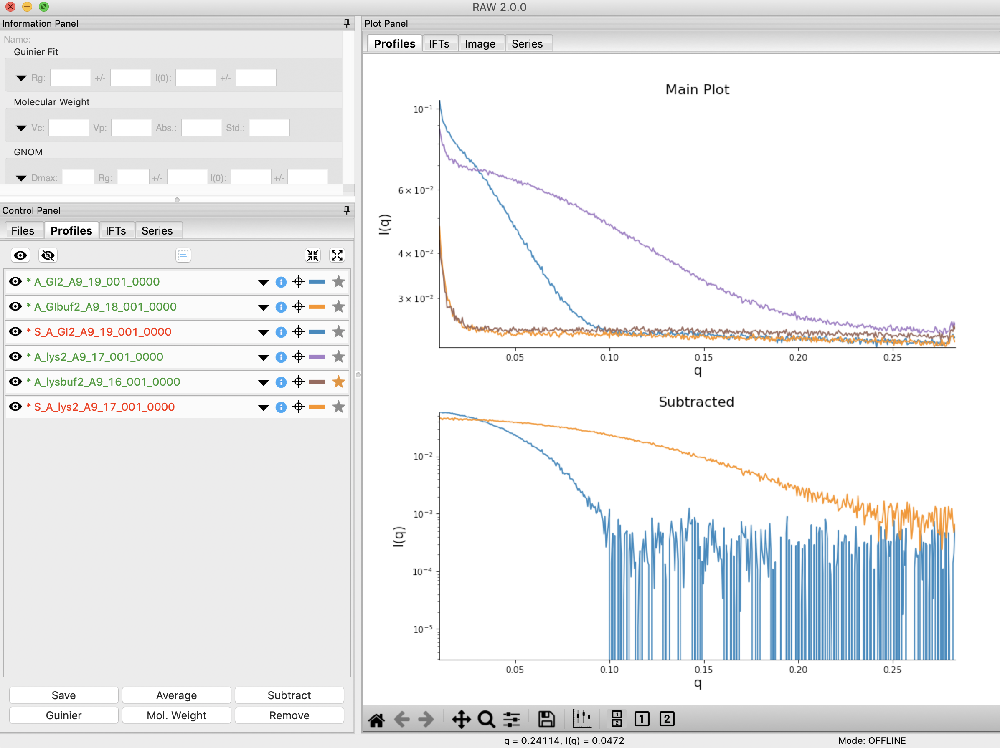

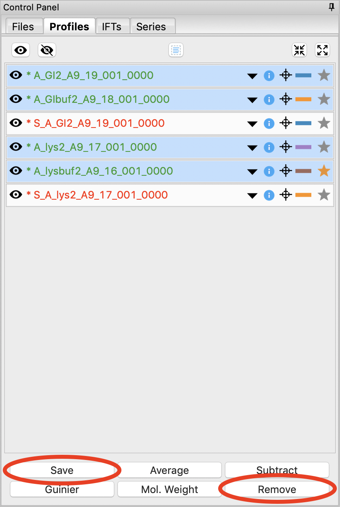

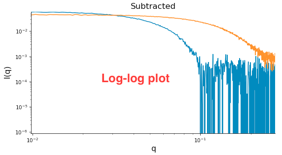
