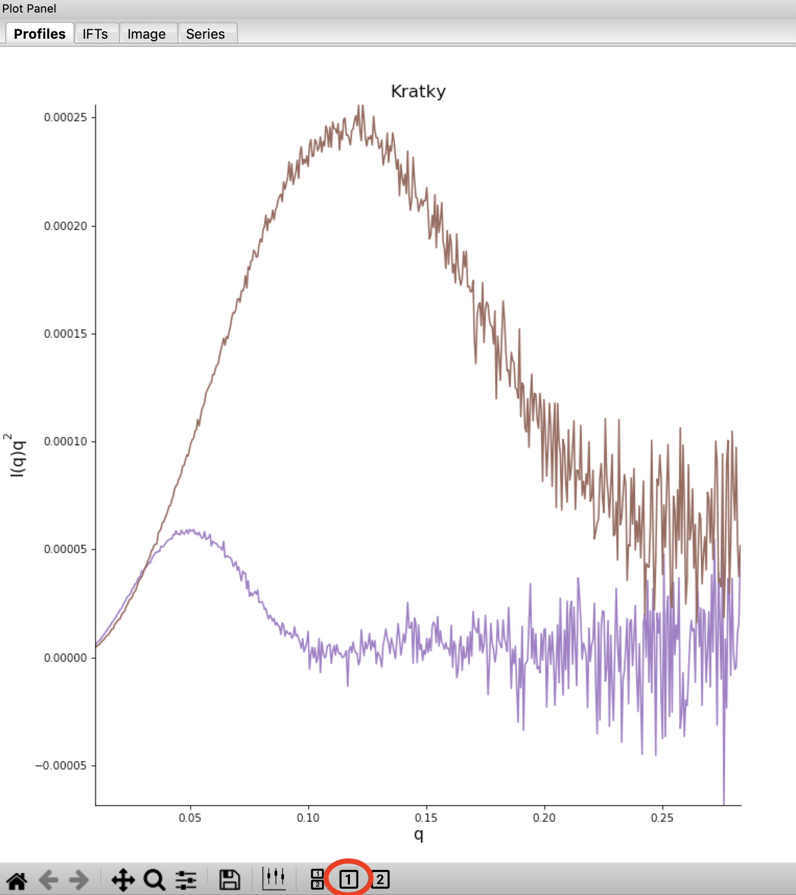
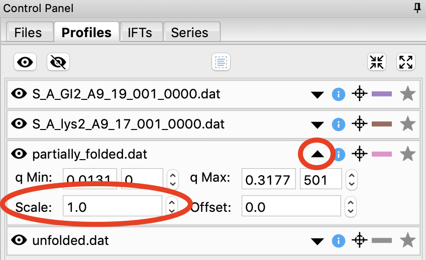
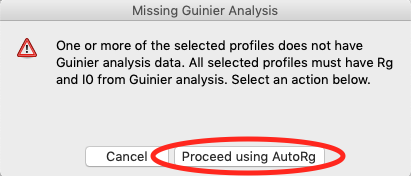
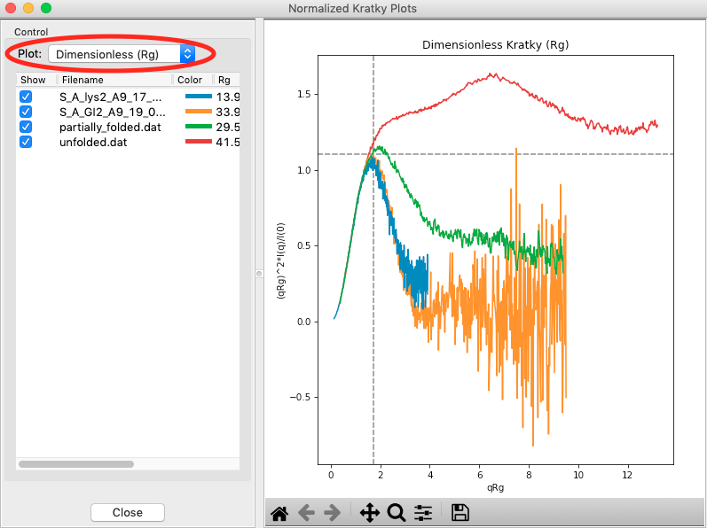
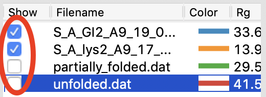
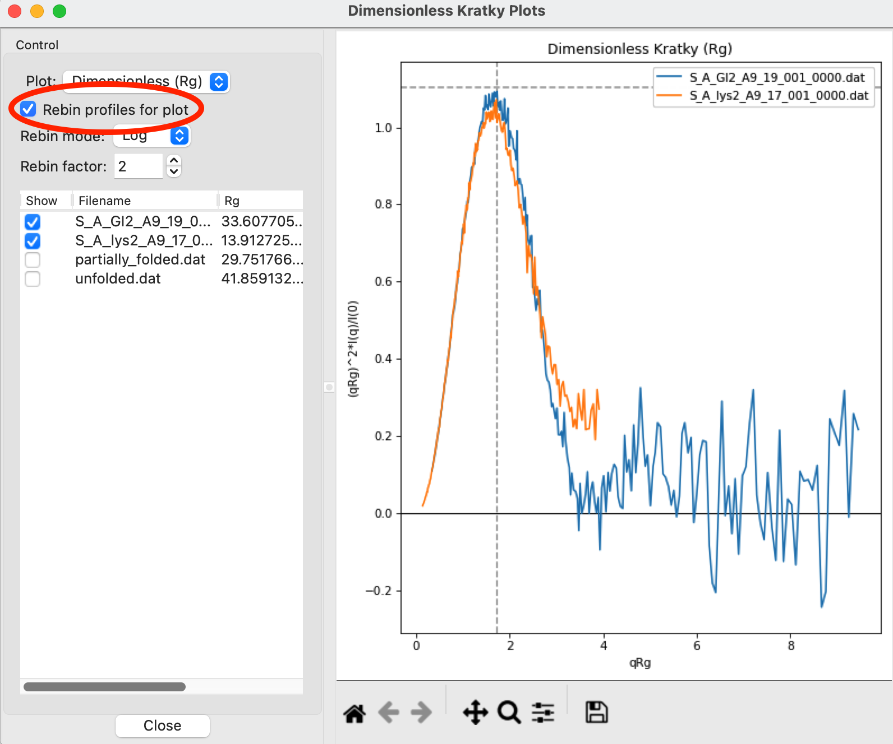

Kratky analysis
^^^^^^^^^^^^^^^^^^^^^^^

A Kratky plot is a plot of :math:`q^2I(q)` vs. *q*\ . Kratky plots can qualitatively assess
the flexibility and/or degree of unfolding in samples. Unfolded (highly flexible) proteins
should have a plateau in the Kratky plot at high q, while compact, globular proteins will
have a bell-shaped (Gaussian) peak. A partially unfolded (flexible) protein may have a
combination of the bell-shape and plateau, or a plateau that slowly decays to zero.

Normalized Kratky plots are plots of :math:`q^2I(q)/I(0)` vs. *q*\ . This normalizes scattering profiles
by mass and concentration. Dimensionless Kratky plots are almost always presented as
:math:`(qR_g)^2I(q)/I(0)` vs. :math:`qR_g`\ . On some occasions you may want to
use an alternative normalization: :math:`(q^2V_c)I(q)/I(0)` vs. :math:`q(V_c)^{1/2}`\ .
These dimensionless plots can provide semi-quantitative analysis of flexibility
and disorder.

A video of an older version of this tutorial is available:

.. raw:: html

    
<iframe src='https://www.youtube.com/embed/jttMQmu-5MY' frameborder='0' allowfullscreen></iframe>

The written version of the tutorial follows.

#.  If you haven't already, save the loaded scattering profiles, remove all loaded
    profiles from RAW, and reload your saved GI and Lysozyme profiles, as described
    in :ref:`the previous section <s1p4>`.

#.  Put the top plot on Kratky axes.

    * *Tip:* Right click on the plot to change the plot type.

#.  Show only the top plot by clicking on the 1 in the plot control bar below the plots.

    |kratky_png|

#.  Both GI and lysozyme show the classic bell shape, indicating they are completely folded.

    *   *Warning:* Bad buffer subtraction can also result in a Kratky plot that appears to show
        some degree of flexibility. Excellent buffer subtraction is required for accurately
        analysis with this technique.

#.  Load the two scattering profiles in the **Tutorial_Data/flexibility_data** folder.

    *   *Note:* The **unfolded.dat** file is the scattering profile of an unfolded lysine
        riboswitch. The **partially_folded.dat** file is same lysine riboswitch, but in the
        biologically functional configuration. The data were downloaded from the
        `BIOISIS database <https://www.bioisis.net/>`_, and has the BIOISIS ids of 2LYSRR and 3LYSRR.

#.  SAXS data can be presented on an arbitrary scale, which is why these two profiles have
    intensity that is much larger than the lysozyme and GI data (which is on an absolute scale).
    Use the triangle button for each item in the Profiles list to show more options. Hide one
    of the newly loaded data sets, and adjust the scale factor on the other until you can comfortably
    see it and your lysozyme and GI data. Repeat the scale adjustment for the other data set.

    *   *Tip:* The up and down arrows will only adjust the last digit of the scale factor.

    |scale_png|

#.  Kratky analysis can also be done on normalized or dimensionless data. RAW supports normalization
    by I(0), and non-dimensionalization by |Rg| and Vc (the volume of correlation).

#.  Select all four loaded scattering profiles, right click, and select the Dimensionless Kratky Plot option.

#.  Normalized and dimensionless Kratky plots require Guinier analysis to be done. If one or more profiles are missing
    this information, RAW will show the following window. You can either cancel, and do the fits manually,
    or you can proceed with RAW’s automatic determination.

    |kratky_norm_autorg|

#.  Click the Proceed using AutoRg button to proceed to the Dimensionless Kratky Plot window using
    RAW’s automatic fitting for |Rg|.

#.  By default, the plot is the Dimensionless |Rg| plot. Use the drop-down “Plot” menu at the top to
    select the Normalized (by I(0)) and Dimensionless Vc plots.

    *   *Tip:* The dashed gray lines on the Dimensionless (Rg) plot are guidelines
        for a globular protein. For a globular protein the  peak position should
        be at :math:`qR_g=\sqrt{3}\approx 1.73`, while peak height should be
        :math:`3/e\approx 1.1`.

    |kratky_norm_png|

#.  Return to the Dimensionless |Rg| plot. Use the check boxes to hide the partially_folded and
    unfolded data sets on the plot. Note that both the lysozyme and GI data look very similar
    on this plot, showing they have similar shapes and (lack of) flexibility.

    |kratky_select_png|

#.  Kratky plots are often noisy in the high q region due to low signal. It can be
    helpful to rebin the data, usually on a logarithmic scale, to smooth out the
    high q region. Check the "Rebin profiles for plot" option to rebin the
    profiles logarithmically with an overall binning factor of 2.

    *   *Note:* The binning is only done in the Kratky plot, it doesn't
        propagate back to the profiles in the main window.

    *   *Try:* Vary the rebin factor and see how the profiles change.

    |kratky_rebin_png|

#.  Right click on the plot and select “Export Data As CSV” to save the dimensionless data
    for further processing or plotting with another program.

    *   *Note:* The data is saved as displayed on the plot. So only selected profiles
        are exported, and if binning has been done the binned profiles are exported.

#.  Click the Close button to close the Dimensionless Kratky Plot window.

.. |Rg| replace:: R\ :sub:`g`
