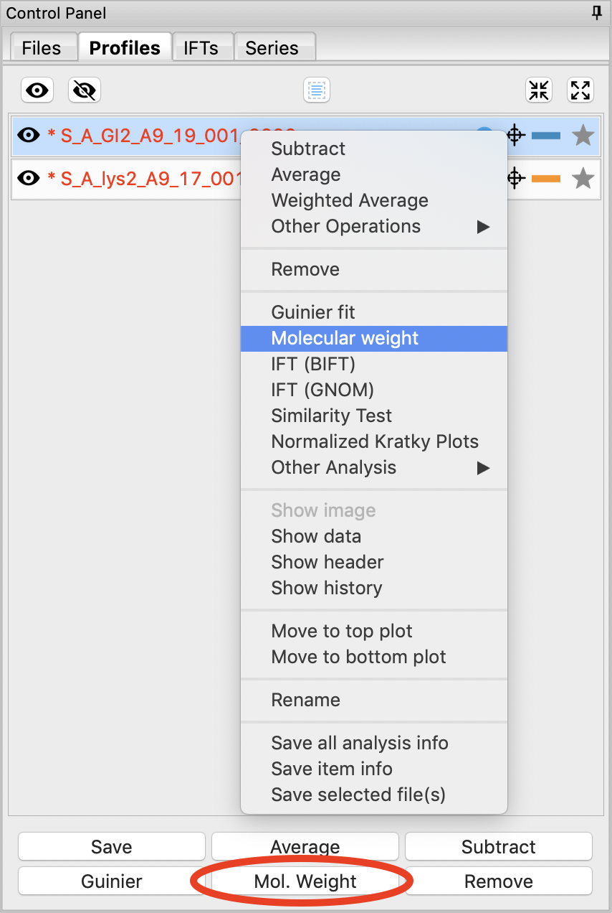
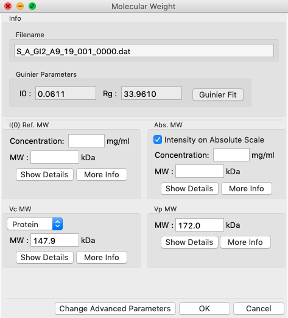
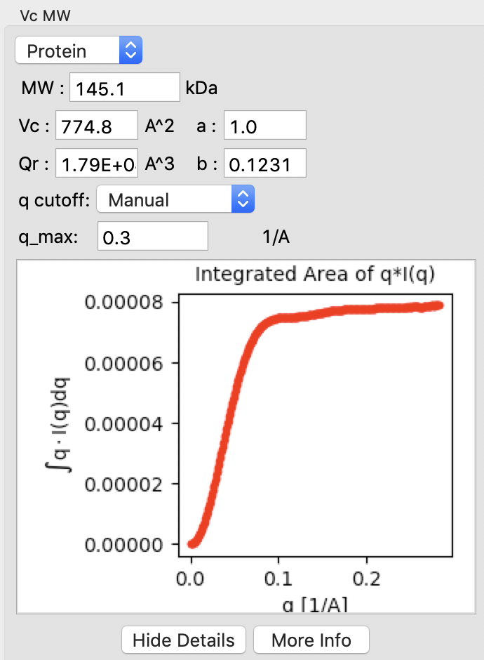
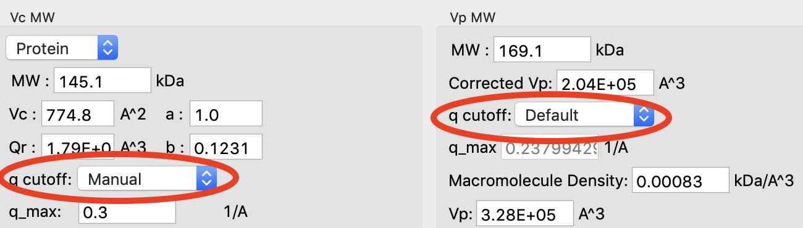

Molecular weight analysis
^^^^^^^^^^^^^^^^^^^^^^^^^^^^^^^^^
.. _raw_mw:

This tutorial covers how to use RAW for molecular weight analysis. This is not a
tutorial on basic principles and best practices for molecular weight analysis.
For that, please see the :ref:`SAXS tutorial <saxs_mw>`.

RAW provides four forms of molecular weight analysis:

*   Referencing I(0) to that of a known standard
*   From the volume of correlation using the method of Rambo and Tainer
*   From the adjusted Porod volume using the method of Fisher et al.
*   From the value of I(0) on an absolute scale.

#.  In RAW, right click on the subtracted GI scattering profile in the Profiles panel
    and select “Molecular weight.” Alternatively click on the "Mol. Weight" button
    at the bottom of the Profiles panel.

    |mw_open_png|

#.  At the top of the panel are the results of the Guinier fit. All four methods
    require a good Guinier fit, so you can use that button to redo the fit if
    necessary. In the lower part of the panel, the results of the four estimates
    for MW are shown.

    *   *Note:* Neither the I(0) Ref. MW panel nor the Abs. MW panel should be reporting a MW.

    *   *Tip:* To learn more about any of the methods, lick on the "More Info"
        button.

    |mw_png|

#.  In either concentration box, enter the sample concentration of 0.47 mg/ml. Notice that you
    now get results from all four methods of MW calculation.

    *   *Question:* The expected MW value for GI is 172 kDa. How do your results compare?

#.  Click on the “Show Details” button for the Vc MW panel. You should see a graph, which shows
    the integrated area of :math:`qI(q)` vs. *q*\ . For this method to be accurate,
    this value needs to converge at high *q*\ .

    |mw_vc_png|

#.  Click on the "Show Details" for the Vp MW panel. You'll notice that both Vp MW
    and Vc MW have a "cutoff" selection. At higher q you can start to get
    scattering from flexibility or intra-molecular features that may reduce the
    reliability of the MW estimate. RAW automatically cuts off the scattering profile
    used based on the size of the object. You can change the cutoff if you need to.

    |mw_cutoff_png|

#.  Click the “OK” button to save your analysis.

    *   *Note:* The “Cancel” button discards the analysis.

    *   *Tip:* After clicking "OK" you can now click on the GI profile in the
        Profiles control panel and see the MW you just found in the Info panel.

#.  Repeat the MW analysis for the lysozyme sample, which had a concentration of 4.27 mg/ml.
    The expected MW of lysozyme is 14.3 kDa.

    *   *Question:* Does the Vc method work for the lysozyme data?

