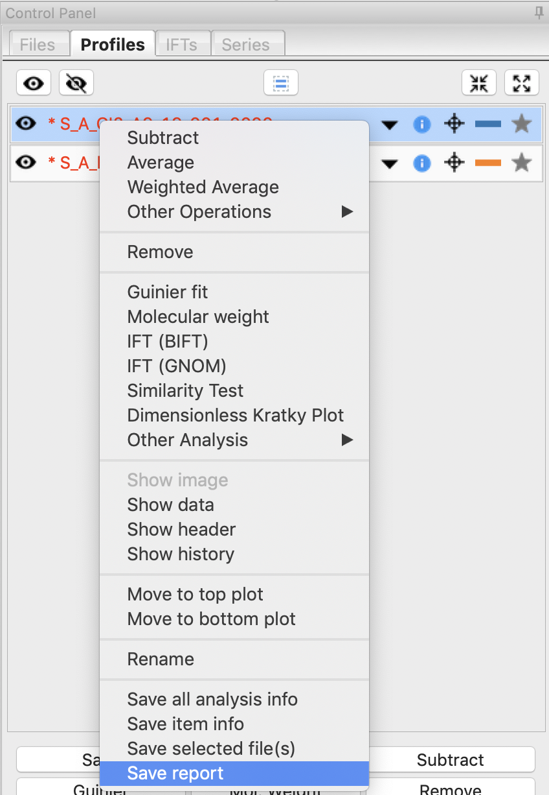
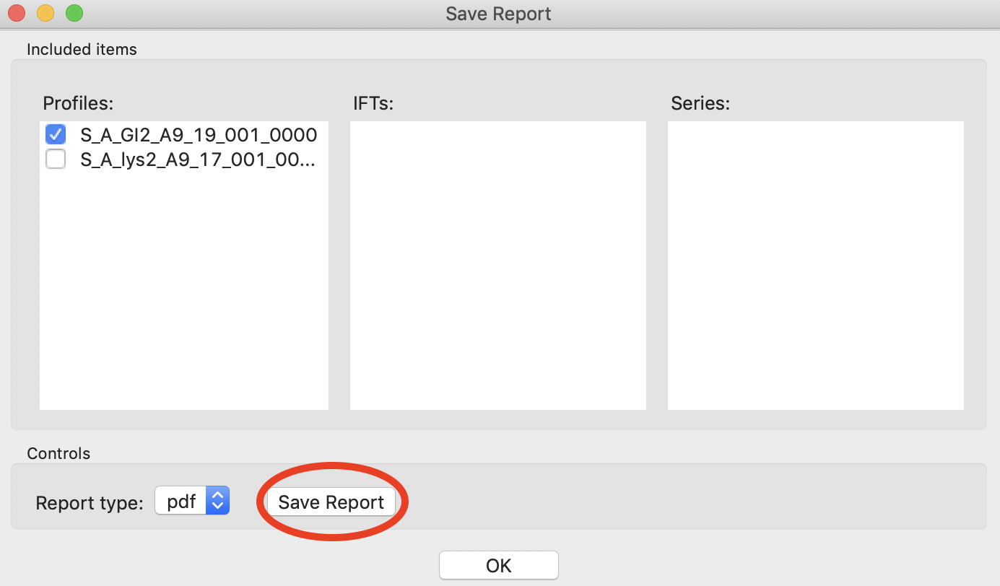
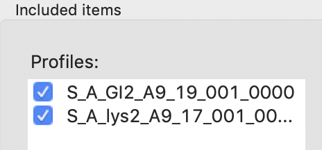
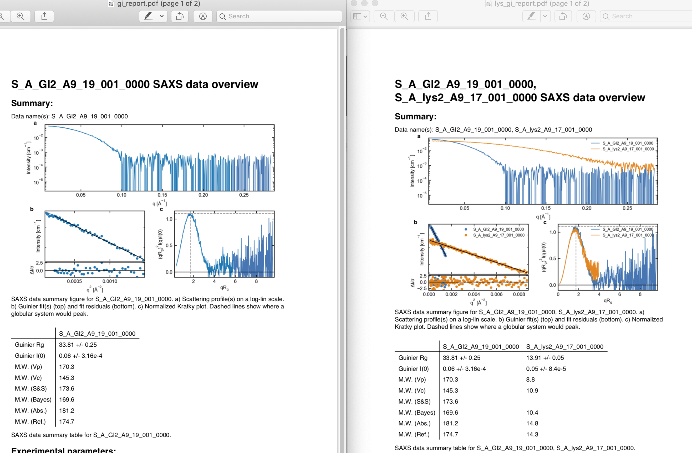

Saving analysis information
^^^^^^^^^^^^^^^^^^^^^^^^^^^^^^^^^^^
.. _s1p4:

There are several ways to save results in RAW, besides saving the processed files
themselves. In this tutorial we go over how to create a summary PDF of your analysis,
and how to save your analysis data to a spreadsheet (.csv file).

Saving as a pdf
*******************************

A video version of this tutorial is available:

The written version of this tutorial follows:

#.  Select the subtracted GI scattering profile in the Profiles panel
    and right click and on it and select “Save report.”

    |report_open_png|

#.  In the panel that opens, click the "Save Report" button and save the
    report as "gi_report.pdf" in the **standards_data** folder. This will
    save a PDF report with plots and analysis for the GI data.

    |report_save_png|

#.  You can also save a report for multiple datasets at once. Select both the
    lysozyme and GI datasets by checking both of the checkboxes. Then click
    "Save Report" to save a report with both datasets as "lys_gi_report.pdf"
    in the **standards_data** folder.

    |report_select_png|

#.  Open the two reports in a pdf viewer. You should see just the GI data
    in the first, whereas the second pdf should have plots and columns in the
    table for both the lysozyme and GI data.

    |report_pdf_png|

#. Once you're done saving reports, click the "OK" button to close the window.

Saving as a spreadsheet (.csv)
*******************************

A video version of this tutorial is available:

.. raw:: html

    
<iframe src='https://www.youtube.com/embed/1vtW1SvbVCI' frameborder='0' allowfullscreen></iframe>

The written version of the tutorial follows.

#.  Save your subtracted scattering profiles in the **standards_data** folder.

#.  Select both subtracted profiles, right click on one of them, and select ‘Save all analysis
    info.’ Give it an appropriate name and save it in the **standards_data** folder.

    *   *Note:* This saves a **.csv** file with all of the analysis information for
        the selected scattering profiles.

    *   *Try:* Open the **.csv** file in Microsoft Excel or Libre/Open Office Calc. You should
        see all of the analysis that you just did.

#.  Remove the subtracted scattering profiles from RAW by selecting both of them and clicking the “Remove” button.

#.  Load the saved subtracted scattering profiles back into RAW. Note that if you select one
    in the Profiles list, the information panel in the upper left corner of RAW populates
    with analysis information. The analysis information is saved with the scattering profile,
    so if you forget to save it in a **.csv**\ , you can load in the profiles later and do it then.

    *   *Note:* To get new files to show up in the file tab, you may have to click the refresh
        button. Also, make sure to that your file type filter is either All files or DAT files.

    |save_analysis_png|

    *   *Try:* Open the saved subtracted scattering profile **S_A_GI2_A9_19_001_0000.dat** in a
        text editor such as Notepad (windows) or TextEdit (mac). You should see all of the data
        in three columns, followed by header information. If you scroll down far enough, the
        header information contains all of the analysis information, as well as the files that
        were averaged and subtracted to make the scattering profile.

.. |save_analysis_png| image:: images/save_analysis.png
    :width: 300 px
    :target: ../_images/save_analysis.png
