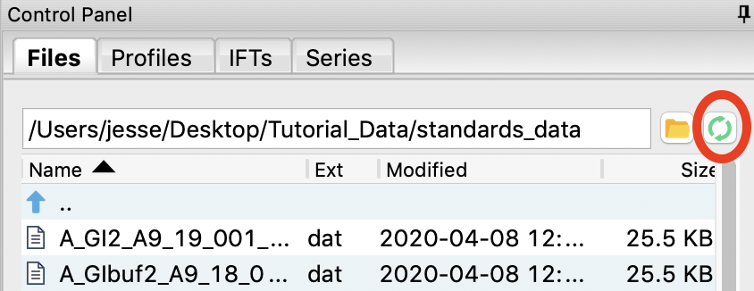

Saving analysis information
^^^^^^^^^^^^^^^^^^^^^^^^^^^^^^^^^^^
.. _s1p4:

#.  Save your subtracted scattering profiles in the **standards_data** folder.

#.  Select both subtracted profiles, right click on one of them, and select ‘Save all analysis
    info.’ Give it an appropriate name and save it in the **standards_data** folder.

    *   *Note:* This saves a **.csv** file with all of the analysis information for
        the selected scattering profiles.

    *   *Try:* Open the **.csv** file in Microsoft Excel or Libre/Open Office Calc. You should
        see all of the analysis that you just did.

#.  Remove the subtracted scattering profiles from RAW by selecting both of them and clicking the “Remove” button.

#.  Load the saved subtracted scattering profiles back into RAW. Note that if you select one
    in the Manipulation list, the information panel in the upper left corner of RAW populates
    with analysis information. The analysis information is saved with the scattering profile,
    so if you forget to save it in a **.csv**\ , you can load in the profiles later and do it then.

    *   *Note:* To get new files to show up in the file tab, you may have to click the refresh
        button. Also, make sure to that your file type filter is either All files or DAT files.

    |save_analysis_png|

    *   *Try:* Open the saved subtracted scattering profile **S_A_GI2_A9_19_001_0000.dat** in a
        text editor such as Notepad (windows) or TextEdit (mac). You should see all of the data
        in three columns, followed by header information. If you scroll down far enough, the
        header information contains all of the analysis information, as well as the files that
        were averaged and subtracted to make the scattering profile.

