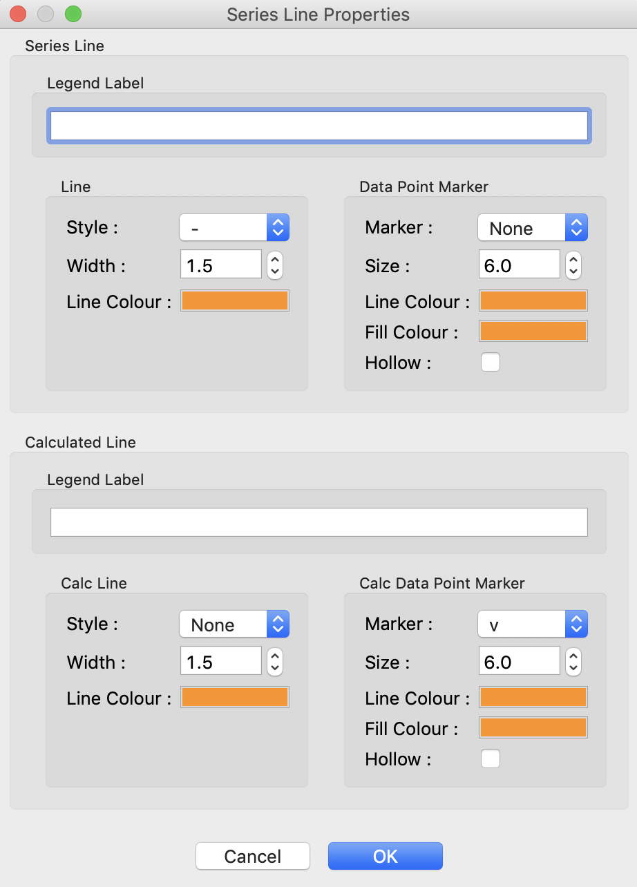
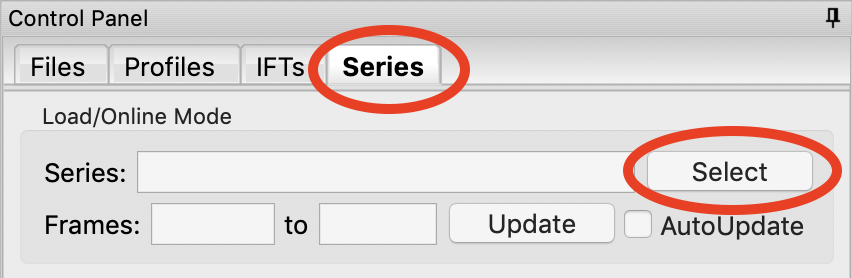
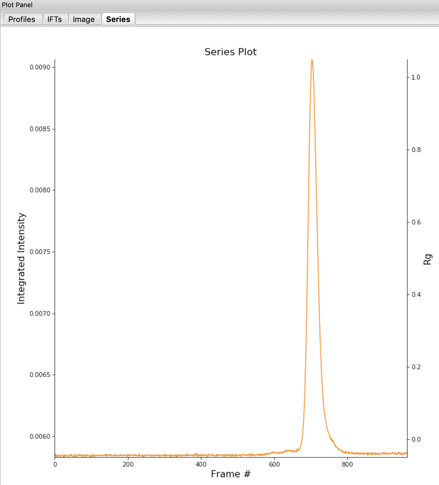
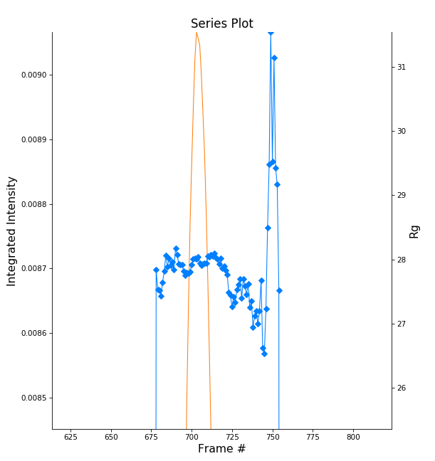
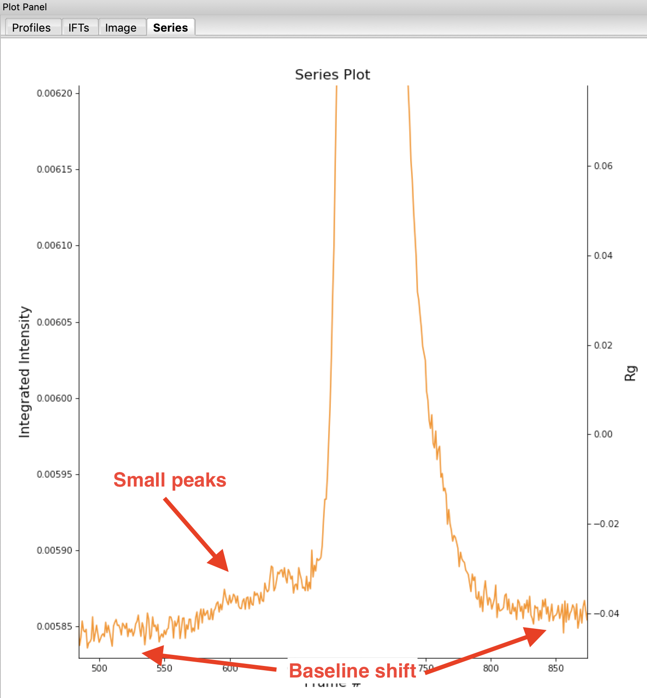
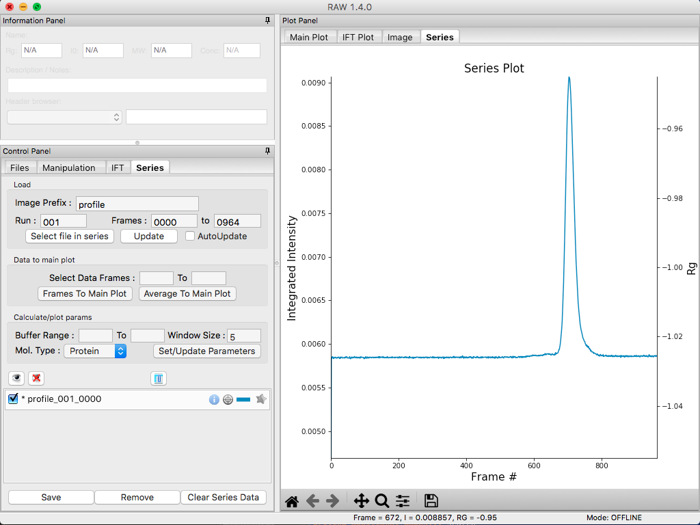
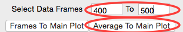

Basic SEC-SAXS processing
^^^^^^^^^^^^^^^^^^^^^^^^^^^^^^^^^
In a typical SEC-SAXS run, images are continuously collected while the eluate (outflow)
of a size exclusion column flows through the SAXS sample cell. As proteins scatter more
strongly than buffer, a plot of total scattered intensity vs. time, the so-called SAXS
chromatograph, will show a set of peaks similar to what is seen by UV absorption measurement
of the SEC system. RAW includes the capability to do routine processing of SEC-SAXS data.
This includes creating the SAXS chromatograph from the data, plotting |Rg|, MW, and I(0)
across the peaks, and extracting specific frames for further analysis.

*Note:* In RAW, this is called Series analysis, as the same tools can be used for other
sequentially sampled data sets.

#.  Clear any data loaded into RAW. Click on the Series tab in the control panel. Click the
    “Select file in series” button. Navigate to the **Tutorial_Data/sec_data/sec_sample_1**
    folder and select any of the **.dat** files in the folder.

    *   *Tip:* In the Files tab, click the “Clear All” button.

    *   *Troubleshooting:* If you get an error message, it means you don't have
        a configuration file loaded. Load the SAXS.cfg file referenced :ref:`earlier <s1p1>`.

    |series_panel_png|

#.  The SEC run will automatically load. RAW should automatically show you the Series
    plot panel. If not, click on the Series tab in the plot panel.

    |series_plot_png|

    *   *Try:* Each point on this curve is the integrated intensity of a scattering profile.
        You can figure out which one by right clicking on the filename in the Series list and
        selecting ‘Show data’. This will show you the frame number and integrated intensity
        displayed on the plot, and the filename corresponding to the displayed frame number.

#.  Drag the plot so that you can clearly the see the first frame. You’ll notice it has a
    significantly lower intensity than the rest of the frames. This happens occasionally
    at the MacCHESS G1 beamline (where the data was taken). It can make it harder to tell
    what the data is doing.

    *   *Tip:* Select the crossed arrows in the plot control bar, and then click and drag on
        the plot to move the curve around on the screen.

#.  Go to the Files control tab and navigate to the **sec_sample_1** data directory. Click on
    the second data file, **profile_001_0001.dat**\ . Scroll down to the bottom of the
    file list, and shift click on the last file, **profile_001_0964.dat**\ . This should
    highlight all of the files in between, as well as the two you clicked on.

#.  Click on the “Plot Series” button. You will see the same curve plotted as before, but
    without the very first scattering profile. Remove the other loaded data set. Now
    you should have a curve where the baseline is very close to the bottom of the plot.

    |series_plot2_png|

#.  In some cases it is more useful to look at the mean intensity or the intensity at a
    specific *q* value than the total intensity. Right click on the plot and select mean
    intensity for the left axis y data. Then try the intensity at *q=0.02*\ .

    *   *Note:* You need to have the drag button in the plot control bar unselected to
        get a right click menu.

#.  Return to plotting the integrated intensity. Zoom in near the base of the peak. Notice
    that there are two smaller peaks on the left, likely corresponding to higher order
    oligomers that we don’t have the signal to properly resolve. Also notice that the
    baseline after the peak is not the same as the baseline before the peak. This can happen
    for several reasons, such as damaged protein sticking to the sample cell windows.

    *   *Tip:* Click on the magnifying glass at the bottom of the plot, then click
        and drag on the plot to select a region to zoom in on.

    |series_plot3_png|

#.  Zoom back out to the full plot.

    *   *Tip:* Click the Home (house) button at the bottom of the plot.

#.  In order to determine if we really have a single species across the peak, we will
    calculate the |Rg| and MW as a function of frame number. In the “Calculate/Plot
    Structural Parameters” section, enter a “Buffer Range” of 400 to 500 and a “Window Size”
    of 5. Star the SEC curve of interest and click the “Set/Update Parameters” button.
    This may take a while to calculate.

    |100002010000018800000095A9F99A4566D6E540_png|

    *   *Note:* All of the files in the given buffer range will be averaged and used as a buffer.
        A sliding average window is then moved across the SEC curve, of size specified by the
        Window Size parameter. So for a window of size five, the profiles corresponding to frames
        0-4, 1-5, 2-6, etc will be averaged. From each of these averaged set of curves, the average
        buffer will be subtracted, and RAW will attempt to calculate the |Rg|, MW, and I(0). These
        values are then plotted as a function of frame number.

    *   *Note:* If you had RNA instead of protein, you would use the Mol. Type menu
        to select that option. This affects the calculation of the molecular weight.

    *   *Warning:* It is important that the buffer range actually be buffer! In this case,
        we made sure to not include the small peaks before the main peak.

#.  Once the calculation is finished, you should see a set of markers, matching the color
    of the original curve. These points are plotted on the right Y axis. Click on the colored
    line next to the star in the Series control panel. In the line properties control panel this
    brings up, change the Calc Marker color to something different. Add a line to the Calc
    Markers by selecting line style ‘-’ (solid), and adjust the line color to your liking.

    *   *Tip:* You can do the same thing to adjust the colors of the scattering profiles in
        the Manipulation and IFT control tabs.

    |series_color_png|

    |series_line_props_png|

#.  Zoom in on the peak region. You’ll notice a region of roughly constant |Rg| across the
    peak. To either side there are regions with higher or lower |Rg| values. These variations,
    particularly on the right side, are from scattering profiles near the edge of the peak
    with lower concentrations of sample, leading to more noise in determining the |Rg| values.

    *   *Note:* There may also be some effects from the small peaks on the leading (left)
        side of the peak, and from the baseline mismatch between left and right sides of the peak.

    |series_rg_png|

#.  You can move your mouse cursor across the |Rg| values on the plot, and the frame number
    and intensity and |Rg| at your cursor position are read out in the bar at the bottom
    of the RAW window. Use this to determine the range of frames over which the |Rg| is
    roughly constant.

    *   *Note:* For an automated determination of |Rg|, particularly with only 5 frames
        averaged together, a change of several percent is likely insignificant.

    |100002010000026300000034957322C176A93588_png|

#.  Zoom back out to the full plot. Right click on the plot and select molecular weight as
    the right axis Y data. Again zoom in on the peak region and find the set of frames for
    which the MW is roughly constant.

    *   *Try:* Vary the window size and/or the buffer range and see how that affects the
        constant |Rg| and MW regions.

#.  Enter the buffer range, 400 to 500, in the “Select Data Frames” boxes of the “Data
    to main plot” section, and then click the “Average to Main Plot” button.

    |100002010000013700000037882DFA03691018C8_png|

#.  Enter the range over which you found the |Rg| and MW to be constant (should be
    ~700-715) in the “Select Data Frames” section and click the “Average to Main Plot”
    button.

#.  Click on the Main Plot tab and the Manipulation tab. You should see two scattering
    profiles, one is the average of the buffer and one is the average across the peak.
    Carry out buffer subtraction and then do a Guinier and MW analysis.

    *   *Note:* The I(0) reference and absolute calibration will not be accurate for
        SEC-SAXS data, as the concentration is not accurately known.

    *   *Question:* How does the |Rg| and MW you get from the averaged curve compare
        to what RAW found automatically for the peak?

    *   *Tip:* Make sure your plot axes are Log-Lin or Log-Log. Make sure that both
        plots are shown by clicking the 1/2 button at the bottom of the plot window.

#.  Generate a new average buffer from the frames on the right side of the peak, 850-950.
    Generate a new subtracted curve and repeat the |Rg| and MW analysis.

    *   *Question:* Which curve looks best?

#.  Try taking a few small sections of the peak, 5-10 frames wide. Use one on the left
    side of the peak, one at the top, and one on the right side (e.g. 685-690, 700-705,
    725-730). Generate subtracted curves from the first buffer (frames 400-500). Carry
    out the |Rg| and MW analysis.

    *   *Question:* Are there any differences in these curves?

    *   *Try:* Apply a scale factor to these new subtracted curves. Can you scale them onto each other?

    *   *Note:* It is useful to analyze several regions on the peaks of the SEC-SAXS curve
        in this way to verify that they are the same. You could have species that failed to
        separate out completely. This kind of analysis will give you confidence in your final
        result.

#.  Load the Bovine Serum Albumin (BSA) SEC-SAXS data contained in the **sec_sample_2**
    data folder. Hide the first SEC-SAXS chromatograph.

#.  Select a good buffer region, and calculate the |Rg| and MW across the peak for the BSA.

    *   *Warning:* Don’t forget to star the curve you want to set/update parameters for!

    *   *Tip:* If you hover your mouse cursor over the info icon, you will see the buffer
        range and window size used to calculate the parameters.

    *   *Question:* Is the BSA peak one species?

#.  Find the useful region of the peak (constant |Rg|/MW), and send the buffer and sample
    data to the main plot. Carry out the standard |Rg| and MW analysis on the subtracted
    scattering profile. For BSA, we expect |Rg| ~28 Å and MW ~66 kDa.

    *   *Try:* As with the previous sample, take a few smaller regions along the peak
        and see if the subtracted scattering profile varies.

#.  In the Series control tab, right click on the name of BSA curve in the list. Select export
    data and save it in an appropriate location. This will save a CSV file with the frame
    number, integrated intensity, radius of gyration, molecular weight, filename for each
    frame number, and a few other items. This allows you to plot that data for publications,
    align it with the UV trace, or whatever else you want to do with it.

    *   *Try:* Open the **.csv** file you just saved in Excel or Libre/Open Office Calc.

#.  Select both items in the Series control panel list, and save them in the **sec_data**
    folder. This saves the Series plot data in a form that can be quickly loaded by RAW.

    *   *Try:* Clear the Series data and then open one of your saved files from the Files tab
        using either the “Plot” or “Plot Series” button.

.. |100002010000018800000095A9F99A4566D6E540_png| image:: images/100002010000018800000095A9F99A4566D6E540.png

.. |100002010000026300000034957322C176A93588_png| image:: images/100002010000026300000034957322C176A93588.png

.. |Rg| replace:: R\ :sub:`g`
