Basic SEC-SAXS processing
^^^^^^^^^^^^^^^^^^^^^^^^^^^^^^^^^
.. _s1p7:

In a typical SEC-SAXS run, images are continuously collected while the eluate (outflow)
of a size exclusion column flows through the SAXS sample cell. As proteins scatter more
strongly than buffer, a plot of total scattered intensity vs. time, the so-called SAXS
chromatograph, will show a set of peaks similar to what is seen by UV absorption measurement
of the SEC system. RAW includes the capability to do routine processing of SEC-SAXS data.
This includes creating the SAXS chromatograph from the data, plotting |Rg|, MW, and I(0)
across the peaks, and extracting specific frames for further analysis.

*Note:* In RAW, this is called Series analysis, as the same tools can be used for other
sequentially sampled data sets.

#.  Clear any data loaded into RAW. Click on the Series tab in the control panel. Click the
    “Select” button. Navigate to the **Tutorial_Data/sec_data/sec_sample_1**
    folder and select any of the **.dat** files in the folder.

    *   *Tip:* In the Files tab, click the “Clear All” button to clear all data in RAW.

    *   *Troubleshooting:* If you get an error message, it means you don't have
        a configuration file loaded. Load the SAXS.cfg file referenced :ref:`earlier <s1p1>`.

    |series_panel_png|

#.  The SEC run will automatically load. RAW should automatically show you the Series
    plot panel. If not, click on the Series tab in the plot panel.

    |series_plot_png|

    *   *Try:* Each point on this curve is the integrated intensity of a scattering profile.
        You can figure out which one by right clicking on the filename in the Series list and
        selecting ‘Show data’. This will show you the frame number and integrated intensity
        displayed on the plot, and the filename corresponding to the displayed frame number.

#.  Drag the plot so that you can clearly the see the first frame. You’ll notice it has a
    significantly lower intensity than the rest of the frames. This happens occasionally
    at the MacCHESS G1 beamline (where the data was taken). It can make it harder to tell
    what the data is doing.

    *   *Tip:* Select the crossed arrows in the plot control bar, and then click and drag on
        the plot to move the curve around on the screen.

#.  Go to the Files control tab and navigate to the **sec_sample_1** data directory. Click on
    the second data file, **profile_001_0001.dat**\ . Scroll down to the bottom of the
    file list, and shift click on the last file, **profile_001_0964.dat**\ . This should
    highlight all of the files in between, as well as the two you clicked on.

#.  Click on the “Plot Series” button. You will see the same curve plotted as before, but
    without the very first scattering profile. Remove the other loaded data set. Now
    you should have a curve where the baseline is very close to the bottom of the plot.

    |series_plot2_png|

#.  In some cases it is more useful to look at the mean intensity, the intensity at a
    specific *q* value, or the intensity in a range of *q* values than the total
    intensity. Right click on the plot and select mean intensity for the left
    axis y data. Then try the intensity at *q=0.02* and in the *q* range 0.01-0.03.

    *   *Note:* You need to have the drag button in the plot control bar unselected to
        get a right click menu.

    *   *Tip:* CHROMIXS, in the ATSAS software displays the average intensity
        over the *q* range 0.01-0.08 :math:`Å^{-1}`. To achieve a similar
        display in RAW, set your q range for the intensity to that. Note that
        RAW will display the sum of the intensity over the range while CHROMIXS
        displays mean intensity for the range, so the results won't be exactly the same.

#.  Return to plotting the integrated intensity. Zoom in near the base of the peak. Notice
    that there are two smaller peaks on the left, likely corresponding to higher order
    oligomers that we don’t have the signal to properly resolve. Also notice that the
    baseline after the peak is not the same as the baseline before the peak. This can happen
    for several reasons, such as damaged protein sticking to the sample cell windows.

    *   *Tip:* Click on the magnifying glass at the bottom of the plot, then click
        and drag on the plot to select a region to zoom in on.

    |series_plot3_png|

#.  Zoom back out to the full plot.

    *   *Tip:* Click the Home (house) button at the bottom of the plot.

#.  In order to determine if we really have a single species across the peak, we will
    calculate the |Rg| and MW as a function of frame number. Right click on the
    filename in the Control Panel and select LC Series analysis to open the
    LC Series analysis panel.

    *   *Note:* At the top of the control panel in this window, in the 'Series info'
        section you'll see several settings. If you had RNA instead of protein,
        you would use the Vc Mol. type menu to select that option. This affects
        the calculation of the molecular weight. You could also change the Vp
        density away from the default value, or change the averaging window
        (discussed below).

    |lc_analysis_main_png|

#.  The LC Series analysis panel provides basic and advanced analysis tools for
    liquid chromatography experiments. Here we will show how to select buffer
    and sample regions, and send final processed data to the main plot. The
    advanced baseline correction features are discussed later.

    In order to calculate |Rg| and other parameters as a function of elution time
    (Frame #), we need to define a buffer region. RAW can do this automatically.
    In the 'Buffer' section click the 'Auto' button.

    |lc_analysis_buffer_auto_png|

    *   *Checkpoint:* You should see a buffer range show up in the buffer list,
        with defined start and end values. The region will be shown in green on
        the Unsubtracted plot.

    |lc_analysis_buffer_range_png|

#.  You can make fine manual adjustments to the buffer range if necessary. Zoom
    in on the baseline with the buffer region. Use the up/down arrows for the
    Start and End points to adjust the buffer region a little bit. You will see
    the region on the plot update as you make the changes.

    |lc_analysis_buffer_adjust_png|

    *   *Warning:* The automatic buffer determation can be wrong! Always be sure
        to manually inspect the region it picked. In particular, large flat leading edge
        shoulders next to the main peak can look like a baseline region to the
        algorithm, and will often mistakenly be picked.

    *   *Tip:* If the SAXS data isn't clear (noisy, low signal, etc.), it can be
        useful to inspect the UV trace associated with the SEC elution to see
        where there are minor elution components that you should exclude from
        your buffer selection.

#.  Zoom back out on the plot. Reset the buffer range to 539 to 568 by typing
    those values in the Start/End range boxes and hitting enter.

#.  To set the buffer region, create a set of subtracted profiles, and calculate
    structural parameters as a function of elution time, click the 'Set buffer'
    button. This may take a while to calculate.

    |lc_analysis_buffer_set_png|

    *   *Note:* All of the files in the given buffer range will be averaged and used as a buffer.
        A sliding average window (size defined by the 'Averaging window size' in the
        'Series Info' section) is then moved across the SEC curve. So for a
        window of size five, the profiles corresponding to frames 0-4, 1-5, 2-6,
        etc will be averaged. From each of these averaged set of curves, the average
        buffer will be subtracted, and RAW will attempt to calculate the |Rg|,
        MW, and I(0). These values are then plotted as a function of frame number.

    *   *Warning:* It is important that the buffer range actually be buffer! In this case,
        we need to make sure to not include the small peaks before the main peak.

#.  Once the calculation is finished, the window should automatically display the
    Subtracted plot. If it doesn't, click on the 'Subtracted' tab in the plot.
    On this plot there is a new Intensity vs. Frame # curve, representing the
    suctracted data. There is also a set of markers, showing one of the calculated
    parameters. By default the |Rg| displayed.. The calculated parameters are
    plotted on the right Y axis. You can show |Rg|, I(0), and MW calculated by
    the volume of correlation (Vc) and adjusted Porod volume (Vp) methods. Click
    on the 'Calculated value' menu to switch between the different displays.

    *   *Try:* Show the |Rg|, MW (Vc), and MW (Vp). Notice that the MW estimate
        varies between the two different methods.

    *   *Note:* You’ll notice a region of roughly constant |Rg| across the peak. To
        either side there are regions with higher or lower |Rg| values. Some of these
        variations, particularly on the right side, are from scattering profiles
        near the edge of the peak with lower concentrations of sample, leading
        to more noise in determining the |Rg| values. There may also be some
        effects from the small peaks on the leading (left) side of the peak,
        and from the baseline mismatch between left and right sides of the peak.

    |lc_analysis_subtracted_png|

#.  A monodisperse peak should display a region of flat |Rg| and MW near the center.
    Note that some spread on either edge can come from small shoulders of other
    components, bad buffer selection, or just the low signal to noise in the tails
    of the peak. Zoom in on the |Rg| and MW values across the peak to verify that
    these show a significant flat region.

    RAW can automatically determine a good sample region (good being defined
    as monodisperse and excluding low signal to noise data). To do this, click
    the 'Auto' button in the Sample region.

    |lc_analysis_sample_auto_png|

    *   *Checkpoint:* You should see a sample range show up in the sample list,
        with defined start and end values. The region will be shown in green on
        the Subtracted plot.

    |lc_analysis_sample_region_png|

#.  In the plot, zoom in on the peak region and verify that the |Rg| and MW seem
    flat in the selected sample range.

    |lc_analysis_sample_region_plot_png|

    *   *Tip:* You can manually adjust the sample region range in the same way
        as the buffer range, using the controls in the Start/End boxs.

#.  Once you are satisfied with the region picked (should be 693-722), click the
    'To Main Plot' button. This averages the selected region and sends the resulting
    average to RAW's Main Plot.

    *   *Note:* RAW first averages the selected sample and buffer regions in the
        unsubtracted data, then subtracts. This avoids the possibility of correlated
        noise that would arise from averaging the subtracted files.

    |lc_analysis_sample_to_main_plot_png|

#.  If you adjust the sample or buffer region in a way that could be problematic,
    RAW will warn you. Try this.

    *   Adjust the Buffer end to include some of the leading edge peaks, such as
        ending at 600. You will want to click on the 'Unsubtracted' plot to
        see the buffer range. Then click 'Set Buffer'. You will see a warning window
        telling you want might be wrong with the selected region. Click 'Cancel'.

        |lc_analysis_buffer_range_warning_png|

    *   Adjust the Sample start to include some of the non-flat region, such as
        starting at 681. Then click 'To Main Plot'. You will see a warning window
        telling you want might be wrong with the selected region. Click 'Cancel'.

        |lc_analysis_sample_range_warning_png|

    *   *Note:* For buffer regions, RAW checks frame-wise similarity across the
        whole *q* range and at low and high *q*, correlations in intensity, and
        whether there are multiple singular values in the selected region.

        For sample regions, RAW checks frame-wise similarity across the
        whole *q* range and at low and high *q*, correlations in calculated values,
        whether there are multiple singular values in the selected region, and
        if some of the selected frames decrease the signal to noise of the average.

#.  Click 'OK' to close the window and save your analysis results. If you reopen
    the LC analysis window you will see the buffer and sample regions you selected
    are remembered.

#.  Click on the Main Plot tab and the Manipulation tab. You should see one scattering
    profile, the buffer subtracted data set you sent to the main plot. Carry out
    Guinier and MW analysis.

    *   *Note:* The I(0) reference and absolute calibration will not be accurate for
        SEC-SAXS data, as the concentration is not accurately known.

    *   *Question:* How does the |Rg| and MW you get from the averaged curve compare
        to what RAW found automatically for the peak?

    *   *Tip:* Make sure your plot axes are Log-Lin or Log-Log. Make sure that both
        plots are shown by clicking the 1/2 button at the bottom of the plot window.

#.  This particular dataset shows a small difference between initial and final buffer
    scattering profiles. A better scattering profile might be obtained by using buffer
    from both sides of the peak. To do so, start by reopening the LC Series Analysis panel.

#.  Switch to showing the unsubtracted profiles by clicking on the 'Unsubtracted' plot tab.

#.  Add a second buffer region by clicking the 'Add region' button.

#.  For the second region, click the 'Pick' button.

    |lc_analysis_buffer_pick_png|

#.  Move your mouse across the plot. You will see a vertical green line moving
    with the mouse cursor. This represents the start of the buffer region. Click
    once to fix the start point where you click. Move the mouse further to the
    right and click again to fix the end point of the buffer region.

    |lc_analysis_two_buffers_png|

#.  Once you are happy with the second buffer region, click 'Set buffer'. A range like
    ~840-870 is reasonable.

#.  A warning window will pop up. In this case, we have purposefully chosen two
    buffer regions because they are different, so ignore the warning and click
    'Continue'.

#.  Remove the old sample region by clicking in the empty space to the right of
    the 'Pick' button to highlight it, and then clicking the 'Remove region' button.

    |lc_analysis_remove_sample_png|

#.  Click the 'Auto' button to automatically find a new sample region. Click the
    'To Main Plot' button to send that new region to the main plot.

    *   *Try:* You can see what the data subtracted by just the second buffer
        region looks like by removing the first buffer region, setting the buffer
        again, finding a new good sample region, and sending new region to the
        main plot.

#.  Cancel out of the LC Series analysis window. This will not save the changes
    you made to the buffer and sample regions.

#.  Carry out the |Rg| and MW analysis on the new curve. How does the scattering
    profile compare to the one that you generated using only buffer from before
    the peak?

    *   *Tip:* You should see subtle but noticeable differences in the Guinier
        fit.

    *   *Note:* An alternative approach to using several buffer regions is to use
        a single buffer region and apply a baseline correction. Both approaches
        have advantages and disadvantages. If you want to do EFA deconvolution,
        it is best to not use a baseline correction, however in other cases
        it will be more accurate as it doesn't assume a single average buffer
        across the peak.

#.  Return to the Series control and plot panels. Click on the colored line next
    to the star in the Series control panel. In the line properties control panel
    this brings up, change the Calc Marker color to something different. Add a
    line to the Calc Markers by selecting line style ‘-’ (solid), and adjust
    the line color to your liking.

    *   *Tip:* You can do the same thing to adjust the colors of the scattering profiles in
        the Manipulation and IFT control tabs.

    |series_color_png|

    |series_line_props_png|

#.  Load the Bovine Serum Albumin (BSA) SEC-SAXS data contained in the **sec_sample_2**
    data folder. Hide the first SEC-SAXS chromatograph.

#.  Select a good buffer region, and calculate the |Rg| and MW across the peak for the BSA.

    *   *Warning:* Don’t forget to star the curve you want to set/update parameters for!

    *   *Tip:* If you hover your mouse cursor over the info icon, you will see the buffer
        range and window size used to calculate the parameters.

    *   *Question:* Is the BSA peak one species?

#.  Find the useful region of the peak (constant |Rg|/MW), and send the buffer and sample
    data to the main plot. Carry out the standard |Rg| and MW analysis on the subtracted
    scattering profile. For BSA, we expect |Rg| ~28 Å and MW ~66 kDa.

    *   *Try:* As with the previous sample, take a few smaller regions along the peak
        and see if the subtracted scattering profile varies.

#.  In the Series control tab, right click on the name of BSA curve in the list. Select export
    data and save it in an appropriate location. This will save a CSV file with the frame
    number, integrated intensity, radius of gyration, molecular weight, filename for each
    frame number, and a few other items. This allows you to plot that data for publications,
    align it with the UV trace, or whatever else you want to do with it.

    *   *Try:* Open the **.csv** file you just saved in Excel or Libre/Open Office Calc.

#.  Select both items in the Series control panel list, and save them in the **sec_data**
    folder. This saves the Series plot data in a form that can be quickly loaded by RAW.

    *   *Try:* Clear the Series data and then open one of your saved files from the Files tab
        using either the “Plot” or “Plot Series” button.

.. |series_panel_png| image:: images/series_panel.png

.. |series_plot_png| image:: images/series_plot.png

.. |series_plot2_png| image:: images/series_plot2.png

.. |series_plot3_png| image:: images/series_plot3.png

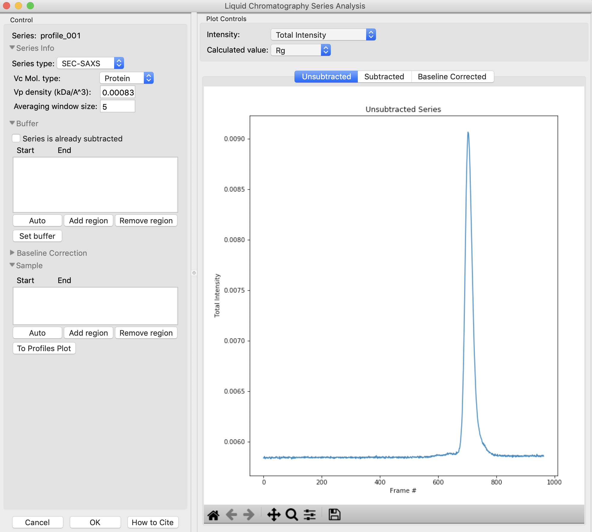

.. |lc_analysis_buffer_auto_png| image:: images/lc_analysis_buffer_auto.png

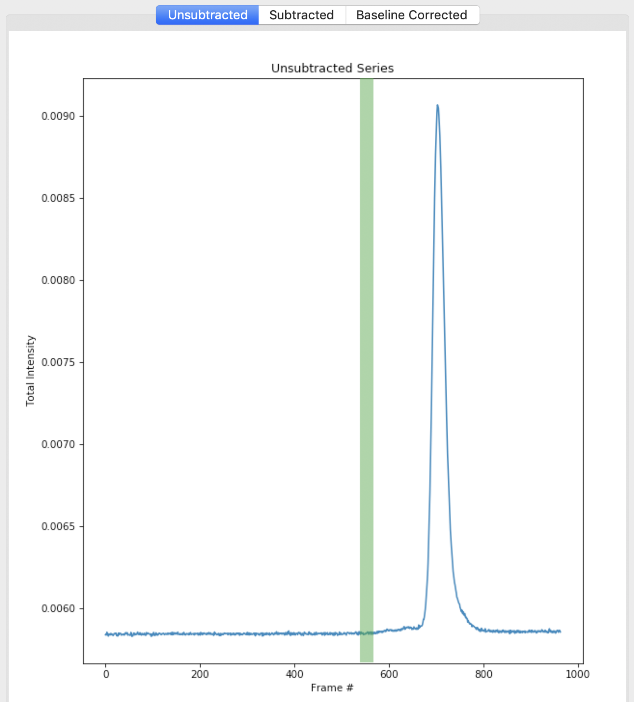

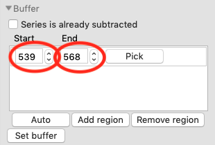

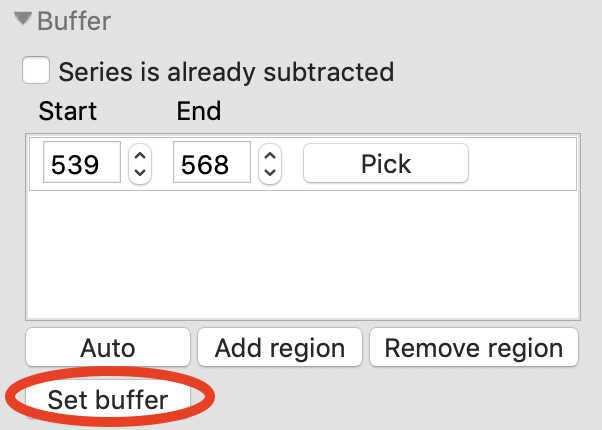

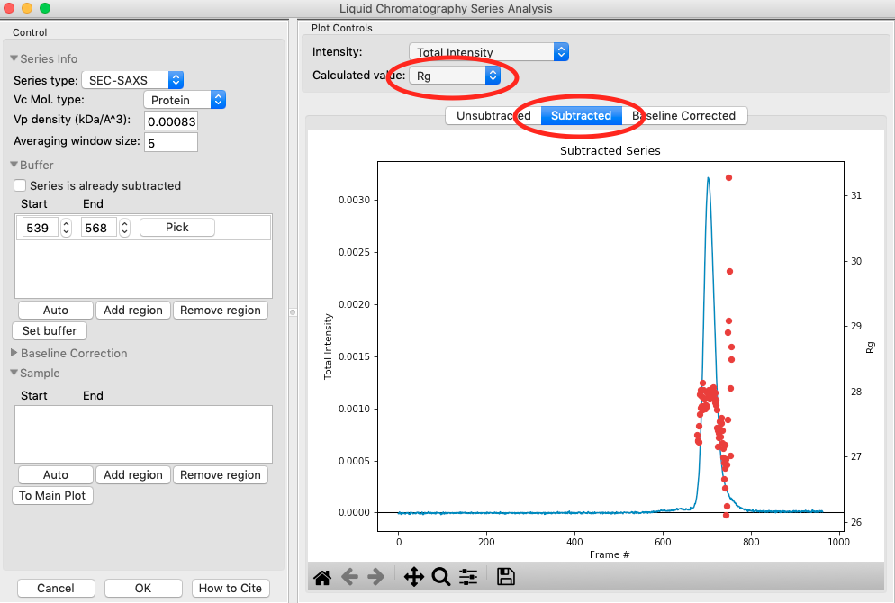

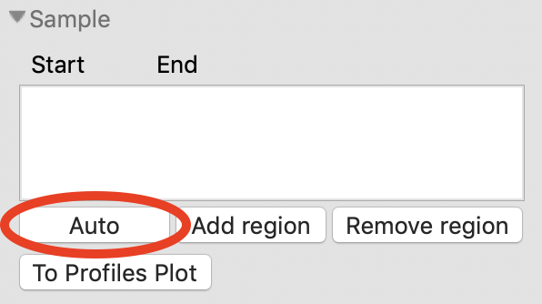

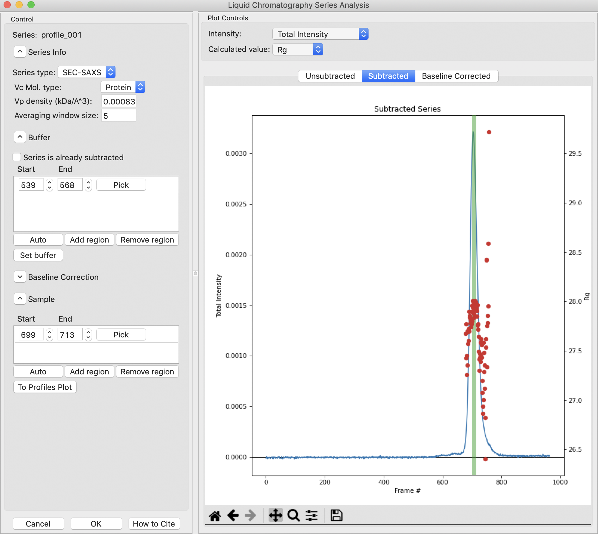

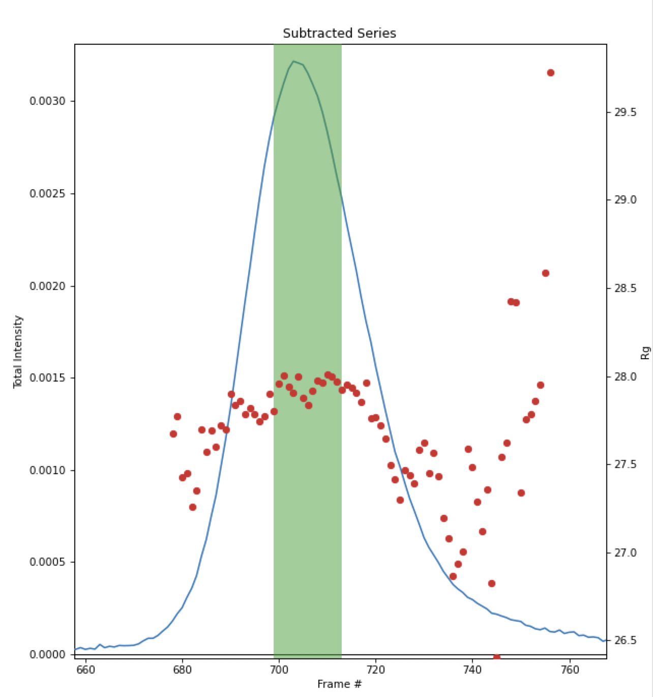

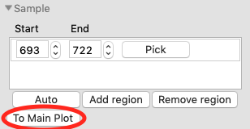

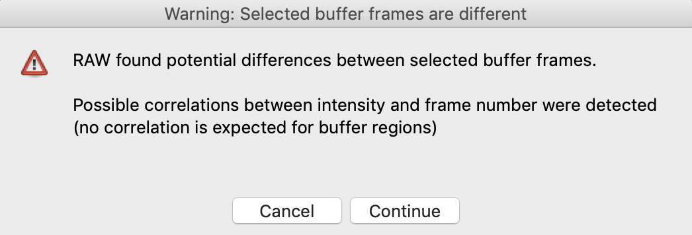

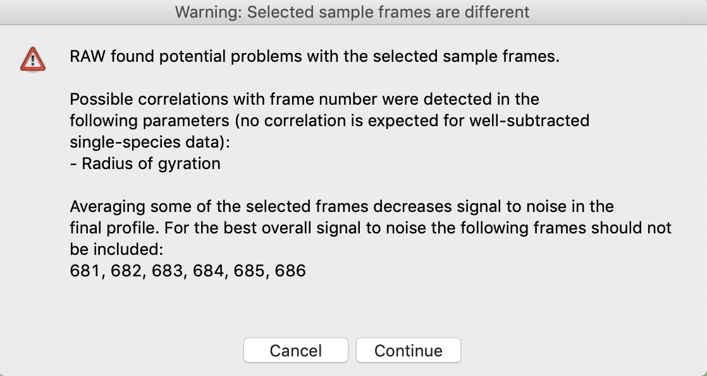

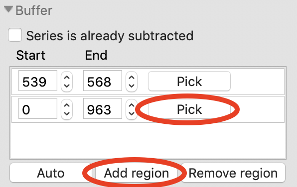

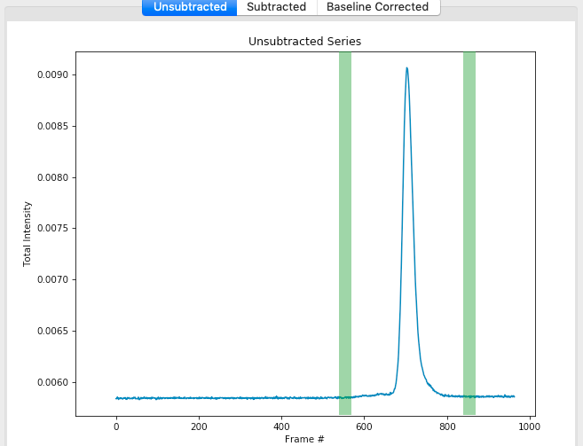

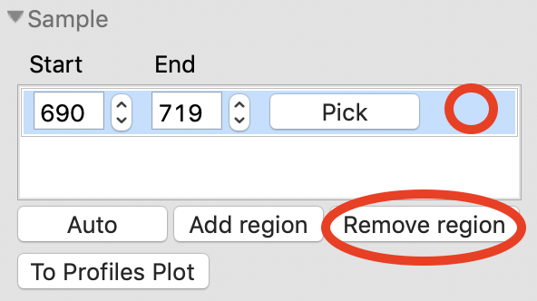

.. |series_color_png| image:: images/series_color.png

.. |series_line_props_png| image:: images/series_line_props.png

.. |series_rg_png| image:: images/series_rg.png

.. |Rg| replace:: R\ :sub:`g`
