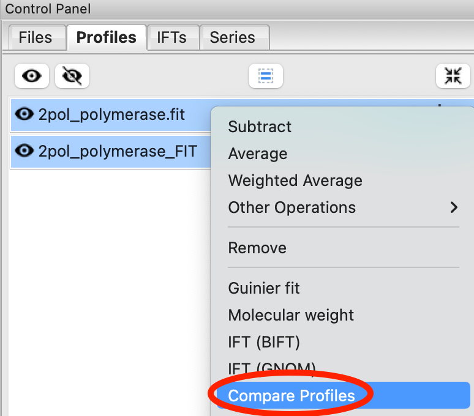
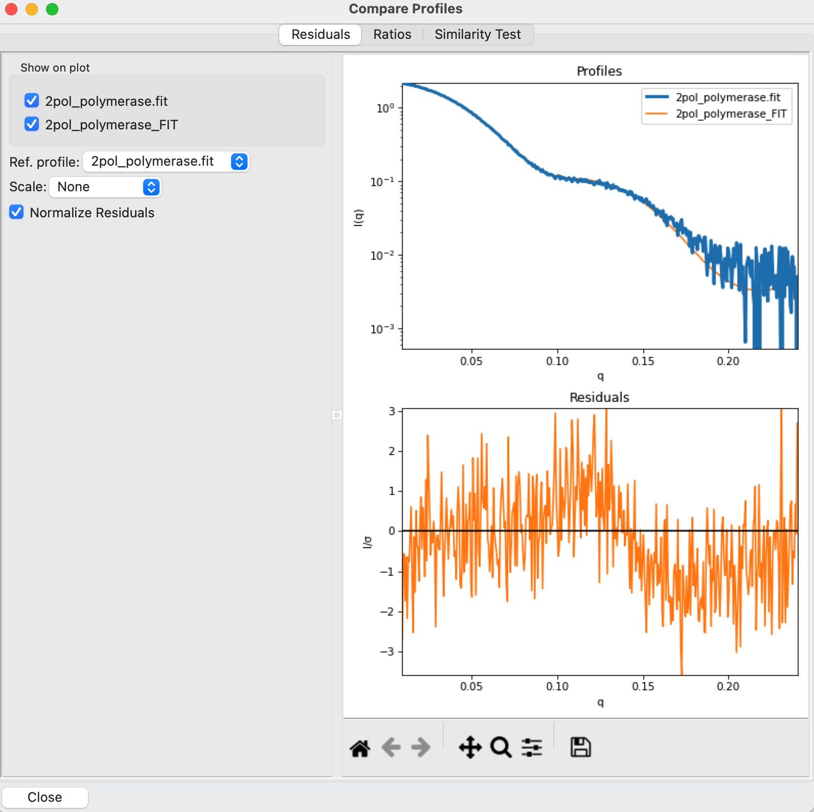
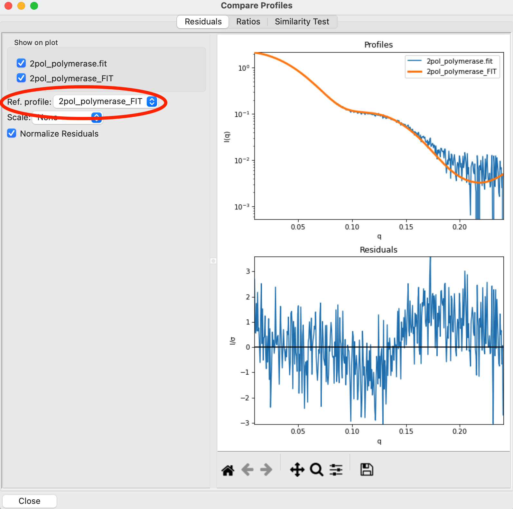
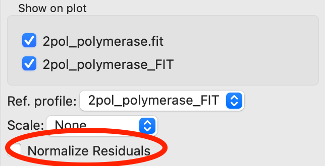
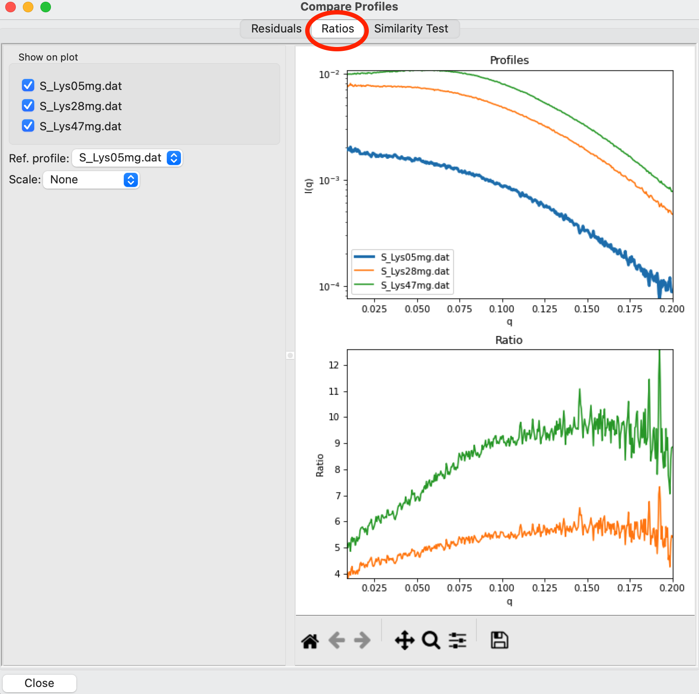
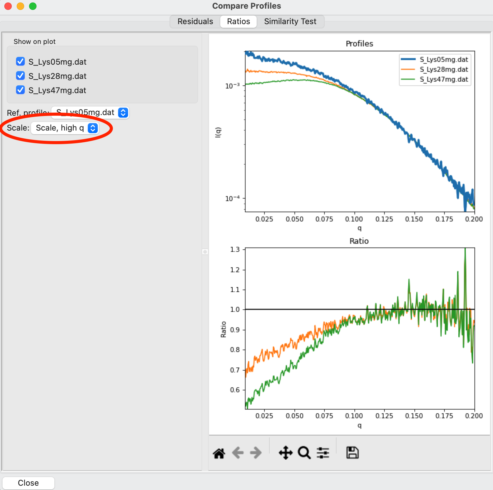
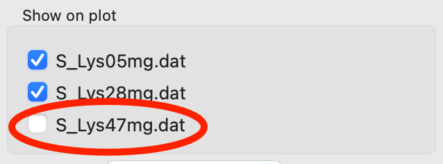
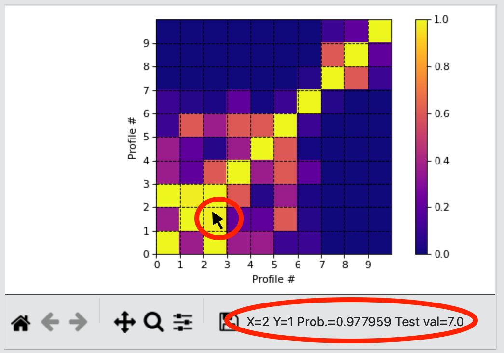

Comparing profiles
^^^^^^^^^^^^^^^^^^^^^^^^^^
.. _s1p6:

It is often useful to compare how similar profiles are, visually and/or statistically.
RAW has a dedicated comparison window that allows you to compare residuals, between
profiles, ratios between profiles, and use statistical tests (currently only the
Correlation Map test is implemented) to check for differences between profiles.

Comparing profiles with residuals
####################################

The residual is the difference between two profiles. Often we normalize this
difference by the uncertainty of one of the profiles, so that large deviations
of points with large uncertainties don't dominate the residual. If two profiles
agree within the noise level of the data the residual should be flat and
randomly distributed. If normalized, you expect most of the residual values to
be within +/- 2.5. It is often used when comparing a fit against the data
(e.g. comparing the fit of the P(r) transformed to I(q) or of a reconstruction
against the data).

The written version of the tutorial follows.

#.  Clear any data loaded into RAW. Load the **2pol_polymerase.fit** data
    in the **Tutorial_Data/theory_data/theory_results** folder into the
    Profiles plot.

    *   *Note:* This fit will load in two profiles, experimental data and the
        CRYSOL fit of a PDB file (high resolution model) to that experimental
        data. See the :ref:`CRYSOL tutorial <crysol_tutorial>` for how to generate
        these fits.

#.  Select both the **2pol_polymerase.fit** (experimental data) and
    **2pol_polymerase_FIT** (theoretical model fit to the data) profiles,
    right click on one of them and select "Compare Profiles" in the right
    click menu.

    |compare_residual_right_click_png|

#.  The Compare Profiles window will open. You will see three tabs at the top,
    the first (and default) shows the residuals between the selected data.

    *   *Note:* You can select as many profiles as you want for comparison,
        not just two.

    *   *Tip:* You can use the checkboxes next to the profile names to turn on
        profiles in the comparison plot. You must have at least two profiles
        turned on or no residuals will be displayed.

        |compare_residual_main_png|

#.  Use the "Ref. profile" drop down menu to select the **2pol_polymerase_FIT**
    profile as the reference profile. The reference profile is the profile that
    is subtracted from every other profile. Here you use the theoretical data
    as the reference.

    *   *Note:* The profile plot will update so that the reference profile is
        bold and on top of all the other plotted profiles.

    *   *Note:* You can see that the residuals have a trend to them, they're
        above zero at high q (0.15-0.2) and then dip below at mid q (around 0.13).
        This indicates that the theoretical model, while mostly a good fit, isn't
        a perfect fit for the experimental data.

    |compare_residual_ref_png|

#.  Use the "Normalize Residuals" checkbox to turn normalization on and off and
    see what difference it makes for both the overall values and shape of the
    residual.

    *   *Note:* You should see the un-normalized residual becomes more dominated
        by very low q deviations, but those points are higher noise, and so get
        flattened out when normalized.

    |compare_residual_normalize_png|

#.  Right click on the plot and use the Axes menu to change the scale of the axes.
    Try changing from a Log-Lin to a Log-Log plot to emphasize the low q.

    *   *Note:* You can change the plot scale in the Ratios plot as well.

#.  Close the comparison window using the Close button.

Comparing profiles with ratios
#################################

The ratio of two profiles can be useful when looking for small changes between
samples. It's often used for looking for concentration dependent effects,
particularly inter-particle interactions which cause a characteristic downturn
at low q.

The written version of this tutorial follows.

#.  Clear any data loaded into RAW. Load the **S_Lys05mg.dat**, **S_Lys28mg.dat**,
    and **S_Lys47mg.dat** profiles into RAW. These are scattering profiles of
    lysozyme measured at three different concentrations, 5 mg/ml, 28 mg/ml, and
    47 mg/ml.

    *   *Note:* The profiles should have significantly different overall intensities,
        due to the different concentrations.

    *   *Note:* In order to remove some high q noise, profiles have been truncated
        to q=0.2.

#.  Select all three profiles, right click and select "Compare Profiles" to open
    the comparison window.

#.  Select the "Ratios" tab at the top of the window.

    *   *Note:* The ratios shown are ratios to the reference profile. The choice
        of reference can be changed as in the Residuals tab.

    |compare_ratios_tab_png|

#.  Because of the different intensity levels that the profiles have due to the
    different concentrations the ratios aren't as useful for examining what's
    going on at low q. RAW can automatically apply a scale factor to the profiles.
    In the "Scale" drop-down menu select "Scale, high q", which will scale the
    profiles to the reference in the high q region of the data.

    *   *Note:* There are a number of scale options available, which can be
        useful in different situations. The Residuals tab also has the scale
        option.

    *   *Note:* You can see that there is a significant downturn at low q in both
        the 28 mg/ml and 47 mg/ml profile, indicating the presence of significant
        repulsion in the sample.

    |compare_ratios_scale_png|

#.  If you want to examine just one of the ratios, you can turn off a profile.
    Uncheck the **S_Lys47mg.dat** profile to show just the ratio of the 28 mg/ml to
    5 mg/ml data.

    |compare_ratios_show_png|

#.  Close the comparison window using the Close button.

Comparing profiles with statistical tests
############################################

In addition to the visual comparisons of the residual and ratio, above, RAW
has the ability to test scattering profiles for statistical similarity. Currently, only one
test is available: the Correlation Map test. This can be done manually, and is also done
automatically when scattering profiles are averaged. This can be useful when you’re dealing
with data that may show changes in scattering from radiation damage or other possible sources.

A video version of an older version this tutorial is available:

.. raw:: html

    
<iframe src='https://www.youtube.com/embed/BPgWze8GjVI' frameborder='0' allowfullscreen></iframe>

The written version of the tutorial follows.

#.  Clear any data loaded into RAW. Load all of the profiles in the **Tutorial_Data/damage_data**
    folder into the Profiles plot. Show only the top plot.

    *   *Tip:* In the Files tab, click the “Clear All” button.

#.  Put the plot on a log-log scale. You should see that the profiles are different at low *q*\ .

    *   *Note:* These data are showing what radiation damage looks like in a data set. They
        are consecutive profiles from the same sample, and as total exposure of the sample
        increase (frame number increases), the sample damages. In this case, the damage
        is manifesting as aggregation, which shows up as an uptick in the profiles at low *q*\ .

    |similarity_main_png|

#.  Select all of the profiles and average them. You will get a warning message informing you
    that not all the files are statistically the same.

    *   *Note:* This is only as good as the statistical test being used, and the cutoff
        threshold selected. In the advanced options panel you can select the test, whether
        or not it is corrected for multiple testing, and the threshold used.

    |similarity_warning_png|

#.  Click the “Average Only Similar Files” button.

    *   Note: This averages only those profiles found to the same as the first file,
        for the given statistical test.

#.  Select all of the profiles except the new averaged one, and right click and
    select “Compare Profiles”. Select the "Similarity Test" tab at the top of the
    window. This tab shows the results of the pairwise tests done using the
    CorMap method. On the top is a heatmap of the probability that the profiles
    are similar, while on the bottom is a list of the pairwise comparisons
    an the actual probabilities.

    |similarity_window_png|

#.  Expand the Filename columns in the list so you can see the full filenames along
    with the probabilities.

    |similarity_window2_png|

#.  Using the menu at the top, turn off multiple testing correction. Change the
    "highlight with p-value <" value to 0.15, and highlight those pairs.

    *   *Note:* Multiple testing correction corrects for the fact that you expect
        more outliers the more pairwise tests you run. Suppose the distribution
        of the uncertainty of a variable is Gaussian. If you run a single test
        to compare the results between two measurements of the variable,
        getting a result that is 2 standard deviations from the mean is a
        significant difference. However, if you make 100 measurements and
        compare them all to the first, you expect that 5% of the measurements
        you make will be outside of 2 standard deviations different, so multiple
        testing attempts to correct for that factor.

    |similarity_highlight_png|

#.  Move you mouse across the heatmap. Note that the profile numbers and probability
    value is displayed in the plot toolbar below the plot. The "X" refers to the
    File # of the file being compared on the x axis, the "Y" refers to the File #
    of the file being compared on the y axis, the "Prob." is the probability
    (corrected, if multiple testing correction is turned on) that the two are
    the same, and the "Test val" is the actual value of the comparison test,
    in this case the CorMap longest edge.

    *   *Note:* Comparing file x against file y is the same as comparing file
        y against file x, so the heatmap is symmetric across the diagonal. The
        diagonal values are comparing a profile to itself, and so the probability
        is always 1 along the diagonal.

    |similarity_heatmap_png|

#.  Without multiple testing correction, and using a less stringent threshold for similarity,
    we see that more profiles are selected here (profiles 6-10) than were excluded from the
    average using the automatic test. Because we know radiation damage increases with dose,
    it is reasonable to suspect that we should discard profiles 6-10, not just 8-10 as in
    the automated version.

#.  Save the similarity test data in the list as a **.csv** by clicking the “Save” button.

#.  Close the comparison window by clicking the “Done” button.

#.  Average profiles 1-5.

#.  Hide all of the profiles except the two averaged profiles on the plot.

    *   *Question:* Is there a difference between the two? What about if you do a Guinier fit?

    *   *Note:* In this case, the differences are subtle, a ~1-2% increase in |Rg|. So
        the automated determination did a reasonable job. However, it is generally good
        to double check your set of profiles both visually and using the Similarity Test
        panel when the automated test warns you of outlier profiles.

.. |similarity_main_png| image:: images/similarity_main.png
    :target: ../_images/similarity_main.png

.. |similarity_warning_png| image:: images/similarity_warning.png
    :width: 500 px
    :target: ../_images/similarity_warning.png

.. |similarity_window_png| image:: images/similarity_window.png
    :width: 600 px
    :target: ../_images/similarity_window.png

.. |similarity_window2_png| image:: images/similarity_window2.png
    :target: ../_images/similarity_window2.png

.. |similarity_highlight_png| image:: images/similarity_highlight.png
    :target: ../_images/similarity_highlight.png

.. |Rg| replace:: R\ :sub:`g`
