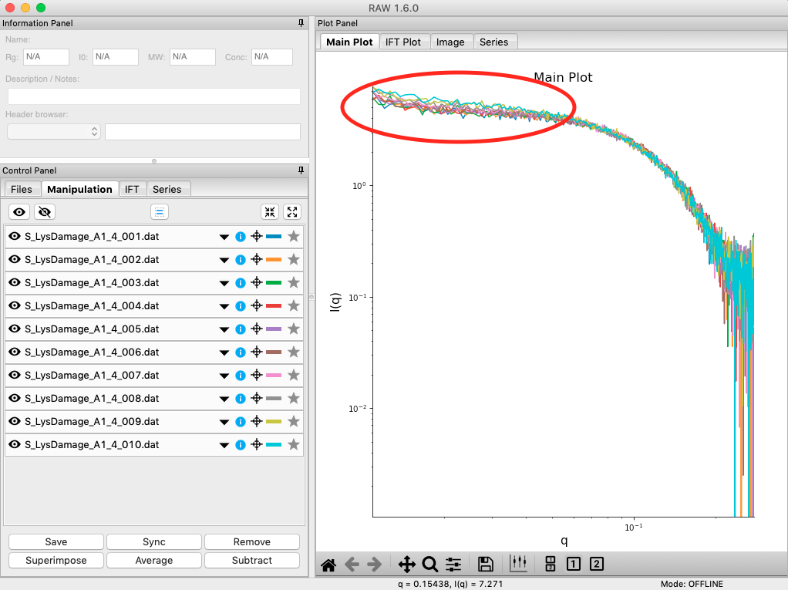
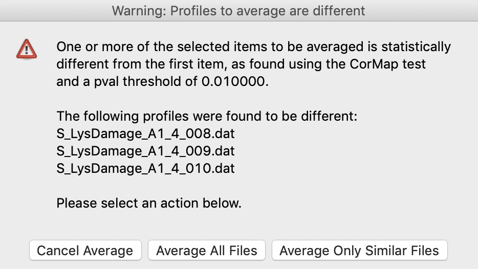
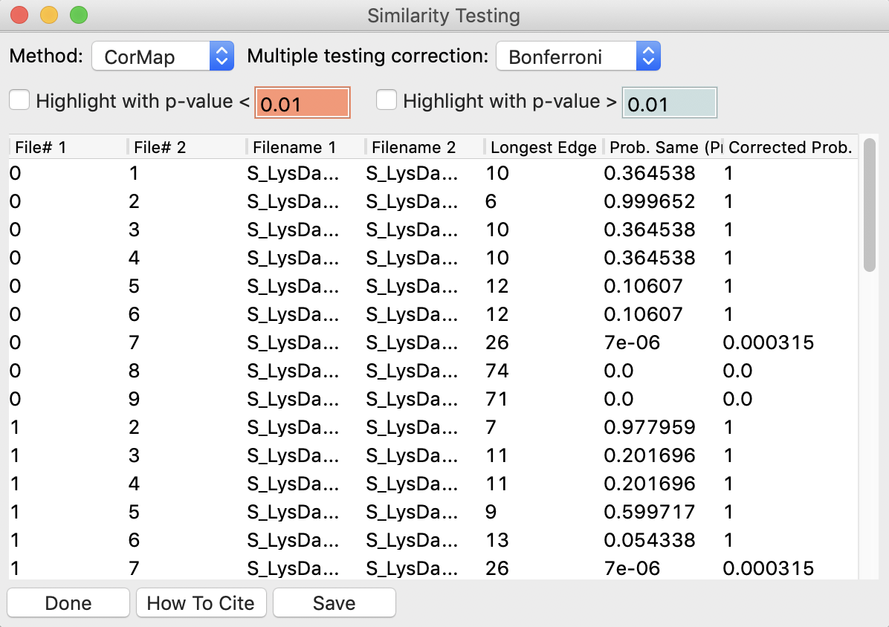
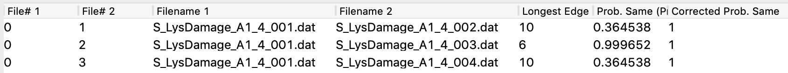
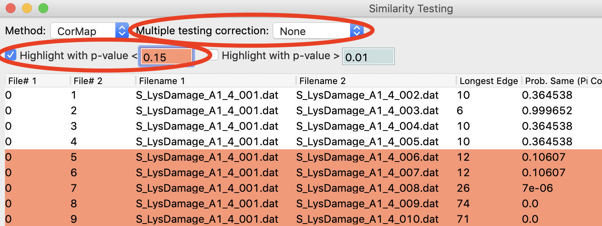

Similarity Testing
^^^^^^^^^^^^^^^^^^^^^^^^^^
.. _s1p6:

RAW has the ability to test scattering profiles for statistical similarity. Currently, only one
test is available: the Correlation Map test. This can be done manually, and is also done
automatically when scattering profiles are averaged. This can be useful when you’re dealing
with data that may show changes in scattering from radiation damage or other possible sources.

#.  Clear any data loaded into RAW. Load all of the profiles in the **Tutorial_Data/damage_data**
    folder into the Profiles plot. Show only the top plot.

    *   *Tip:* In the Files tab, click the “Clear All” button.

#.  Put the plot on a log-log scale. You should see that the profiles are different at low *q*\ .

    *   *Note:* These data are showing what radiation damage looks like in a data set. They
        are consecutive profiles from the same sample, and as total exposure of the sample
        increase (frame number increases), the sample damages. In this case, the damage
        is manifesting as aggregation, which shows up as an uptick in the profiles at low *q*\ .

    |similarity_main_png|

#.  Select all of the profiles and average them. You will get a warning message informing you
    that not all the files are statistically the same.

    *   *Note:* This is only as good as the statistical test being used, and the cutoff
        threshold selected. In the advanced options panel you can select the test, whether
        or not it is corrected for multiple testing, and the threshold used.

    |similarity_warning_png|

#.  Click the “Average Only Similar Files” button.

    *   Note: This averages only those profiles found to the same as the first file,
        for the given statistical test.

#.  Select all of the profiles except the new averaged one, and right click and
    select “Similarity Test”.

    |similarity_window_png|

#.  The similarity testing window (above) shows the results of the pairwise tests
    done using the CorMap method. Expand the window and the Filename columns
    to allow you to see the full filenames along with the probabilities.

    |similarity_window2_png|

#.  Using the menu at the top, turn off multiple testing correction. Change the
    highlight less than value to 0.15, and highlight those pairs.

    |similarity_highlight_png|

#.  Without multiple testing correction, and using a less stringent threshold for similarity,
    we see that more profiles are selected here (profiles 6-10) than were excluded from the
    average using the automatic test. Because we know radiation damage increases with dose,
    it is reasonable to suspect that we should discard profiles 6-10, not just 8-10 as in
    the automated version.

#.  Save the similarity test data as a **.csv** by clicking the “Save” button.

#.  Close the similarity testing window by clicking the “Done” button.

#.  Average profiles 1-5.

#.  Hide all of the profiles except the two averaged profiles on the plot.

    *   *Question:* Is there a difference between the two? What about if you do a Guinier fit?

    *   *Note:* In this case, the differences are subtle, a ~1-2% increase in |Rg|. So
        the automated determination did a reasonable job. However, it is generally good
        to double check your set of profiles both visually and using the Similarity Test
        panel when the automated test warns you of outlier profiles.

.. |Rg| replace:: R\ :sub:`g`
