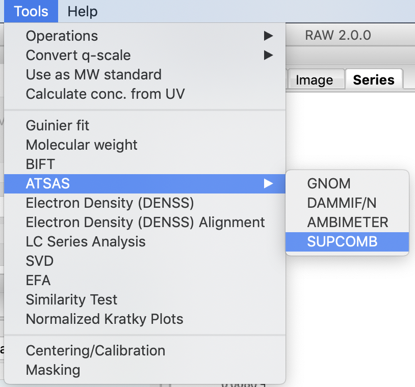
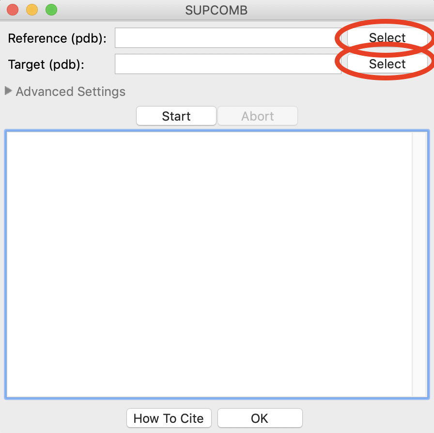
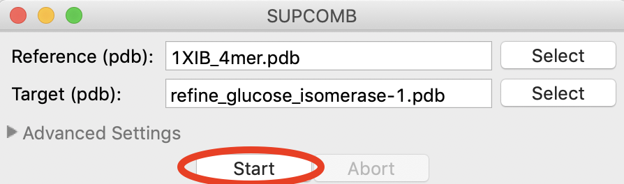
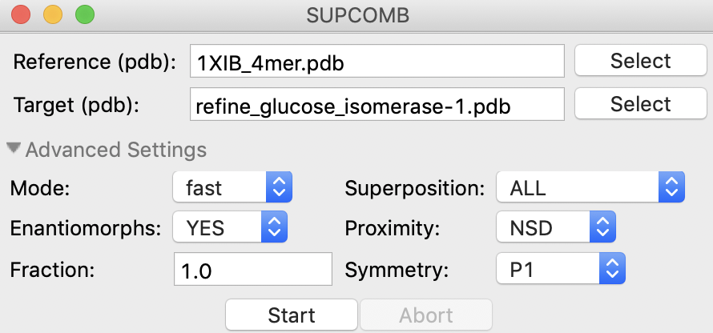
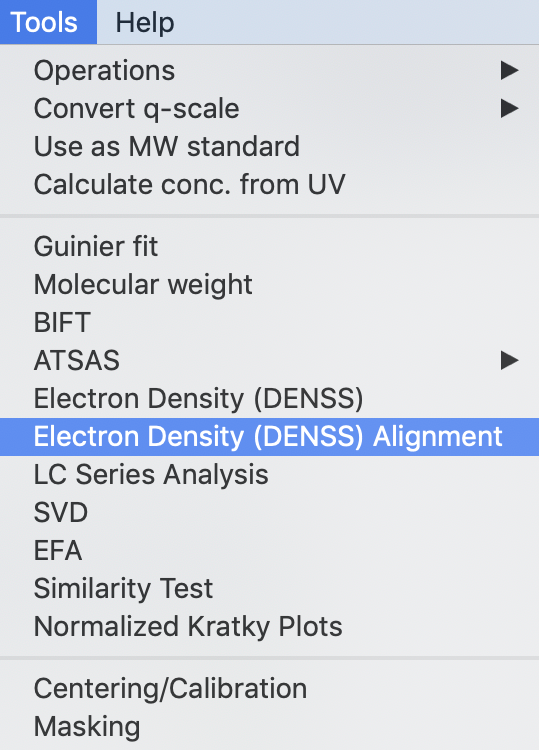
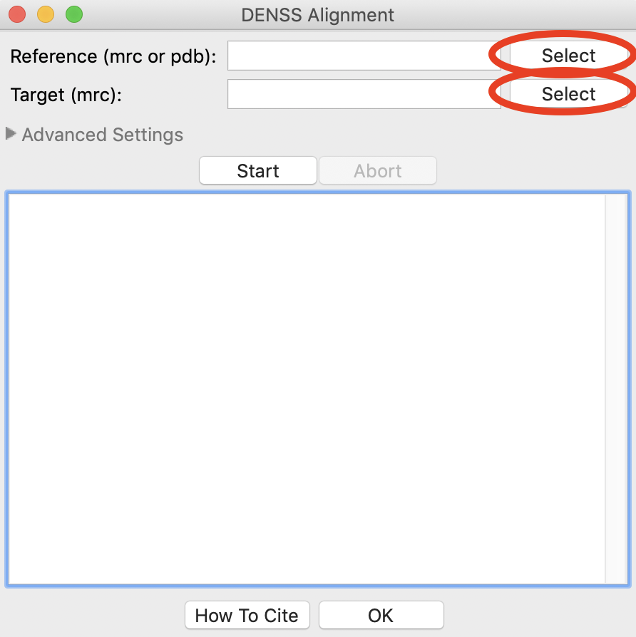
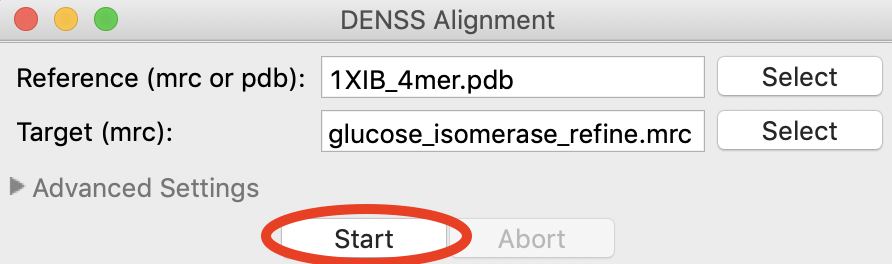
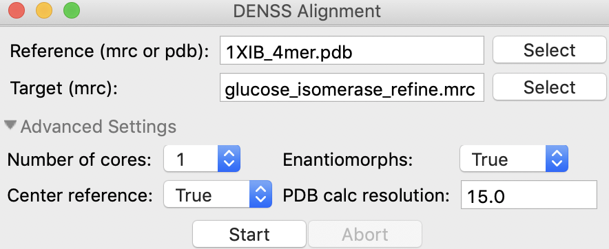

Aligning reconstructions with high resolution shapes
^^^^^^^^^^^^^^^^^^^^^^^^^^^^^^^^^^^^^^^^^^^^^^^^^^^^^^^^^^^^^^^^^^^^^^

It is often important to align SAXS reconstructions, either bead models such
as those from DAMMIF/N or electron density from DENSS, with high resolution
structural models such as those from x-ray crystallography to see how well
they agree. RAW can do that automatically when you generate the models,
as described in the :ref:`DAMMIF/N <dammif>` and :ref:`DENSS <denss_s2>` sections
of the tutorial. RAW also provides standalone windows for doing the alignment
with already generated reconstructions.

A video version of this tutorial is available:

.. raw:: html

    
<iframe src='https://www.youtube.com/embed/W-7dE1o7-aQ' frameborder='0' allowfullscreen></iframe>

The written version of the tutorial follows.

Bead models - SUPCOMB
*************************

SUPCOMB from the ATSAS suite can be used to align two PDB files. In this context,
one model (the reference) is the high resolution structure while the other
(the target) is the bead model reconstruction.

#.  Open the SUPCOMB window by selection Tools->ATSAS->SUPCOMB from the menu bar

    |align_supcomb_menu_png|

#.  In the window that opens, 'Target' is the model that is aligned, where
    as 'Reference' is the model that the target is aligned to. In other words,
    the Reference model stays unchanged, while the Target model is moved to
    best align with the Reference.

#.  Use the Reference 'Select' button to select
    **reconstruction_data/gi_complete/1XIB_4mer.pdb** as the reference file.

    *   *Tip:* Only the filename will show up in either the Reference or Target
        box. If you hover your mouse over the filename it will show the full
        path to the file.

#.  Use the Target 'Select' button to select
    **reconstruction_data/gi_complete/gi_dammif/refine_glucose_isomerase-1.pdb**

    |align_supcomb_select_png|

#.  Click the start button, SUPCOMB will run.

    |align_supcomb_start_png|

#.  When SUPCOMB is finished, in the same folder as the target file you will
    see a **<target_name>_aligned.pdb** file, which is the target model
    aligned with the reference file.

#.  Advanced settings can be accessed by clicking on the 'Advanced Settings' text
    to expand the section. These settings are described in the `SUPCOMB manual
    <https://www.embl-hamburg.de/biosaxs/manuals/supcomb.html>`_.

    |align_supcomb_advanced_png|

Electron density
*************************

DENSS include a native tool for aligning two electron density files (.mrc)
or an electron density to a PDB file. In this context, one model (the reference)
is the high resolution

#.  Open the Electron Density Alignment window by selection Tools->Electron
    Density (DENSS) Alignment from the menu bar

    |align_denss_menu_png|

#.  In the window that opens, 'Target' is the model that is aligned, where
    as 'Reference' is the model that the target is aligned to. In other words,
    the Reference model stays unchanged, while the Target model is moved to
    best align with the Reference.

#.  Use the Reference 'Select' button to select
    **reconstruction_data/gi_complete/1XIB_4mer.pdb** as the reference file.

    *   *Tip:* Only the filename will show up in either the Reference or Target
        box. If you hover your mouse over the filename it will show the full
        path to the file.

#.  Use the Target 'Select' button to select
    **reconstruction_data/gi_complete/gi_dammif/glucose_isomerase_refine.mrc**

    |align_denss_select_png|

#.  Click the start button, DENSS alignement will run.

    *   *Tip:* If there is already a file in the folder with the aligned output
        filename you will get a prompt to overwrite it.

    *   *Tip:* By default, DENSS centers the Reference file. This writes out
        a file namged **<reference_name>_centered.pdb** in the same folder as
        the reference file, which is what should be compared to the aligned
        file. You can turn this off in the Advanced Settings.

    |align_denss_start_png|

#.  When alignment is finished, in the same folder as the target file you will
    see a **<target_name>_aligned.mrc**. Compare this to the **<reference_name>_centered.pdb**
    file in reference file folder. In this case those names are **glucose_isomerase_refine_aligned.mrc**
    and **1XIB_4mer_centered.pdb**.

#.  You can change the advanced settings by expanding the Advanced Settings section.
    These advanced settings are:

    *   *Number of cores:* Number of cores to use during alignment
    *   *Enantiomorphs:* Whether to generate enantiomorphs of the Target before doing
        the alignment.
    *   *Center reference:* Whether to center the reference model at the origin
        If used,this creates a **<reference_name>_centered.pdb** file in the same
        folder as the reference file.
    *   *PDB calc. resolution:* The resolution of the density map created from
        the Reference PDB model to compare with the Target model. This has
        no effect if the Reference is already a density.

    |align_denss_advanced_png|

