Advanced SEC-SAXS processing – Baseline correction
^^^^^^^^^^^^^^^^^^^^^^^^^^^^^^^^^^^^^^^^^^^^^^^^^^^^^^^

Sometimes SEC data shows a baseline drift. This can be due either to instrumental
changes (such as beam drift), or changes in the measured system, such as capillary
fouling. RAW provides the ability to correct for these forms of baseline drift
using either a linear or integral baseline method. The linear baseline method
is best for instrumental drifts, while the integral baseline method is best
for capillary fouling. Both baseline methods apply a distinct correction for each
*q* value.

A video version of this tutorial is available:

.. raw:: html

    
<iframe src='https://www.youtube.com/embed/ftFPs6XTyEA' frameborder='0' allowfullscreen></iframe>

The written version of the tutorial follows.

Linear Baseline Correction
*****************************

#.  Clear all of the data in RAW. Load the **xylanase.hdf5** SEC data in the
    **sec_data** folder.

#.  When it loads in, you will see there is a distinct constant upward slope in the
    integrated intensity. This usually happens due to instrumental drift,
    and can often be mostly corrected for.

    |baseline_series_plot_png|

#.  Open the LC Series analysis panel. Set a buffer range ('Auto' is fine).
    You'll still see the slope in the subtracted integrated intensity plot.

    *   *Note:* To baseline correct data, you should only have buffer regions
        selected before the peak.

#.  Use the triangle to expand the Baseline Correction section.

    *   *Note:* On windows it will look like a button with '>>' after the
        name.

    |lc_analysis_baseline_expand_png|

#.  Set baseline correction to 'Linear'. You should see the start and end
    controls become active, and two blue regions representing your selected
    start and end regions appear on the 'Subtracted' plot.

    *   *Note:* This should automatically show the 'Subtracted' plot tab. If
        it doesn't, select the 'Subtracted' plot tab.

    |lc_analysis_baseline_linear_png|

#.  If you look closely, it looks like the baseline may level off a little bit
    at the start of the series curve. So we will select a start range closer
    to the peak. Click the 'Pick' button for the baseline correction start region
    and select a start region about halfway to the peak. Roughly 30-50 frames
    is a good length for the start and end regions.

    |lc_analysis_baseline_linear_pick_png|

#.  Expand the end range to be 50 frames long.

    |lc_analysis_baseline_linear_range_png|

#.  Click 'Set baseline and calculate'. You may see a warning, click 'Continue'.

    *   *Note:* The warning simply informs you that the slope of the linear correction
        is not the same in the start and end region at all q values. This is usually
        the case, and mostly can be ignored.

    |lc_analysis_baseline_linear_warning_png|

#.  The 'Baseline Corrected' plot should automatically show after you set the
    baseline region and calculate. If not, change to that plot tab. You can
    see that the upward drift is essentially gone.

    |lc_analysis_baseline_linear_corrected_png|

#.  Switch back to the subtracted plot. You'll see the calculated baseline
    shown in orange.

    |lc_analysis_baseline_linear_baseline_png|

#.  Switch back to displaying the Baseline Corrected plot.

#.  Remove any existing sample region and find a new sample region using the 'Auto'
    button. Send that region to the Profiles plot.

#.  You can remove the baseline correction by changing the 'Baseline correction'
    selection from 'Linear' to 'None'. Do this, then send the sample region to the
    Profiles plot again.

#.  Change the 'Baseline correction' selection back to 'Linear'. Click 'Set Baseline
    and calculate' to redo the linear correction. Click 'OK' to exit the LC Series
    Analysis window. Now if you save series or reopen the window you will see
    your baseline correction.

#.  Switch to the profiles plot. Put the subtracted plot on a Log-Log scale.
    You can see a difference in the profiles due to the baseline correction at
    low q.

    |baseline_linear_profiles_png|

Integral Baseline Correction
******************************

Integral baseline correction proceeds very similarly to linear baseline correction.
Here we provide detail only where the procedures are different.

#.  Clear all of the data in RAW. Load the **baseline.hdf5** SEC data in the
    **sec_data** folder.

    *   *Note:* This is the same as what you :ref:`previously saved <s1p7>` in
        an earlier part of the tutorial.

#.  Open the LC Series analysis panel. Verify that your buffer regions
    are before the peak of interest.

#.  Set baseline correction to 'Integral'.

#.  Zoom in near the base of the subtracted peak. Pick a start region in the
    flat baseline area just before the start of the peaks.

#.  Pick an end region in the flat region just after the end of the peaks.

    *   *Note:* You should end up with regions ~460-480 and 860-880

    *   *Try:* You can use the 'Auto' button to automatically find start and end
        regions. For this dataset, it ends up a little close to the peaks, so
        some manual adjustment is necessary.

    |lc_analysis_baseline_regions_png|

#.  Click the 'Set baseline and calculate' button.

    *   *Note:* The start and end points should be set in regions with no change
        in the baseline. If they aren't, RAW will give a warning. Try changing the
        end region to ~800-820 to see such a warning.

#.  Zoom in on the base of the peak in the baseline corrected dataset. You should
    see that the baseline is actually a little overcorrected. This is because
    the integral baseline correction only allows for positive or no change in the
    baseline, so if some *q* values need a negative correction the total baseline
    ends up overcorrected, as the positive values are brought down but the negative
    values are not brought up.

    *   *Note:* You can change the intensity display to individual *q* values or
        a *q* range and look at different points in *q* to try figure out which *q*
        values are causing the issue.

    |lc_analysis_baseline_overcorrect_png|

#.  Switch back to the subtracted plot and zoom in on the base of the peak.
    You'll see the calculated baseline shown in orange.

    |lc_analysis_baseline_baseline_png|

#.  Change the intensity display to 'Intensity in q range' and try several
    different q ranges. This will allow you to see what q values are getting
    the baseline overcompensated.

    *   *Try:* Recommended regions to try for this dataset are 0.01-0.02, 0.05-0.06,
        0.1-0.2, 0.2-0.27.

    *   *Note:* You should find that it is the high *q* ranges that are being
        overcorrected. This may imply that the profiles are mostly noise in
        that range. If you examine the profiles and determine that is the case,
        you could truncate the profiles to lower *q* before doing the baseline
        correction.

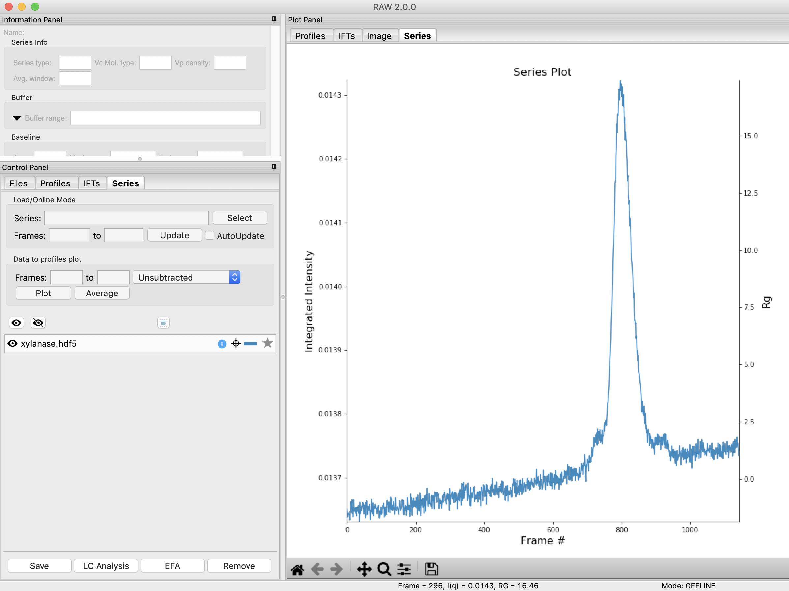

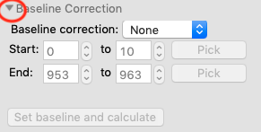

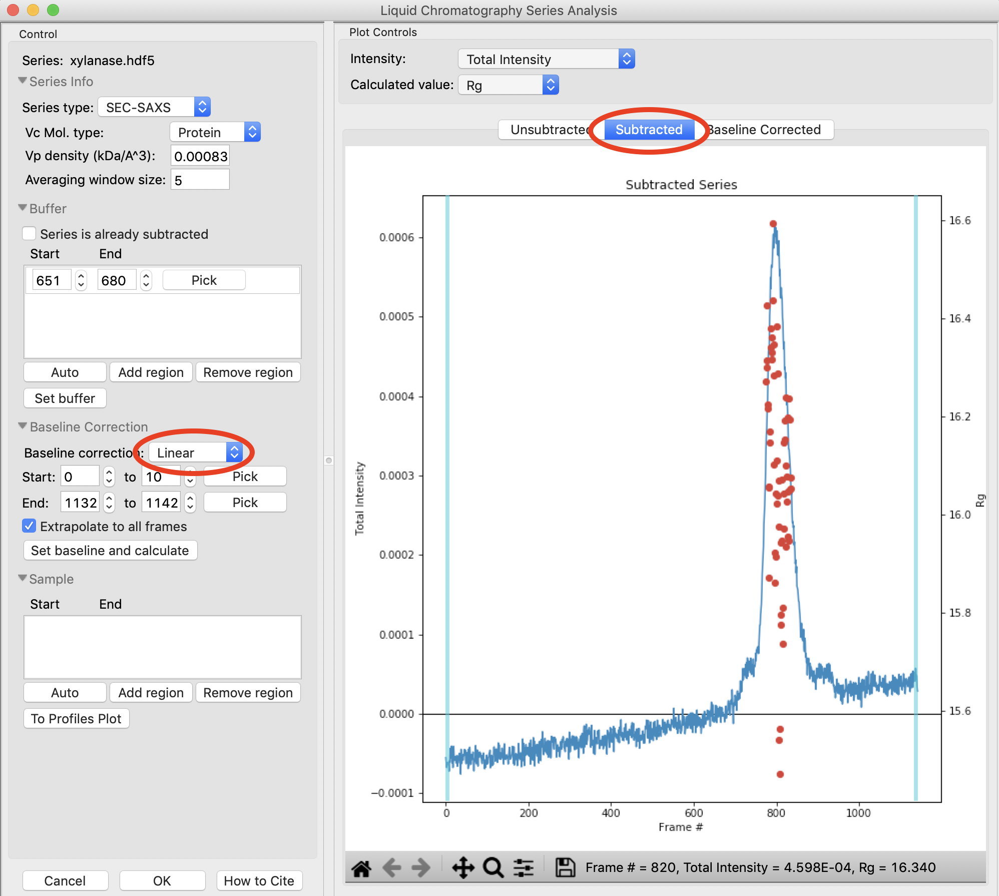

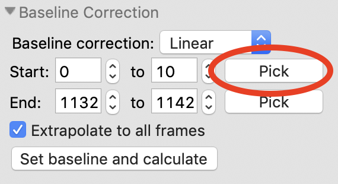

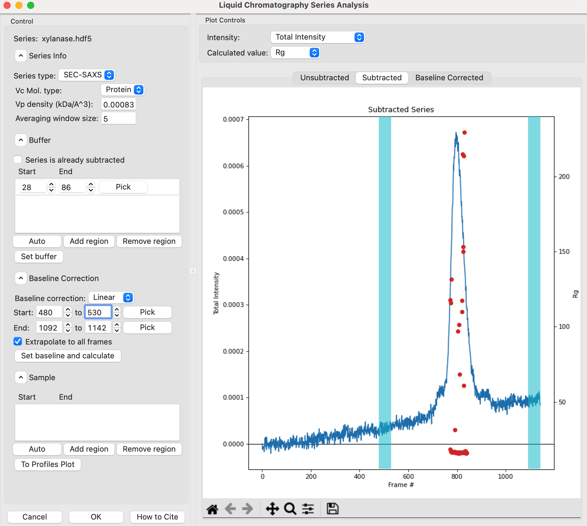

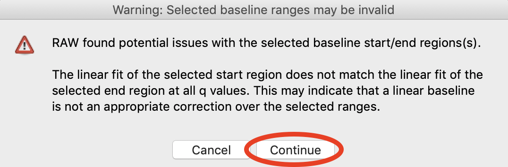

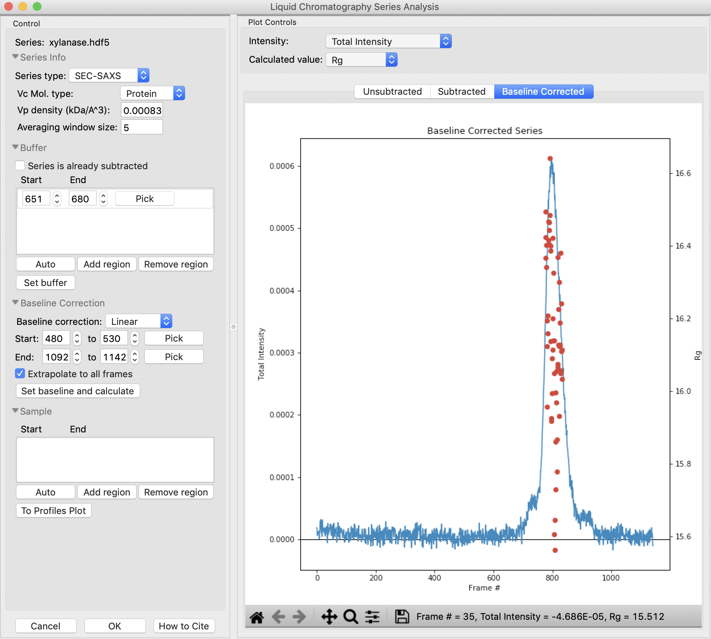

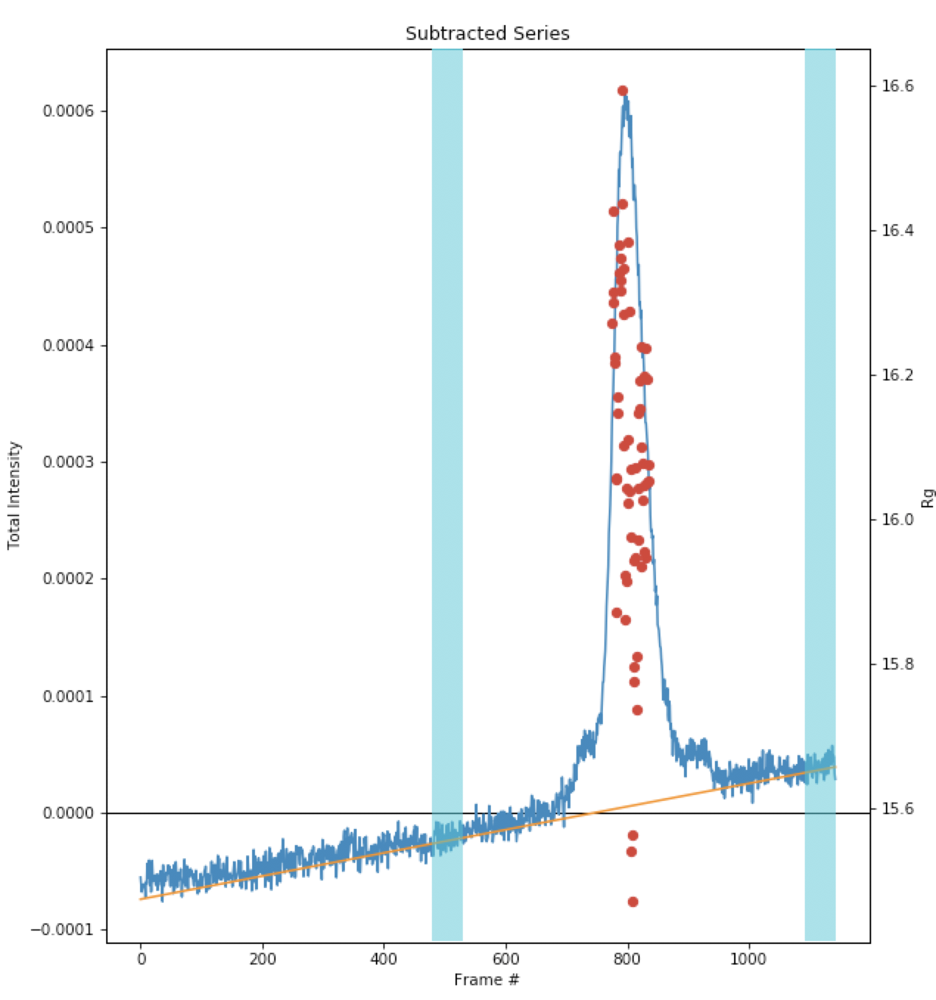

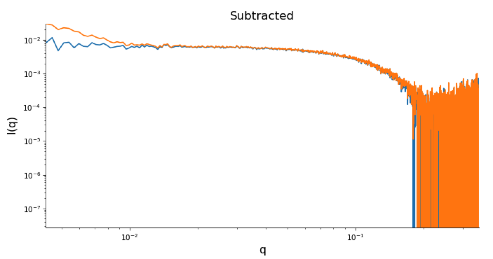

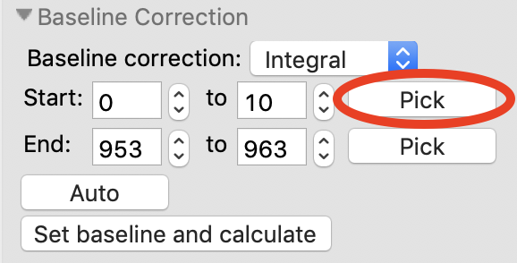

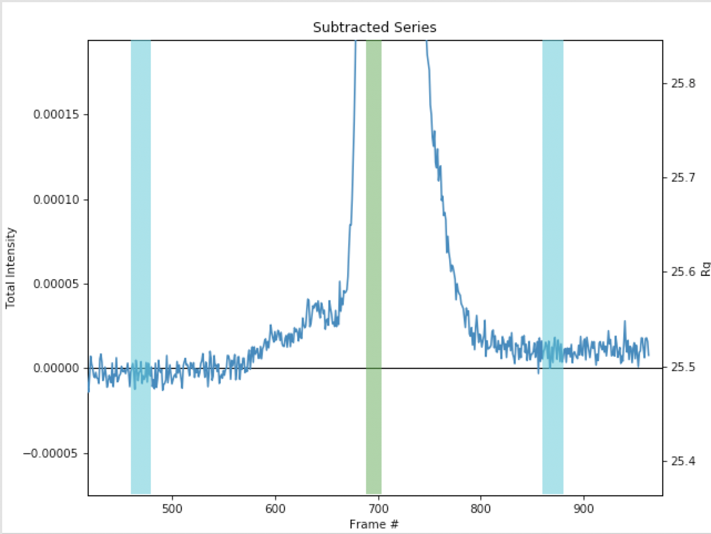

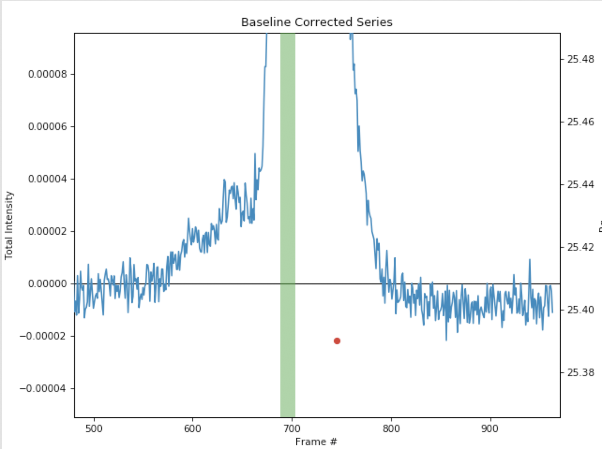

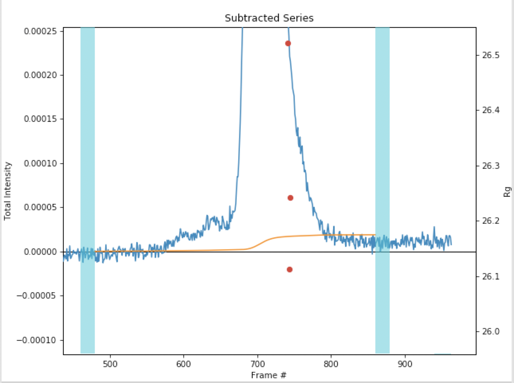
