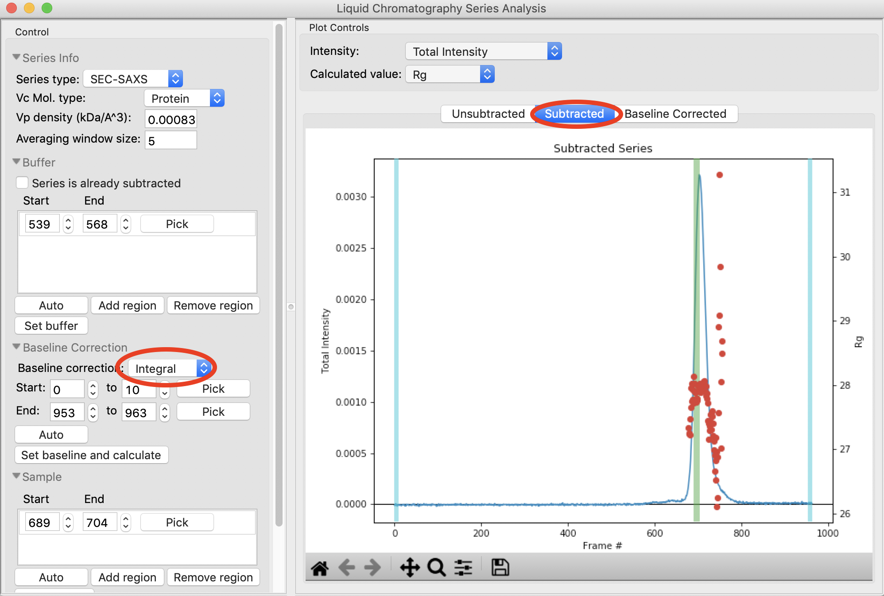
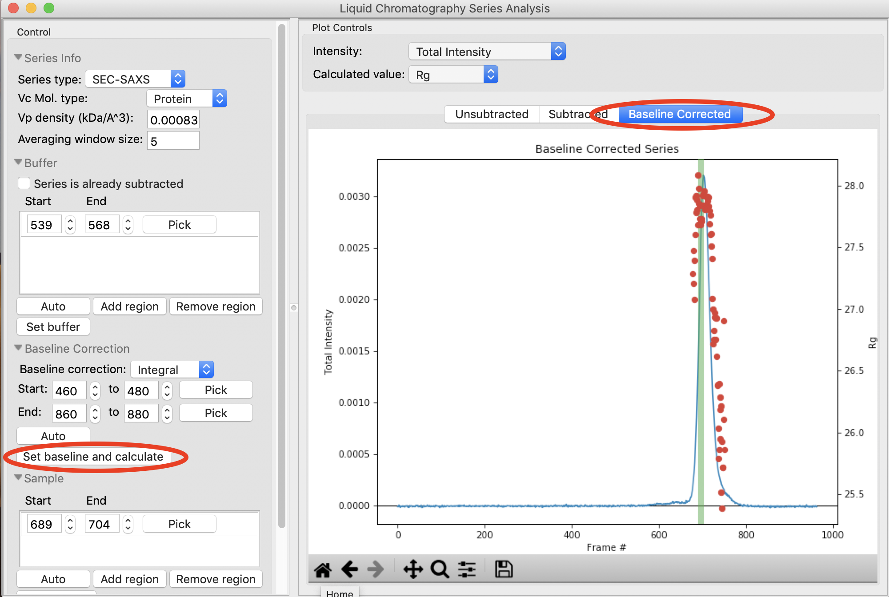
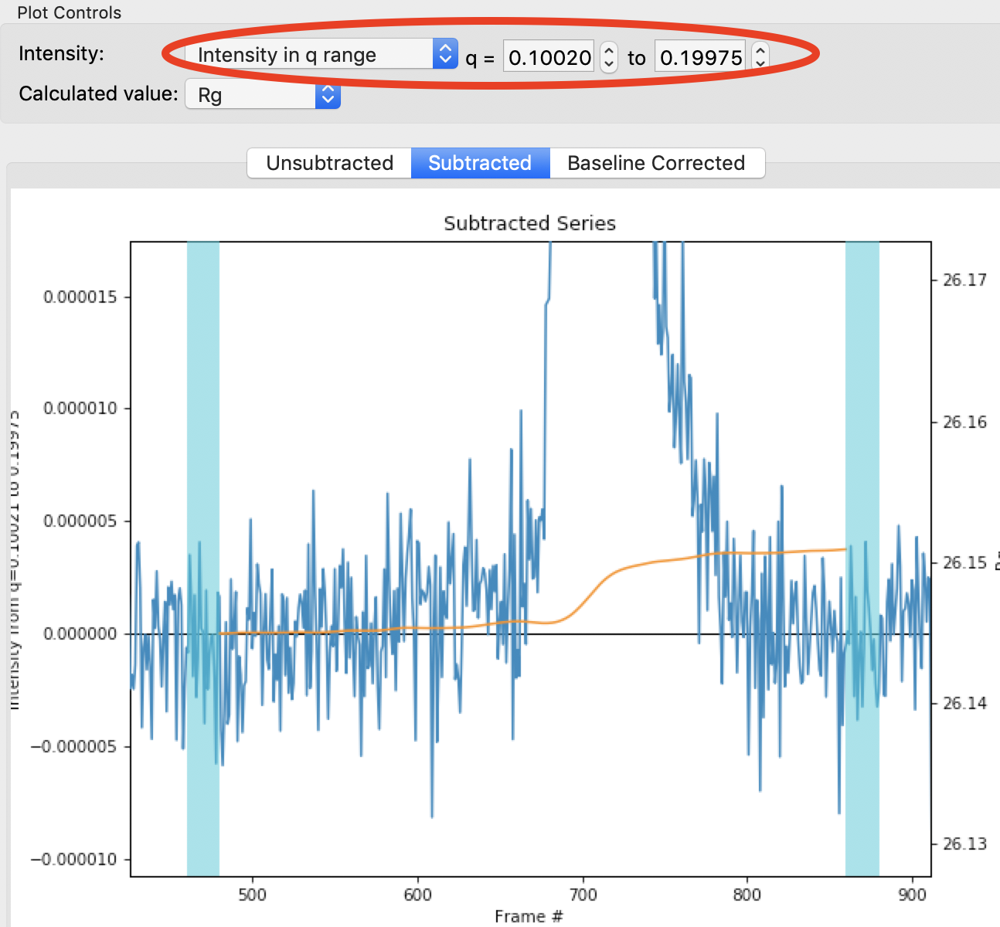

Advanced SEC-SAXS processing – Baseline correction
^^^^^^^^^^^^^^^^^^^^^^^^^^^^^^^^^^^^^^^^^^^^^^^^^^^^^^^

Sometimes SEC data shows a baseline drift. This can be due either to instrumental
changes (such as beam drift), or changes in the measured system, such as capillary
fouling. RAW provides the ability to correct for these forms of baseline drift
using either a linear or integral baseline method. The linear baseline method
is best for instrumental drifts, while the integral baseline method is best
for capillary fouling. Both baseline methods apply a distinct correction for each
*q* value.

#.  Clear all of the data in RAW. Load the **baseline.sec** SEC data in the
    **sec_data** folder.

    *   *Note:* This is the same as what you :ref:`previously saved <s1p7>` in
        an earlier part of the tutorial.

#.  Open the LC Series analysis panel.

#.  To baseline correct data, you should only have buffer regions selected before
    the peak. Select the 'Unsubtracted' plot tab and verify that your buffer regions
    are before the peak of interest.

#.  Use the triangle to expand the Baseline Correction section.

    |lc_analysis_baseline_expand_png|

#.  Set baseline correction to 'Integral'. You should see the start and end
    controls become active, and two blue regions representing your selected
    start and end regions appear on the 'Subtracted' plot.

    *   *Note:* This should automatically show the 'Subtracted' plot tab. If
        it doesn't, select the 'Subtracted' plot tab.

    |lc_analysis_baseline_integral_png|

#.  Zoom in near the base of the subtracted peak. Click the 'Pick' button for the
    baseline correction start region and select a start region in the flat baseline
    area just before the start of the peaks.

    |lc_analysis_baseline_pick_png|

#.  Pick an end region in the flat region just after the end of the peaks.

    *   *Note:* You should end up with regions ~460-480 and 860-880

    *   *Try:* You can use the 'Auto' button to automatically find start and end
        regions. For this dataset, it ends up a little close to the peaks, so
        some manual adjustment is necessary.

    |lc_analysis_baseline_regions_png|

#.  Click the 'Set baseline and calculate' button. The 'Baseline Corrected' plot
    should automatically show after you set the baseline region and calculate.
    If not, change to that plot tab.

    *   *Note:* The start and end points should be set in regions with no change
        in the baseline. If they aren't, RAW will give a warning. Try changing the
        end region to ~800-820 to see such a warning.

    |lc_analysis_baseline_set_png|

#.  Zoom in on the base of the peak in the baseline corrected dataset. You should
    see that the baseline is actually a little overcorrected. This is because
    the integral baseline correction only allows for positive or no change in the
    baseline, so if some *q* values need a negative correction the total baseline
    ends up overcorrected, as the positive values are brought down but the negative
    values are not brought up.

    *   *Note:* You can change the intensity display to individual *q* values or
        a *q* range and look at different points in q to try figure out which q
        values are causing the issue.

    |lc_analysis_baseline_overcorrect_png|

#.  Switch back to the subtracted plot and zoom in on the base of the peak.
    You'll see the calculated baseline shown in orange.

    |lc_analysis_baseline_baseline_png|

#.  Change the intensity display to 'Intensity in q range' and try several
    different q ranges. This will allow you to see what q values are getting
    the baseline overcompensated.

    *   *Try:* Recommended regions to try for this dataset are 0.01-0.02, 0.05-0.06,
        0.1-0.2, 0.2-0.27.

    *   *Note:* You should find that it is the high *q* ranges that are being
        overcorrected. This may imply that the profiles are mostly noise in
        that range. If you example the profiles and determine that is the case,
        you could truncate the profiles to lower *q* before doing the baseline
        correction.

#.  Switch back to displaying the total intensity and the Baseline Corrected plot.

#.  Remove any existing sample region and find a new sample region using the 'Auto'
    button. Send that region to the main plot.

    *   *Try:* Compare with what you found for this dataset :ref:`earlier in
        the tutorial <s1p7>`.

*Note:* The linear baseline correction is done in much the same way as the integral
correction, so it is not covered in this tutorial. The only differences are that
there is no 'Auto' determination of start and end regions, and that you should
pick start and end regions that are linearly changing, not flat.

.. |lc_analysis_baseline_expand_png| image:: images/lc_analysis_baseline_expand.png

.. |lc_analysis_baseline_pick_png| image:: images/lc_analysis_baseline_pick.png
    :width: 300 px

.. |lc_analysis_baseline_regions_png| image:: images/lc_analysis_baseline_regions.png

.. |lc_analysis_baseline_overcorrect_png| image:: images/lc_analysis_baseline_overcorrect.png

.. |lc_analysis_baseline_baseline_png| image:: images/lc_analysis_baseline_baseline.png

