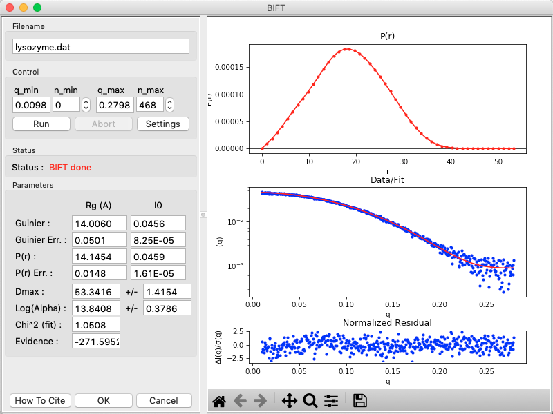
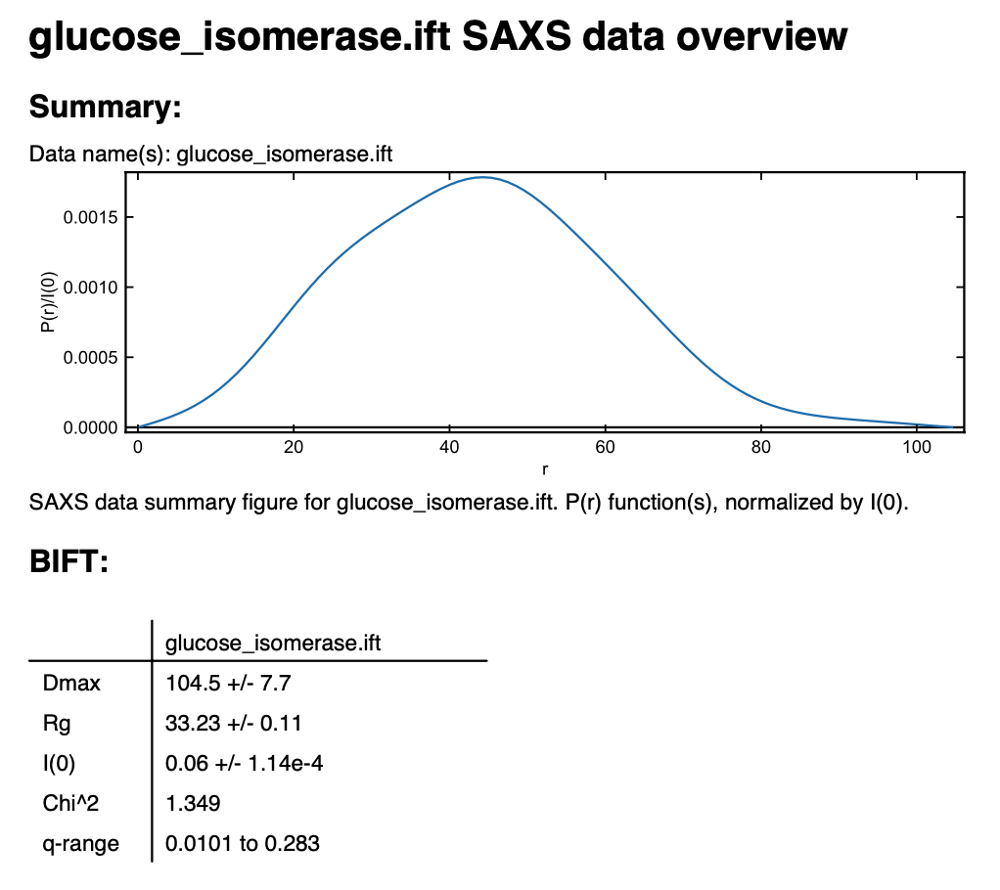

Pair-distance distribution analysis – BIFT in RAW
^^^^^^^^^^^^^^^^^^^^^^^^^^^^^^^^^^^^^^^^^^^^^^^^^^^^^^^^^
.. _bift_tutorial:

RAW has a built in method for determining the P(r) function using a Bayesian IFT method.
This has the advantage of only have one possible solution. More information on this method can
be found in the RAW paper and manual and references therein.

This tutorial covers how to use RAW for doing an IFT. This is not a tutorial
on basic principles and best practices for doing an IFT or analysis of the
resulting P(r) function. For that, please see the :ref:`SAXS tutorial <saxs_ift>`.

If you use RAW to run BIFT, in addition to citing the RAW paper, please
cite the BIFT paper: Hansen, S. Journal of Applied Crystallography (2000)
33, 1415-1421. DOI: `10.1107/S0021889800012930 <https://doi.org/10.1107/S0021889800012930>`_

A video version of this tutorial is available:

.. raw:: html

    
<iframe src='https://www.youtube.com/embed/Q0zCyjUJ35s' frameborder='0' allowfullscreen></iframe>

The written version of the tutorial follows.

#.  Right click on the glucose isomerase profile in the Profiles list you loaded
    :ref:`previously <s2p1>`. Select “IFT (BIFT)” from the resulting menu.

    |bift_panel_png|

#.  The BIFT panel has plots on the right. These show the P(r) function
    (top panel), the data (middle panel, blue points) and the fit line (middle
    panel, red line), and the fit residual (bottom panel).

#.  On the left of the BIFT panel are the controls and the resulting parameters. Note that
    in this case you do not control the |Dmax| value, the BIFT method finds that for you
    automatically. Because BIFT can take some time to run, if you change the
    *q* range for the data you have to click the 'Run' button to run BIFT again.

#.  Note that for this dataset, BIFT has found a |Dmax| value around 100,
    in good agreement with what we found from GNOM.

#.  Click OK to exit the BIFT window. This saves the results into the IFTs panel.

#.  Click on the IFTs Control and Plot tabs. This will display the BIFT output you just generated.
    Save the **glucose_isomerase.ift** item in the **reconstruction_data** folder.

#.  You can save the IFT in the pdf report that RAW can make. Right click on
    the **glucose_isomerase.ift** item in the IFT control panel and
    select "Save report". In the window that opens click "Save Report" and
    save the pdf report. If you open the report you will see a plot of the P(r)
    function and a summary of the run parameters and numerical results saved
    as a table.

    |bift_report_png|

*Note:* As of now, BIFT output from RAW is not compatible with DAMMIF or other ATSAS programs.
However, it is compatible with electron density determination via DENSS.

.. |Dmax| replace:: D\ :sub:`max`
