Theoretical profiles and fitting from models – CRYSOL in RAW
^^^^^^^^^^^^^^^^^^^^^^^^^^^^^^^^^^^^^^^^^^^^^^^^^^^^^^^^^^^^^^^
.. _crysol_tutorial:

One of the most useful things to do with SAXS data is to compare the data
against high resolution models (such as crystallography or CryoEM structures or
AlphaFold models). You can generate theoretical scattering profiles from
high resolution models, such as pdb models, independent of the experimental
data. You can also fit these generated theoretical scattering profiles against
the experimental SAXS data.

While it might seem that the most rigorous approach would be to generate a
theoretical profile independent of the experimental data, this 'minimal' approach
often fails to produce good fits even when the model and solution structure are
in good agreement. This is because there are contributions from the solvent,
particularly the hydration layer and the excluded volume, that are hard to model
and that most theoretical scattering profile calculators treat as fit parameters.
So to get the most accurate understanding of whether your model fits the data,
you should actually fit the data as part of the process of generating the
theoretical profile, rather than generating a 'minimal' theoretical profile
and comparing to the data.

One of the most common programs to generate theoretical scattering profiles
is the CRYSOL program in the ATSAS package. We will use RAW to run CRYSOL. Note
that you need :ref:`ATSAS installed <atsas>` to do this part of the tutorial.

If you use RAW to run CRYSOL, in addition to citing the RAW paper, please
cite the paper given in the `CRYSOL manual. <https://www.embl-hamburg.de/biosaxs/crysol.html>`_

The written version of the tutorial follows.

#.  The easiest way to generate a theoretical profile in RAW using CRYSOL
    is simply to plot a **.pdb** or **.cif** file. In the Files Control
    Panel go to the **theory_data** folder, select the **1XIB_4mer.pdb**
    and click the plot button.

#.  After the calculation is done, RAW will plot the theoretical profiles
    from CRYSOL on the profiles plot. You should see two profiles,
    **1XIB_4mer.abs** and **1XIB_4mer.int**

    *   *Note:* The difference between **.abs** and **.int** results from CRYSOL
        is simply the overall scale factor. The **.abs** is on an absolute
        scale of 1/(cm*(mg/ml)), while **.int** is on an arbitrary scale.
        Generally **.abs** is probably more useful, since many beamlines
        calibrate their experimental data to an absolute scale, so this result
        will be relatively close in overall scale to what you measure.

    |theory_crysol_load_model_png|

#.  You can also generate a theoretical profile using the CRYSOL window in RAW.
    This gives you more control over the parameters used to generate the profile,
    using the plot button simply uses the default parameters. Select the
    "Tools->ATSAS->CRYSOL" menu option to open the CRYSOL window.

    |theory_crysol_menu_png|

#.  In the CRYSOL window, in the models section use the Add button to add
    the **1XIB_4mer.pdb** file to the list of models to calculate a theoretical
    profile from.

    |theory_crysol_model_add_png|

#.  Click the "Start" button to calculate the theoretical scattering profile
    for the model.

    *   *Note:* The Status will change to "Running calculation" while running
        and then to "Finished calculation" when finished.

    |theory_crysol_start_png|

#.  After the calculation finishes, the theoretical profile will display in the
    plot on the right side of the window, and parameters from the profile will
    be shown in the list at the bottom right of the window.

    *   *Note:* Not all parameters will display. The Data, Chi^2, and Prob.
        fields are only calculated if the model is fit to data.

    |theory_crysol_results1_png|

#.  The CRYSOL window can also be used to fit the model against experimental
    data. Go back to the Files Control Panel and load in the **glucose_isomerase.dat**
    data. Return to the CRYSOL window. In the Experimental data section use the
    Add button, check the **glocuse_isomerase.dat** item in the dialog that
    appears, and then click OK to add the **glucose_isomerase.dat** experimental data to the
    list of data you can fit a model against.

    *   *Note:* Only data that is loaded into RAW can be added to the CRYSOL
        experimental data list.

    |theory_crysol_data_add_png|

#.  Click the Start button to calculate the theoretical scattering profile and
    fit it to the data. After the calculation finishes you'll see both the
    theoretical profile, the data, and the uncertainty normalized residual
    plotted in the right plot, as well as the parameters from the theoretical
    profile in the list at the bottom right.

    *   *Note:* This will now have all parameters, including the Data, Chi^2, and
        Prob. fields that were missing when you calculated a theoretical profile
        without fitting.

    |theory_crysol_results2_png|

#.  Click the OK button to close the CRYSOL window and send the calculated
    theoretical scattering profile to the Profiles plot. It will appear as
    **1XIB_4mer_glucose_isomerase_FIT** in the Profiles Control Panel.

#.  You can also load more than one model and/or profile into the CRYSOL window
    to calculate multiple profiles at once. Load the **polymerase.dat**
    experimental data into RAW. Select both the polymerase and GI profiles in the
    Profiles Control Panel, right click on the **polymerase.dat** profile and select
    "Other Analysis->Fit Model (CRYSOL)". This will open the CRYSOL window with
    the selected profiles already loaded in the Experimental Data section.

    |theory_crysol_right_click_png|

#.  Add the **1XIB_4mer.pdb** (GI) and **2pol.cif** (polymerase) models to the
    CRYSOL model section.

#.  Uncheck the **2pol.pdb** model in the Models list. Only items that are checked
    are used for calculation, so this will let you fit just the **1XIB_4mer.cif**
    model.

    |theory_crysol_model_select_png|

#.  Click the Start button to fit the **1XIB_4mer.cif** model against both experimental
    profiles. After the calculation finishes you'll see both experimental profiles and the
    theoretical profile fit to both measured profiles.

    *   *Question:* Which dataset does the model fit better?

    *   *Try:* Turn off the 1XIB_4mer model and turn on the 2pol model and see
        how that fits both profiles.

    |theory_crysol_results3_png|

#.  You can also fit multiple models against a single profile. Check both
    the **1XIB_4mer.pdb** and **2pol.cif** entries in the models list
    and uncheck the **glucose_isomerase.dat** experimental data.

    |theory_crysol_data_select_png|

#.  Click the Start button to fit both models against the polymerase data.

    *   *Question:* Which model fits the profile better?

    *   *Try:*  Turn off the polymerase profile and turn on the GI profile
        and see how each model fits that data.

    *   *Tip:* You can also calculate the theoretical scattering profile from
        multiple models without fitting against data. To do this, uncheck all the
        data items and calculate the 'minimal' theoretical profiles.

    |theory_crysol_results4_png|

#.  You can fit multiple models against multiple profiles. Check both models
    and both experimental profiles. Click the start button to fit both models
    against both experimental profiles.

#.  You can export the values in the results table to a csv file. Right click
    on the table and select Export Data. Save the .csv file in the **theory_data**
    folder.

    *   *Try:* Open the .csv file in Excel or another spreadsheet program.

    |theory_crysol_export_data_png|

#.  Click OK to close the CRYSOL window and send all the fits to the Profiles
    plot and control panel.

#.  You can also adjust the settings for running CRYSOL from the CRYSOL
    window. We'll do that using some example data. Load the **SASDP43.dat**
    experimental data into RAW.

    *   *Note:* This dataset is from the `SASDP43 entry in the SASBDB
        <https://www.sasbdb.org/data/SASDP43/>`_

#.  Open a CRYSOL window and add the **Brpt55_M_Zn.pdb** model and the
    **SASDP43.dat** data.

#.  Run the CRYSOL fitting with the default settings.

#.  Open a second CRYSOL window and add the same model and data to it.
    Set the harmonics to 100. Run the CRYSOL fitting with these updated settings.

    |theory_crysol_harmonics_png|

#.  You should see that the result using 100 harmonics is a better fit than the
    result using the default harmonics.

    *   *Note:* More harmonics are necessary to get accurate theoretical profiles
        from high aspect ratio objects. This protein happens to be a long thin
        rod, so using more harmonics is helpful here. For something globular, like
        GI, it should make little or no difference. You can test this yourself
        using the tutorial data.

    |theory_crysol_results5_png|

#.  There are also a number of advanced settings you can set. Expand the
    Advanced Setting section and (if necessary) scroll down to see the
    different options. The settings are explained in detail in the CRYSOL
    manual.

    *   *Note:* Common settings to change are the solvent density and contrast
        (requires turning off the "Fit solvent" option).

    *   *Tip:* If you need all the CRYSOL outputs (such as the .log and .alm files)
        you can check the "Save all outputs to folder" option and provide
        a folder to save to by clicking the "..." button after the "Save to" field.

    |theory_crysol_settings_png|

#.  Close the CRYSOL windows with the OK button to save the fit results to
    the Profiles plot and control panel.

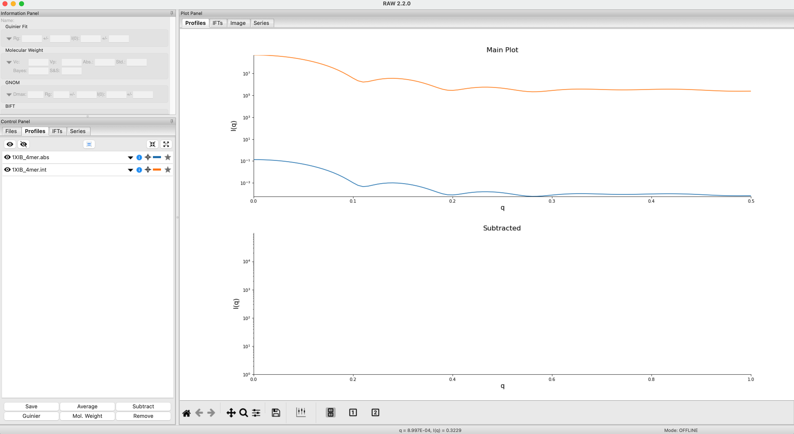

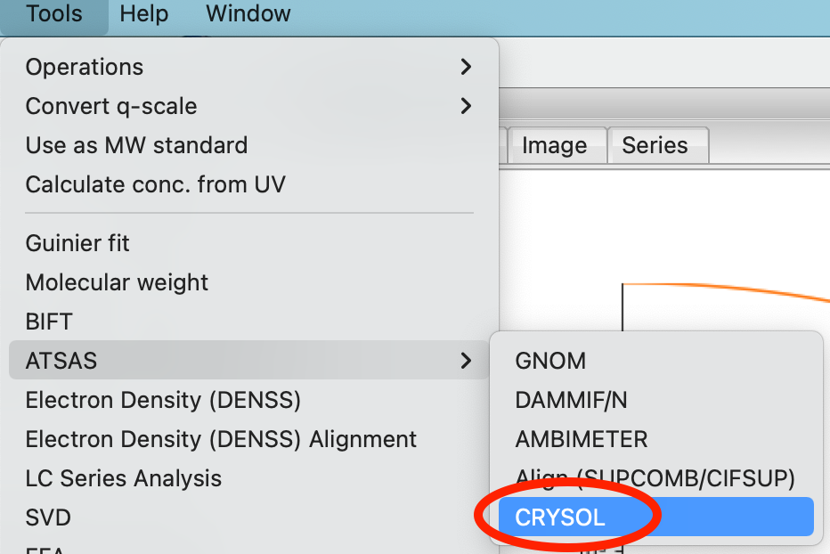

.. |theory_crysol_model_add_png| image:: images/theory_crysol_model_add.png
    :target: ../_images/theory_crysol_model_add.png

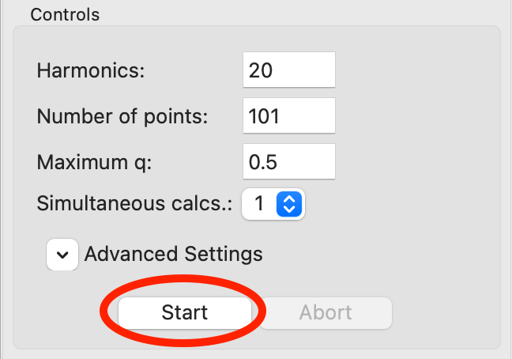

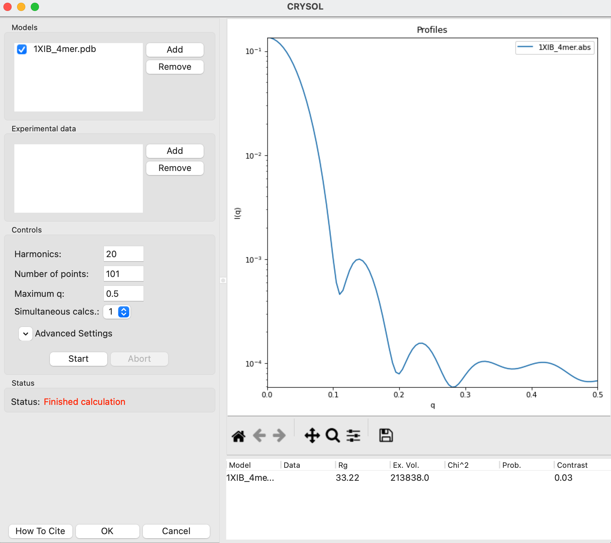

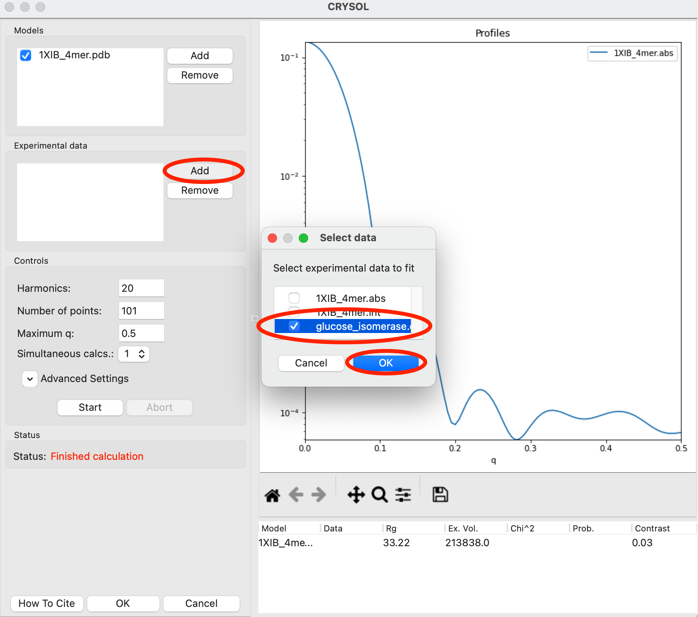

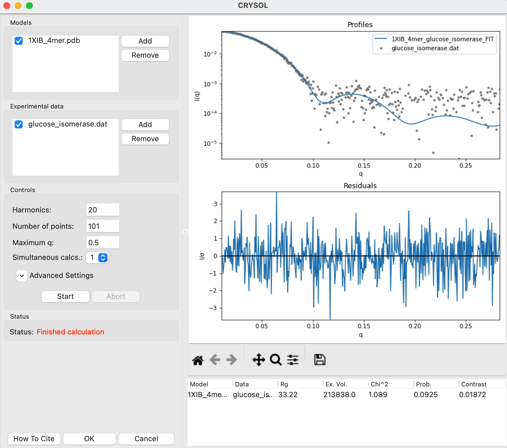

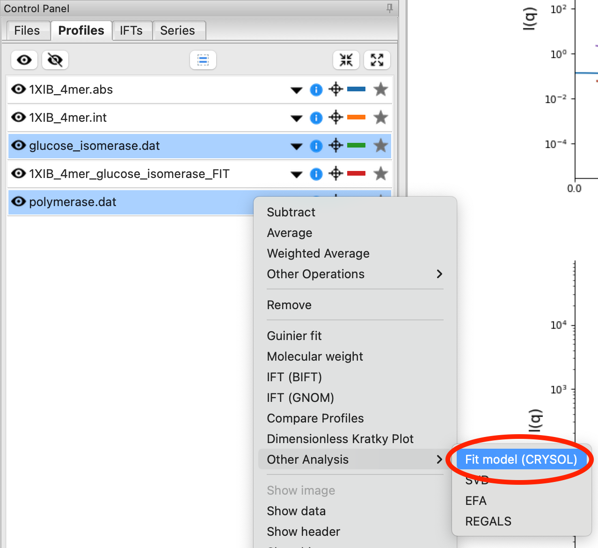

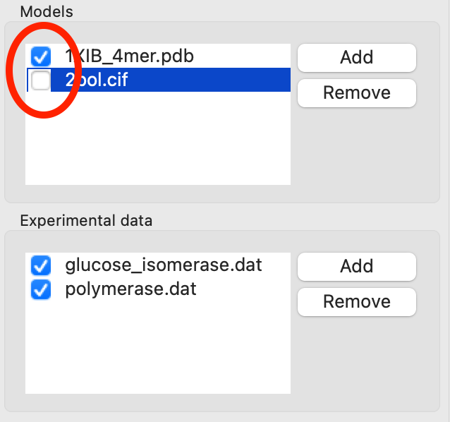

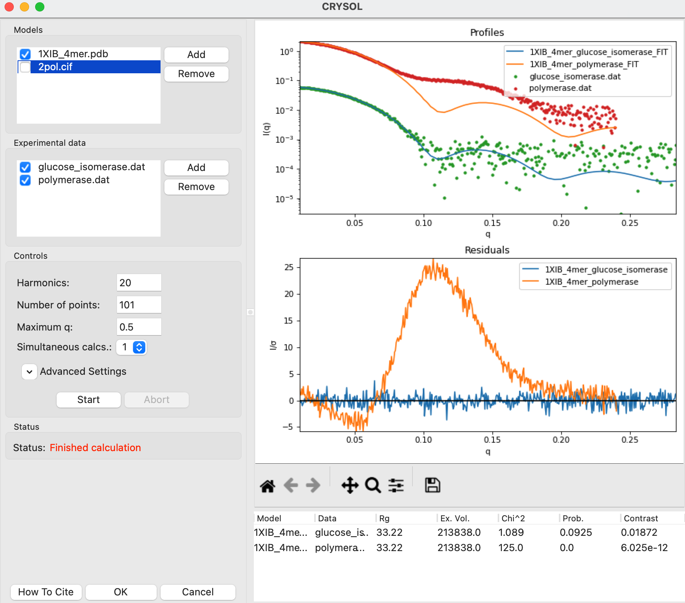

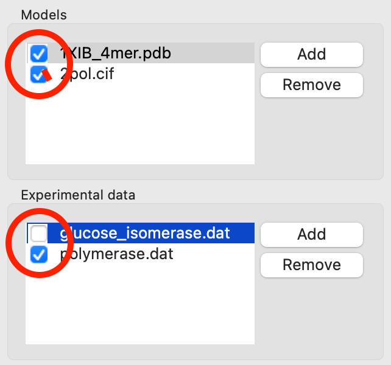

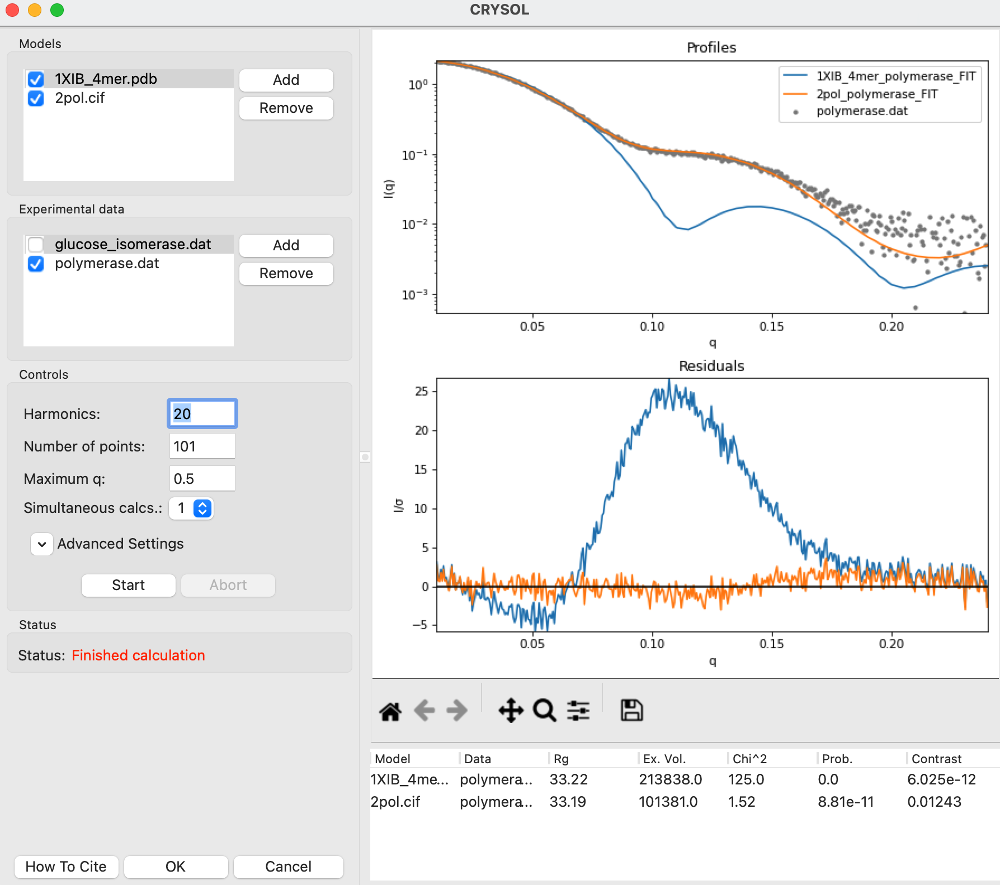

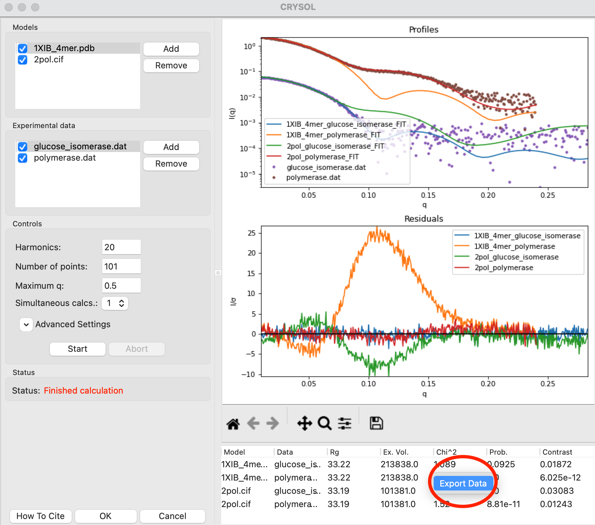

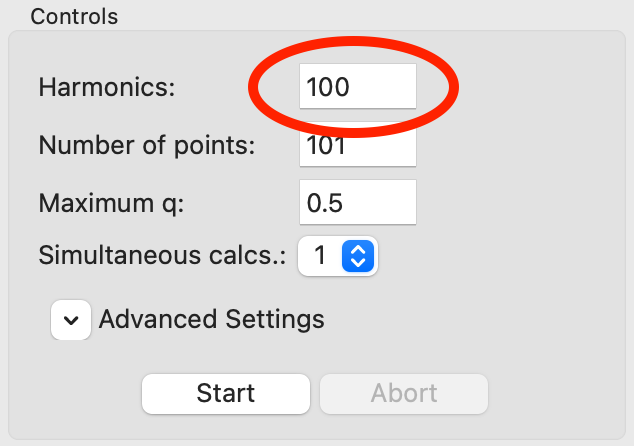

.. |theory_crysol_results5_png| image:: images/theory_crysol_results5.png
    :target: ../_images/theory_crysol_results5.png

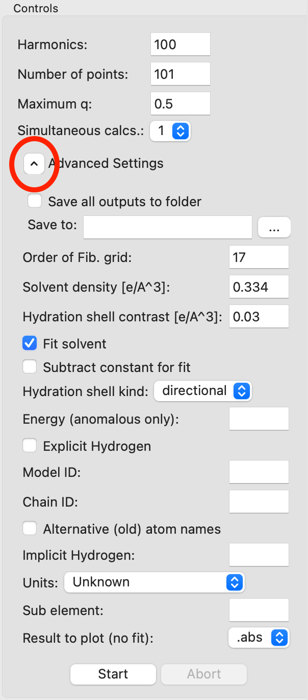
