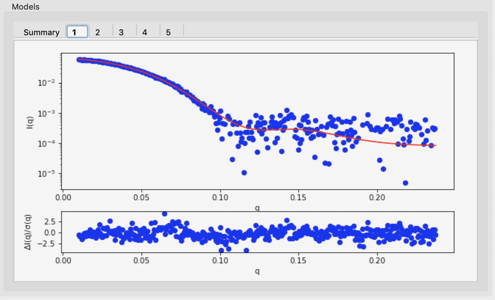

3D reconstruction with bead models – DAMMIF/N and DAMAVER in RAW
^^^^^^^^^^^^^^^^^^^^^^^^^^^^^^^^^^^^^^^^^^^^^^^^^^^^^^^^^^^^^^^^^^^^^^^^^^
.. _dammif:

Shape reconstruction in SAXS is typically done using bead models (also called dummy atom models,
or DAMs). The most common program used to generate these shapes is DAMMIF (and, to a lesser
degree, DAMMIN) from the ATSAS package. We will use RAW to run DAMMIF/N. Because the shape
reconstruction is not unique, a number of distinct reconstructions are generated, and then a
consensus shape is made from the average of these reconstructions. The program DAMAVER from
the ATSAS package is the most commonly used program for building consensus shapes. Note that you need
:ref:`ATSAS installed <atsas>` to do this part of the tutorial.

This is not a tutorial on basic principles and best practices for doing bead
model reconstructions. For that, please see the :ref:`SAXS tutorial <saxs_bead_models>`.

If you use RAW to run DAMMIF or associated programs, in addition to citing the
RAW paper, please cite the papers given in the:

    *    `DAMMIF manual <https://www.embl-hamburg.de/biosaxs/manuals/dammif.html>`_
    *    `DAMMIN manual <https://www.embl-hamburg.de/biosaxs/manuals/dammin.html>`_
    *    `DAMAVER manual <https://www.embl-hamburg.de/biosaxs/manuals/damaver.html>`_
    *    `DAMCLUST manual <https://www.embl-hamburg.de/biosaxs/manuals/damclust.html>`_
    *    `SASRES manual <https://www.embl-hamburg.de/biosaxs/manuals/sasres.html>`_
    *    `SUPCOMB manual <https://www.embl-hamburg.de/biosaxs/manuals/supcomb.html>`_

as appropriate

A video version of this tutorial is available:

.. raw:: html

    
<iframe src='https://www.youtube.com/embed/umxeTsgYg58' frameborder='0' allowfullscreen></iframe>

The written version of the tutorial follows.

#.  Clear all of the data in RAW. Load the **glucose_isomerase.out** file that you saved in the
    **reconstruction_data** folder in a previous part of the tutorial.

    *   *Note:* If you haven’t done the previous part of the tutorial, or forgot to save
        the results, you can find the **glucose_isomerase.out** file in the
        **reconstruction_data/gi_complete** folder.

#.  Right click on the **glucose_isomerase.out** item in the IFT list. Select the “Bead Model (DAMMIF/N)” option.

#.  Running DAMMIF generates a lot of files. Click the “Select” button for the output directory,
    make a new folder in the **reconstruction_data** directory called **gi_dammif** and select
    that folder.

#.  Change the number of reconstructions to 5.

    *   *Note:* It is generally recommended that you do 15-20 reconstructions. However,
        for the purposes of this tutorial, 5 are enough.

    *   *Note:* For final reconstructions for a paper, DAMMIF should be run in Slow mode.
        For this tutorial, or for obtaining an initial quick look at results, Fast mode is fine.

#. Uncheck the "Refine average with dammin" checkbox.

    *   *Note:* For final reconstructions for a paper, DAMMIN refinement should be done. However, it
        is quite slow, so for the purposes of this tutorial we won't do it.

#.  If it's not already checked, check the "Align and cluster envelopes (damclust)"
    checkbox.

#.  RAW can align the DAMMIF/N output with a PDB structure using SUPCOMB from the
    ATSAS package. To do so, check the 'Align output to PDB' box and select
    the **1XIB_4mer.pdb** file in the **reconstruction_data/gi_complete** folder.

    *   *Tip:* If you're not sure if you selected the correct file, hovering
        your mouse over the filename will show the full path to the file.

    |dammif_run_tab_png|

#.  Click the “Start” button.

    *   *Note:* The status panel will show you the overall status of the reconstructions.
        You can look at the detailed status of each run by clicking the appropriate tab in
        the log panel.

#.  Note that by default the envelopes are aligned and averaged using DAMAVER, and then the
    aligned and averaged profile is refined using DAMMIN. Clustering analysis is also
    done by default.

    *   Some settings are accessible in the panel, and all settings can be changed in the
        advanced settings panel.

#.  Wait for all of the DAMMIF runs, DAMAVER, DAMCLUST, and alignment to finish.
    Depending on the speed of your computer this could take a bit.

#.  Once the reconstructions are finished, the window should automatically switch to the
    results tab. If it doesn’t, click on the results tab.

    |dammif_results_png|

#.  The results panel summarizes the results of the reconstruction run. At the top of the
    panel there is the AMBIMETER evaluation of how ambiguous the reconstructions might be
    (see previous tutorial section). If DAMAVER was run, there are results from the normalized
    spatial discrepancy (NSD), showing the mean and standard deviation of the NSD, as well as
    how many of the reconstructions were included in the average. If DAMAVER was run on 3 or
    more reconstructions, and ATSAS >=2.8.0 is installed, there will be the output of SASRES
    which provides information on the resolution of the reconstruction. If DAMCLUST was run
    the number of clusters, information on each cluster, and the distance between each
    cluster is shown.

#.  Information on each individual model is shown at the bottom. The summary tab
    gives the model chi squared, |Rg|, |Dmax|, excluded volume, molecular
    weight estimated from the excluded volume, and, if appropriate, mean NSD
    of the model.

    *   Any models rejected from the average by DAMAVER will be shown in red in
        the summary tab list.

    *   *Tip:* The model highlighted in blue in the summary tab is the 'most
        probable' model, this can be used as your final bead model instead of
        doing a dammin refinement.

#.  Also, each individual model has a tab which shows the data, the model fit,
    and the residuals.

    |dammif_results_fit_png|

#.  The results summary shown in Summary tab is automatically saved as a
    **<prefix>_dammif_results.csv** csv file, e.g. for this data as
    **glucose_isomerase_dammif_results.csv**. All the plots shown on the individual model
    tabs are automatically saved as a multi-page pdf file with the same name.

#.  Click on the Viewer tab to open the model viewer.

    *   *Note:* The model viewer is intended for a fast first look at the results. It is
        not currently up to the standards of a program like pyMOL.

    |dammif_viewer_png|

#.  Click and drag the model to spin it.

    *   Note: For glucose isomerase, it should look more or less like a flattened sphere.

#.   Right click and drag the model to zoom in and out.

#.  Use the “Model to display” menu in the Viewer Controls box to change which
    reconstruction is displayed.

#.  Click the “Close” button when you are finished looking at the results and reconstructions.

#.  The results from individual DAMMIF runs are saved in the selected output folder
    with the name **<prefix>_xx**, where *xx* is the run number: 01, 02, etc. For
    this tutorial, that would be **glucose_isomerase_01**, **glucose_isomerase_02**, and so on. The
    different files produced are described in the `DAMMIF manual <https://www.embl-hamburg.de/biosaxs/manuals/dammif.html#output>`_.

    *   *Note:* Generally, the file of interest is the **-1.pdb** file, in this case
        **glucose_isomerase_01-1.pdb**, **glucose_isomerase_02-1.pdb**, etc.

#.  If averaging was done with DAMAVER, the results are saved in the selected output
    folder with the given prefix, in this case **glucose_isomerase**. The output
    files generated are described in the `DAMAVER manual <https://www.embl-hamburg.de/biosaxs/manuals/damaver.html>`_.

    *   *Note:* Generally, the files of interest are the generated pdbs:
        **<prefix>_damaver.pdb** and **<prefix>_damfilt.pdb**. For this tutorial, those
        would be **glucose_isomerase_damaver.pdb** and **glucose_isomerase_damfilt.pdb**.

#.  If clustering was done with DAMCLUST, the results are saved in the selected output
    folder with the given prefix (for this tutorial, **glucose_isomerase**). The files generated
    are described in the `DAMCLUST manual <https://www.embl-hamburg.de/biosaxs/manuals/damclust.html#output>`_.

#.  If refinement was done with DAMMIN, the results are saved in the selected output
    folder as **refine_<prefix>**, e.g. for this tutorial **refine_glucose_isomerase**. The files
    generated are described in the `DAMMIN manual <https://www.embl-hamburg.de/biosaxs/manuals/dammin.html#output>`_.

    *   *Note:* Generally, the file of interest is the **-1.pdb** file, in this case
        **refine_glucose_isomerase-1.pdb**.

#.  If alignment to a reference PDB was done with SUPCOMB, the files aligned
    depend on what other processing was done.

    *   If refinement was done, then there will be a single file named
        **refine_<prefilx>_-1_aligned.pdb**. For this tutorial,
        **refine_glucose_isomerase-1_aligned.pdb**.

    *   If no refinement is done but averaging is done, then the
        damaver and damfilt results are aligned, as well as the most
        probable model (the blue highlighted model in the summary panel).
        The associated filenames would be **<prefix>_damaver_aligned.pdb**,
        **<prefix>_damfilt_aligned.pdb**, and **<prefix>_##_-1_aligned.pdb**
        where ## is the model number of the most probable model. For
        this tutorial, **glucose_isomerase_damaver_aligned.pdb**,
        **glucose_isomerase_damfilt_aligned.pdb**, and
        **glucose_isomerase_##-1_aligned.pdb**.

    *   If no refinement is done but clustering is done, then the representative
        models of each cluster is aligned. The associated filenames would be
        **<prefix>_##-1_aligned.pdb** where ## is the model number of the
        representative model. For this tutorial, that is
        **glucose_isomerase_##-1_aligned.pdb**.

    *   If no refinement, averaging, or clustering is done, then every calculated
        model is aligned. The associated filenames would be
        **<prefix>_##-1_aligned.pdb** where ## is the model number of a model.
        For this tutorial, that is **glucose_isomerase_##-1_aligned.pdb**.

.. |dammif_run_tab_png| image:: images/dammif_run_tab.png
    :target: ../_images/dammif_run_tab.png

.. |dammif_results_png| image:: images/dammif_results.png
    :target: ../_images/dammif_results.png

.. |dammif_viewer_png| image:: images/dammif_viewer.png
    :target: ../_images/dammif_viewer.png

.. |Rg| replace:: R\ :sub:`g`

.. |Dmax| replace:: D\ :sub:`max`
