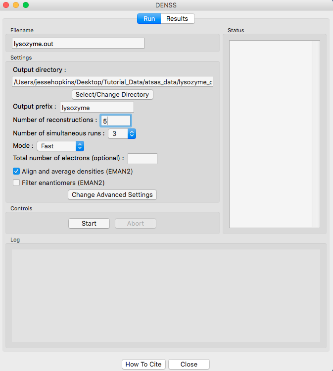
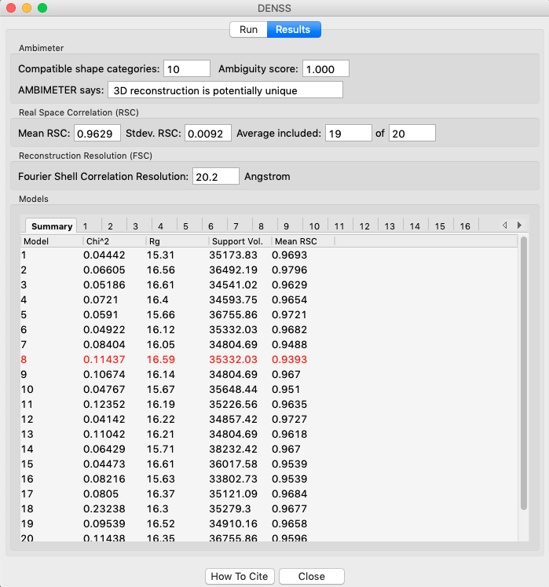
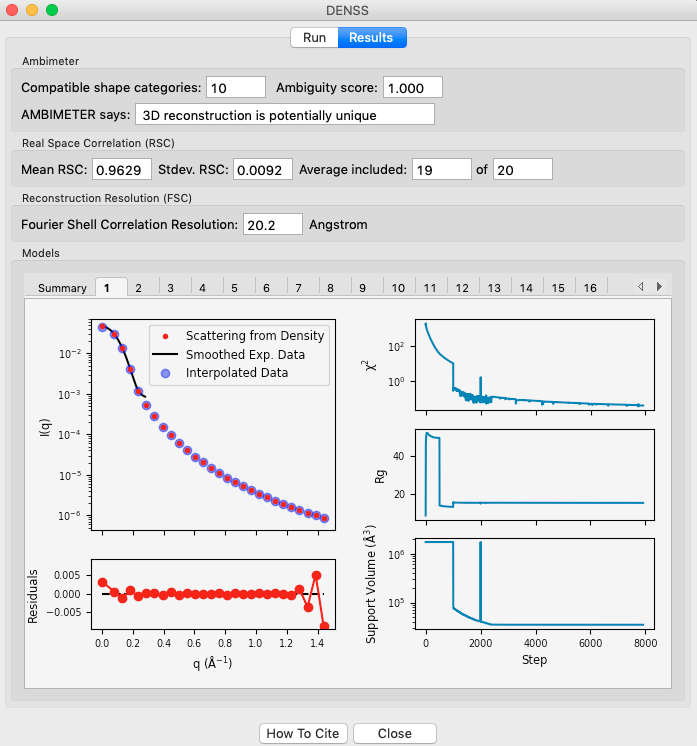
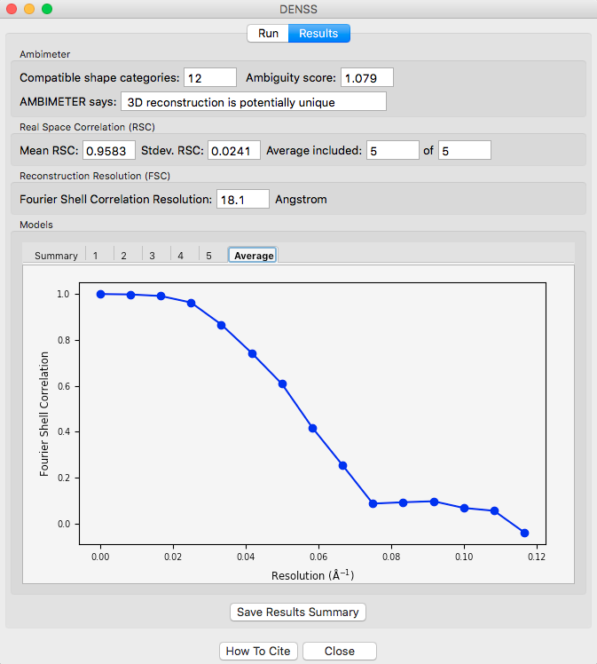

3D reconstruction with electron density – DENSS in RAW
^^^^^^^^^^^^^^^^^^^^^^^^^^^^^^^^^^^^^^^^^^^^^^^^^^^^^^^^^^^^^^^^^^^^^^^^^^
.. _denss_s2:

A new, exciting method for doing 3D shape reconstructions in SAXS yields actual
electron density, rather than bead models. There are many potential advantages to this,
but one significant one is easy handling of systems like RNA-Protein complexes or
membrane proteins surrounded by lipids or detergents, which have more than one electron
density. Bead models typically only have two (molecule and solvent) or three bead densities,
and so typically fail to reconstruct these complex objects. `DENSS <http://denss.org>`_ has
been fully implemented in RAW and will be used to reconstruct these electron densities.

If you use DENSS in RAW, in addition to citing the RAW paper, please cite the
DENSS paper: T. D. Grant. Nature Methods (2018) 15, 191–193.
DOI: `10.1038/nmeth.4581 <https://doi.org/10.1038/nmeth.4581>`_

A video version of this tutorial is available:

.. raw:: html

    
<iframe src='https://www.youtube.com/embed/BepDKkGXM6Q' frameborder='0' allowfullscreen></iframe>

The written version of the tutorial follows.

#.  Clear all of the data in RAW. Load the **glucose_isomerase.ift** file that you saved in the
    **reconstruction_data** folder in a previous part of the tutorial.

    *   *Note:* If you haven’t done the previous part of the tutorial, or forgot to save
        the results, you can find the **glucose_isomerase.ift** file in the
        **reconstruction_data/gi_complete** folder.

    *   *Note:* You could run DENSS on the **glucose_isomerase.out** file that you used
        for :ref:`dammif <dammif>`. However, that profile was truncated to a maximum
        q value of 8/Rg, ~0.23. For DENSS you want to use the full q range of the data. As the
        .ift file was generated using all the q range available, it is convenient to
        use it rather than generating another .out file.

#.  Right click on the **glucose_isomerase.ift** item in the IFT list. Select the “Electron Density (DENSS)” option.

#.  Running DENSS generates a lot of files. Click the “Select” button for the output directory,
    make a new folder in the **reconstruction_data** directory called **gi_denss** and select
    that folder.

#.  Change the number of reconstructions to 5 and the mode to Fast.

    *   *Note:* It is generally recommended that you do at least 20 reconstructions. However,
        for the purposes of this tutorial, 5 are enough.

    *   *Note:* For final reconstructions for a paper, DENSS should be run in Slow mode.
        For this tutorial, or for obtaining an initial quick look at results, Fast mode is fine.

#.  RAW can align the DENSS output with a PDB structure. To do so, check the
    Align output to PDB/MRC' box and select the **1XIB_4mer.pdb** file in
    the **reconstruction_data/gi_complete** folder.

    *   *Tip:* If you're not sure if you selected the correct file, hovering
        your mouse over the filename will show the full path to the file.

    |denss_run_tab_png|

#.  Click the “Start” button.

    *   *Note:* The status panel will show you the overall status of the reconstructions.
        You can look at the detailed status of each run by clicking the appropriate tab in
        the log panel.

#.  Note that by default the densities are aligned and averaged, including enantiomer
    filtering, and a refined density is created from the average.

#.  Wait for all of the DENSS runs and averaging to finish. Depending
    on the speed of your computer this could take a bit.

#.  Once the reconstructions are finished, the window should automatically switch to the
    results tab. If it doesn’t, click on the results tab.

    |denss_results_tab_png|

#.  The results panel summarizes the results of the reconstruction runs. If you are using
    a .out file, then at the top of the panel there is the ambimeter evaluation of
    how ambiguous the reconstructions might be (see earlier tutorial section).
    If averaging was run there is an estimate of the
    reconstruction resolution based on the Fourier shell correlation. In the models
    section there are several tabs. The summary tab shows the chi^2, |Rg|, support volume,
    and RSC to the reference model. If any model was not included in the averaging it
    is highlighted in red.

    *   Verify that the Rg is close to the expected value, and that the chi^2 and support
        volumes are relatively consistent between models.

    *   *Note:* Above we show the results for 20 runs instead of the 5 in the tutorial.

#.  Individual model results are displayed in the numbered tabs. For each individual
    model there are plots of: the original data and the model data (scattering from density);
    the residual between the original data and the model data; and chi squared, |Rg| and support volume
    vs. refinement step.

    *   Verify that the residual between the actual data and the model data is small.

    *   Check that the chi squared, |Rg|, and support volume have all plateaued (converged)
        by the final steps.

    |denss_model_tab_png|

#.  If the densities were averaged, the average tab will display the Fourier shell correlation
    vs. resolution.

    *   *Note:* The reconstruction resolution is taken as the resolution in angstroms where the
        correlation first crosses 0.5.

    |denss_fsc_png|

#.  The results summary shown in Summary tab is automatically saved as a
    **<prefix>_denss_results.csv** csv file, e.g. for this data as
    **glucose_isomerase_denss_results.csv**. All the plots shown on the individual model
    tabs are automatically saved as a multi-page pdf file with the same name.

#.  Click the “Close” button when you are finished looking at the results and reconstructions.

#.  The results from the individual DENSS runs are saved in the selected output folder as
    **<prefix>_xx.mrc** where *xx* corresponds to the run number: 01, 02, etc. For this
    tutorial that would be **glucose_isomerase_01.mrc**, **glucose_isomerase_02.mrc**, etc.

#.  If averaging was done, final average density is saved in the selected output
    folder as **<prefix>_aver.mrc**. For this tutorial, that would be **glucose_isomerase_aver.mrc**.

#.  If refinement was done, the final refined density is saved in the selected
    output folder as **<prefix>_refine.mrc**. For this tutorial that would be
    **glucose_isomerase_refine.mrc**.

#.  If alignment to a reference model was done, the files aligned
    depend on what other processing was done.

    *   If refinement was done, then there will be a single file named
        **<prefix>_refine_aligned.mrc**. For this tutorial,
        **glucose_isomerase_refine_aligned.mrc**.

    *   If no refinement is done but averaging is done, then the
        averaged model is aligned. The associated filenames would
        be **<prefix>_average_aligned.mrc**. For this tutorial,
        **glucose_isomerase_averaged_aligned.mrc**.

    *   If no refinement or averaging is done, then every calculated
        model is aligned. The associated filenames would be
        **<prefix>_##_aligned.mrc** where ## is the model number of a model.
        For this tutorial, that is **glucose_isomerase_##_aligned.mrc**.

*Note:* **.mrc** files can be opened in Chimera and pyMOL. For tips about how to
visualize the density and align it with known structures see the appropriate
sections here: `http://www.tdgrant.com/denss/tips/ <http://www.tdgrant.com/denss/tips/>`_.

.. |Rg| replace:: R\ :sub:`g`
