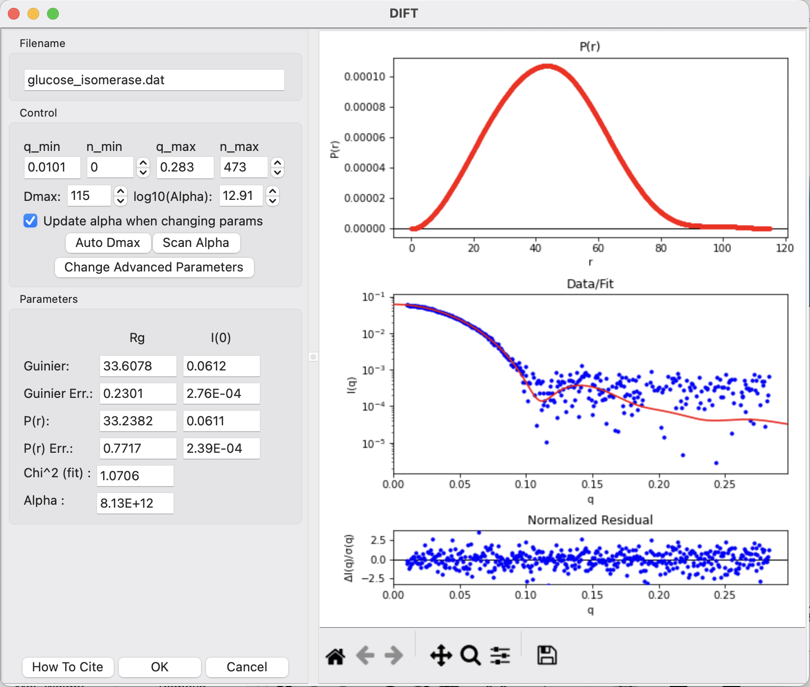
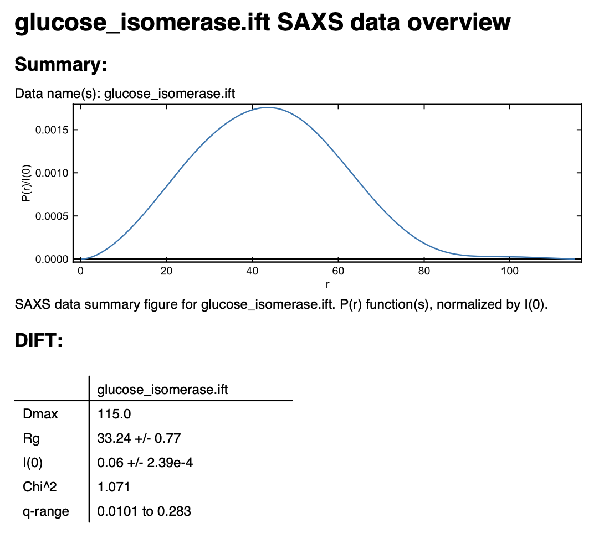

Pair-distance distribution analysis – DIFT (DENSS IFT) in RAW
^^^^^^^^^^^^^^^^^^^^^^^^^^^^^^^^^^^^^^^^^^^^^^^^^^^^^^^^^
.. _dift_tutorial:

The first step in most advanced data processing is to calculate the P(r) function, the
Fourier transform of I(q). This cannot be calculated directly from the scattering profile, so
indirect Fourier transform (IFT) methods are typically used. In addition to GNOM and BIFT, 
RAW has another built-in method for calculating the P(r) curve called DIFT. DIFT is the IFT 
calculator from DENSS. It is the same algorithm used in the DENSS command line tool *denss.fit_data.py*. 
DIFT is built into RAW in python and does not require a separate installation of DENSS. 
DIFT works similarly to GNOM, allowing automatic or manual selection of Dmax and alpha, 
though there are important differences described below. 

This tutorial covers how to use RAW for doing an IFT. This is not a tutorial
on basic principles and best practices for doing an IFT or analysis of the
resulting P(r) function. For that, please see the :ref:`SAXS tutorial <saxs_ift>`.

If you use RAW to run DIFT, in addition to citing the RAW paper, please
cite the DIFT paper `here. <https://journals.iucr.org/j/issues/2022/05/00/vg5144/>`_

The written version of the tutorial follows.

#.  Right click on the glucose isomerase profile in the Profiles list you loaded
    :ref:`previously <s2p1>`. Select “IFT (DENSS)” from the resulting menu.

    *   *Note:* RAW will automatically try to find an appropriate maximum dimension (|Dmax|) and 
        smoothing parameter (alpha).

    |dift_panel_png|

#.  The DIFT panel has plots on the right. These show the P(r) function
    (top panel), the data (middle panel, blue points) and the fit line (middle
    panel, red line), and the fit residual (bottom panel).

#.  On the left of the DIFT panel are the controls and the resulting parameters. You can alter
    the data range used, the |Dmax| value, and the alpha value used.

    *   *Note:* Unlike GNOM, in DIFT you cannot select/deselect forcing P(r=0) or P(r=|Dmax|) to zero. 
        They are mathematically restricted to zero already.

    *   *Tip:* The Guinier and P(r) |Rg| and I(0) values should agree well for
        mostly rigid particles. Unlike GNOM, there is no “Total Estimate” for DIFT.

#.  Try varying the |Dmax| value up and down in the range of 80-120. Observe what
    happens to the P(r) and the quality of the solution.

    *   *Note:* |Dmax| is in units of Å.

#.  Return the |Dmax| value to that found by RAW by clicking the "Auto Dmax" button.
    |Dmax| should be 115. 

#.  By default, DIFT will scan a wide range of alpha values and automatically select the optimal 
    value (the highest alpha yielding a good fit). Too large of an alpha will cause oversmoothing 
    of the P(r) curve and a poor fit of the I(q) curve. Too small of an alpha will cause ripples 
    in the P(r) curve.

    *   *Try:* Vary alpha and monitor the effect on P(r) smoothness and fit of I(q)

#.  Click Scan Alpha to automatically determine alpha again. Note that you can select a different 
    Dmax and select Scan Alpha, which will likely return a different alpha. In contrast, the 
    Auto Dmax button is not affected by alpha.

    *   *Note:* Alpha can be a very wide range of values (Scan Alpha scans through 40 orders of
        magnitude). To make selecting alpha easier, the log10(alpha) is used to set the alpha 
        in the input instead of alpha itself.

    *   *Tip:* If you find the automatic selection of alpha slow, uncheck the "Update alpha when
        changing params" checkbox to avoid recalculating alpha whenever you change a setting. 
        You can always manually click Scan Alpha when desired.

#.  Click "OK" to exit the panel and save the IFT to the RAW IFTs panel and plot.

    *   *Tip:* After exiting the IFT panel, note that data from the IFT shows
        up in the Information panel.

#.  Click on the IFTs Control and Plot tabs. This will display the DIFT output you just generated.
    Save the **glucose_isomerase.ift** item in the **reconstruction_data** folder.

    *   *Note:* This saved file is the same format as the BIFT .ift file.

#.  You can save the IFT in the pdf report that RAW can make. Right click on
    the **glucose_isomerase.ift** item in the IFT control panel and
    select "Save report". In the window that opens click "Save Report" and
    save the pdf report. If you open the report you will see a plot of the P(r)
    function and a summary of the run parameters and numerical results saved
    as a table.

    *   *Try:* Save both the GI profile and the IFT in the same report.

    |dift_report_png|

.. |Rg| replace:: R\ :sub:`g`

.. |Dmax| replace:: D\ :sub:`max`
