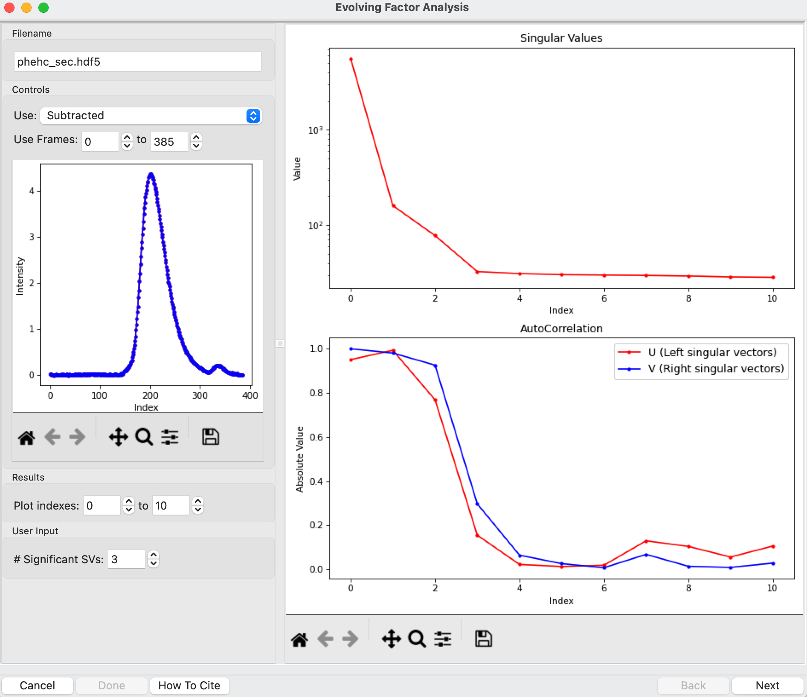
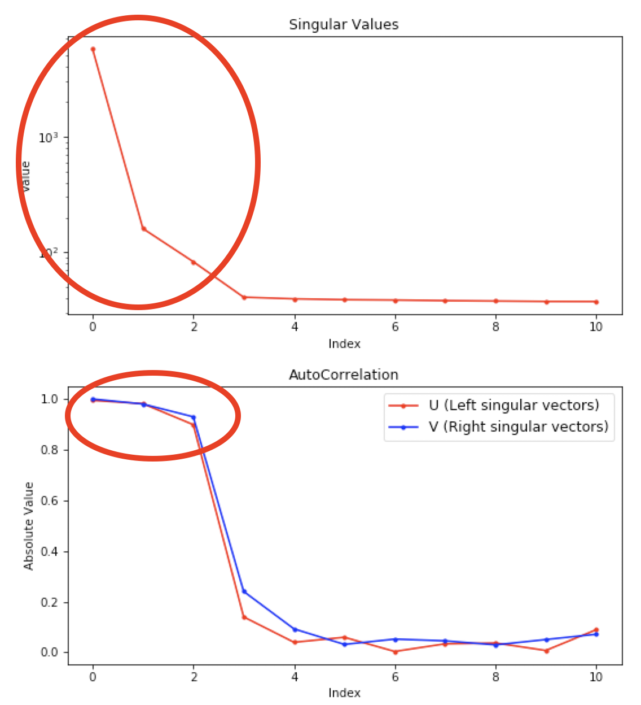
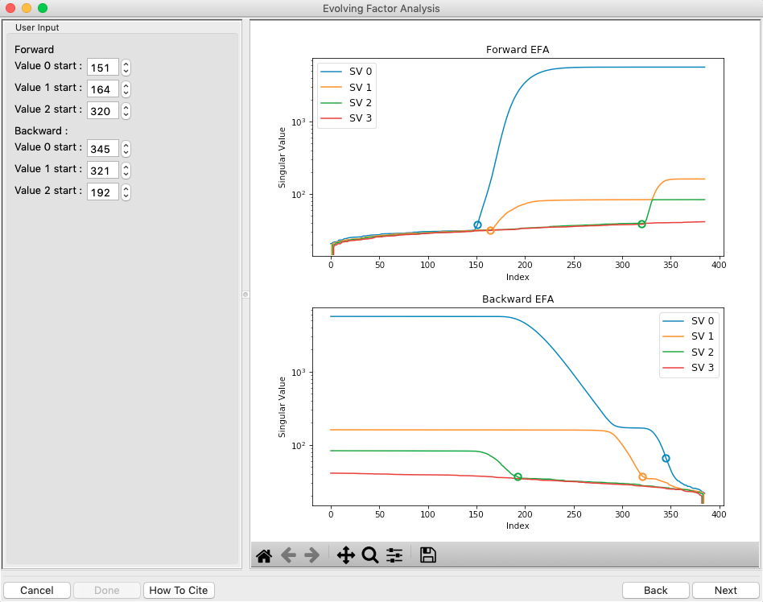
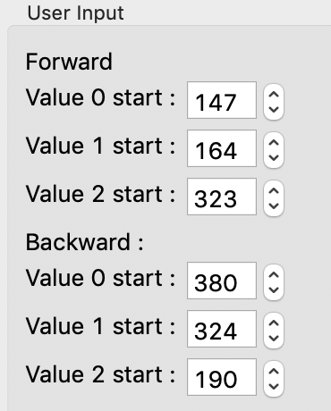
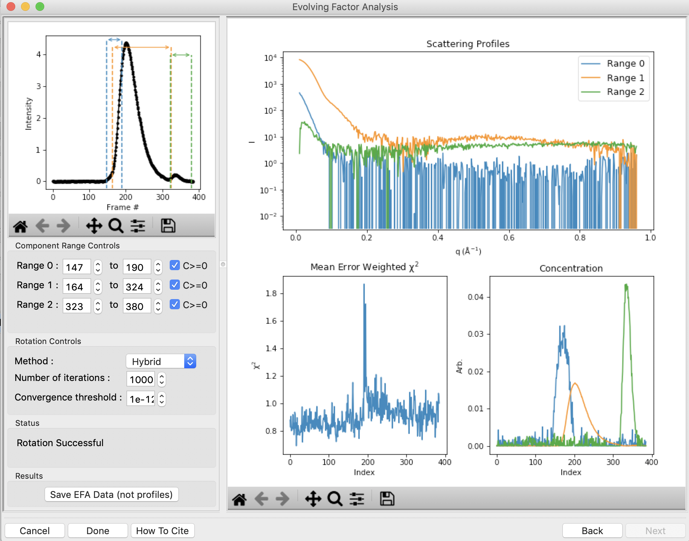
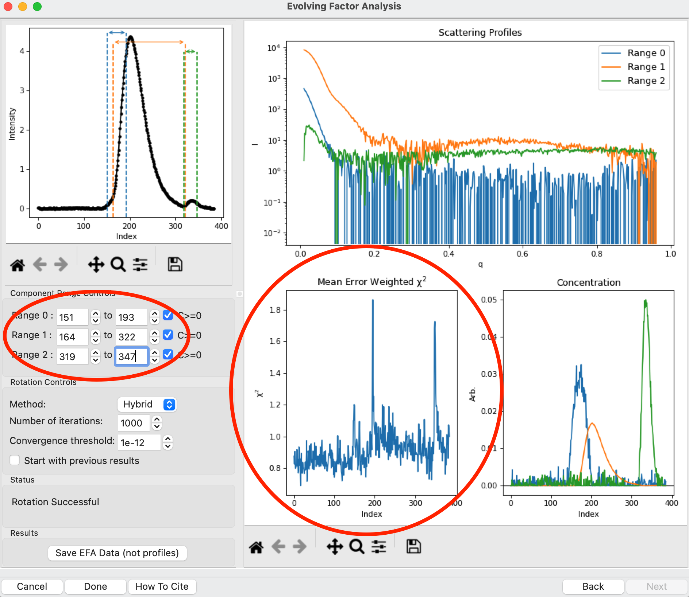
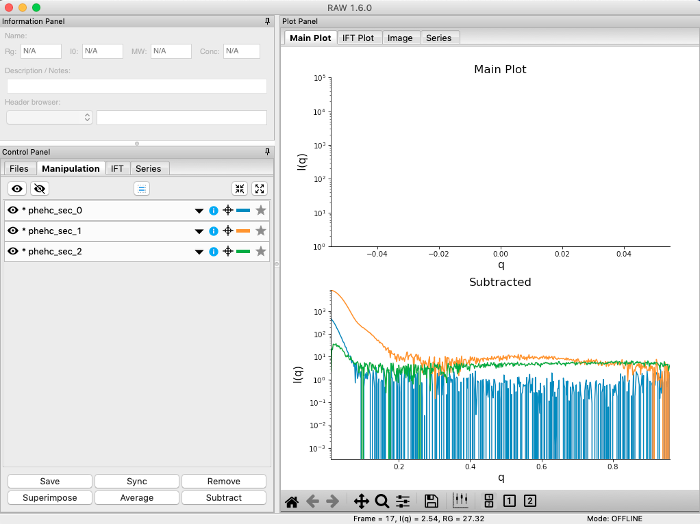

Advanced SEC-SAXS processing – Evolving factor analysis (EFA)
^^^^^^^^^^^^^^^^^^^^^^^^^^^^^^^^^^^^^^^^^^^^^^^^^^^^^^^^^^^^^^
.. _raw_efa:

Sometimes SEC fails to fully separate out different species, and you end up with overlapping
peaks in your SEC-SAXS curve. It is possible to apply more advanced mathematical techniques
to determine if there are multiple species of macromolecule in a SEC-SAXS peak, and to attempt
to extract out scattering profiles for each component in an overlapping peak.
:ref:`Singular value decomposition (SVD) <raw_svd>` can be used to help determine how many distinct scatterers are in a
SEC-SAXS peak. Evolving factor analysis (EFA) is an extension of SVD that can extract individual
components from overlapping SEC-SAXS peaks. Note that the first step of EFA is
doing SVD, but that happens entirely within the EFA analysis window. The SVD
window does not need to be opened before doing EFA. This tutorial covers
EFA.

:ref:`REGALS <raw_regals>` is a similar deconvolution technique, but can be
applied in cases where there are components that are not strictly
first-in-first-out and EFA would fail. EFA is recommended for standard
SEC-SAXS data, but for more complex data, such as ion exchange chromatography,
or time resolved or titration data you should use REGALS. REGALS can also
handle deconvolution of SEC-SAXS data with a sloping baseline.

If you use EFA in RAW, in addition to citing the RAW paper, please cite the
EFA paper: S. P. Meisburger, A. B. Taylor, C. A. Khan, S. Zhang, P. F.
Fitzpatrick, N. Ando. Journal of the American Chemical Society (2016). 138(20),
6506-6516. DOI: `10.1021/jacs.6b01563 <https://doi.org/10.1021/jacs.6b01563>`_

A video version of this tutorial is available:

.. raw:: html

    
<iframe src='https://www.youtube.com/embed/U2bSg20mU8s' frameborder='0' allowfullscreen></iframe>

The written version of the tutorial follows.

#.  Clear all of the data in RAW. Load the **phehc_sec.hdf5** file in the **series_data** folder.

    *   *Note:* The data were provided by the Ando group at Cornell University
        and is some of the data used in the paper: *Domain Movements upon Activation of
        Phenylalanine Hydroxylase Characterized by Crystallography and Chromatography-Coupled
        Small-Angle X-ray Scattering*\ . Steve P. Meisburger, Alexander B. Taylor, Crystal
        A. Khan, Shengnan Zhang, Paul F. Fitzpatrick, and Nozomi Ando. Journal of the
        American Chemical Society 2016 138 (20), 6506-6516. `DOI: 10.1021/jacs.6b01563
        <https://dx.doi.org/10.1021/jacs.6b01563>`_

    |efa_series_plot_png|

#.  We will use EFA to extract out the two scattering components in the main
    peak in this data. Right click on the **phehc_sec.hdf5** item in the Series
    list. Select the “EFA” option.

#.  The EFA window will be displayed. On the left are controls, on the right are plots of
    the value of the singular values and the first autocorrelation of the left and right
    singular vectors.

    *   *Note:* Large singular values indicate significant components. What matters is the relative
        magnitude, that is, whether the value is large relative to the mostly flat/unchanging
        value of high index singular values.

    *   *Note:* A large autocorrelation indicates that the singular vector is varying smoothly,
        while a low autocorrelation indicates the vector is very noisy. Vectors corresponding to
        significant components will tend to have autocorrelations near 1 (roughly, >0.6-0.7) and
        vectors corresponding to insignificant components will tend to have autocorrelations near 0.

    |efa_panel_png|

#.  For successful EFA, you want to use Subtracted data, and you often want to have
    a buffer region before and after the sample. For this data set, using the entire
    frame range (from 0 to 385) is appropriate. With other data sets, you may need to
    change the frame range to, for example, remove other, well separated, peaks from the
    analysis.

        *   *Tip:* If you have a dataset where you have a large number of components,
            such as 4+, it can be useful to set the EFA range to isolate just
            2-3 of those components. The more components you have, the harder
            it is to do the EFA. There is a trade off in the amount of data
            used (more is better), and the number of components in the
            deconvolution (less is better) that requires some experimentation
            to find the right balance for a given dataset.

#.  RAW attempts to automatically determine how many significant singular values (SVs) there
    are in the selected range. This corresponds to the number of significant scattering
    components in solution that EFA will attempt to deconvolve. At the bottom of
    the control panel, you should see that RAW thinks there are three significant
    SVs (scattering components) in our data. For this data set, that is accurate.
    We evaluate the number of significant components by how many singular values
    are above the baseline, and how many components have both left and right singular
    vectors with autocorrelations near one. For this data there are three singular
    values above baseline, and three singular vectors with autocorrelations near
    1 (see step 3).

    |efa_components_png|

    *   *Note:* Typically you want the number of significant singular values and
        the number of singular vectors with autocorrelations near 1 to be equal.
        If they aren't, it likely indicates a weak or otherwise poorly resolved
        component in the dataset. Try the deconvolution first with the lower then
        the higher number of components.

    *   *Note:* RAW can find the wrong number of components automatically. You will
        always want to double check this automatic determination against the SVD results in
        the plots. If you change the data range used (or data type), the number
        of components will not automatically update so you should check and update
        it if necessary.

#.  Click the “Next” button in the lower right-hand corner of the window to advance to
    the second stage of the EFA analysis.

    *   *Note:* It may take some time to compute the necessary values for this next step,
        so be patient.

    |efa_panel_2_png|

#.  This step shows you the “Forward EFA” and “Backward EFA” plots. These plots represent
    the value of the singular values as a function of frame.

    *   *Note:* There is one more singular value displayed on each plot than available in
        the controls. This is so that in the following Steps you can determine where each
        component deviates from the baseline.

#.  In the User Input panel, tweak the “Forward” value start frames so that the frame
    number, as indicated by the open circle on the plot, aligns with where the singular
    value first starts to increase quickly. This should be around 147, 164, and 322.

    *   *Note:* For the Forward EFA plot, SVD is run on just the first two frames, then
        the first three, and so on, until all frames in the range are included. As more
        frames are added, the singular values change, as shown on the plot. When a singular
        value starts increasingly sharply, it indicates that there is a new scattering
        component in the scattering profile measured at that point. So, for the first ~150
        frames, there are no new scattering components (i.e. just buffer scattering). At
        frame ~147, we see the first singular value (the singular value with index 0,
        labeled SV 0 on the plot) start to strongly increase, showing that we have gained
        a scattering component. We see SV 1 start to increase at ~164, indicating another
        scattering component starting to be present in the data.

#.  In the User Input panel, tweak the “Backward” value start frames so that the frame
    number, as indicated by the open circle on the plot, aligns with where
    the singular value drops back to near the baseline. This should be around
    383, 360, and 200.

    *   *Note:* For the Backward EFA plot, SVD is run on just the last two frames, then the
        last three, and so on, until all frames in the range are included. As more frames are
        added, the singular values change, as shown on the plot. When a singular value
        drops back to baseline, it indicates that a scattering component is leaving
        the dataset at that point.

    *   *Note:* The algorithm for determining the start and end points is not particularly
        advanced. For some datasets you may need to do significantly more adjustment of these values

    |efa_ranges_png|

#.  Click the “Next” button in the bottom right corner to move to the last stage of the
    EFA analysis.

    |efa_panel_3_png|

#.  This window shows controls on the left and results on the right. In the controls area,
    at the top is a plot showing the SEC-SAXS curve, along with the ranges occupied by
    each scattering component, as determined from the input on the Forward and Backward
    EFA curves in stage 2 of the analysis. The colors of the ranges correspond to the
    colors labeled in the Scattering Profiles plot on the top right and the Concentration
    plot in the lower right. This panel takes the SVD vectors and rotates them back into
    scattering vectors corresponding to real components.

    *   *Note:* This rotation is not guaranteed to be successful, or to give you valid
        scattering vectors. Any data obtained via this method should be supported in other
        ways, either using other methods of deconvolving the peak, other biophysical or
        biochemical data, or both!

#.  This rotation looks quite good, as judged by the reasonable profiles, concentration
    peaks, and relatively flat chi^2 vs. frame plot. However, you don't always pick the
    right ranges the first time, sometimes some fine tuning is necessary. To simulate
    this, in the “Component Range Controls” set the ranges back to the original
    default values found by RAW: 151 to 193, 164 to 322, and 319 to 347.

#.  After making these adjustments, you should see some spikes in the chi^2 values.

    |efa_poor_rotation_png|

#.  Fine tune the ranges using the controls in the “Component Range Controls” box.
    Adjust the starts and ends of Ranges 0 and 1 and the end of Range 2 by a few points
    until the spikes in the chi-squared plot go away. After these adjustments, Range 0
    should be about 142 to 198, Range 1 from 161 to 322, and Range 2 from 319 to 360.

    *   *Note:* These ranges are a little different from what you previously found,
        particularly the end of ranges 1 and 2. This likely means that there is
        very little (or no) contribution of those components in the extended range.
        You can verify this by setting the ends of those ranges back to 360 and 383
        respectively and looking at the concentration profiles, you'll see that the
        profiles are essentially zero in the more extended ranges. It's usually
        a good idea to minimize the component range to avoid introducing contamination
        from other components. In this case, you could do that by narrowing the
        range of the components until you start to see chi^2 spikes, then returning
        to the last good value.

#.  To see these changes on the Forward and Backward EFA plots, click the “Back” button
    at the bottom right of the page. Verify that all of your start and end values are
    close to where the components become significant, as discussed in Steps 8 and 9.

#.  Click the “Next” button to return to the final stage of the EFA analysis.

#.  In the Rotation Controls box, you can set the method, the number of iterations, the
    convergence threshold, and whether you're starting with the previous results.
    As you can see in the Status window, the rotation was successful for this
    data. If it was not, you could try changing methods or adjusting the number
    of iterations or threshold.

    *   *Tip:* If it takes a while to run EFA every time you change a component,
        you can speed up the convergence by starting with the previous results.
        To do so, you would check the "Start with previous results" box. This
        will allow you to quickly iterate on changes, as long as the magnitude
        of the change is relatively small. Just be sure to set the convergence
        criteria back to not using previous results to do your final EFA run,
        as you can bias the rotation with the previous results and guide the
        EFA into a solution that is path dependent and thus isn't reproducible later.

#.  Examine the chi-squared plot. It should be uniformly close to 1 for good EFA. For
    this data, it is.

#.  Examine the concentration plot. You’ll see three peaks, corresponding to the
    concentrations for the three components. In the Range Controls, uncheck the Range
    0 C>=0 box. That removes the constraint that the concentration must be positive.
    If this results in a significant change in the peak, your EFA analysis is likely
    poor, and you should not trust your results.

    *   *Note:* The height of the concentration peaks is arbitrary, all peaks are
        normalized to have an area of 1.

#.  Uncheck all of the C>=0 controls.

    *   *Question:* Do you observe any significant changes in the scattering profiles,
        chi-squared, or concentration when you do this? How about if you uncheck one and
        leave the others checked?

#.  Recheck all of the C>=0 controls. You have now verified, as much as you can, that
    the EFA analysis is giving you reasonable results.

#.  *Reminder:* Here are the verification steps we have carried out, and you should carry
    out every time you do EFA:

        #.  Confirm that your selected ranges correspond to the start points of the
            Forward and Backward EFA values (Steps 12-13).

        #.  Confirm that your chi-squared plot is close to 1, without any major
            spikes.

        #.  Confirm that your concentrations are not significantly altered by
            constraining the concentration to be positive (Steps 17-19).

#.  Click the “Save EFA Data (not profiles)” to save the EFA data, including the SVD,
    the Forward and Backward EFA data, the chi-squared, and the concentration, along
    with information about the selected ranges and the rotation method used.

#.  Click the “Done” button to send the scattering profiles to the Profiles Plot.

#.  In the main RAW window, go to the Profiles control tab and the Profiles plot. If
    it is not already, put the Profiles plot on a semi-Log or Log-Log scale.

    |efa_profiles_png|

#.  The three scattering profiles from EFA are in the manipulation list. The labels _0,
    _1, and _2 correspond to the 0, 1, and 2 components/ranges.

    *   *Note:* Regardless of whether you use subtracted or unsubtracted data, these
        scattering profiles will be buffer subtracted, as the buffer represents a
        scattering component itself, and so (in theory) even if it is present will be
        separated out by successful EFA.

Note: By default, RAW bins the profiles before doing an SVD and calculating the
evolving factor plots, in order to speed up the process. The final EFA rotation is
done on the full unbinned dataset. You can turn binning on and off and adjust
the binning parameters in the Series options panel in the Advanced Options window.

Note 2: If you save a pdf report of a series that has EFA analysis done on it, a
summary of the EFA analysis and the various plots is saved in the report.

.. |efa_series_plot_png| image:: images/efa_series_plot.png
    :target: ../_images/efa_series_plot.png

