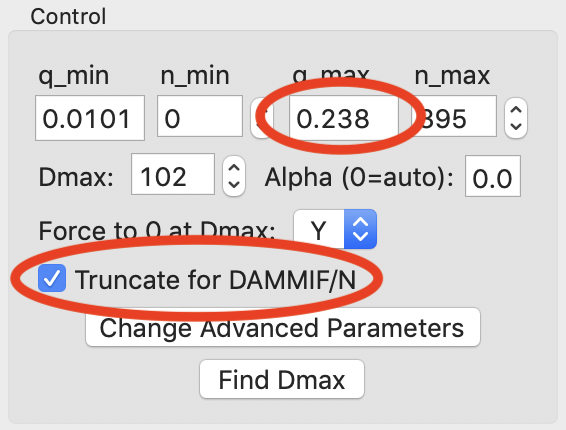

Pair-distance distribution analysis – GNOM in RAW
^^^^^^^^^^^^^^^^^^^^^^^^^^^^^^^^^^^^^^^^^^^^^^^^^^^^^^^^^
.. _s2p1:

The first step in most advanced data processing is to calculate the P(r) function, the
Fourier transform of I(q). This cannot be calculated directly from the scattering profile, so
indirect Fourier transform (IFT) methods are typically used. The most common such method is implemented
in the GNOM program from the ATSAS package. We will use RAW to run GNOM. Note that you need
:ref:`ATSAS installed <atsas>` to do this part of the tutorial.

This tutorial covers how to use RAW for doing an IFT. This is not a tutorial
on basic principles and best practices for doing an IFT or analysis of the
resulting P(r) function. For that, please see the :ref:`SAXS tutorial <saxs_ift>`.

If you use RAW to run GNOM, in addition to citing the RAW paper, please
cite the paper given in the `GNOM manual. <https://www.embl-hamburg.de/biosaxs/manuals/gnom.html>`_

A video version of this tutorial is available:

.. raw:: html

    
<iframe src='https://www.youtube.com/embed/1fe6uleE8iM' frameborder='0' allowfullscreen></iframe>

The written version of the tutorial follows.

#.  Open RAW. The install instructions contain information on installing and running RAW.
    If RAW is already open, clear all loaded data in RAW.

#.  Open the **glucose_isomerase.dat** file in the **Tutorial_Data/reconstruction_data** folder.

#.  Right click on the glucose_isomerase profile in the Profiles list and select “IFT (GNOM)”.

    *   *Note:* RAW will automatically try to find an appropriate maximum dimension (|Dmax|).

    *   *Troubleshooting:* If you do not have the GNOM option in the right click menu, RAW does
        not know where your ATSAS programs are installed. If you installed the ATSAS programs
        after starting RAW, restart RAW and it will attempt to automatically find them. If that
        has failed, go to the Options->Advanced Options menu and choose the ATSAS settings (“ATSAS”).
        Uncheck the option to “Automatically find the ATSAS bin location”, and specify the location
        manually.

    |gnom_panel_png|

#.  The GNOM panel has plots on the right. These show the P(r) function
    (top panel), the data (middle panel, blue points) and the fit line (middle
    panel, red line), and the fit residual (bottom panel).

    *   *Note:* The fit line is the Fourier transform of the P(r) function, and is also
        called the regularized intensity.

#.  On the left of the GNOM panel are the controls and the resulting parameters. You can alter
    the data range used, the |Dmax| value, whether the solution is forced to zero at
    |Dmax|, and the alpha value used.

    *   *Tip:* The Guinier and P(r) |Rg| and I(0) values should agree well for
        mostly rigid particles. The total estimate varies from 0 to 1, with 1
        being ideal. GNOM also provides an estimate of the quality of
        the solution. You want it to be at least a “REASONABLE” solution.

#.  Try varying the |Dmax| value up and down in the range of 80-110. Observe what
    happens to the P(r) and the quality of the solution.

    *   *Note:* |Dmax| is in units of Å.

#.  Return the |Dmax| value to that found by RAW by clicking the "Auto Dmax" button.
    |Dmax| should be 102. By default, GNOM forces the P(r) function to zero at |Dmax|.
    For a high quality data set and a good choice of |Dmax|, P(r) should go to zero
    naturally. Change the “Force to 0 at Dmax” option to “N”.

    *   *Try:* Vary |Dmax| with this option turned off.

#.  Reset it so that the P(r) function is again being forced to zero
    at |Dmax|.

#.  RAW makes it easy to truncate your data for bead model reconstructions with ,
    DAMMIF/N by setting q\ :sub:`max` to 8/|Rg| or 0.30, whichever is smaller.
    Check the "Truncate for DAMMIF/N" box to truncate the data.

    |gnom_cutrg_png|

    *   *Note:* The q\ :sub:`max` goes from 0.283 to 0.238 when you check the box.
    *   *Tip:* For electron density reconstruction with DENSS use the full
        available q range.

#.  Click "OK" to exit the panel and save the IFT to the RAW IFTs panel and plot.

    *   *Tip:* After exiting the IFT panel, note that data from the IFT shows
        up in the Information panel.

#.  Click on the IFTs Control and Plot tabs. This will display the GNOM output you just generated.
    Save the **glucose_isomerase.out** item in the **reconstruction_data** folder.

    *   *Note:* This saved file is all of the GNOM output, in the GNOM format. It can be used
        as input for any program that needs a GNOM **.out** file.

.. |gnom_panel_png| image:: images/gnom_panel.png
    :target: ../_images/gnom_panel.png

.. |Rg| replace:: R\ :sub:`g`

.. |Dmax| replace:: D\ :sub:`max`
