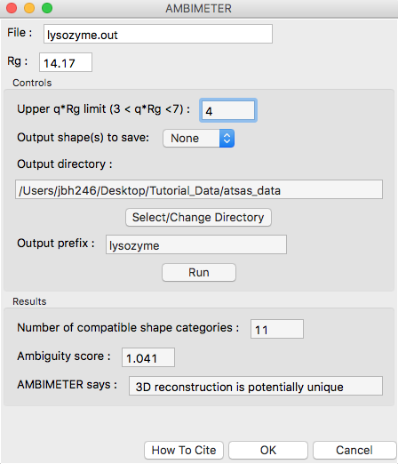
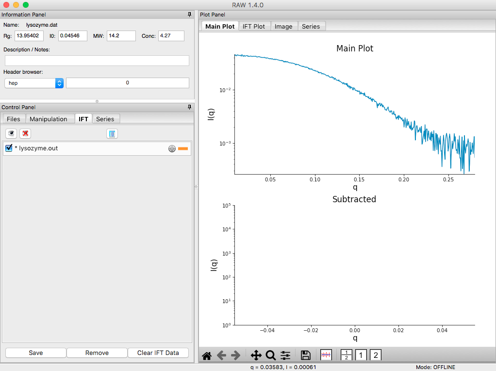
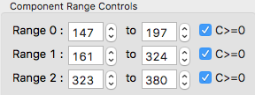
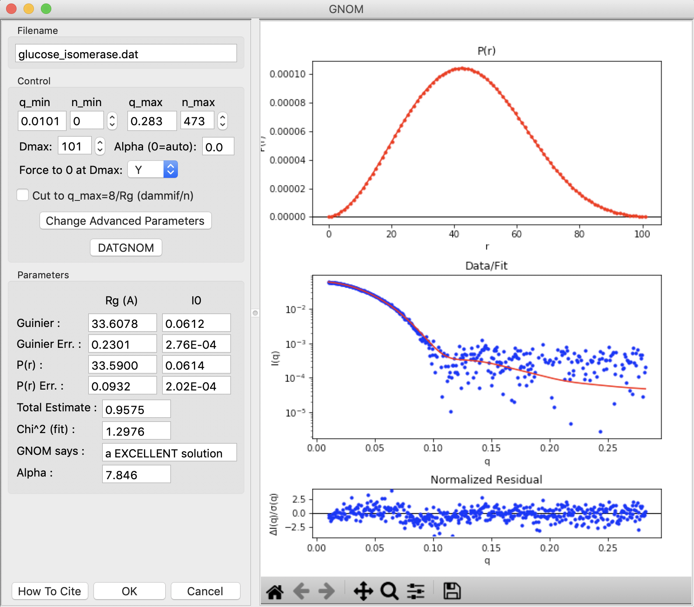

Pair-distance distribution analysis – GNOM in RAW
^^^^^^^^^^^^^^^^^^^^^^^^^^^^^^^^^^^^^^^^^^^^^^^^^^^^^^^^^
The first step in most advanced data processing is to calculate the P(r) function, the inverse
Fourier transform of I(q). This cannot be calculated directly from the scattering profile, so
indirect Fourier transform methods are typically used. The most common such method is implemented
in the GNOM program from the ATSAS package. We will use RAW to run GNOM. Note that you need
:ref:`ATSAS installed <atsas>` to do this part of the tutorial.

#.  Open RAW. The install instructions contain information on installing and running RAW.

#.  Open the **lysozyme.dat** file in the **Tutorial_Data/atsas_data** folder.

#.  Right click on the lysozyme profile in the Manipulation list and select “IFT (GNOM)”.

    *   *Note:* RAW will automatically try to find an appropriate maximum dimension (|Dmax|)
        by running the DATGNOM program from the ATSAS software package.

    *   *Troubleshooting:* If you do not have the GNOM option in the right click menu, RAW does
        not know where your ATSAS programs are installed. If you installed the ATSAS programs
        after starting RAW, restart RAW and it will attempt to automatically find them. If that
        has failed, go to the Options->Advanced Options menu and choose the ATSAS settings (“ATSAS”).
        Uncheck the option to “Automatically find the ATSAS bin location”, and specify the location
        manually.

    |gnom_panel_png|

#.  The GNOM panel has plots on the right. These show the P(r) function (top panel), the data
    (bottom panel, blue points) and the fit line (bottom panel, red line).

    *   *Note:* The fit line is the Fourier transform of the P(r) function, and is also
        called the regularized intensity.

#.  On the left of the GNOM panel are the controls and the resulting parameters. You can alter
    the data range used and the |Dmax| value.

    *   *Tip:* The Guinier and P(r) |Rg| and I(0) values should agree well. The total estimate
        varies from 0 to 1, with 1 being ideal. GNOM also provides an estimate of the quality of
        the solution. You want it to be at least a “REASONABLE” solution.

#.  Vary the |Dmax| value up and down in the range of 30-50 in steps of 1. Observe what
    happens to the P(r) and the quality of the solution.

    *   *Note:* |Dmax| is in units of Å.

    *   *Tip:* Recall that we want the following qualities in a P(R) function:

        #.  No negative values.

        #.  A gentle approach to |Dmax| (not suddenly forced down).

        #.   Minimal oscillation.

#.  Return the |Dmax| value to that found by DATGNOM by clicking the “DATGNOM” button.
    |Dmax| should be 40. By default, GNOM forces the P(r) function to zero at |Dmax|.
    For a high quality data set and a good choice of |Dmax|, P(r) should go to zero
    naturally. Change the “Force to 0 at Dmax” option to “N”.

    *   *Try:* Vary |Dmax| with this option turned off.

#.  Reset it so that the P(r) function is again being forced to zero
    at |Dmax|.

#.  Set the |Dmax| back to 40, and click OK. This saves the results into the RAW IFT panel.

#.  Click on the IFT Control and Plot tabs. This will display the GNOM output you just generated.
    Save the **lysozyme.out** item in the **atsas_data** folder.

    *   *Note:* This saved file is all of the GNOM output, in the GNOM format. It can be used
        as input for any program that needs a GNOM **.out** file.

.. |dammif_run_tab_png| image:: images/dammif_run_tab.png

.. |dammif_results_png| image:: images/dammif_results.png

.. |denss_run_tab_png| image:: images/denss_run_tab.png

.. |denss_results_png| image:: images/denss_results_tab.png

.. |denss_fsc_png| image:: images/denss_fsc.png

.. |10000201000000C0000000F27D3BE3AA11912468_png| image:: images/10000201000000C0000000F27D3BE3AA11912468.png

.. |10000201000003B3000002EB8E792276E0CD8D88_png| image:: images/10000201000003B3000002EB8E792276E0CD8D88.png

.. |10000201000003B6000002EBE2BBC8749420E175_png| image:: images/10000201000003B6000002EBE2BBC8749420E175.png

.. |1000020100000320000002A2D123A77E23D67C60_png| image:: images/1000020100000320000002A2D123A77E23D67C60.png

.. |1000020100000401000002FFB79B21A115149137_png| image:: images/1000020100000401000002FFB79B21A115149137.png

.. |efa_series_plot_png| image:: images/efa_series_plot.png

.. |dammif_viewer_png| image:: images/dammif_viewer.png

.. |100002010000031F000002A41245FE3782B26A6C_png| image:: images/100002010000031F000002A41245FE3782B26A6C.png

.. |10000201000001E00000025F31616EF70FB0318B_png| image:: images/10000201000001E00000025F31616EF70FB0318B.png

.. |100002010000031E00000257E806280132469D47_png| image:: images/100002010000031E00000257E806280132469D47.png

.. |10000201000003B3000002ECA374DC717C28A0DA_png| image:: images/10000201000003B3000002ECA374DC717C28A0DA.png

.. |Rg| replace:: R\ :sub:`g`

.. |Dmax| replace:: D\ :sub:`max`
