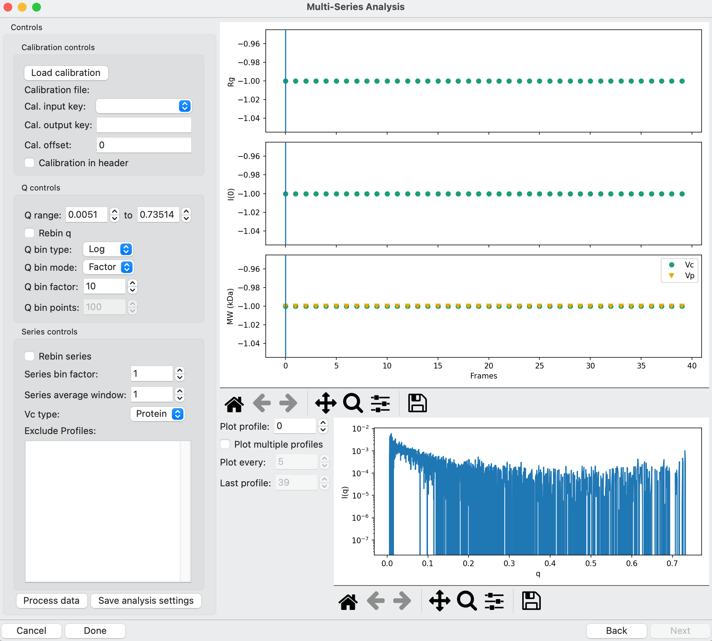
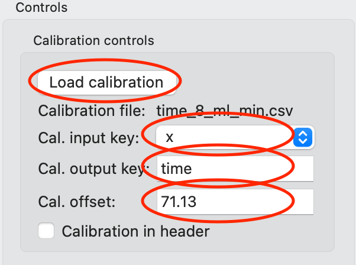
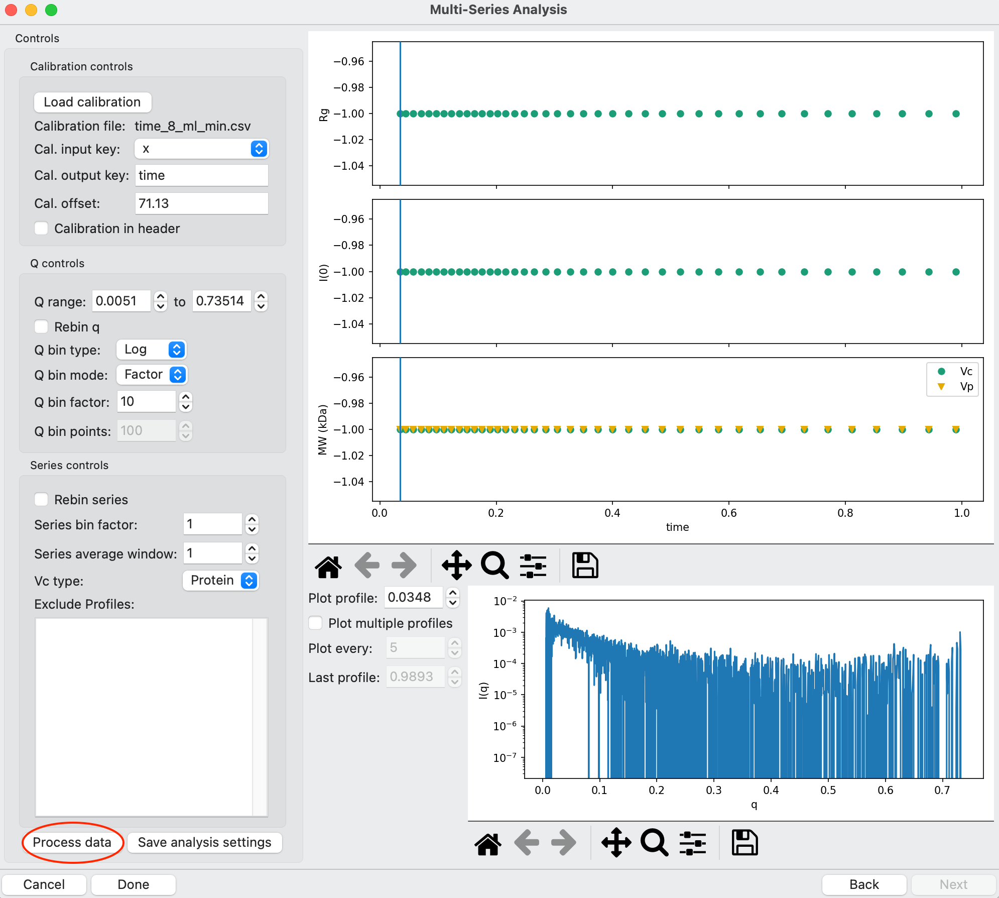
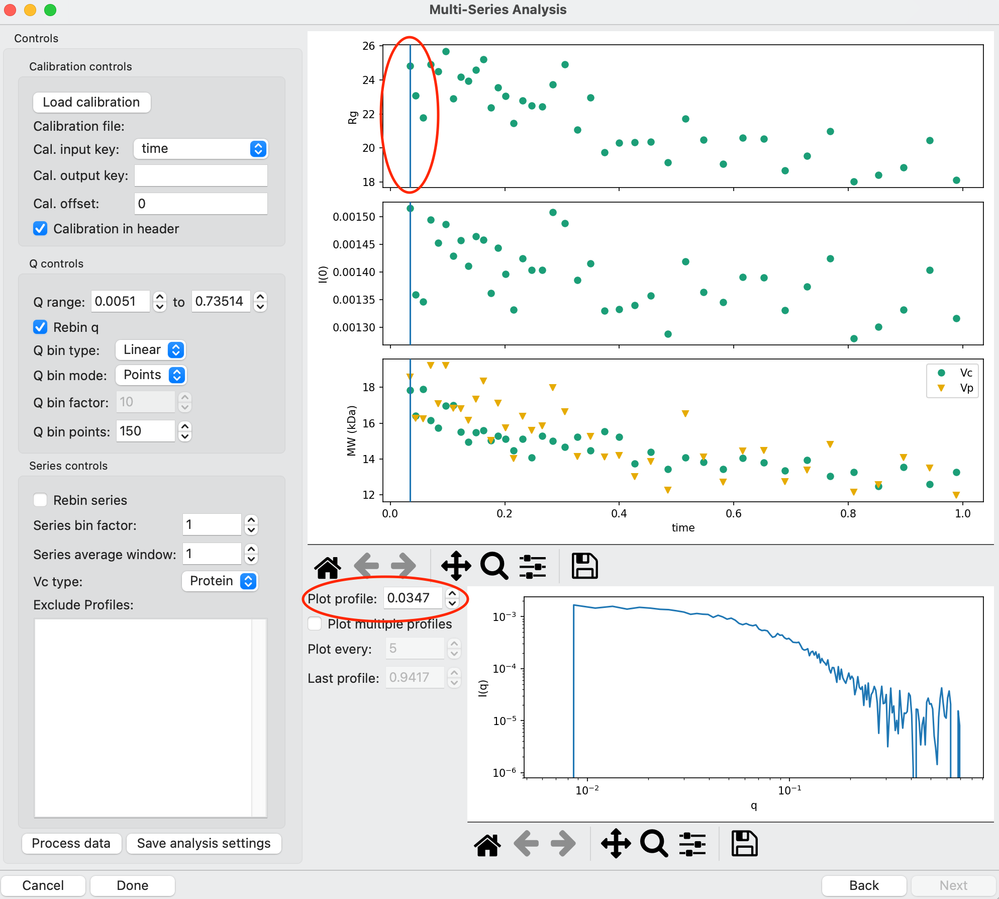

Multi-series analysis
^^^^^^^^^^^^^^^^^^^^^^^^^^^^^^^^^^^^^^^^^^^^^^^^^^^^^^^

Sometimes SAXS data is collected in a way where multiple separate datasets
need to be processed together, either averaged or subtracted. A simple
example is if an IEC-SAXS experiment is done and background subtraction is
done by measuring a blank injection in the same gradient and doing a point
by point subtraction of the series with sample and the series without sample.
A more complicated example would be how time-resolved SAXS data is collected
at the BioCAT beamline, where multiple sequential scans along a microfluidic
mixer are collected for a single injection and some of the scans are used
for buffer subtraction while others contain scattering from the sample.

The multi-series analysis tool in RAW provides a robust mechanism for loading
in multiple series at once, carrying out point-by-point averaging and
subtraction across series. Once a subtracted series is created, you can
then carry out further data refinement including truncating and binning q ranges,
averaging together multiple points in a series to improve signal to noise,
removing particular profiles from the series, and calibrating the series.

The written version of the tutorial follows.

Time-resolved SAXS analysis
*****************************

Time resolved SAXS data from the BioCAT beamline is used for this tutorial.
The experiment is a refolding experiment on Cytochrome C. The protein starts
out chemically denatured in a 4.5 M guanidine buffer. It is then diluted 10x
into a refolding buffer using a very fast microfluidic mixer, initiating the
refolding reaction. Timepoints after mixing are obtained by measuring the
scattering some distance along the mixing channel, and are determined by
how long the solution takes to flow from the mixing point to the measurement point.

The basic data collection procedure is as follows: First, flow of mixing and
sample buffers is started. Then, simultaneously, the X-ray exposure and a
continuous scan of the mixer is started. The X-ray beam is scanned along the
observation region, and images are measured while the mixer is moving (a
continuous/fly scan rather than step scan), which is important for minimizing
radiation damage and maximizing throughput. Each exposure along the observation
region corresponds to a different timepoint after mixing. Repeated scans along
the mixer add additional data at the same timepoints, which improves the
signal to noise of the measurement at the timepoint. After sufficient buffer
scans, the sample is injected into the mixer via an injection valve.
Measurements are carried out while all the sample flows through the mixer,
yielding multiple scans with mixed sample measured at every timepoint. Once
all the sample has passed through the mixer, additional scans of just buffer
are measured, yielding pre- and post-sample buffer and sample measurements
at every timepoint as part of the same experiment. If necessary, the
measurement is repeated multiple times to provide good data at each timepoint.
Typically, at least 3 such measurements are made.

This tutorial will take you through loading and carrying out buffer subtraction
on a single measurement, and then averaging multiple such measurements together
to get a final time series.

#.  Clear all of the data in RAW. From the Tools menu select "Multi-Series Analysis"
    to open the multi-series analysis window.

    |ms_panel_png|

#.  There are three ways that you can load multi-series data in RAW. The primary
    way is to use the Select from disk sub-panel, which allows you to pick a directory
    and then define a filename with variables in it that allows RAW to find the
    series of interest. You can also select series that are loaded in the Series
    control panel in RAW with the "Add from series panel" button and for data
    collected at the BioCAT beamline (or with a compatible file naming convention)
    you can load the data in automatically with the "Auto Select" button.

#.  Click the Browse button and select the **Tutorial_Data/multiseres_data/cytc_01**
    folder. This sets the directory where RAW will look for .dat files corresponding
    to your series.

#.  The filename field expects two variables, one corresponding to the series
    number, <s>, and one corresponding to the file number <f>. As with any
    series in RAW, a single series consists of some set of scattering profiles.
    The file number variable lets you define which profiles (.dat files on disk)
    are in a given series, while the series number defines which series to load.
    Take a look at the data in the **cytc_01** folder. You will see filenames
    such as **cytc_01_005_0001_data_000001_00001.dat** and
    **cytc_01_005_0001_data_000002_00002.dat**. If you scroll down a bit you'll
    see filenames such as **cytc_01_005_0010_data_000001_00001.dat**
    The series number is given by the cytc_01_05\ **_0001** and cytc_01_05\ **_0010**
    values, in this case the first file is in series 1 (0001) and the second file
    is in series 10 (0010). The last value in the filename is the file number,
    so **_00001.dat** is the first file in the series, **_00002.dat** the second, and
    so on.

        *   Note: For this time resolved data set, each series represents a single
            scan of the beam down the mixing channel and each file represents a
            single timepoint in that scan. So across all the series the _00001.dat
            files are all measuring the first timepoint, the _00002.dat files the next
            timepoint, and so on.

        *   Tip: File naming convention will vary from facility to facility, so
            make sure you understand the convention for your data.

#.  In the filename field enter *cytc_01_005_<s>_data_0<f>_<f>.dat*. This is a
    filename constructed to make use of the series number, <s>, and file number,
    <f> variables that allow RAW to find all the series and files of interest.
    We'll go through this construction piece by piece.

    #.  If you scroll through all the .dat files in the selected folder, you
        will see that there is an unvarying file prefix: *cytc_01_005_*
        We include this in our filename to match that part of the filename.

    #.  The *<s>* is put in the series number position. This will let RAW
        match the series numbers, we'll define the exact format of this
        next.

    #.  The *_data_0* is again fixed across all files in the folder, so
        similar to the prefix we include that to match the filename.

    #.  The *<f>_<f>.dat* piece makes use of the file number variable
        twice. Looking at the files in the folder you'll see that every
        time the last number in the filename increments the number right
        before it does as well, e.g. _000001_00001.dat, _000002_00002.dat,
        and so on. The last number is the file number,  but in order to
        match the filename we need to increment both, so we use the <f>
        variable twice.

    |ms_filename_png|

#.  Look at the data in the selected folder and make a note of the first and
    last series numbers (should be 0001 and 0090). In the Series # line enter
    1 in the first field and 90 in the second field. In the zero pad field
    enter 4. This tells RAW that wherever you put <s> in the filename it
    should substitute numbers in the range from 1 to 90 (so 1, 2, 3, etc up to 90).
    The zero pad value tells RAW what the string format for these numbers is. In
    this case, it will make the numbers in the filename 4 characters long, and
    any extra characters will be zeros. So series 1 is represented as 0001,
    series 10 as 0010.

    *   Note: If you changed the zero padding to 3, for example, then you
        would get series strings 001 and 010 for series 1 and 10.

#.  Look at the data in the selected folder and make a note of the first and
    last file numbers for a single series (should be 00001 and 00040). In the
    Profiles # line enter 1 in the first field and 40 in the second field.
    In the zero pad field enter 5. This tells RAW that wherever you put <f>
    in the filename it should substitute numbers in the range from 1 to 40,
    with the format of those in the filename defined by the zero padding
    as described above. For example, file number 1 is represented as 00001
    and file number 10 as 00010.

    *   Note: For both series and file number, you don't have to list
        everything in your target folder. You could, for example, load
        just series 5 to 35 instead of 1 to 90, if you used that as the
        series number range.

    |ms_series_file_numbers_png|

#.  An important note is that you can use linux \* and ? wildcards in the filename.
    So in this case we could have defined the filename as *cytc_01_005_<s>_*\ \*\ *<f>.dat*.
    This can be useful if your filename can't be matched strictly with the <s>
    and <f> variables. However, searching for files with wildcards in it
    is significantly slower than getting a defined filename, so you should only
    do this if needed.

#.  Now that the directory, filename, and series and file numbers are all
    defined, click the 'Select files' button. This will search for files
    matching the values you provided in the selected folder. Series that it
    successfully finds will be displayed in the left panel. Note that in the left
    panel you will first see a number, this series ID increments sequentially and will be
    used to identify the series in the next part of the analysis. After that you
    will see the series name, in this case it should be something like *cytc_01_005_0001*.

    *   Tip: Scroll down in the left panel to see all 90 loaded series.

    |ms_series_load_png|

#.  Click on the first series in the left panel. This will display the series
    location and contents Series Info subpanel. Verify that the files contained
    in the series are what you expect. In this case, make sure that each file
    corresponds to series 1 (has _0001 for the series number) and that the file
    number is sequentially incrementing from 1 to 40 (ends with _00001.dat
    to _00040.dat). Also verify that the data directory is correct.

    *   Note: The files are not yet loaded into RAW. Because that can take some
        time, due to the large number of files involved, you have a chance to
        check and make sure you're loading what you want first.

    *   Tip: In the left panel, you can rearrange the series order by selecting
        one or more series (clicking, shift clicking, or control clicking as in
        the RAW control panels) and then clicking the Move up or Move down buttons.
        You can also remove series you don't want to include in the analysis
        using the Remove button.

    *   Tip: The number of profiles is provided in the info panel, and is a good
        way to quickly spot check that you loaded what you expected.

    *   Try: Click on a few other series in the left list and make sure they
        contain the right files.

#.  Click the "Next" button to load in the series data (may take a little bit)
    and advance to the next part of the analysis.

    |ms_series_info_png|

#.  The next portion of the analysis allows you to define buffer and sample
    series in a manner similar to how you define buffer and sample profiles
    for a LC Series dataset. The window shows a plot of total scattering
    intensity for each series. Here, each point corresponds to the sum of
    the total intensity of every profile in the series (for this example data
    set, each point in the sum of intensity from 40 profiles). The series number
    corresponds to the series ID given in the list of series in the loading
    panel.

    *   Note that series IDs are simply sequential for the series loaded, so they
        do not necessarily correspond to the series number as defined by <s>.
        For example, if you'd rearranged the list so that the series with number
        0002 was first in the list and 0001 was second, then the first point in
        this intensity plot would have series ID 1 and correspond to the series
        with number 0002. Or if you'd loaded series 5 to 35, the first point
        in the plot would be series 5 but have series ID 1.

    |ms_intensity_plot_png|

#.  First we will define what series are buffer. Unlike the LC Analysis panel,
    this is not defining a single profile as buffer, rather we are saying that
    every profile in the series is a buffer profile. For this time resolved data,
    recall that we first measure a set of scans (each scan is a single series
    when loaded into RAW) with buffer, then inject sample, measure a set of scans
    with sample, and then measure a final set of scans with just buffer.
    Analogous to a SEC-SAXS elution series, the series where protein is
    being measured have more total scattering than those with buffer, leading
    to the peak in this plot. Use the "Add region" button to add two buffer
    regions, one before the sample measurement and one after, and define the
    start and end points appropriately using either the spin boxes or
    the "Pick" button as you would in the LC Series panel. These
    should be around series 1-30 and 70-90.

    *   Note: Because of the injection method, there is some tailing in the
        sample concentration across later series. So to be conservative we
        pick a smaller post-buffer region near the end of the collected series.

    *   Tip: To use the interactive range picker, click the Pick button, then
        click on the start point of the range on the plot and then the end
        point of the range on the plot.

    *   Note: Buffer regions are shown on the plot in green.

    *   Note: Defining a buffer region is optional. If data is already subtracted
        you can proceed to the next step without doing this.

    |ms_buffer_range_png|

#.  Next we define what series are sample. Again, this is telling RAW that
    every profile in that series is a sample profile. Use the "Add region" button
    to add a sample region where the peak in the data is. This should be
    around series 32-44.

    *   Note: Sample regions are shown on the plot in purple.

    |ms_sample_range_png|

#.  Click the "Next" button to carry out the buffer subtraction and averaging.
    In this step, RAW carries out a point-by-point average of the defined
    buffer region(s) and sample region(s). For this data, each series has 90
    profiles in it. So RAW averages the first profile across series 1-30 and 70-90
    to create the average buffer profile at that point. It then averages the
    first profile across series 32-44 to create the average sample profile at
    that point. The average buffer profile is then subtracted from the average
    sample profile to yield the subtracted scattering profile at that point.
    This is carried out for all points in the series, resulting in 90
    subtracted scattering profiles, each at a different measured timepoint.
    RAW then carries out automated Rg and MW calculations for each subtracted
    profile and, if successful, displays the results in newly displayed window.

    |ms_profile_panel_png|

#.  A single time resolved measurement doesn't always yield great signal to noise
    data. You can see from the subtracted profile plotted at the bottom of the window
    that the data is highly noisy, and thus the automated Rg and MW calculations
    were not run successfully. We need to average together multiple measurements
    to improve this signal to noise and yield usable data.

    *   Note: This dataset represents a worst case scenario. Cytochrome C is
        small, so has lower scattering, and the final renaturing buffer
        contains 0.45 M guanidine, which reduces the contrast. For most time
        resolved datasets a single measurement will yield better signal to noise
        data.

#.  We will now apply a time calibration to the data. This requires two things.
    First, the profile header for each subtracted profile must contain a value
    that can be used to calibrate the data. Second, a calibration file that converts
    this header value into the desired value must be provided. A linear interpolation
    of the data in the calibration file is created, f(x) and the calibrated value
    is calculated as cal_val = f(input_val). Click the "Load Calibration" button
    and select the **Tutorial_Data/multiseries_data/time_8_ml_min.csv** file.
    This file contains distance from the mixing region in mm and time after
    mixing in ms.

    *   Note: A calibration file should consist of two columns in csv format.
        The first column is the input value and the second the output value.

#.  The "Cal. input key" selection menu lists all the available keys in the profile
    header. For this time resolved data, the calibration is done by the position
    of the beam on the microfluidic mixer. Select the "x" key in the menu, which
    gives the x position of the mixer.

#.  The "Cal. output key" field is the name that the calibrated point will be
    saved with in the profile header. Enter "time"

#.  The "Cal offset" field allows you to provide an offset value that will be
    added to the value from the profile header (i.e. cal_val = f(input_val+offset)).
    For this dataset, this is the measured position of the mixing region in x.
    Enter 71.13 for this value.

    |ms_calibration_png|

#.  Click "Process data" to apply the calibration. After it finishes you'll see
    that the x axis of the plots is now in your calibrated units, in this case
    time in ms.

    |ms_calibration2_png|

#.  We will now save the settings used to process this data. This allows us to
    apply the same settings to additional datasets, making processing
    quicker. It also provides a record of what settings were used to produce
    the final subtracted series. Click the "Save analysis settings" button
    and save the settings as "cytc_01.json" in the top level
    **Tutorial_Data/multiseries_data** folder.

    |ms_save_settings_png|

#.  Click the done button at the bottom of the window. This will close the
    analysis window and send the subtracted series to the Series control panel
    and Series plot, where you can do further analysis on it.

#.  Open the Multi-Series Analysis window. Click the "Load analysis settings"
    button to load in the **cytc_01.json** settings you just saved. You will see
    the "Select from disk" controls fill in the previous values, and additionally
    the range settings and settings from the final panel are also loaded.

    |ms_load_settings_png|

#.  Since this data is from BioCAT, it is compatible with the Auto select loading
    function. Click the "Auto select" button and select any profile in the
    **Tutorial_Data/mutliseries_data/cytc_03** folder. You will see the series
    load in the left panel as before.

    |ms_auto_load_png|

#.  Click the "Next" button to move to the buffer and sample range selection
    window. Note that the previously used ranges are selected by default.

#.  The experimental strategy changed slightly for this dataset, so we need to
    tweak the sample and buffer ranges. Change those as appropriate.

    *   Note: Buffer ranges should be around 1-30 and 75-90, and sample range
        around 32-49.

    |ms_ranges_repeat_png|

#.  Click the "Next" button to move to the subtracted profiles window. Note that
    the time calibration has been applied automatically, as it was loaded with
    the rest of the settings.

#.  Save the settings for this analysis as "cytc_03" and click "Done" to send
    the subtracted time series to the Series plot.

#.  In the Series Control Panel, save the cytc_01 and cytc_03 series that you
    have processed to the **Tutorial_Data/multiseries_data** folder.

#.  Next we will average the time resolved data across all 5 repeated time
    series measurements. This will improve the signal to noise of the final dataset.
    Open the **cytc_02_006_00.hdf5**, **cytc_04_004_0.hdf5** and **cytc_06_018_0.hdf5**
    series in the **Tutorial_Data/multiseries_data** folder.

#.  Select all the cytc series in the Series Control Panel, right click on a
    selected series, and select "Multi-Series analysis" from the pop-up menu
    to open a multi-series analysis window with the selected series already
    loaded.

#.  In the multi-series analysis window, click "Next" to move to the series
    buffer and sample range window. Add a sample range that spans all 5 series.

    |ms_all_sample_range_png|

#.  Click "Next" to advance to the subtracted profiles window.

    *   Note: Because this is an average of 5 repeated measurements, the signal
        to noise is significantly improved and the automated methods are able
        to calculate Rg and MW at most timepoints.

#.  Because we've previously calibrated each series in time, we can apply that
    calibration to the average of all these independent series. Check the
    "Calibration in header" box and from the drop-down menu select "time"
    as the Cal. input key.  This tells RAW that the calibrate already exists
    in the header, rather than having to be calculated from a header value,
    and that the appropriate key to use for the calibration is "time".

    |ms_cal_in_header_png|

#.  Click the "Process data" button to reprocess the data with this calibration.

    *   Note: The plots will now show the x axis with calibrated time values.
        For this dataset the time unit is milliseconds, so all the data is
        recorded for mixing times below 1 ms.

    |ms_average_data_png|

#.  Next we will bin and trim the data to improve the data quality of the individual
    scattering profiles at each timepoint. We'll start with q binning. Check
    the "Rebin q" box, set the Q bin type to "Linear", set the Q bin mode to
    "Points" and set the number of Q bin points to 150.

    *   Note: Q bin type can be linear or logarithmic, and dictates whether the
        bin spacing is linear or log base 10 in q. Q bin mode can be factor, which
        reduces the number of q points in the profile by the provided factor,
        or number of points, which sets the number of q points in the profile
        to a fixed value.

    |ms_q_bin_png|

#.  Click the "Process data" button to reprocess the data with this q binning.
    The plotted profile should now show significantly less noise.

    |ms_q_bin_profile_png|

#.  Because of strong parasitic scattering from the mixer window at some positions,
    the usable q range does not necessarily extend to the lowest q point for this
    dataset, as seen from the dip below zero in the intensity at the lowest q
    point in the plotted profile. Right click on the profile plot and select
    "Log-Log" to change to a logarithmic x axis to see the low q better.
    Then use the "Plot profile" selector to scroll through the profiles at
    different time points and get a feel for where the first usable q point is.

    *   Note: The vertical line on the plot shows which Rg/I(0)/MW values correspond
        to the displayed profile. The value in the Plot profile selector box
        is the x axis value corresponding to the plotted profile, in this case
        the time in ms.

    *   Tip: By right clicking on the parameter plots (e.g. Rg) you can change
        the plot type to be linear or logarithmic on either y or x axes.

    |ms_plot_profile_png|

#.  As you scroll through the profiles you should notice significant variation
    at low q below ~0.01 1/A. In the first box of the "Q range" line, type 0.01
    and then the enter key. This control will automatically pick the nearest q value to
    the value you type.

    |ms_q_min_png|

#.  Click the "Process data" button to set this q min value and then scroll back
    through the profiles to see if you need to adjust the q min value further.

#.  You should see there's still more variation than would be expected, indicating
    a higher noise level than desired at the lowest q points. Se the q min value
    to 0.015, and then process the data again.

#.  Put the profiles plot back on Log-lin axes and scroll through the profiles,
    looking now at the signal in the high q range. Again because these are relatively
    low signal to noise experiments, the usable q range may not extend all the way
    out to the maximum measured q point, so look for the q range where about
    half the data points are negative, indicating the sample signal is not
    significantly above the background.

        Tip: If unsubtracted sample and buffer profiles match, the no signal
        condition, then just from noise you'd expect half the points in the
        subtracted profile to be a bit below zero and half a bit above zero.

#.  Set the maximum q value to the highest usable q value for the profiles
    that you found, which should be around 0.5-0.55 1/A and then process the
    data again.

    *   Note: The usable q range for these time resolved SAXS experiments will
        depend on the sample size and concentration and buffer composition.
        Because of the small size (12.3 kDa) and high denaturant concentration
        these cytochrome c refolding experiments are a worst case for signal
        to noise. Often a wider q range is accessible, though due to the strong
        parasitic scattering from the mixer it is rare to get a usable low q
        below ~0.01 1/A.

    |ms_q_range_png|

#.  The series panel can also be used to remove outlier points from the series.
    For example, sometimes there's a bit of dust on the mixer window that leads
    to very strong and extended in q background scattering at a particular timepoint,
    rendering that timepoint not not usable, or perhaps the first timepoint
    starts too close to the edge of the mixer and there is significant additional
    scattering due to that. For this dataset we will excluding only the earliest
    timepoint, as that has excess scattering from the edge of the mixer.

    *   Note: You can't always tell this from a casual examination of the profiles.
        Looking at the images collected at each time point can help here.

.. |ms_series_file_numbers_png| image:: images/ms_series_file_numbers.png
    :width: 500 px
    :target: ../_images/ms_series_file_numbers.png

.. |ms_series_load_png| image:: images/ms_series_load.png
    :target: ../_images/ms_series_load.png

.. |ms_intensity_plot_png| image:: images/ms_intensity_plot.png
    :target: ../_images/ms_intensity_plot.png

