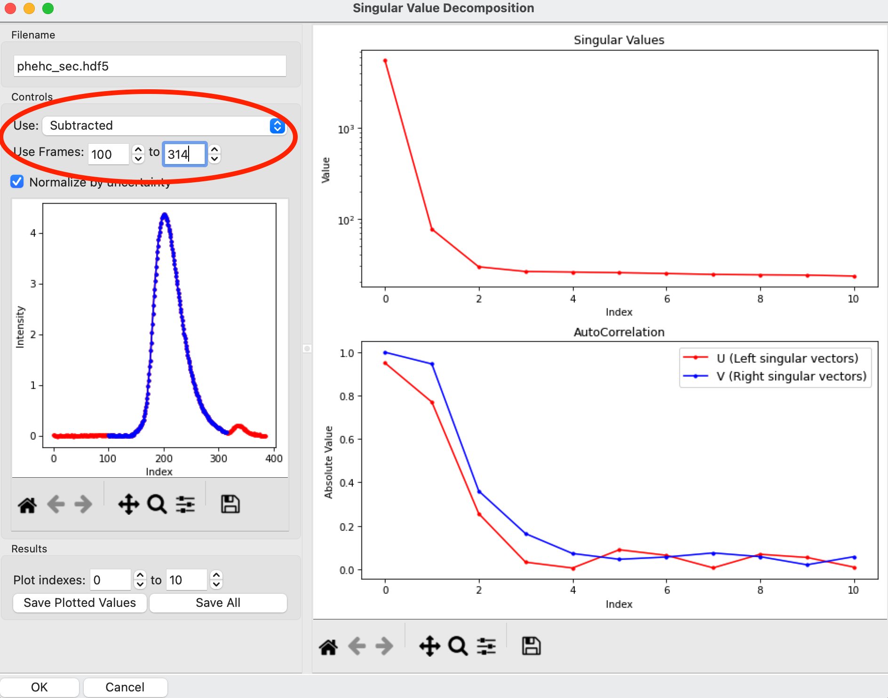
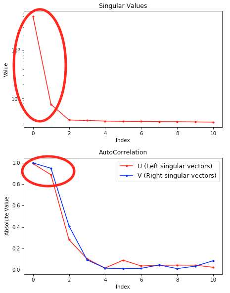

Advanced SEC-SAXS processing – Singular value decomposition (SVD)
^^^^^^^^^^^^^^^^^^^^^^^^^^^^^^^^^^^^^^^^^^^^^^^^^^^^^^^^^^^^^^^^^^
.. _raw_svd:

Sometimes SEC fails to fully separate out different species, and you end up with overlapping
peaks in your SEC-SAXS curve. It is possible to apply more advanced mathematical techniques
to determine if there are multiple species of macromolecule in a SEC-SAXS peak, and to attempt
to extract out scattering profiles for each component in an overlapping peak. Singular value
decomposition (SVD) can be used to help determine how many distinct scatterers are in a
SEC-SAXS peak. :ref:`Evolving factor analysis (EFA) <raw_efa>` is an extension
of SVD that can extract individual components from overlapping SEC-SAXS peaks.
Note that the first step of EFA is doing SVD, but that happens entirely within
the EFA analysis window. The SVD window does not need to be opened before doing
EFA. This tutorial covers SVD.

A video version of this tutorial is available:

.. raw:: html

    
<iframe src='https://www.youtube.com/embed/Hyvr18s7Ihg' frameborder='0' allowfullscreen></iframe>

The written version of the tutorial follows.

#.  Clear all of the data in RAW. Load the **phehc_sec.hdf5** file in the **sec_data** folder.

    *   *Note:* The data were provided by the Ando group at Cornell University
        and is some of the data used in the paper: *Domain Movements upon Activation of
        Phenylalanine Hydroxylase Characterized by Crystallography and Chromatography-Coupled
        Small-Angle X-ray Scattering*\ . Steve P. Meisburger, Alexander B. Taylor, Crystal
        A. Khan, Shengnan Zhang, Paul F. Fitzpatrick, and Nozomi Ando. Journal of the
        American Chemical Society 2016 138 (20), 6506-6516. `DOI: 10.1021/jacs.6b01563
        <https://dx.doi.org/10.1021/jacs.6b01563>`_

    |efa_series_plot_png|

#.  Right click on the **phehc_sec.hdf5** item in the Series list. Select the “SVD” option.

#.  The SVD window will be displayed. On the left are controls, on the right are plots of
    the value of the singular values and the first autocorrelation of the left and right
    singular vectors.

    *   *Note:* Large singular values indicate significant components. What matters is the relative
        magnitude, that is, whether the value is large relative to the mostly flat/unchanging
        value of high index singular values.

    *   *Note:* A large autocorrelation indicates that the singular vector is varying smoothly,
        while a low autocorrelation indicates the vector is very noisy. Vectors corresponding to
        significant components will tend to have autocorrelations near 1 (roughly, >0.6-0.7) and
        vectors corresponding to insignificant components will tend to have autocorrelations near 0.

    |svd_panel_png|

#.  Adjust the starting frame number to 100, the ending frame number to near 300, and switch
    to using Subtracted data.

    *   *Note:* The blue points are in the plot on the left are the region being
        used for SVD, while the red points shows the rest of the SEC-SAXS curve.

    |svd_panel_sub_png|

#.  We have now isolated the peak. Looking at the top plot, we see there are two singular
    values significantly above the baseline level, and from the autocorrelation we see two
    values with both left and right singular vectors autocorrelations near 1. This indicates
    that there are two scattering components in the peak, even though there are no obvious
    shoulders in the region we selected

    *   *Try:*  Adjust the starting and ending values and seeing how that changes the SVD
        results. Is there a region of the peak you can isolate that has just one significant
        component?

    *   *Note:* Normally, changing between Unsubtracted and Subtracted SEC-SAXS profiles
        should remove one significant singular value component, corresponding to the buffer
        scattering. In this data, you will see no difference, as the profiles used to
        produce the SEC-SAXS curve were already background subtracted.

    *   *Note:* You can save the SVD plots by clicking the Save button, as with the plots
        in the main RAW window. You can save the SVD results, either just the plotted values
        or all of the values, using the two Save buttons in the SVD panel.

    |singular_values_png|

#.  Close the SVD window by clicking the OK button.

.. |efa_series_plot_png| image:: images/efa_series_plot.png
    :target: ../_images/efa_series_plot.png

.. |svd_panel_png| image:: images/svd_panel.png
    :target: ../_images/svd_panel.png

