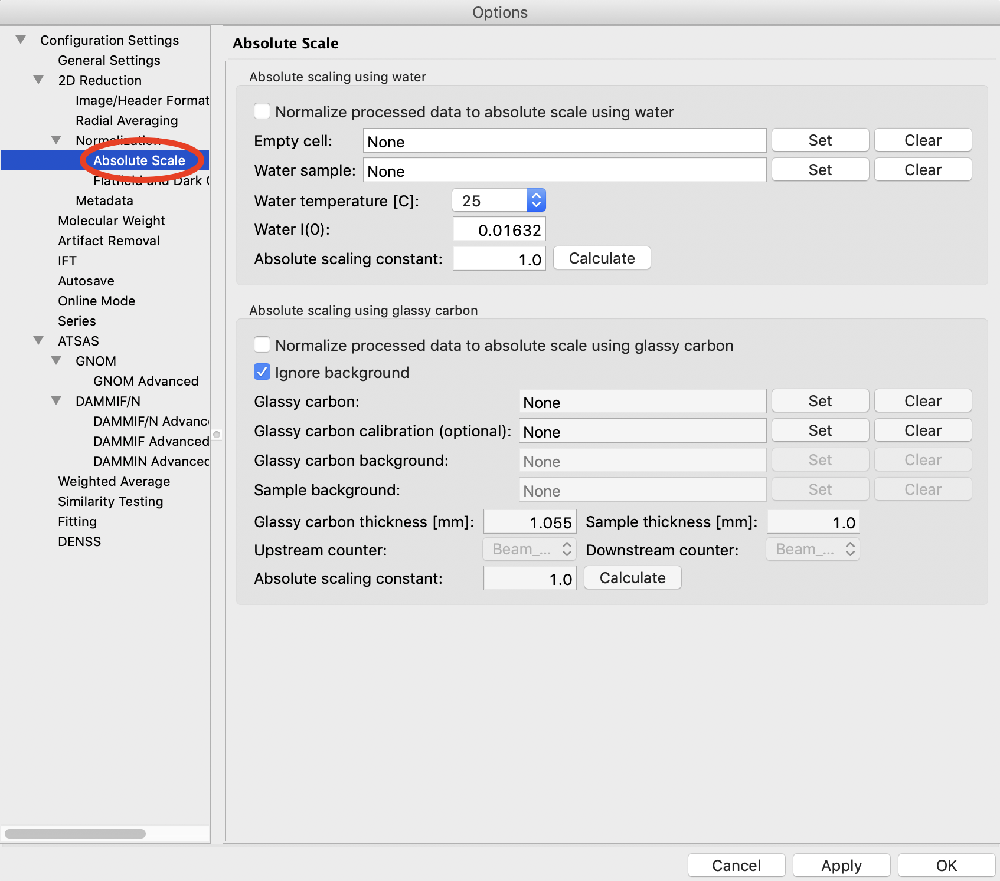
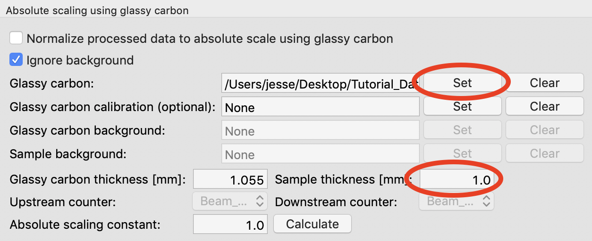
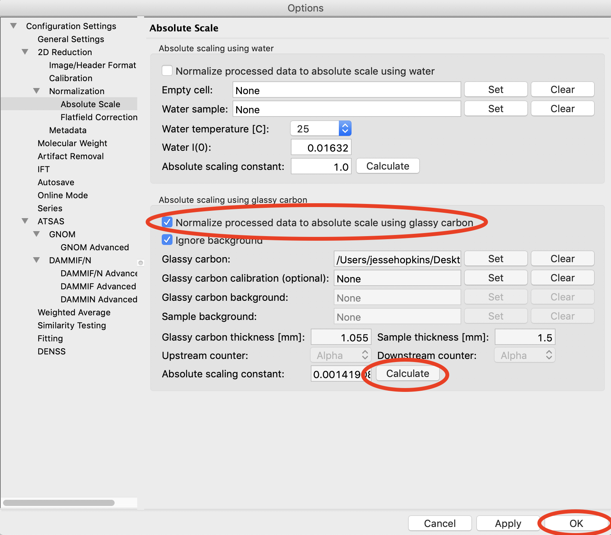
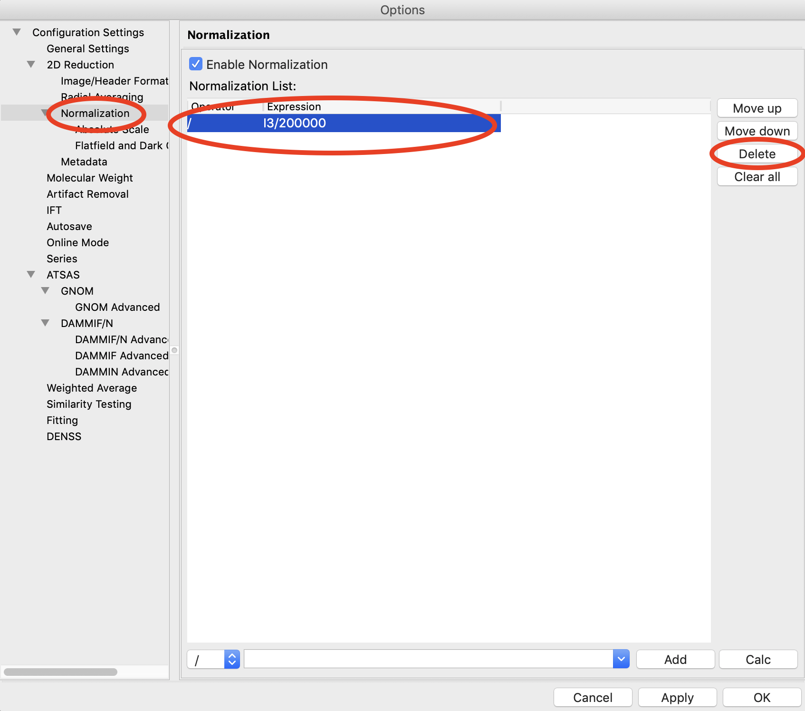
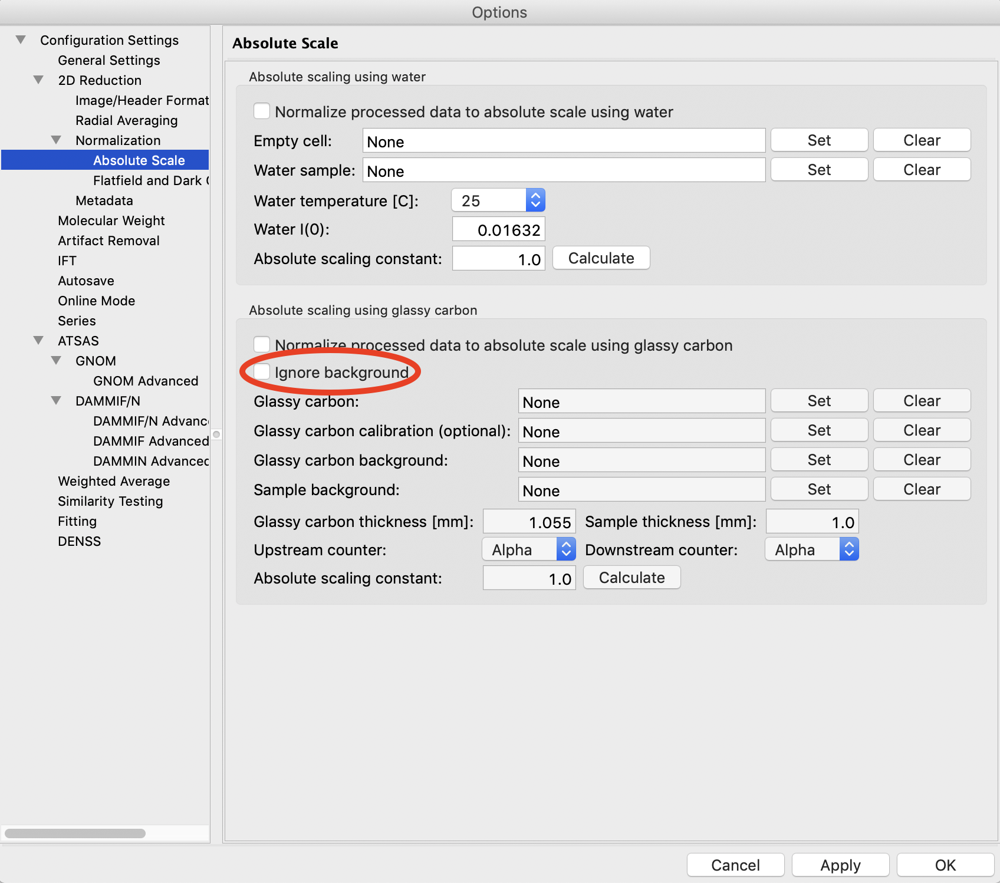
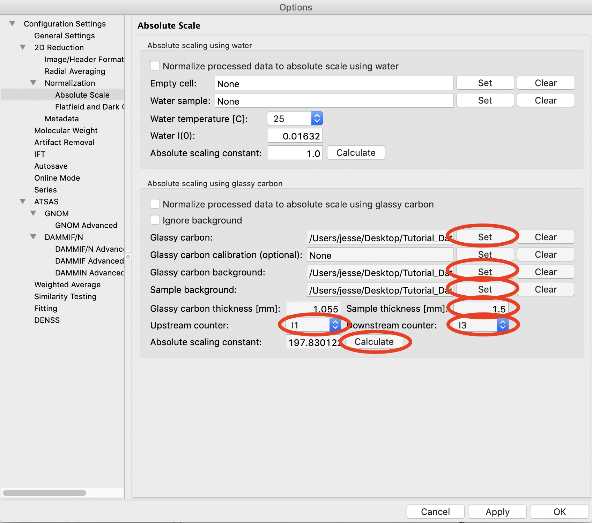

Setting absolute scale with glassy carbon
^^^^^^^^^^^^^^^^^^^^^^^^^^^^^^^^^^^^^^^^^^^^^^^^^
.. _s3p6:

This section teaches you how to set up absolute scale using glassy carbon (NIST SRM 3600)
as a reference. It assumes you have completed :ref:`Parts 1 <s3p1>`,
:ref:`2 <s3p3>` and :ref:`3 <s3p4>`\ . Note that you can use water (:ref:`Part 4 <s3p5>`) or
glassy carbon for absolute scale calibration in RAW. Glassy carbon is the more accurate approach,
if available.

There are two ways to use glassy carbon as a standard in RAW. One way follows the NIST
protocol, and will deliver the most accurate results. However, this method depends on
all measurements having reliable flux measurements upstream and downstream of the sample.
It also requires accurate measurements of the background of the glassy carbon measurement
and the sample measurements. The second way is more similar to that used by water, in that
it essentially ignores the background (assumes it to be small). This approach only requires
regular normalization and a single measurement of the background for the glassy carbon sample.

A video version of this tutorial is available:

.. raw:: html

    
<iframe src='https://www.youtube.com/embed/dhmd4IzlMfM' frameborder='0' allowfullscreen></iframe>

The written version of the tutorial follows.

Simple (ignoring background)
*********************************************

#.  Load/use the settings from part 3 (without absolute scale set from water, part 4). If you
    haven't done those parts, the settings are saved available as **settings.cfg**
    in the **calibration_data** folder.

#.  Plot both of the **glassy_carbon2_011_000x.tif.tif** files, where x is 1-2, on the main plot.

    *   *Tip:* :ref:`Section 1 Part 1 <s1p1>` of this tutorial document teaches you how to do this.

#.  Average the **glassy_carbon** files you just loaded. Save the average in
    the **calibration_data** folder.

#.  Open the Options window by selecting “Advanced Options” in the Options menu.

#.  Click on the Absolute Scale section in the options list on the left.

    |config_absgc1_png|

#.  Click on the Glassy carbon “Set” button and select the **A_glassy_carbon2_011__0001.dat**
    file you just saved.

#.  Set the Sample thickness to 1.0 mm.

    |config_absgc2_png|

#.  Click “Calculate” button. You should get about 324.

    *   *Note:* It is important that you not change your normalization settings once
        you have set the absolute scaling constant. If you do, you will have to recalculate
        the absolute scaling constant. Also, make sure absolute scale is turned off before
        you calculate the scale constant, otherwise you will get a bad scaling constant.

#.  Check the “Normalize processed data to absolute scale using glassy carbon” checkbox.

#.  Click “OK” to exit the advanced options panel, saving the changes.

    |config_absgc3_png|

#.  Save the settings for future use.

Full (NIST recommended)
******************************************

**Important note:** All of the normalization (including flux, transmission, etc) happens
through the absolute scale panel. You shouldn’t have anything set in the Normalization
panel (unless you are doing something like subtracting off a constant pedestal from the
image).

*Note:* The calibration dataset used for the previous ('Simple') approach
doesn't have the requisite data to use for the full approach. So we will use
the data in the **calibration_data/extra** folder.

#.  Load the **SAXS.cfg** file in the **calibration_data/extra** folder.

#.  Open the Options window by selecting “Advanced Options” in the Options menu.

#.  Click on the Normalization section in the options list on the left.

#.  Remove any/all items in the Normalization List by highlighting them in the list
    and clicking the “Delete” button.

    |config_absgc_full1_png|

#.  Go to the Absolute Scale options section and turn off any absolute scaling
    already in place.

#.  Click “OK” to exit the advanced options window and save the changes.

#.  Plot the **glassy_carbon_41_001_0000.tiff** file.

    *   *Tip:* :ref:`Section 1 Part 1 <s1p1>` of this tutorial document teaches you how
        to do this.

#.  Save the **glassy_carbon** profile in the **calibration_dat/extra** folder.

#.  Plot and save the **vac_37_001_0000.tiff** and ** MT2_48_001_0000.tiff **
    profiles.

#.  Open the Options window and select the Absolute Scale section.

#.  Uncheck the Ignore background checkbox.

    |config_absgc_full2_png|

#.  Click the Glassy carbon “Set” button and select the **glassy_carbon_41_001_0000.dat** file.

#.  Click the Glassy carbon background “Set” button and select the **vac_37_001_0000.dat** file.

    *   *Tip:* This is the instrument background from when the glassy carbon
        images were taken.

#.  Click the Sample background “Set” button and select the **MT2_48_001_0000.tiff** file.

    *   *Tip:* This is the instrument background from when sample images
        were taken, including the empty sample cell.

#.  Set the Sample thickness to 1.5 mm.

#.  Set the Upstream counter to I1.

#.  Set the Downstream counter to I3.

#.  Click the “Calculate” button. You should get an absolute scaling constant near 198.

    *   *Note:* This approach will only work if the .dat files you select for the glassy
        carbon, glassy carbon background, and sample background contain the upstream and
        downstream counter values. This happens automatically with RAW. Otherwise, you should
        use images, which will have more noise, but should allow RAW to find all of the
        appropriate counter values.

    *   *Note:* It is important that you not change your normalization settings once you
        have set the absolute scaling constant. If you do, you will have to recalculate the
        absolute scaling constant. Also, make sure absolute scale is turned off before you
        calculate the scale constant, otherwise you will get a bad scaling constant (see the
        manual for details).

    |config_absgc_full3_png|

#.  Check the “Normalize processed data to absolute scale using glassy carbon” checkbox.

#.  Click “OK” to exit the advanced options panel, saving the changes.

#.  Save the settings for future use.

**Comparison note:**

We find that for the example data in the calibratin_data/extras folder, the
two methods of glassy carbon calibration agree within ~1.5%. The best approach
depends on how strong your background scattering is relative to the rest of
the scattering in the system.

