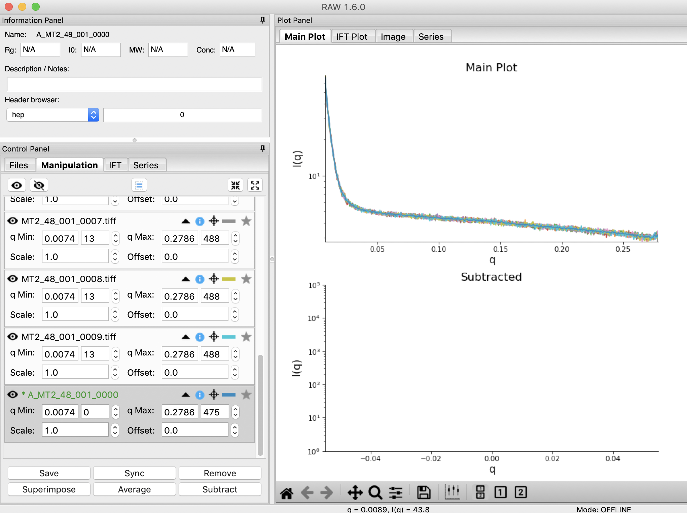
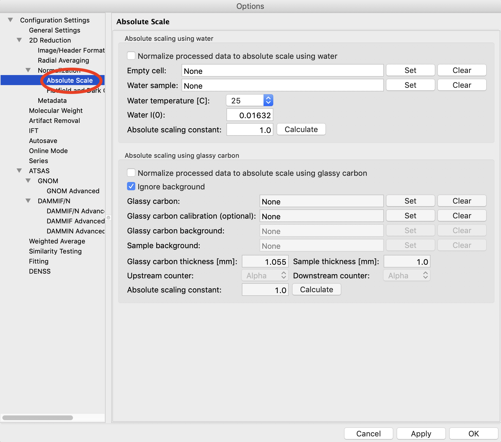
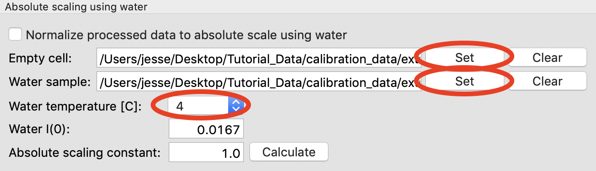
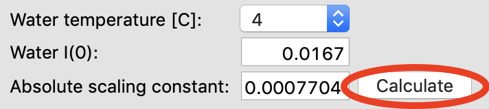
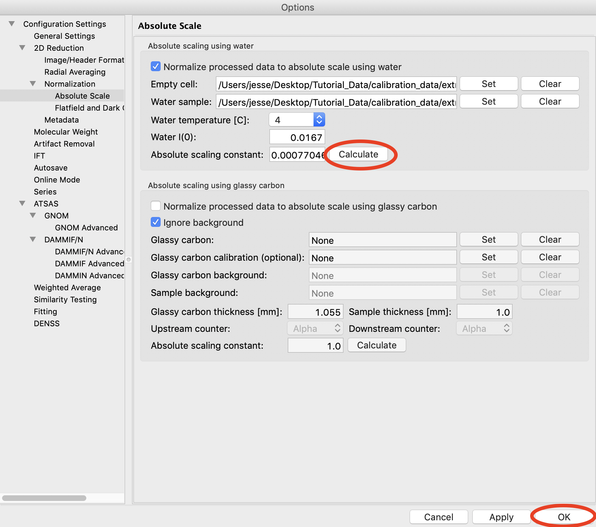

Setting absolute scale with water
^^^^^^^^^^^^^^^^^^^^^^^^^^^^^^^^^^^^^^^^^
.. _s3p5:

This section teaches you how to set up absolute scale using water as a reference.
Note that you can use water or glassy carbon (:ref:`Part 5 <s3p6>`)
for absolute scale calibration in RAW. Glassy carbon is the more accurate approach,
if available.

*Note:* The calibration dataset used for the first parts of this tutorial
doesn't have the requisite data to use for this part. So we will use
the data in the **calibration_data/extra** folder.

A video version of this tutorial is available:

.. raw:: html

    
<iframe src='https://www.youtube.com/embed/Qa4a-5wHGpE' frameborder='0' allowfullscreen></iframe>

The written version of the tutorial follows.

#.  Load the **SAXS.cfg** file in the **calibration_data/extra** folder.

#.  Plot all of the **MT2_48_001_000x.tiff** files, where x is 0-9, on the main plot.

    *   *Tip:* :ref:`Section 1 Part 1 <s1p1>` of this tutorial document teaches you
        how to do this.

#.  Average the **MT2** files you just loaded. Save the average in the **calibration_data**
    folder.

    |config_abswater1_png|

#.  Repeat steps 1 and 2, plotting, averaging and saving, for the **water2_49_001_000x.tiff**
    files.

#.  Open the Options window by selecting “Advanced Options” in the Options menu.

#.  Click on the Absolute Scale section in the options list on the left.

    |config_abswater2_png|

#.  Click on the Empty cell “Set” button and select the **A_MT2_48_001_0000.dat**
    file.

#.  Click on the Water sample “Set” button and select the **A_water2_49_001_0000.dat**
    file.

#.  Set the Water temperature to 4 C.

    |config_abswater3_png|

#.  Click the Calculate button to calculate the Absolute Scaling Constant. You should
    get a value near 0.00077.

    *   *Tip:* You can also use images to set the absolute scale. This may give worse
        results, as the signal to noise of the averaged file should be better than for
        a single image.

    *   *Note:* It is important that you not change your normalization settings once you
        have set the absolute scaling constant. If you do, you will have to recalculate
        the absolute scaling constant. Also, make sure absolute scale is turned off before
        you calculate the scale constant, otherwise you will get a bad scaling constant
        (see the manual for details).

    |config_abswater4_png|

#.  Check the “Normalize processed data to absolute scale” checkbox. Click “OK” to
    exit the advanced options window and save the changes.

    |config_abswater5_png|

#.  Save the settings for later use.

