Centering and calibration
^^^^^^^^^^^^^^^^^^^^^^^^^^^^^^^^^^^^^^^^^^^^^^^^^^^^
.. _s3p1:

The first step is to set the beam center, x-ray wavelength, and sample to detector distance.
Before this can be done, you have to set the image and file header type in the Options window.
The best way to find the beam center and sample to detector distance is using the automated
method in RAW.

#.  Open RAW. The install instructions contain information on installing and running RAW.

#.  Open the Options window by going to the Options menu (top of the RAW window or in the
    system bar, depending on your OS) and selecting “Advanced Options”

#.  In the options window, select the Image/Header Format section on the left.

#.  In the area on the right, set the Image format dropdown menu to “Pilatus” and the
    Header file format to “BioCAT, APS”.

    |options_header_png|

#.  Go to the "General Settings" section. If necessary, uncheck both of the Flip Image
    checkboxes. These allow you to control the orientation of the displayed image,
    and make it match the physical layout of the instrument. For this beamline and
    image type, no modification is necessary.

    |options_general_png|

#.  Go to the "Radial Averaging" section. Set the Detector to "pilatus_1m"

    |options_radial_1_png|

#.  Click the OK button in the bottom right to close the window and save the
    changes to the settings.

#.  In the files tab, avigate to the **Tutorial_Data/calibration_data** folder.

#.  We will use silver behenate to calibrate the sample to detector distance,
    the beam center on the detector, and the detector rotation. Show the silver
    behenate image by selecting the **agbe_008_0001.tif** file and clicking
    the show image button at the bottom of the File Control panel.

    |calibration_image_png|

#.  In the Image Plot Panel that is now showing, click on the Image Display Settings
    button (looks like vertical slider bars) at the bottom of the screen.

#.  In the window that appears, set the scale to logarithmic and and click “OK”.

    |calibration_logscale_png|

#.  Open the Centering/Calibration panel by going to the Tools menu and selecting
    “Centering/Calibration”.

    |calibraiton_auto_panel_png|

#.  In the Centering/Calibration panel set the Energy to 12.0 keV. Verify that the
    Detector Pixel Size is 172.0 x 172.0 μm. Verify that the Detector is set to
    "pilatus_1m". Verify that the standard is set to AgBh.

    *   *Note:* The x-ray energy/wavelength is a previously measured value.

    *   *Note:* If you set the detector properly in the radially averaging
        options panel the detector and detector pixel size values will
        fill in automatically (if the detector is not Other).

    |calibration_parameters_png|

#.  The goal of centering and calibration is to find a beam center position, sample
    to detector distance, and detector rotation that causes the calculated
    Silver-Behenate ring pattern to match up with the rings on the image.

    *   *Note:* The beamstop is the blue/green bar extending out from the top
        right edge of the detector

#.  Click the “Start” button in the “Automatic Centering/Calibration” panel.

#.  Make sure the “Ring #” is set to 0. Click on a point with strong intensity in
    the Silver Behenate ring nearest the beamstop.

    *   *Note:* For some experimental setups, one or more of the largest d-spacing
        rings may not be visible on the detector. In this case, you need to figure
        out what the first visible ring on the detector is, and set the ring number
        to that. So, if the third ring was the first one on the detector, the Ring #
        would be set to 2 (the ring number is zero index, so 0 corresponds to the first
        ring, 1 to the second ring, and so on).

    |calibraiton_centering_1_png|

#.  The peak intensity points in that ring will be automatically found, and labeled with
    tan-ish dots.

    *   *Tip:* If it didn’t find very many points, try clicking again on another
        part of the ring, and it will add more points to your selection.

#.  Click on the other portions of the same ring that are on different detector
    panels to find out the rest of the points in this calibration ring.

    *   *Note:* The autofind algorithm will only find peaks in contiguous
        regions.

    *   *Tip:* Due to the color map selected, the points may be hard to see. Try changing
        to the heat map or grayscale to see the selected points,.

    |calibraiton_centering_2_png|

#.  Change the “Ring #” to 1.

    |calibraiton_ring_number_png|

#.  Click on a peak intensity point of the second visible ring. Do this for all
    the sections of this ring in different detector modules.

#.  Change the “Ring #” to 2. Click on a peak intensity point of the third visible
    ring. Points will be shown with green dots.

#.  Click the “Done” button in the “Automatic Centering/Calibration” panel.

    |calibraiton_centering_3_png|

#.  The beam position, sample to detector distance, and detector tilt angles will
    be calculated and filled in. Calculated rings will display on the plot as
    dashed red lines, based on the parameters found in the fit. The beam center
    is displayed as a red dot on the image. You can verify the validity of the
    fit based on how these calculated values match up with what is shown on the image.

    *   *Note:* Calculated rings are displayed without detector tilt angles, so if the detector
        is significantly off beam normal the calculated rings will not match up with the
        measured rings.

    *   *Note:* Image tilt plane rotation is an odd value. It represents motions of
        both X and Y around the Z axis of the detector. As such, it can take on
        large values (such as -131) for very small detector angles, which is just
        representing motion in both axes. In this case, all three detector angles are
        ~0.7 degrees or less.

    |calibraiton_centering_4_png|

#.  If necessary (such as if the autocentering routine fails), all of the calibration
    values can be adjusted manually. The beam center can either be typed into the
    appropriate boxes, or the red arrows can be used to nudge it by "Steps" pixels
    in any direction. The crosshares can be used to pick the beam center position by
    hand, good for getting a rough alignment. The other parameters can be
    typed into their appropriate boxes. Manual centering is an iterative process:

    #.  Enter rough values based on observation, measurement of actual sample
        detector distance.

    #.  Use arrows to move beam center until you match up with the first ring.

    #.  Adjust the distance until you match up with the second ring.

    #.  Repeat the last two steps as necessary until you converge on a solution.

#.  Click the OK button in the Centering/Calibration panel to save your settings and
    exit the panel.

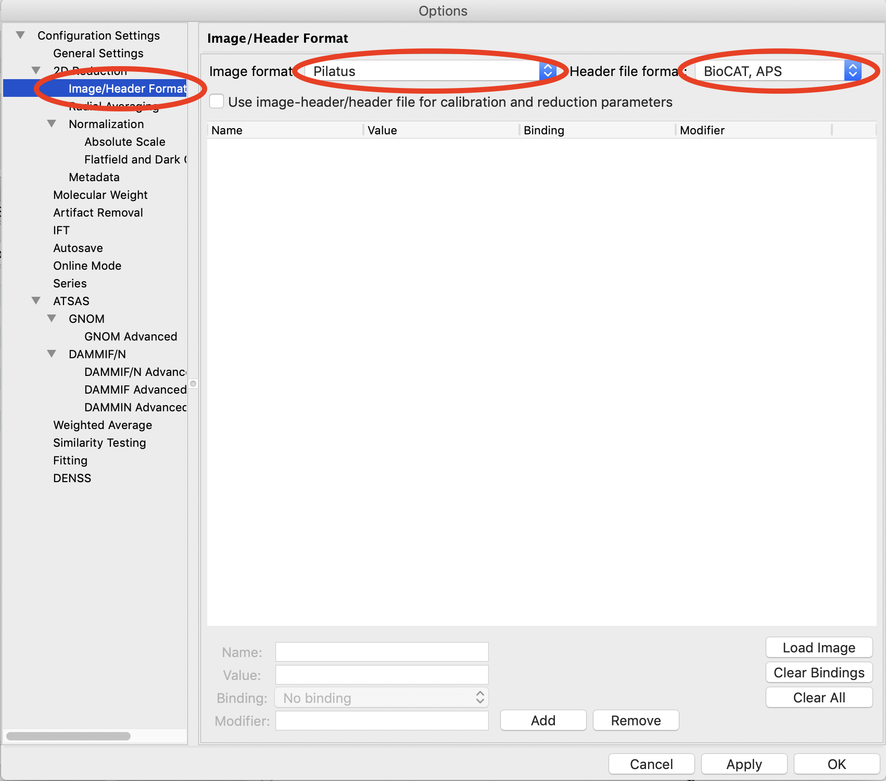

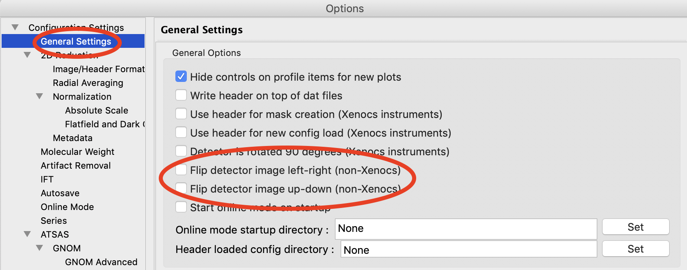

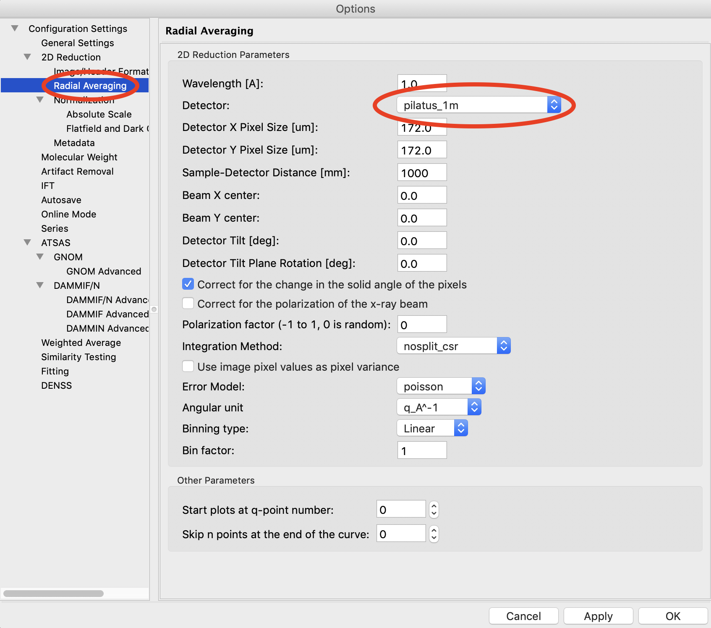

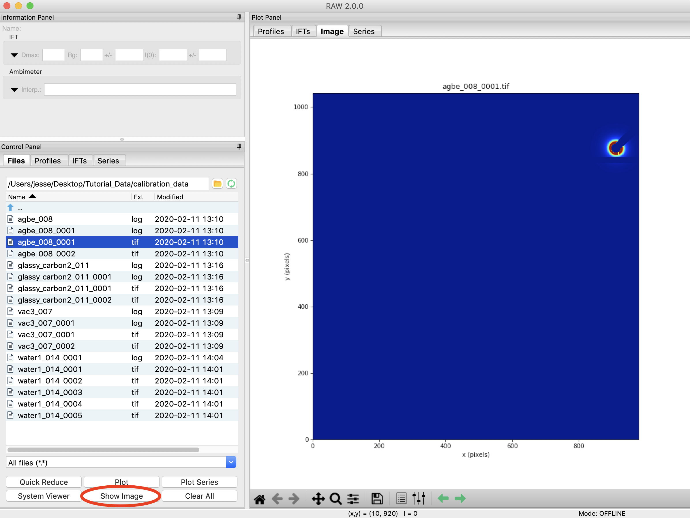

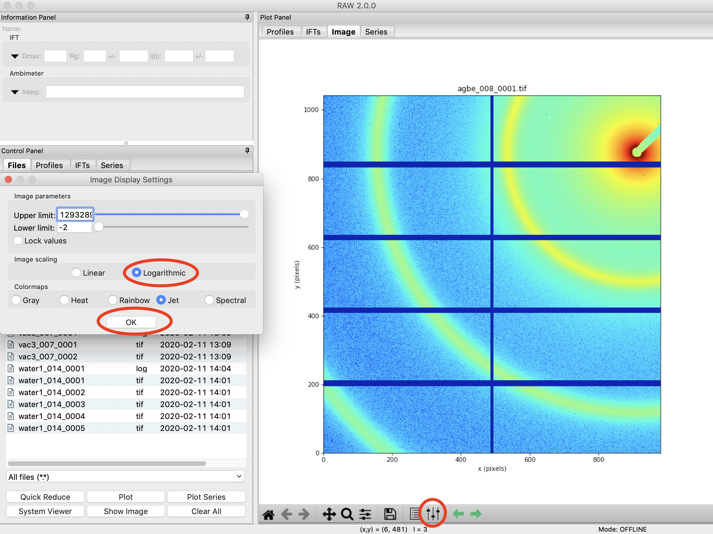

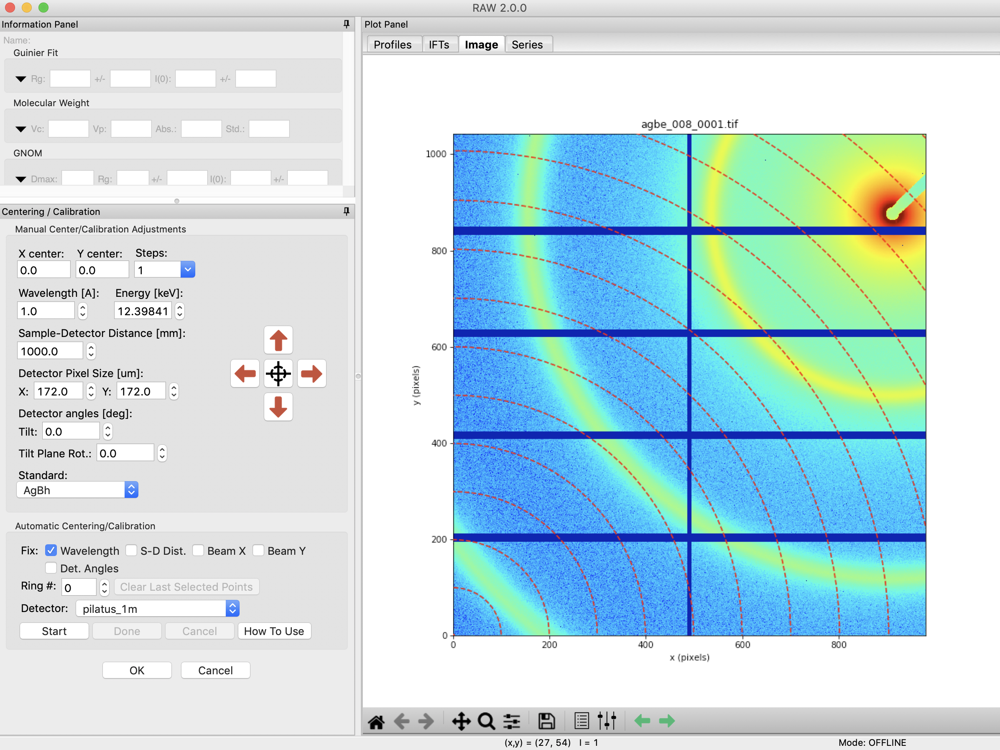

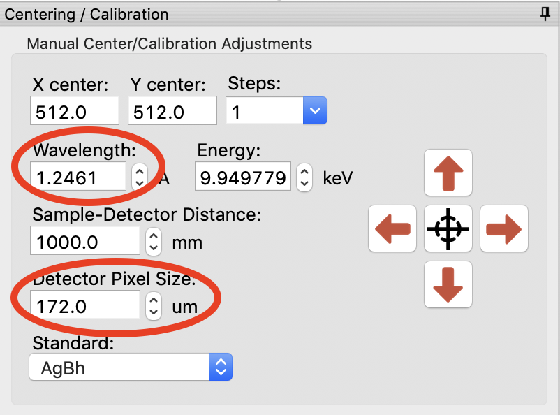

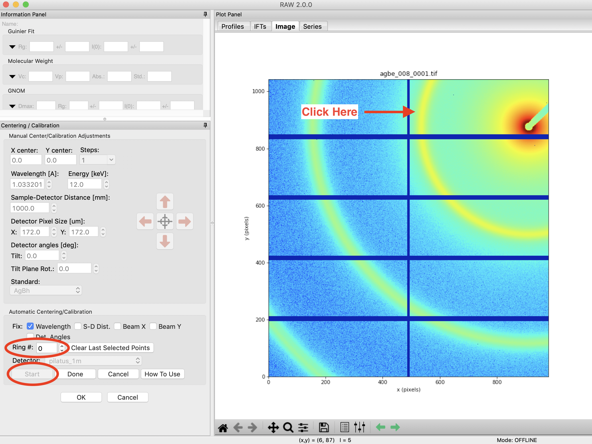

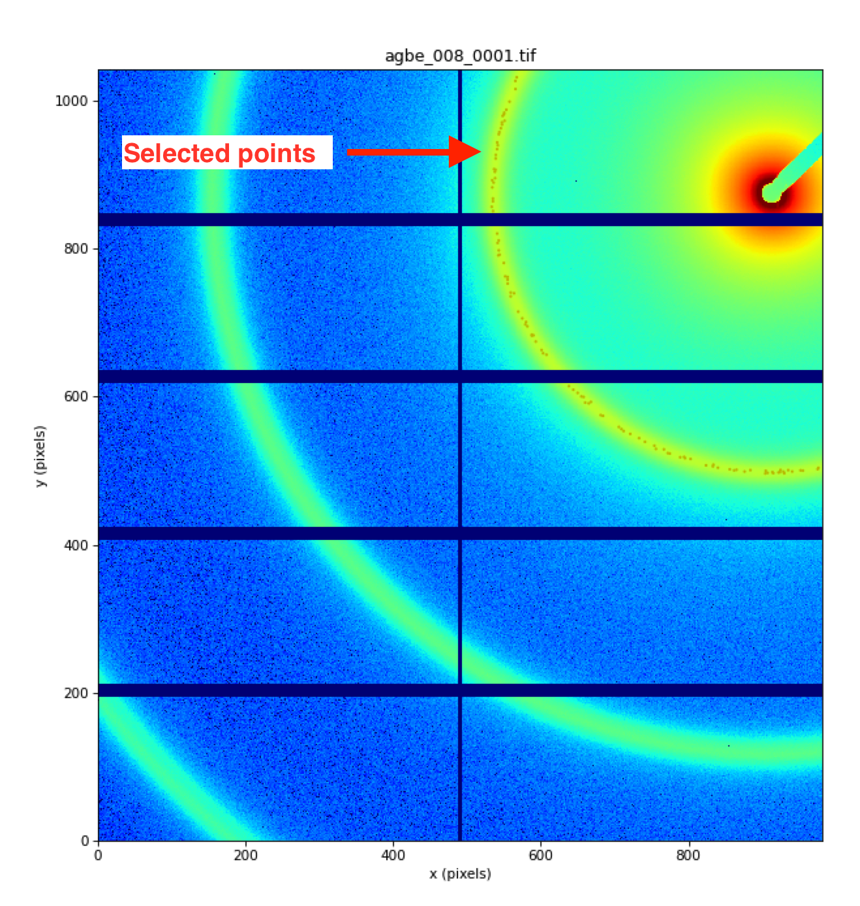

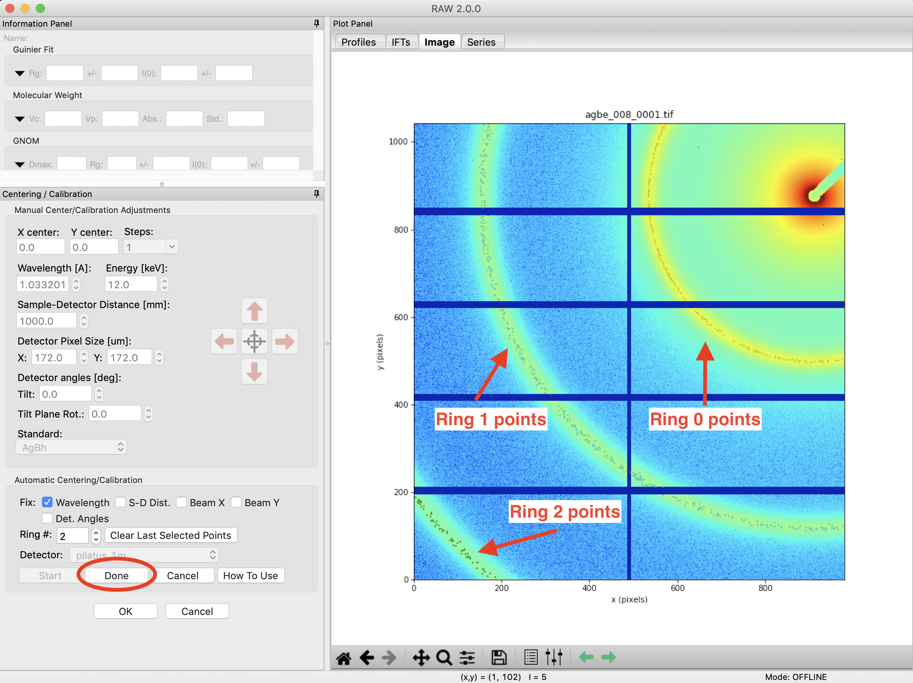

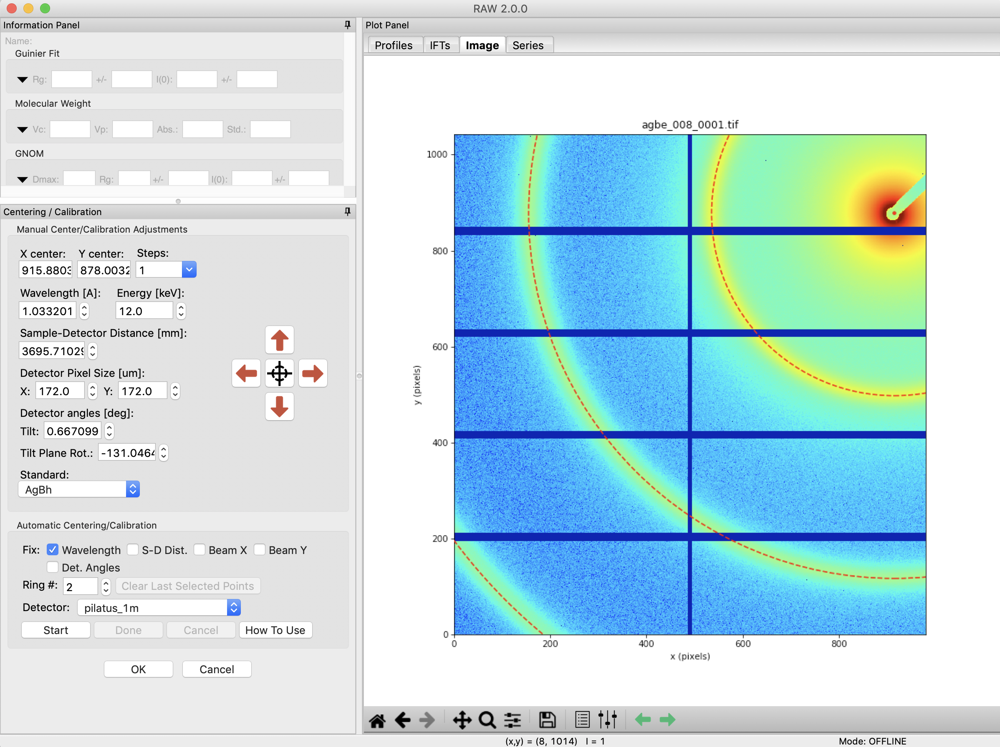

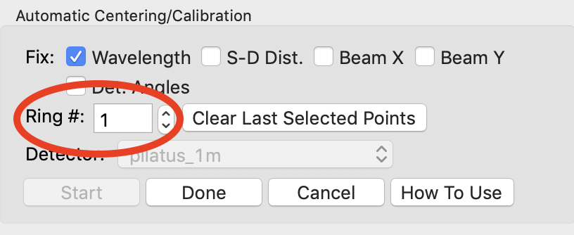
