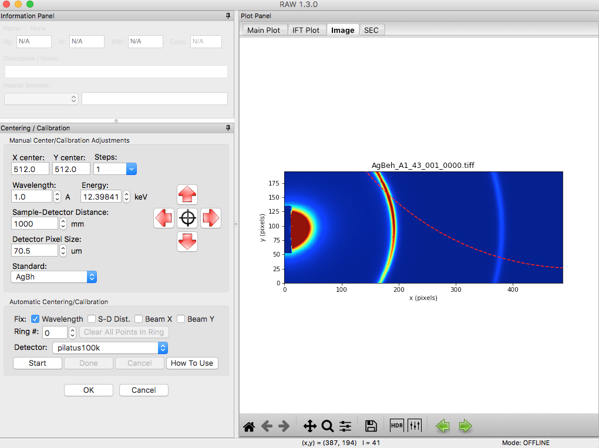
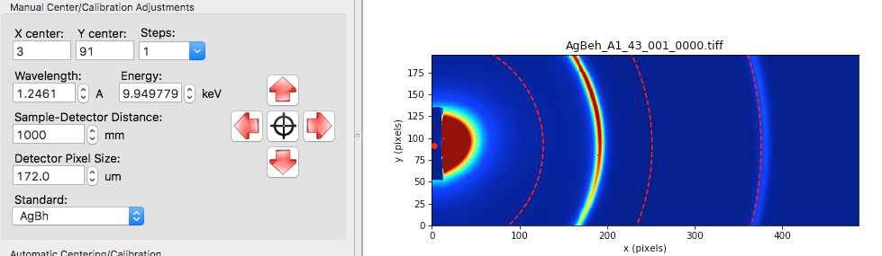
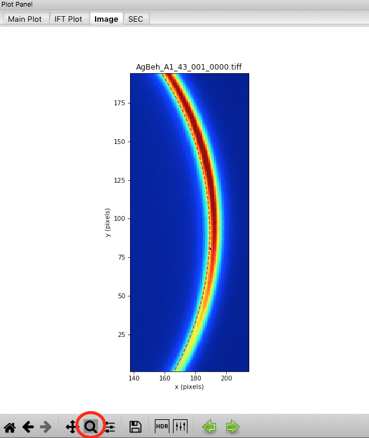
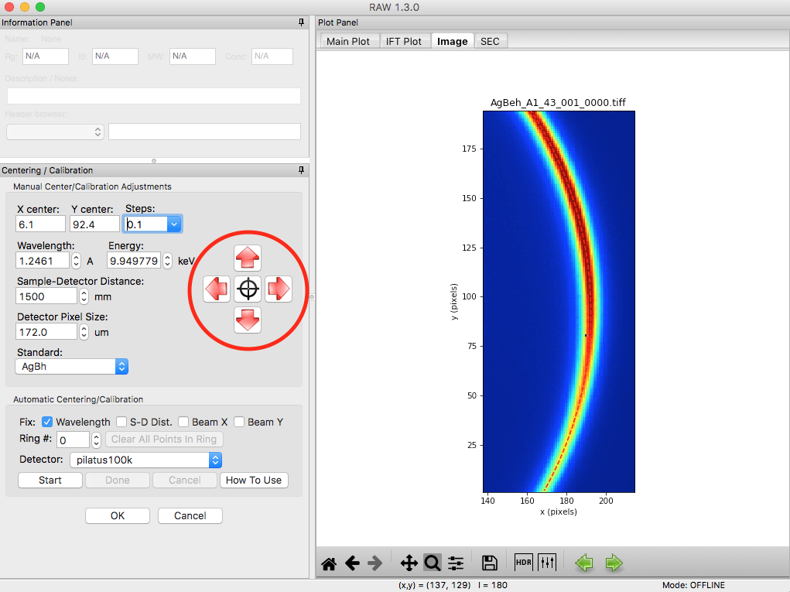

Centering and calibration – Manual method
^^^^^^^^^^^^^^^^^^^^^^^^^^^^^^^^^^^^^^^^^^^^^^^^^^^^^
.. _s3p2:

If the automated method fails, you can also carry out centering and calibration

#.  If you haven’t already, carry out Steps 1-9 of Part 1, so that the
    **AgBeh_A1_43_001_0000.tiff** file is shown in the Image Plot Panel with an upper
    limit of 90000 set for the image.

#.  In the Image Display settings (see Part 1, Step 8), set the upper limit to 9000 and
    click “OK” to close the settings window.

    |10000201000001C00000011359B0899F361B50F4_png|

#.  Open the Centering/Calibration panel by going to the Tools menu and selecting
    “Centering/Calibration”.

    |10000201000003FC000002FB4AC9E9FB85B6D0CA_png|

#.  In the Centering/Calibration panel set the wavelength to 1.2461 Å. Set the detector
    pixel size to 172.0 μm.

    *   *Note:* The x-ray energy/wavelength is a previously known value, and is not
        found in RAW.

    |1000020100000189000001206B620B7F6AC688A3_png|

#.  We know that the beam is probably near the center of the beamstop. Click on the
    crosshairs button and click in the center of the beamstop.

    *   *Note:* The beamstop is the dark blue patch extending out from the center of
        the left edge of the detector.

#.  *Checkpoint:* Once you have done that, three rings should be displayed on the
    image, and the current beam center is shown as a red dot on the image. This is shown below.

    |10000201000003D30000011DBB83199F9986606D_png|

#.  Set the Sample-Detector Distance to 1500 mm.

    *   *Note:* The rough sample to detector distance is known from direct measurement
        of the experimental setup. Calibration can be done without this knowledge, but
        will take longer.

#.  Using the zoom tool at the bottom of the Plot window, zoom in on the first ring
    shown on the detector.

    |1000020100000262000002D49D3E5CCAB5D20DEE_png|

#.  Using the red arrow buttons, move your beam center until the dashed red line (first
    silver behenate ring) matches with the hottest (most red) pixels of the first
    ring shown on the detector.

    |10000201000003FD000002FD63F3FE9B954A53E3_png|

#.  Use the home button to zoom out to the whole extent of the detector image.

    |100002010000019E0000002822CCA30221A5A768_png|

#.  Open the image display settings and set the upper limit to 2000. Zoom in on the
    second silver behenate ring on the image (near x=380). Use the spin controls
    (up/down arrows) on the sample detector distance to adjust the distance until
    the red dashed ring matches perfectly with the hottest pixels on the detector image.

#.  Zoom back out to the full extent of the image. Set the image display upper limit
    back to 9000. Zoom in on the first ring, and adjust the beam center position
    until that ring perfectly matches the hottest pixels on the detector.

    *   *Tip:* If you had the ring properly centered in y the first time, you should only
        need to adjust the x position (left/right).

#.  Iterate steps 10-13 until both rings are well aligned. You should find an X center
    of ~4, a Y center of ~ 92.5, and a sample-detector distance of ~1517 mm.

    *   *Tip:* You can adjust the step size for moving the beam center using the “Steps”
        menu. You can either pick a value from the dropdown menu, or enter your own value
        in the box.

    *   *Tip:* The spin controls adjust the last digit of the value in the box. So if you want
        to adjust the sample-detector distance more finely than 1 mm, set the distance to
        (for example) 1500.0 and then the spin controls will change the distance in steps
        of 0.1 mm.

#.  Compare the manually found center and sample detector distance with those you found
    automatically in Part 1 (if you did that). If you did a careful job in this part,
    they should compare well.

.. |10000201000001C00000011359B0899F361B50F4_png| image:: images/10000201000001C00000011359B0899F361B50F4.png

.. |1000020100000189000001206B620B7F6AC688A3_png| image:: images/1000020100000189000001206B620B7F6AC688A3.png

.. |100002010000019E0000002822CCA30221A5A768_png| image:: images/100002010000019E0000002822CCA30221A5A768.png
