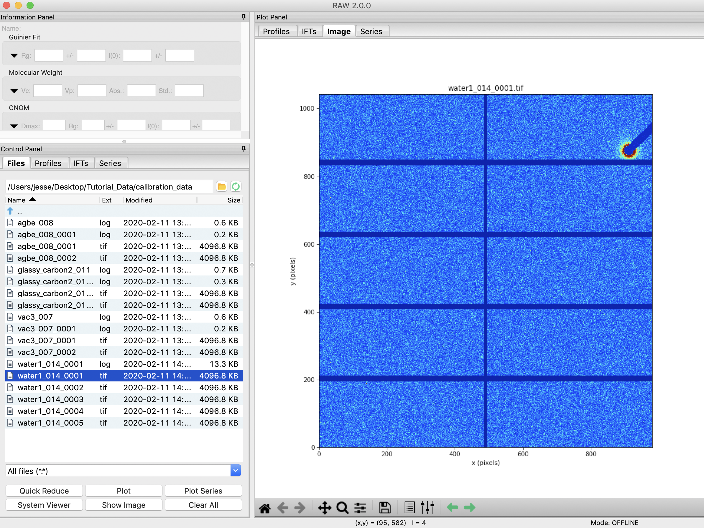
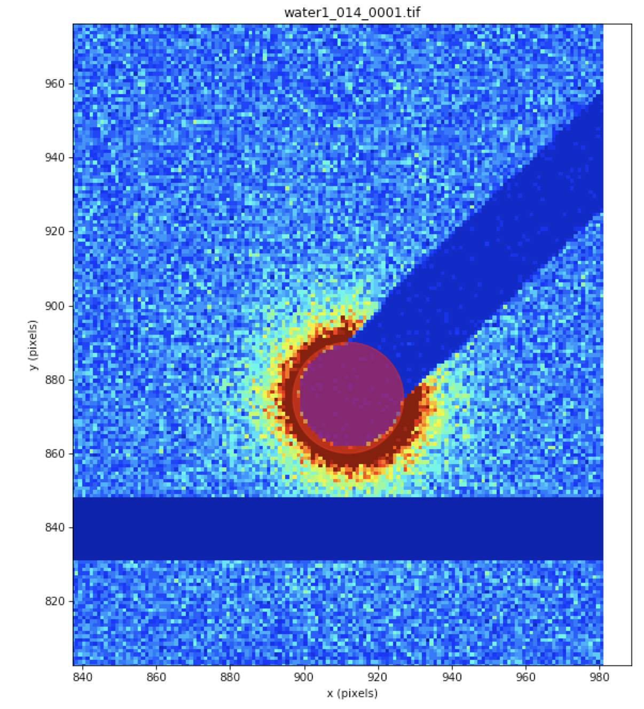
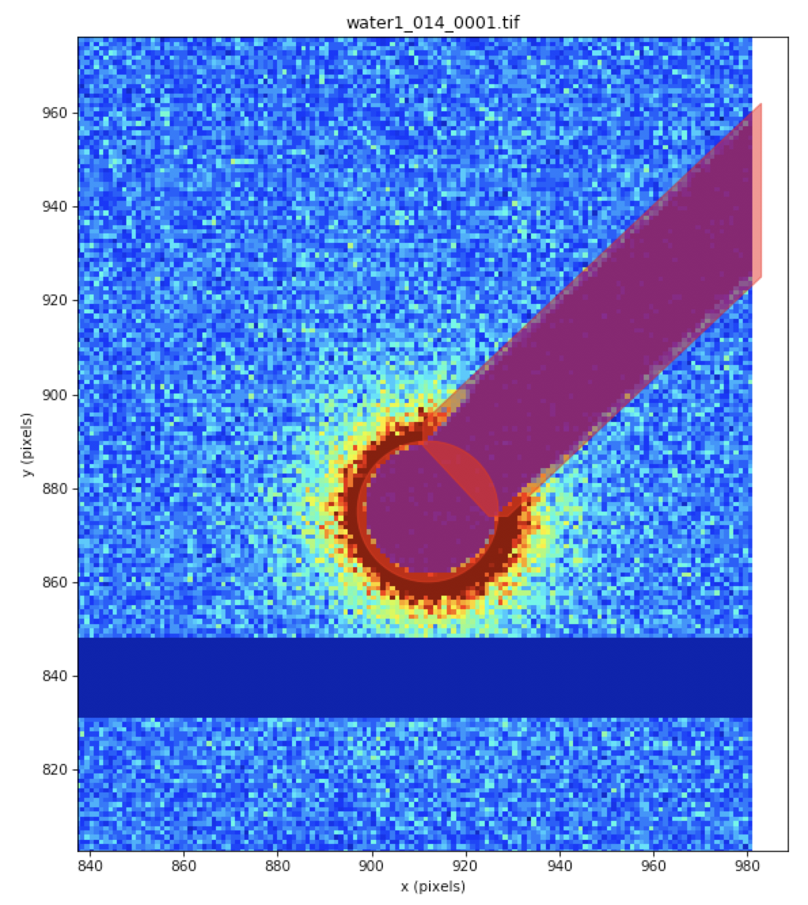
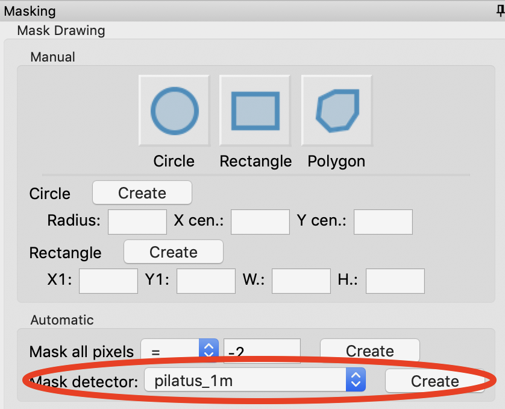

Masking
^^^^^^^^^^^^^^^
.. _s3p3:

The first step in creating a calibraiton file is to to mask out unwanted
portions of your image, such as the beamstop and bad detector pixels. Before
this can be done, you have to set the image and file header type in the Options window.

A video version of this tutorial is available (please see the first part of the centering
and calibration video for how to set the initial options):

.. raw:: html

    
<iframe src='https://www.youtube.com/embed/JiacpOC4FJE' frameborder='0' allowfullscreen></iframe>

The written version of the tutorial follows.

#.  Open RAW. The install instructions contain information on installing and running RAW.

#.  Open the Options window by going to the Options menu (top of the RAW window or in the
    system bar, depending on your OS) and selecting “Advanced Options”

#.  In the options window, select the Image/Header Format section on the left.

#.  In the area on the right, set the Image format drop-down menu to “Pilatus” and the
    Header file format to “BioCAT, APS”.

    |options_header_png|

#.  Go to the "General Settings" section. If necessary, uncheck both of the Flip Image
    checkboxes. These allow you to control the orientation of the displayed image,
    and make it match the physical layout of the instrument. For this beamline and
    image type, no modification is necessary.

    |options_general_png|

#.  Go to the "Radial Averaging" section. Set the Detector to "pilatus_1m"

    |options_radial_1_png|

#.  Click the OK button in the bottom right to close the window and save the
    changes to the settings.

#.  In the files tab, navigate to the **Tutorial_Data/calibration_data** folder.

#.  In the Files tab, select the **water1_014_0001.tif** file and click the show image button.

    *   *Tip:* It's usually best to make a mask on a water or buffer image. If you do it
        on instrument background, which can be quite low, it can be hard to tell
        where the edges of the beamstop are. If you do it on a bright image,
        like a silver behenate or glassy carbon, you can get fooled by a small
        amount of bleed onto the pixels at the edge of the beamstop and not
        make a large enough mask.

#.  Set the image upper limit to 30 on a linear scale.

#.  Open the masking panel by clicking “Masking” in the Tools menu.

#.  Zoom in around the beamstop.

    *   *Note:* The beamstop is the blue bar in the upper right of the detector.

#.  Select the Pan tool and left click and drag the image to the left until you can
    see a blank (white) canvas to the left of the beamstop.

    |masking_panel_png|

#.  Click on the circle mask drawing button and click on a point at the center of
    the circular part of the beamstop.

#.  Move the cursor until the red outline of the circle covers the beamstop. Click
    again to make the circle mask.

    *   *Tip:* If you mess up drawing the mask, click on the masked region (shaded red)
        and click your backspace/delete key to remove it.

    *   *Tip:* You can also resize a rectangle (or circle) mask my right clicking on
        it and selecting resize.

    *   *Tip:* You can create a rectangle of defined position and size by entering
        the x and y coordinates of the bottom left corner and the width and
        height of the rectangle then clicking 'Create'.

#.  If the mask is not perfectly centered, click and drag it until it's centered.

#.  If the mask is too large or small once centered, right click and click resize.
    Then move the mouse pointer to resize the mask, and click once to set the new size.

    |masking_circle_png|

#.  Click on the polygon mask drawing button. Click on a point circular part of the
    beamstop near the top right edge. Click again near the start of the bar.
    Click again just past the top of the bar in the white canvas. Click again
    in the white canvas just below the bottom of the bar. Click again near the
    start of the bar on the bottom side near the circular region. Click again
    in the circular part of the beamstop near the bottom edge. Right click to
    finish the map.

    *   *Tip:* Each click in a polygon mask adds a new point, which defines a
        line segment between it and the previous point.

    |masking_polygon_png|

#.  Zoom back out to the full extent of the image.

#.  Next you need to mask out the bad pixels on the detector. On a Pilatus detector,
    bad pixels usually have a value of -2.

#.  In the automatic section of the Mask Drawing controls, set Mask All Pixels = -2
    and click 'Create'.

    *   This control allows you to mask pixels at, above, or below a given threshold.
        It is particularly useful for things like bad pixels, where the value is known.

    |masking_thresh_png|

#.  Next we need to mask the gaps between detector panels. Verify that the "pilatus_1m"
    detector is selected in the "Mask detector" control. Then click "Create".

    *   This control automatically creates masks of panel gaps for any known
        detector type.

    |masking_panel_gap_png|

#.  In the masking panel, make sure that “Beamstop mask” is selected in the Mask Creation
    drop-down menu. Click the "Set" button to set the mask you just made as the beamstop mask.

    |masking_set_png|

#.  Click the OK button to exit the masking panel.

#.  If you wish to edit the current mask, reopen the Masking panel. Then
    click the "Show" button to show the current mask. From there you can make changes,
    then click "Set" again.

**Additional Tips**

#.  Don't be confused by the "Save to File" and "Load from file" buttons.
    These save the mask to a separate file or load a mask from a separate file.
    These do not save or set the mask in RAW. To do that you need to use the
    "Set" button as described above. The mask is then saved with the settings.

.. |options_header_png| image:: images/options_header.png
    :target: ../_images/options_header.png

.. |options_general_png| image:: images/options_general.png
    :target: ../_images/options_general.png

.. |options_radial_1_png| image:: images/options_radial_1.png
    :target: ../_images/options_radial_1.png

.. |masking_panel_png| image:: images/masking_panel.png
    :target: ../_images/masking_panel.png

.. |masking_thresh_png| image:: images/masking_thresh.png
    :width: 400 px
    :target: ../_images/masking_thresh.png

.. |masking_set_png| image:: images/masking_set.png
    :target: ../_images/masking_set.png
