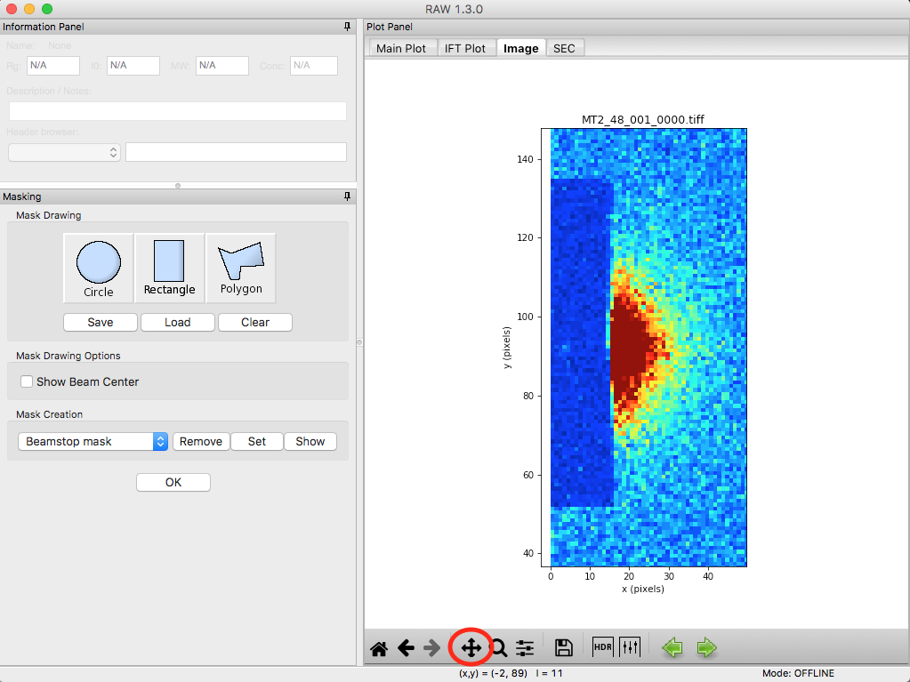
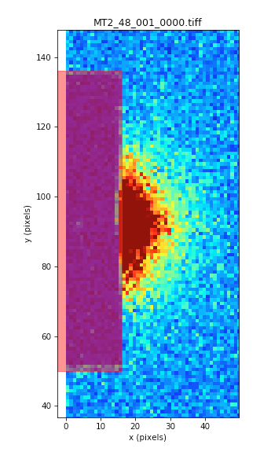
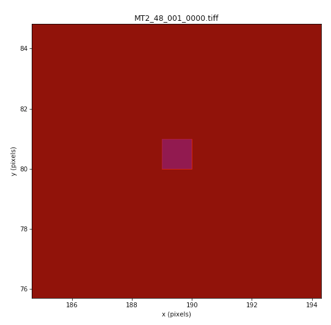
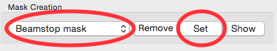

Masking
^^^^^^^^^^^^^^^
.. _s3p3:

This section teaches you how to mask out unwanted portions of your image, such as the
beamstop and bad detector pixels. It assumes you have just done :ref:`Part 1 <s3p1>`
or :ref:`2 <s3p2>`. If not, open RAW as in Step 1 and set your data folder as
in Step 6 of :ref:`Part 1 <s3p1>`.

#.  In the Files tab, select the **MT2_48_001_0000.tiff** file and click the show image button.

#.  Set the image upper limit to 50.

#.  Open the masking panel by clicking “Masking” in the Tools menu.

#.  Zoom in around the beamstop.

    *   *Note:* The beamstop is the blue rectangular area on the left edge of the detector

#.  Select the Pan tool and left click and drag the image to the right until you can
    see a blank (white) canvas to the left of the beamstop.

    |10000201000003FF000002FFA1373650FAC1BA86_png|

#.  Click on the rectangle mask drawing button and click on a point in the white
    part of the canvas just above the edge of the beamstop.

#.  Move the cursor until the red outline of the rectangle covers the beamstop from
    top to bottom, and out to the right edge of the middle of the beamstop. Click
    again to make the rectangle mask.

    *   *Note:* There will still be a bit of the beamstop at the bottom right edge that
        is not covered by this rectangle.

    *   *Tip:* If you mess up drawing the mask, click on the masked region (shaded red)
        and click your backspace/delete key to remove it.

    |10000201000001590000023F0706EE751FB36A8E_png|

#.  This beamstop is quite square, so a simple square mask works. A circle is also easy to draw:

    *   Click on the Circle mask drawing button.
    *   Click at the center
    *   Move the mouse out to make it the size you want, and click again to finish the circle.

#.  If you need to draw another (non-square or circle) shape, you would do the following:

    *   Click on the Polygon mask drawing button. Left click to place the first vertex.
    *   Continue left clicking to place more vertices to draw the desired shape.
    *   Right click to connect the last point you put down to the first point, and finish
        drawing the polygon.

#.  Zoom back out to the full extent of the image.

#.  Set the image upper limit to 0, and the lower limit to -2 (should be the default lower limit).

#.  Look for any pixels that are blue, these are bad pixels. You should find one at (189, 80)

    *   *Note:* On this detector, bad pixels have values of -2.

    *   *Tip:* Finding a single pixel, even when you are looking for a blue on red, can
        be quite tricky. You might try a couple of ways to look for it. First, you can
        zoom in on the image, and use the Pan tool to drag the image around and look for
        bad pixels. Second, you can try changing the colormap in the Image Display Settings
        to Gray. Then the bad pixel will look like a black pixel on a white background,
        which might be easier to see.

#.  Zoom in on the bad pixel and apply a rectangular mask over the pixel.

    *   *Note:* Due to how the image displays, you may see a bit of blue edge beyond the
        pixel mask. Don’t worry, as the pixel is actually masked. If you want to be sure,
        you can mask a few pixels around it as well.

    |100002010000021E0000021365526F4D184B1EAD_png|

#.  In the masking panel, make sure that “Beamstop mask” is selected in the Mask Creation
    dropdown menu. Click the set button to set the mask you just made as the beamstop mask.

    |100002010000018500000048B4CFC92D12B1F018_png|

#.  Click the OK button to exit the masking panel.

