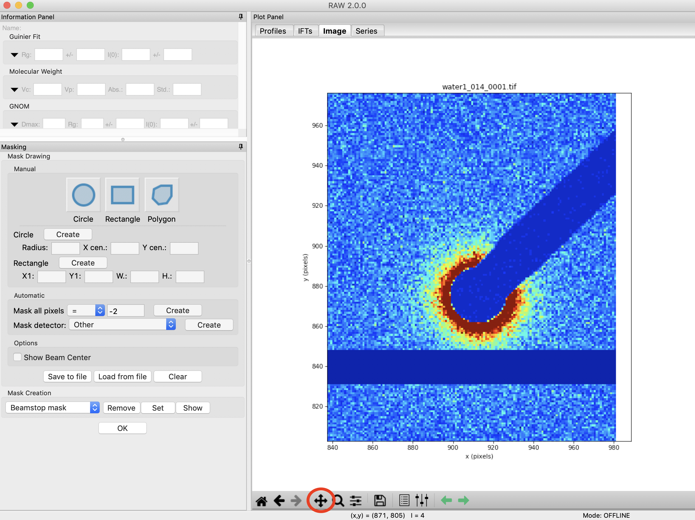
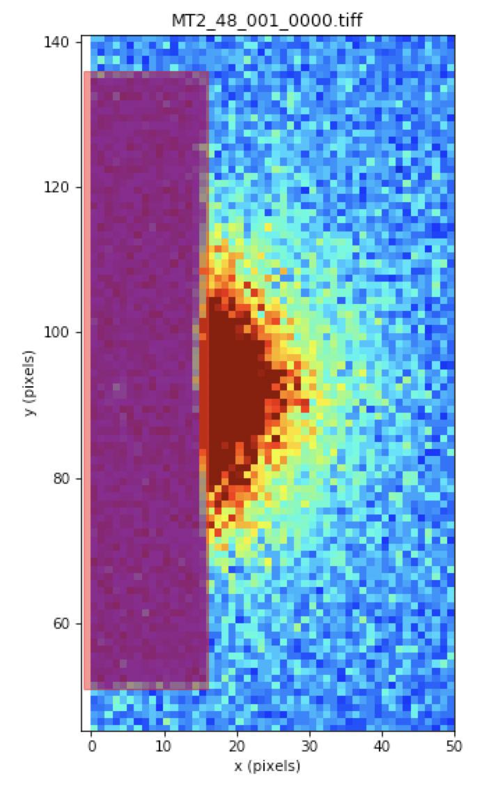
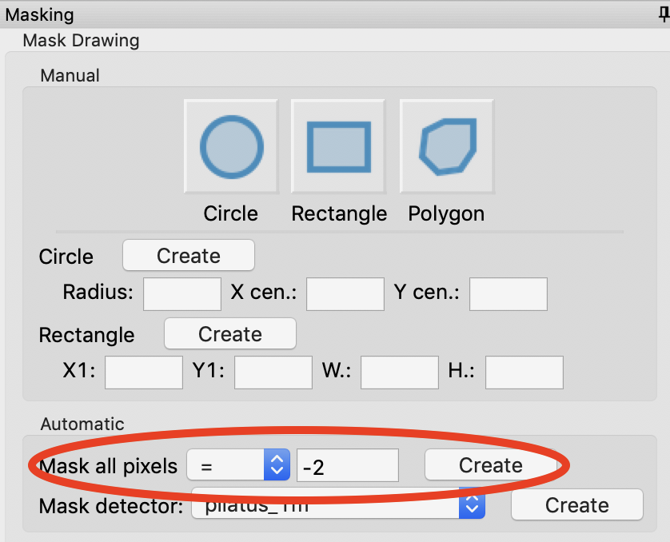
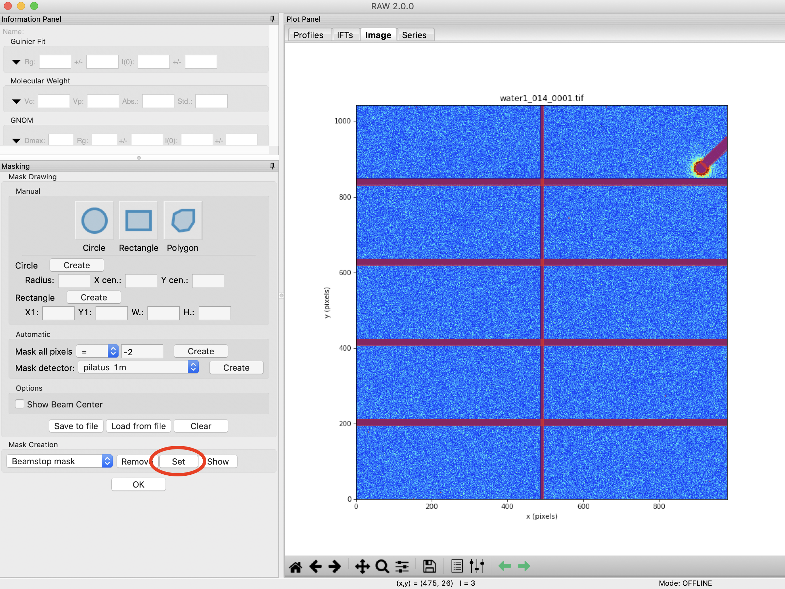

Masking
^^^^^^^^^^^^^^^
.. _s3p3:

This section teaches you how to mask out unwanted portions of your image, such as the
beamstop and bad detector pixels. It assumes you have just done :ref:`Part 1 <s3p1>`
or :ref:`2 <s3p2>`. If not, open RAW as in Step 1 and set your data folder as
in Step 6 of :ref:`Part 1 <s3p1>`.

#.  In the Files tab, select the **MT2_48_001_0000.tiff** file and click the show image button.

#.  Set the image upper limit to 50.

#.  Open the masking panel by clicking “Masking” in the Tools menu.

#.  Zoom in around the beamstop.

    *   *Note:* The beamstop is the blue rectangular area on the left edge of the detector

#.  Select the Pan tool and left click and drag the image to the right until you can
    see a blank (white) canvas to the left of the beamstop.

    |masking_panel_png|

#.  Click on the rectangle mask drawing button and click on a point in the white
    part of the canvas just above the edge of the beamstop.

#.  Move the cursor until the red outline of the rectangle covers the beamstop from
    top to bottom, and out to the right edge of the middle of the beamstop. Click
    again to make the rectangle mask.

    *   *Note:* There will still be a bit of the beamstop at the bottom right edge that
        is not covered by this rectangle.

    *   *Tip:* If you mess up drawing the mask, click on the masked region (shaded red)
        and click your backspace/delete key to remove it.

    *   *Tip:* You can also resize a rectangle (or circle) mask my right clicking on
        it and selecting resize.

    |masking_rectangle_png|

#.  This beamstop is quite square, so a simple square mask works. A circle is also easy to draw:

    *   Click on the Circle mask drawing button.
    *   Click at the center
    *   Move the mouse out to make it the size you want, and click again to finish the circle.

#.  If you need to draw another (non-square or circle) shape, you would do the following:

    *   Click on the Polygon mask drawing button. Left click to place the first vertex.
    *   Continue left clicking to place more vertices to draw the desired shape.
    *   Right click to connect the last point you put down to the first point, and finish
        drawing the polygon.

#.  Zoom back out to the full extent of the image.

#.  Next you need to mask out the bad pixels on the detector. On a Pilatus detector,
    bad pixels usually have a value of -2.

#.  In the automatic section of the Mask Drawing controls, set Mask All Pixels = -2
    and click 'Create'.

    *   This control allows you to mask pixels at, above, or below a given threshold.
        It is particularly useful for things like bad pixels, where the value is known.

    |masking_thresh_png|

#.  In the masking panel, make sure that “Beamstop mask” is selected in the Mask Creation
    dropdown menu. Click the set button to set the mask you just made as the beamstop mask.

    |masking_set_png|

#.  Click the OK button to exit the masking panel.

**Additional Tips**

#.  If you have a larger detector with panel gaps, the Mask detector function in
    the Automatic section of the Mask Drawing tools will generate a gap mask for many
    different detectors.

#.  You can resize rectangle and circle masks by right clicking on them and selecting resize.

#.  You can 'invert' a mask, which for a beamstop mask means it will only include pixels
    in the mask. This can be useful if, for example, you have a circular shadow from
    your flight tube on your detector.

#.  If you know the mask parameters, you can put in coordinates for a circle or rectangle
    and create a mask with a known position and size.

