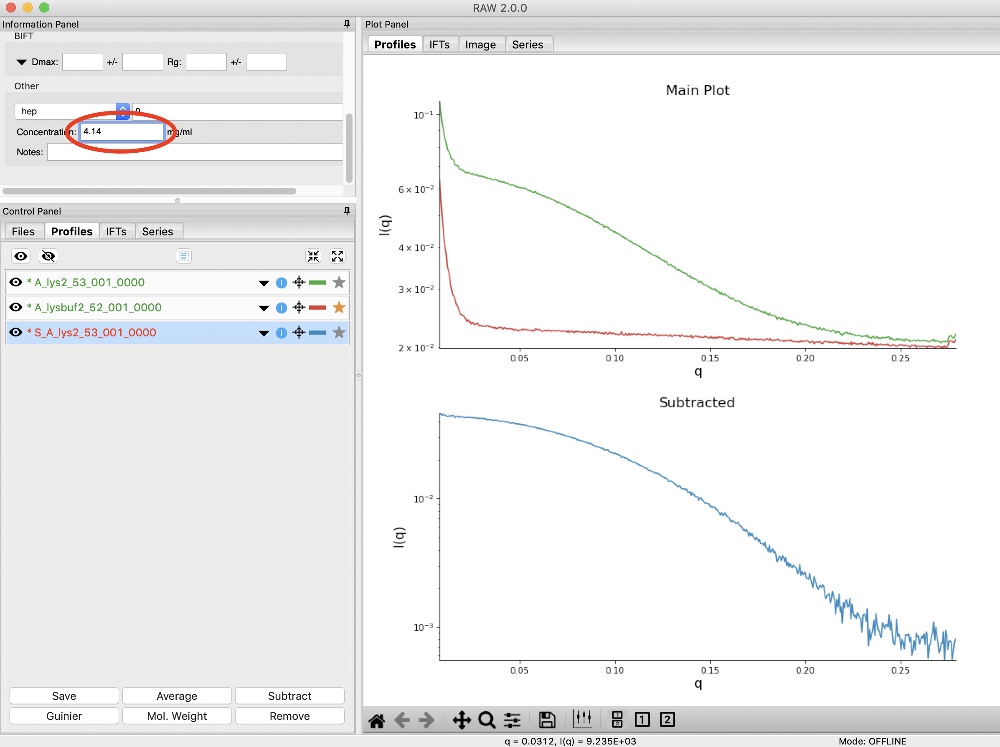
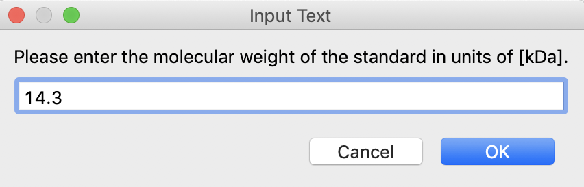

Setting a molecular weight standard
^^^^^^^^^^^^^^^^^^^^^^^^^^^^^^^^^^^^^^^^^^^
One method for determining molecular weight from a scattering profile is comparison to a known
scattering profile with known molecular weight. This part will teach you how to set that known
standard in RAW.

*Note:* The calibration dataset used for the first parts of this tutorial
doesn't have the requisite data to use for this part. So we will use
the data in the **calibration_data/extra** folder.

A video version of this tutorial is available:

.. raw:: html

    
<iframe src='https://www.youtube.com/embed/tj1dunGbLYo' frameborder='0' allowfullscreen></iframe>

The written version of the tutorial follows.

#.  Load the **SAXS.cfg** file in the **calibration_data/extra** folder.

#.  Plot all of the **lysbuf2_52_001_000x.tiff** files, where x is 0-9, on the main plot.

    *   *Tip:* :ref:`Section 1 Part 1 <s1p1>` of this tutorial document teaches you how to do this.

#.  Average the **lysbuf2** files you just loaded.

#.  Repeat steps 2-3 for the **lys2_52_001_000x.tiff** files.

#.  Subtract the averaged buffer profile (**lysbuf2**\ ) from the averaged sample profile
    (**lys2**\ ).

    *   *Tip:* :ref:`Section 1 Part 1 <s1p1>` of this tutorial document teaches you how to do this.

#.  Select the subtracted profile by clicking on it. In the information panel, set the concentration
    to 4.14 (this is concentration in mg/ml).

    *   *Tip:* You will have to scroll down to the bottom of the Information panel to
        find the Concentration.

    |config_mwstd1_png|

#.  Perform a Guinier fit on the subtracted profile.

    *   *Tip:* :ref:`Section 1 Part 2 <s1p2>` of this tutorial document teaches you how to do this.

#.  Right click on the subtracted profile and select the “Other Operations->Use as MW Standard” option.

#.  Enter the molecular weight of the standard in kDa in the box that appears. For this lysozyme
    sample, the molecular weight is 14.3 kDa.

    |config_mwstd2_png|

#.  Click “OK” to save the molecular weight standard.

#.  Save the settings for future use.

