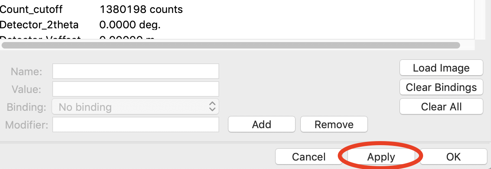
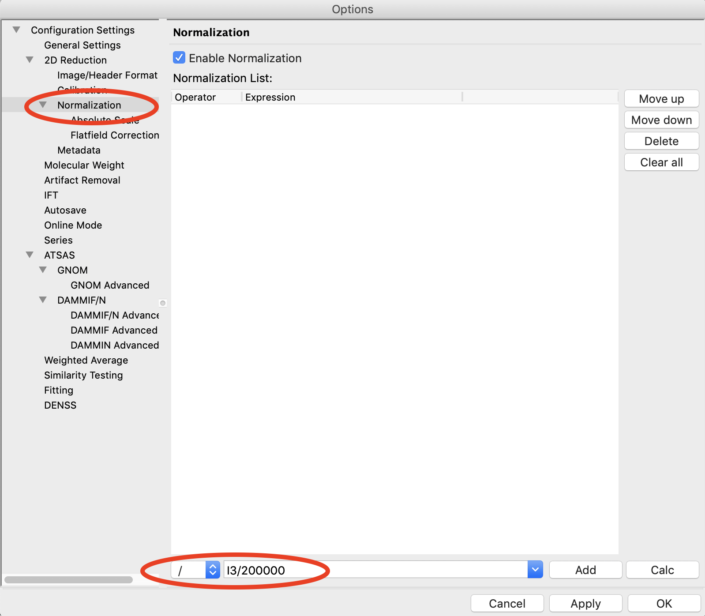
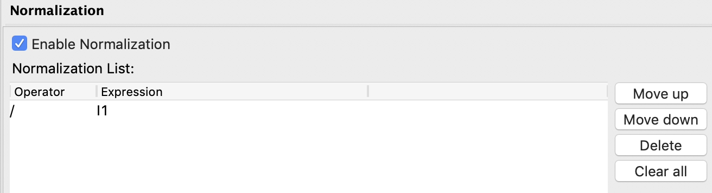
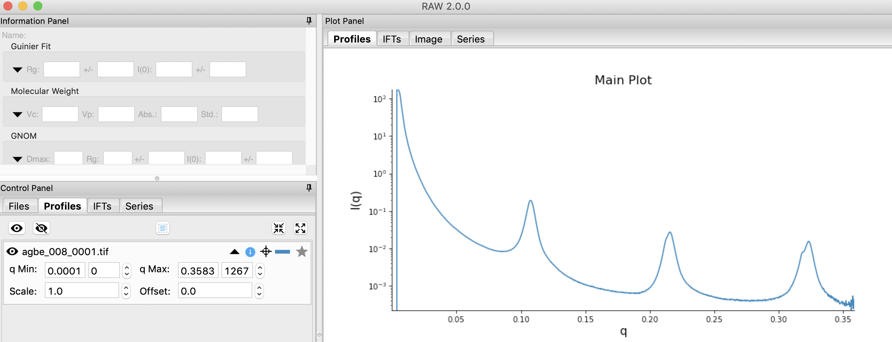
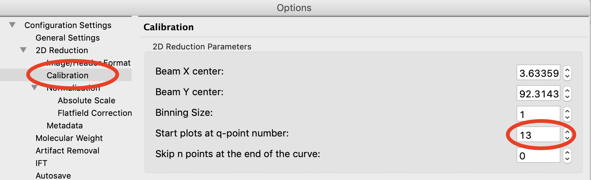
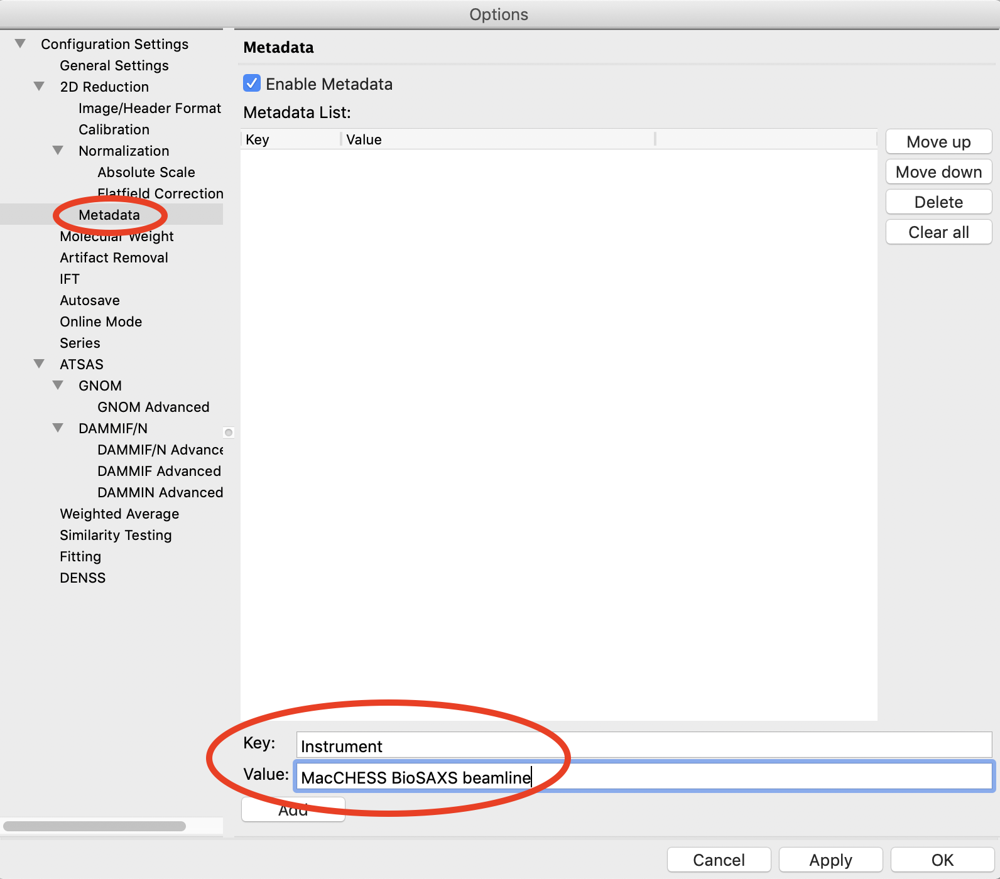

Setting normalization and other options
^^^^^^^^^^^^^^^^^^^^^^^^^^^^^^^^^^^^^^^^^^^^^^^
.. _s3p4:

This section teaches you how to set up normalization by a beamstop counter, and
other options. It assumes you have completed :ref:`Parts 1 <s3p1>` and :ref:`2 <s3p3>`\ .

A video version of this tutorial is available:

.. raw:: html

    
<iframe src='https://www.youtube.com/embed/NTjrds0stGc' frameborder='0' allowfullscreen></iframe>

The written version of the tutorial follows.

#.  Open the Options window by selecting “Advanced Options” in the Options menu.

#.  In the window that shows up select the Image/Header Format section on the left.
    In the area on the right click the Load Image button.

    |config_norm_load_image_png|

#.  In the window that pops up, select the **agbe_008_0001.tif** file. Click
    the Open button.

    *   *Note:* You can select any image of the appropriate type, not just the behenate.

#.  In the Image/Header Format window you should now see header values loaded into the
    list. Click the Apply button at the bottom of the screen.

    |config_norm_apply_png|

#.  Click on the Normalization section in the options list on the left.

#.  In the fields at the bottom of the Normalization panel, make sure “/” is selected
    in the left dropdown menu, and enter I1 in the large field.

    *   *Note:* It is typical in SAXS to normalize by the transmitted intensity. At the
        BioCAT beamline, the beamstop counter is name I1, which is why we are using
        that name in the normalization expression.

    *   *Tip:* You can use the large field as a dropdown menu to see and select
        available normalization counters.

#.  Click the Calc button to evaluate the expression for the counter values loaded
    in the Image/Header Format tab. You should get a value of 7200.0.

#.  Click the Add button to add the expression to the normalization list.

    |config_norm_values_png|

#.  You should now see the normalization in the normaliation list.
    Make sure the “Enable Normalization” checkbox at the top of the page is checked.

    |config_norm_enable_png|

#.  Click OK to exit the options window.

#.  In the file list, select the **agbe_008_0001.tif** file and click the Plot
    button. You will see a curve get plotted in the top panel of the Profiles plot.

#.  Click on the Profiles tab. You will see a profile loaded in the Profiles list.

    |config_norm_start_point1_png|

#.  Adjust the start point for q Min to remove the points with zero value at the start of
    the curve (these are q points entirely in the mask). Set q Min so that the first point
    is the peak of the curve on the main plot. This should be around point 13 (depending
    on your mask).

    *   *Tip:*  It is easier to see the start point if you put the plot on
        a log-log scale.

    |config_norm_start_point2_png|

#.  Open the Options window as in Step 1.

#.  Click on the Radial Averaging section in the options list on the left. Set “Start plots
    at q-point number” to the number you just found in Step 13.

    *   *Note:* This makes it so that every curve loaded from now on will by default
        not display the first n points, which are covered by the beamstop.

    *   *Tip:* You can do the same for the end point.

    |config_norm_start_point3_png|

#.  RAW also allows you to add arbitrary metadata to your radially integrated
    files. One use case is to provide metadata keys for data deposition (e.g. in
    the `SASBDB <https://www.sasbdb.org/>`_). To start, click on the Metadata
    section in the options list on the left of the Options window.

#.  In the 'Key' field enter 'Detector'. In the 'Value' field enter 'Pilatus3 X 1M'.

#.  Click the Add button.

    |config_norm_metadata1_png|

#.  Click the OK button to exit the options window and save your changes.

#.  You have configured everything necessary, and are now ready to save your settings.
    Go to the File menu and select “Save Settings”.

#.  Save the settings as **SAXS.cfg**\ .

#.  These settings can now be used to process images, and can be reloaded when you
    open RAW by selecting “Load Settings” from the File menu.

**Additional Tips**

There are other settings you may find it useful to set.

#.  In the "General Settings" section you can set "Hide controls on
    profile items for new plots". This means that when you load a profile
    item it starts with the extra controls (such as q min and q max) hidden.

.. |config_norm_load_image_png| image:: images/config_norm_load_image.png
    :target: ../_images/config_norm_load_image.png

.. |config_norm_start_point2_png| image:: images/config_norm_start_point2.png
    :target: ../_images/config_start_point2.png

