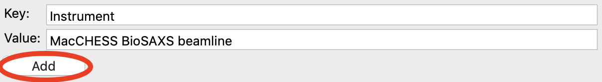

Setting normalization and other options
^^^^^^^^^^^^^^^^^^^^^^^^^^^^^^^^^^^^^^^^^^^^^^^
.. _s3p4:

This section teaches you how to set up normalization by a beamstop counter, and
other options. It assumes you have completed :ref:`Parts 1 <s3p1>` (or :ref:`2 <s3p2>`\ )
and :ref:`3 <s3p3>`.

#.  Open the Options window by selecting “Advanced Options” in the Options menu.

#.  In the window that shows up select the Image/Header Format section on the left.
    In the area on the right click the Load Image button.

    |config_norm_load_image_png|

#.  In the window that pops up, select the **AgBeh_A1_43_001_0000.tiff** file. Click
    the Open button.

    *   *Note:* You can select any image of the appropriate type, not just the behenate.

#.  In the Image/Header Format window you should now see header values loaded into the
    list. Click the Apply button at the bottom of the screen.

    |config_norm_apply_png|

#.  Click on the Normalization section in the options list on the left.

#.  In the fields at the bottom of the Normalization panel, make sure “/” is selected
    in the left dropdown menu, and enter I3/200000 in the large field.

    *   *Note:* It is typical in SAXS to normalize by the transmitted intensity. At the
        CHESS G1 beamline, the beamstop counter is name I3, which is why we are using
        that name in the normalization expression.

    |config_norm_values_png|

#.  Click the Calc button to evaluate the expression for the counter values loaded
    in the Image/Header Format tab. You should get a value of 0.02404.

#.  Click the Add button to add the expression to the normalization list.

#.  Make sure the “Enable Normalization” checkbox at the top of the page is checked.

#.  Click OK to exit the options window.

#.  In the file list, select the **AgBeh_A1_43_001_0000.tiff** file and click the Plot
    button. You will see a curve get plotted in the top panel of the Main Plot.

#.  Click on the manipulation tab. You will see a data item loaded in the manipulation list.

    |config_norm_start_point1_png|

#.  Adjust the start point for q Min to remove the points with zero value at the start of
    the curve (these are q points entirely in the mask). Set q Min so that the first point
    is the peak of the curve on the main plot. This should be around point 13 (depending
    on your mask).

    |config_norm_start_point2_png|

#.  Open the Options window as in Step 1.

#.  Click on the Calibration section in the options list on the left. Set “Start plots
    at q-point number” to the number you just found in Step 13.

    *   *Note:* This makes it so that every curve loaded from now on will by default
        not display the first n points, which are covered by the beamstop.

    |config_norm_start_point3_png|

#.  RAW also allows you to add arbitrary metadata to your radially integrated
    files. One use case is to provide metadata keys for data deposition (e.g. in
    the `SASBDB <https://www.sasbdb.org/>`_). To start, click on the Metadata
    section in the options list on the left of the Options window.

#.  In the 'Key' field enter 'Instrument'. In the 'Value' field enter 'MacCHESS
    BioSAXS beamline'.

    |config_norm_metadata1_png|

#.  Click the Add button.

    |config_norm_metadata2_png|

#.  Click the OK button to exit the options window and save your changes.

#.  You have configured everything necessary, and are now ready to save your settings.
    Go to the File menu and select “Save Settings”.

#.  Save the settings as **SAXS.cfg**\ .

#.  These settings can now be used to process images, and can be reloaded when you
    open RAW by selecting “Load Settings” from the File menu.

.. |config_norm_load_image_png| image:: images/config_norm_load_image.png

.. |config_norm_apply_png| image:: images/config_norm_apply.png

.. |config_norm_values_png| image:: images/config_norm_values.png

.. |config_norm_start_point1_png| image:: images/config_norm_start_point1.png

.. |config_norm_start_point2_png| image:: images/config_norm_start_point2.png

.. |config_norm_start_point3_png| image:: images/config_norm_start_point3.png

.. |config_norm_metadata1_png| image:: images/config_norm_metadata1.png

