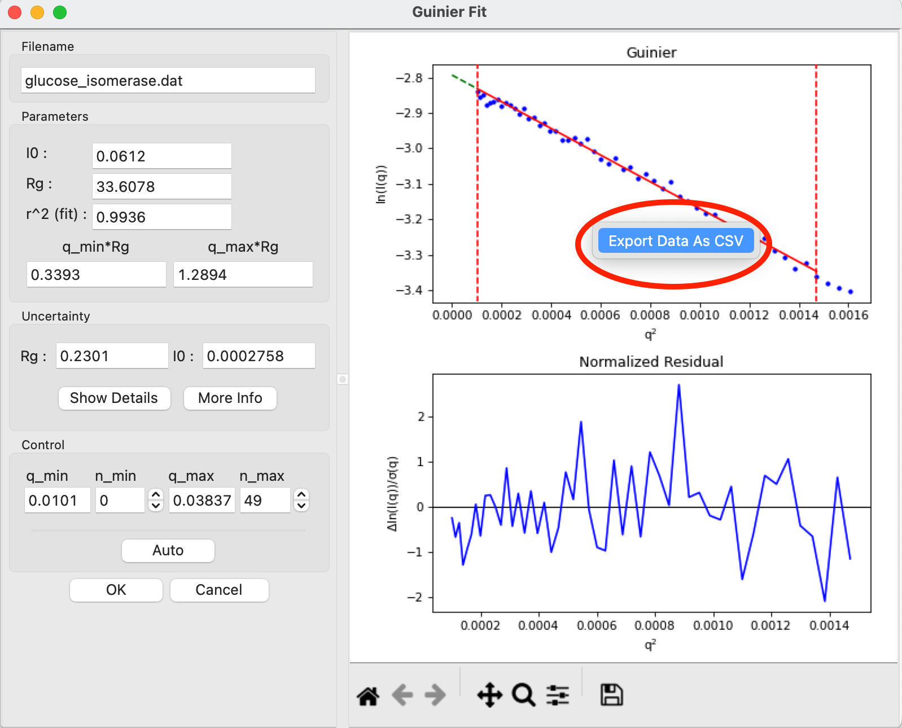
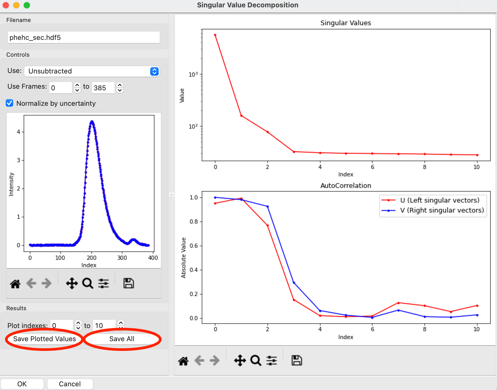
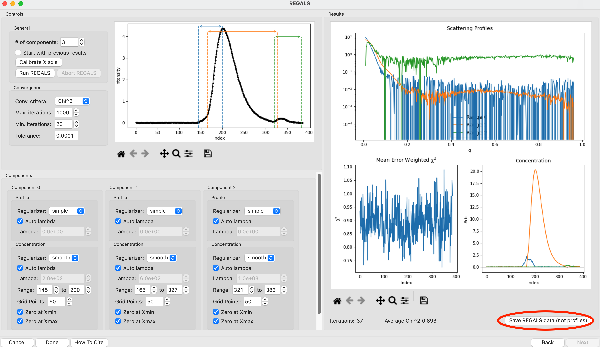
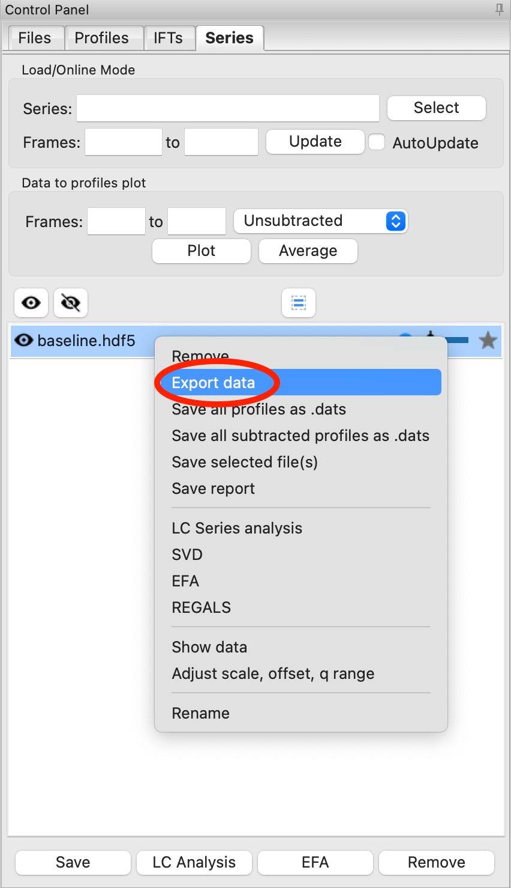

Exporting plot data
^^^^^^^^^^^^^^^^^^^^^^^^^^^^^^^^^
.. _raw_export_plot:

This tutorial covers how to export plot data in RAW for using in other programs.
This is intended to be distinct from saving data in formats that RAW knows how
to read (e.g. .dat, .ift, .hdf5 for profiles, IFTs, and series respectively), as
the export formats cannot be read back into RAW. Exporting data in this way is
most useful for generating your own figures in other software.

The written version of the tutorial follows.

Exporting plot data as csv
***************************

The following plots let you right click on the plot and export the data shown on
the plot as a csv file:

*   Guinier fit (not the Guinier axes on the Profiles plot panel)
*   Dimensionless Kratky
*   Comparison (Residuals and Ratios)
*   CRYSOL
*   IFT plot panel

We will demonstrate how to do this using the Guinier fit plot.

#.  Load the **glucose_isomerase.dat** dataset in the reconstruction_data folder.

#.  Open the Guinier fit window by selecting the profile in the control
    panel and clicking the "Guinier" button.

    *   *Tip:* For the IFT plot panel, the top and bottom plot (P(r) functions and
        data/fit in q space) export separately, so if you want both you will
        need to right click and export from both the top and bottom plot.
        For the other windows listed above, all data on all plots shown is
        exported at once.

#.  In the Guinier fit window, right click on the plot and select "Export
    Data as CSV".

    |export_guinier_png|

#.  Give the file an appropriate name and location and save the file.

Note: Comma separated value (.csv) files can be read directly by most
spreadsheet programs like Excel. They are text files that can be opened
and examined directly in a text editor.

Exporting SVD, EFA, and REGALS plot data
*****************************************

SVD, EFA, and REGALS plot data (including the singular values, autocorrelations,
forward and backward EFA plots and EFA and REGALS result plots) can be saved
from the various analysis windows.

#.  Load the **phehc_sec.hdf5** file in the series_data folder.

#.  Open the SVD window by right clicking on the phehc_sec.hdf5 series item
    and selecting "SVD".

#.  Use the "Save Plotted Values" button to save the plotted Singular Values and
    AutoCorrelation values as a .csv file.

    *   Tip: If you want to save more values, increase the end value of the
        plot indexes.

#.  Use the "Save All" button to save the singular values, autocorrelation values,
    and the left and right singular vectors as a .csv file.

    |export_svd_png|

#.  Close the SVD window and open the EFA window. Proceed with the EFA analysis
    until you reach the final results page.

#.  Use the "Save EFA Data (not profiles)" button to save the EFA results that
    aren't the profiles in a .csv file. This includes metadata, the concentration
    profiles, the chi^2 vs. frame, the forward and backward EFA data, the full
    singular values and the left and right singular vectors for the number of
    components selected for EFA.

    |export_efa_png|

#.  Close the EFA window and open the REGALS window. Proceed with the REGALS
    analysis until you reach the final results page.

#.  Use the "Save REGALS data (not profiles)" button to save the REGALS results
    that aren't the profiles in a .csv file. This includes metadata, the
    concentration profiles, the smoothed concentration profiles, the chi^2 vs.
    frame, the component P(r) functions if calculated, the forward and
    backward EFA data, the full singular values and the left and right singular
    vectors for the number of components selected for REGALS.

    |export_regals_png|

Exporting series plot data
***************************

Series plot data (including the integrated intensity vs. frame and Rg vs. frame
values) can be saved from the Series control panel.

#.  Load the **baseline.hdf5** file in the series_data folder.

#.  In the Series control panel, right click on the **baseline.hdf5** item and
    select "Export data".

#.  Save the .csv file with an appropriate filename and location. This file
    contains some metadata, and the integrated intensity, mean intensity,
    if appropriate intensity in a fixed q range or at a fixed q value,
    subtracted intensity (integrated, mean, q range and q value), Rg,
    Rg uncertainty, I(0), I(0) uncertainty, MW and MW uncertainty from Vc,
    MW from Vp, and filename for each frame.

    |export_series_png|

Saving reconstruction plots
*****************************

The reconstruction plots (dammif/n residual plots and denss residual,
convergence and fsc plots) are automatically saved as
**<prefix>_dammif_results.pdf** or **<prefix>_denss_results.pdf**. However,
the data that makes the plots is not necessarily saved.

For DAMMIF/N results, if you want to recreate the residuals plots you can
load the **.fir** file, which has the fit and experimental data, and open those
two curves in the Comparison window to make a residual plot. The residual
data can be exported from there. Alternatively, you could calculate the
normalized residual directly from the data and fit.

For the DENSS results, the convergence data is saved in the **_by_step.fit** files,
the fsc data is saved in the **_fsc.dat file**, and the fit data is saved in the
**_map.fit** for each individual model.

.. |export_efa_png| image:: images/export_efa.png
    :target: ../_images/export_efa.png

