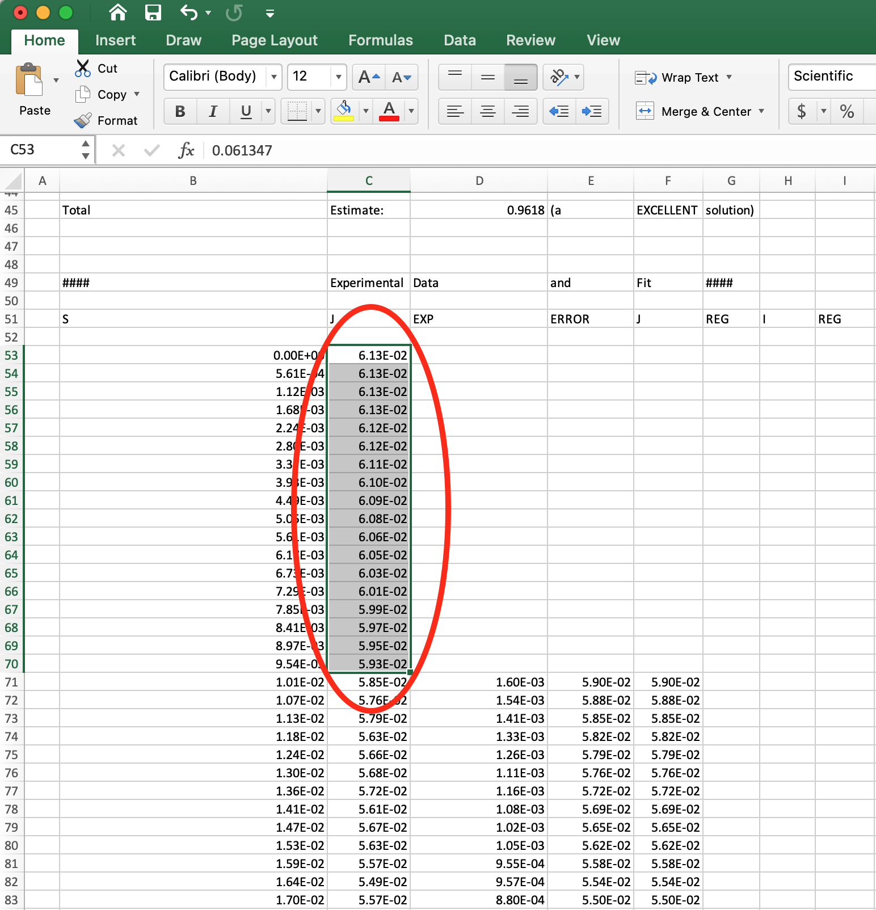
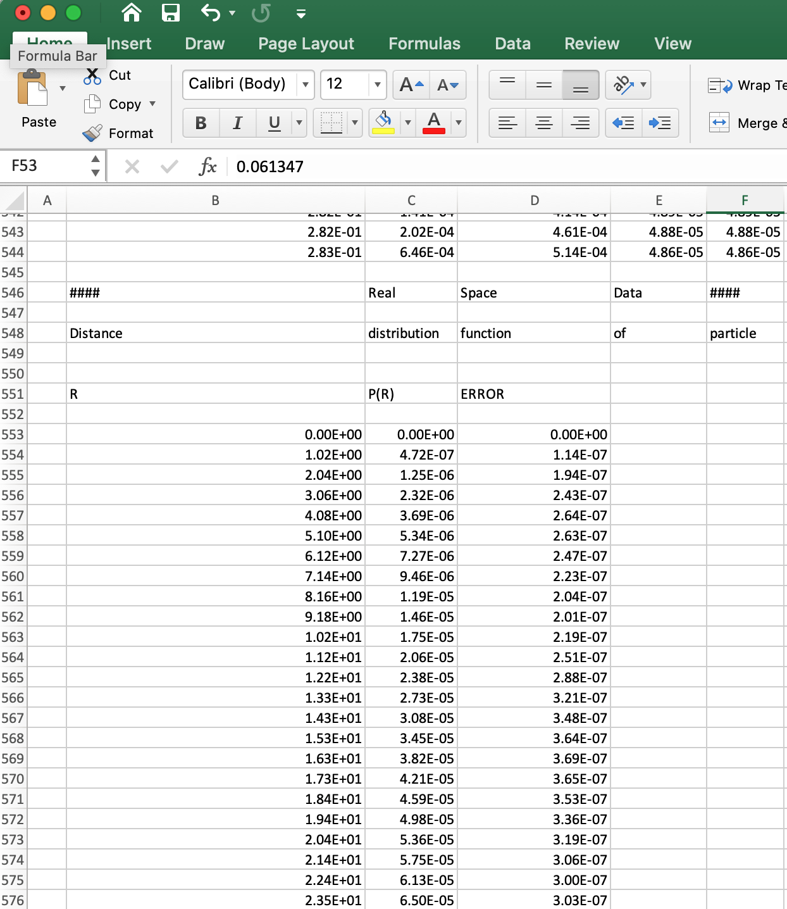

Opening data externally
^^^^^^^^^^^^^^^^^^^^^^^^^^^^^^^^^
.. _raw_external_data:

This tutorial covers how to open data saved from RAW in other programs.
This tutorial won't focus on how to use different plotting software, but rather
on the formatting of data from RAW and how to open it in common programs like
Excel.

The written version of the tutorial follows.

Opening .dat files
*************************

RAW saves profile data, including the q, I(q), and uncertainty data in .dat files.
Note that .dat is a common extension for scattering profile data, and other programs,
such as Primus, also produce .dat files which may have slightly different formats.

File format
##############

These .dat files are standard text files with space separated values. They
consist of a header (and possibly a footer), which are marked out by "#"
starting the header and footer lines. The data is saved in three columns
with space separation, and the numbers are in scientific format, e.g. 1.23E-04.
The scattering profile data has a ``#      Q             I(Q)           Error``
header line, and three columns which are:

    #.  **Q** - The experimental q vector
    #.  **I(Q)** - The experimental intensities
    #.  **Error** - The experimental uncertainty

A large amount of data, including analysis data is saved in either the footer
(by default) or the header. Regardless of physical location in the file the
start of this information is distinguished by a "### HEADER:" line. After that,
if the leading "#" marks are removed from each line the extra data is in json
format.

The actual header always contains the number of data points and the column headings.

Opening .dat files in Excel
##############################

RAW .dat files can be opened in Excel (or Libre Office or similar). From there
it's easy to save the three column data in whatever format you want for further
plotting or analysis.

#.  Open Excel.

#.  Create a blank workbook.

#.  Choose "File->Import->Text file" (or the data ribbon "Get External Data->
    From Text" button) and select a RAW .dat file.

#.  In the first screen of the import wizard select "Delimited" and click "Next".

    |import_dat_excel1_png|

#.  In the second screen of the import wizard check "Space".

    |import_dat_excel2_png|

#.  Click "Finish".

#.  In the next window that appears select the location and click "Import".

#.  The data will be imported. Note that the column headings will be shifted
    over by one column, the first column is Q, the second I(q) and the third
    Error.

    |import_dat_excel3_png|

Opening .out files
*******************

RAW saves IFT data, including the P(r) function and fit to the data, produced
by GNOM in .out files, which is the output format from the GNOM command line
program.

File format
###############

The .out file is a standard text file with space separated values. It contains
four sections delineated by section headers like:
``####      Configuration                                 ####``\.
The numbers for the data in columns are in scientific format, e.g. 1.23E-04.
The first section is "Configuration", which gives input parameters used to create
the P(r) function. The second section is "Results", which gives regularization,
perceptual criteria, real space Rg and I(0) and total estimate results. The
third section is "Experimental Data and Fit", which consists of 5 columns containing
the input experimental data and the scattering profile generated as a Fourier
transform of the P(r) function, which should fit the data (for a good P(r) function).
The column headers are:

    #.  **S** - The q vector extrapolated to q=0
    #.  **J Exp** - The experimental intensities
    #.  **Error** - The experimental uncertainty
    #.  **J Reg** - The scattering profile that is the Fourier transform of the P(r)
        function over the experimental q range (also called the regularized
        intensity)
    #.  **I Reg** - The scattering profile that is the Fourier transform of the P(r)
        function over the extrapolated q range (also called the regularized
        intensity)

The fourth section is "Real Space Data", which consists of the P(r) function.
The columns are:

    #.  **R** - The real space distance
    #.  **P(R)** - The value of the pair distance distribution function at
        a given R value
    #.  **ERROR** - The uncertainty in the P(r) value

Opening .out files in Excel
###############################

RAW .out files can be opened in Excel (or Libre Office or similar). From there
it's easy to save the data in whatever format you want for further
plotting or analysis. The import process is basically the same as for .dat files,
above:

#.  Open Excel.

#.  Create a blank workbook.

#.  Choose "File->Import->Text file" (or the data ribbon "Get External Data->
    From Text" button) and select a GNOM .out file.

#.  In the first screen of the import wizard select "Delimited" and click "Next".

#.  In the second screen of the import wizard check "Space".

#.  Click "Finish".

#.  In the next window that appears select the location and click "Import".

#.  In the imported data, some of the I Reg values will be in the wrong column,
    due to how separators are handled. Scroll down to the experimental data section.
    Select the Data in the second column from the top to just above where the
    next three columns start.

    |import_out_excel1_png|

#.  Cut that data and paste it at the top of the fifth column.

    |import_out_excel2_png|

#.  The header labels are not in the correct columns, but the five data columns
    in the experimental section now correspond to those given above: S, J Exp,
    Error, J Reg, I Reg respectively.

#.  Scroll down further to find the three column P(r) data with the correct
    column headers.

    |import_out_excel3_png|

Opening .ift files
*******************

RAW saves IFT data produced by BIFT in .ift files.

File format
##############

These .ift files are standard text files with space separated values.
The numbers for the data in columns are in scientific format, e.g. 1.23E-04.
These files consist of several different sections marked by columns headers on
lines starting with "#". The whole file overall starts with a "# BIFT" line to
identify the type of IFT. The first section is the P(R) function and is started
with the ``#      R             P(R)           Error`` header. The columns are:

    #.  **R** - The real space distance
    #.  **P(R)** - The value of the pair distance distribution function at
        a given R value
    #.  **Error** - The uncertainty in the P(r) value

The second section is the experimental data and the scattering profile generated
as a Fourier transform of the P(r) function, which should fit the data (for a
good P(r) function). It is started with the
``#      Q             I(Q)           Error            Fit`` header. The columns are:

    #.  **Q** - The experimental q vector
    #.  **I(Q)** - The experimental intensities
    #.  **Error** - The experimental uncertainty
    #.  **Fit** - The scattering profile that is the Fourier transform of the P(r)
        function over the experimental q range (also called the regularized
        intensity)

The third section is the fit/regularized intensity extrapolated to q=0 and
starts with the
``#  Q_extrap       Fit_extrap``
header. The columns are:

    #.  **Q_extrap** - The extrapolated q vector
    #.  **Fit_extrap** - The scattering profile that is the Fourier transform
        of the P(r) function over the extrapolated q range (also called the regularized
        intensity)

The fourth section is data about the parameters used and derived values,
such as the I(0) and Rg, which are saved at the end of the file. This
information is distinguished by a ``### HEADER:`` line. After that,
if the leading "#" marks are removed from each line the extra data is in json
format.

Opening .ift files in Excel
###############################

RAW .ift files can be opened in Excel (or Libre Office or similar). From there
it's easy to save the data in whatever format you want for further
plotting or analysis. The import process is basically the same as for .dat files,
above:

#.  Open Excel.

#.  Create a blank workbook.

#.  Choose "File->Import->Text file" (or the data ribbon "Get External Data->
    From Text" button) and select an .ift file.

#.  In the first screen of the import wizard select "Delimited" and click "Next".

#.  In the second screen of the import wizard check "Space".

#.  Click "Finish".

#.  In the next window that appears select the location and click "Import".

#.  The data will be imported. Note that the column headings will be shifted
    over by one column. For example, for the P(r) data, the first column is
    the R data, the second the P(R) data, and the third the Error data.

#.  Scroll down through the spreadsheet to see all of the imported data.

Opening .csv files
*******************

RAW saves most exported data and analysis in .csv (comma separated value) format.

File format
##############

These .csv files are standard text files with comma separated values. Files
generated from RAW will have an header information such as column headings
marked with a "#" at the start of the line.

Opening .csv files in Excel
#############################

.csv files generally be opened in Excel (or Libre Office or similar) by double
clicking on the file. From there it's easy to save the data in whatever format
you want for further plotting or analysis. If double clicking doesn't work,
the import process is basically the same as for .dat files, above:

#.  Open Excel.

#.  Create a blank workbook.

#.  Choose "File->Import->Text file" (or the data ribbon "Get External Data->
    From Text" button) and select an .ift file.

#.  In the first screen of the import wizard select "Delimited" and click "Next".

#.  In the second screen of the import wizard check "Comma".

#.  Click "Finish".

#.  In the next window that appears select the location and click "Import".

.. |import_dat_excel1_png| image:: images/import_dat_excel1.png
    :target: ../_images/import_dat_excel1.png
    :width: 500 px

.. |import_dat_excel2_png| image:: images/import_dat_excel2.png
    :target: ../_images/import_dat_excel2.png
    :width: 500 px

.. |import_dat_excel3_png| image:: images/import_dat_excel3.png
    :target: ../_images/import_dat_excel3.png
    :width: 500 px

.. |import_out_excel2_png| image:: images/import_out_excel2.png
    :target: ../_images/import_out_excel2.png

