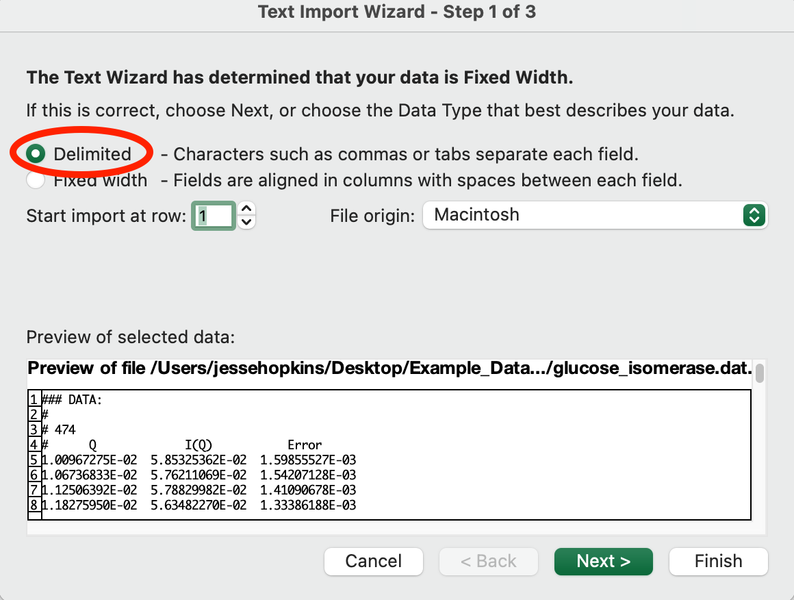
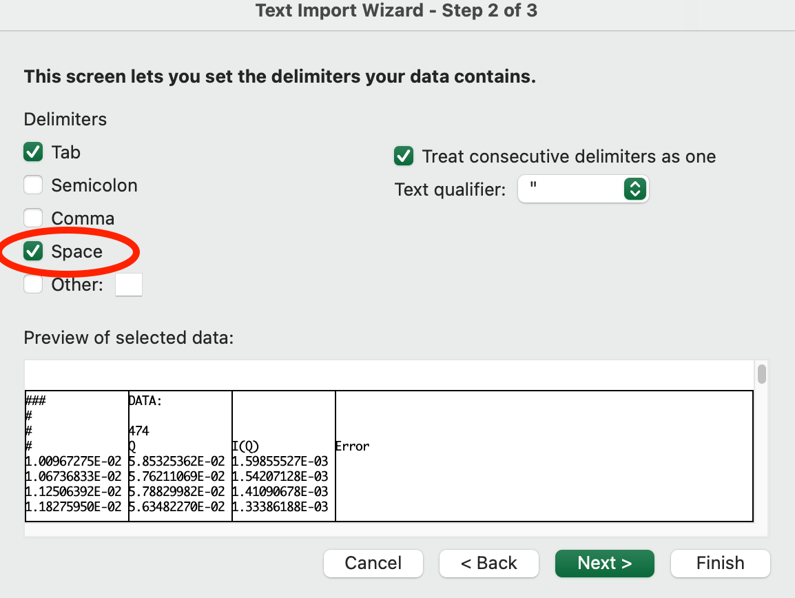
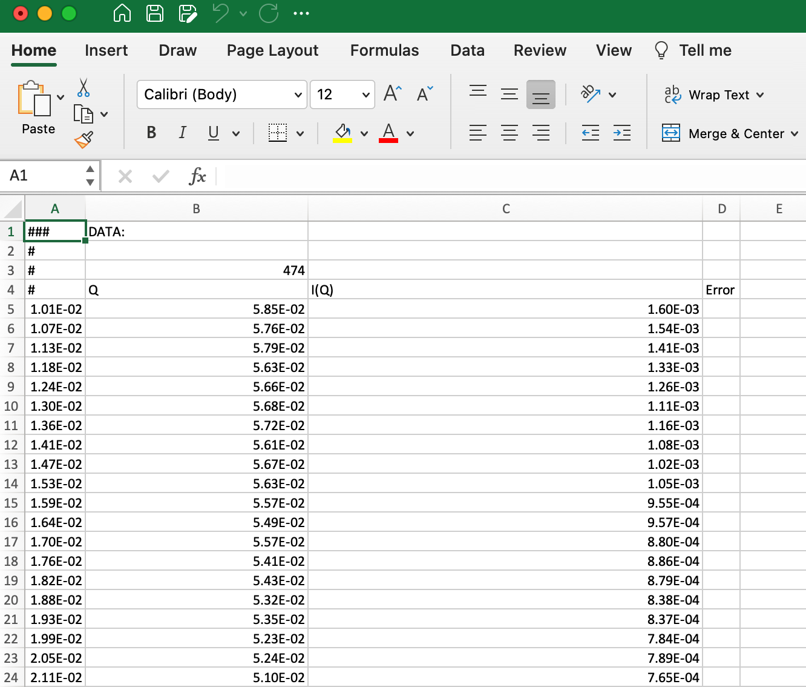

Opening data externally
^^^^^^^^^^^^^^^^^^^^^^^^^^^^^^^^^
.. _raw_external_data:

This tutorial covers how to open data saved from RAW in other programs.
This tutorial won't focus on how to use different plotting software, but rather
on the formatting of data from RAW and how to open it in common programs like
Excel.

The written version of the tutorial follows.

Opening .dat files
*************************

File format
##############

RAW saves profile data, including the q, I(q), and uncertainty data in .dat files.
Fundamentally, these files consist of a header (and possibly a footer), which are
marked out by "#" starting the header and footer lines. The data is saved in
three columns with space separation, and the numbers are in scientific format,
e.g. 1.23E-04.

A large amount of data, including analysis data is saved in either the footer
(by default) or the header. Regardless of physical location in the file the
start of this information is distinguished by a "### HEADER:" line. After that,
if the leading "#" marks are removed from each line the extra data is in json
format.

The actual header always contains the number of datapoints and the column headings.

Opening .dat files in Excel
##############################

RAW .dat files can be opened in Excel (or Libre Office). From there it's easy
to save the three column data in whatever format you want for further plotting
or analysis.

#.  Open Excel.

#.  Create a blank workbook.

#.  Choose "File->Import->Text file" (or the data ribbon "Get External Data->
    From Text" button) and select a RAW .dat file.

#.  In the first screen of the import wizard select "Delimited" and click "Next".

    |import_dat_excel1_png|

#.  In the second screen of the import wizard check "Space".

    |import_dat_excel2_png|

#.  Click "Finish".

#.  In the next window that appears select the location and click "Import".

#.  The data will be imported. Note that the column headings will be shifted
    over by one column, the first column is Q, the second I(q) and the third
    Error.

    |import_dat_excel3_png|

