Customizing and saving plots
^^^^^^^^^^^^^^^^^^^^^^^^^^^^^^^^^
.. _raw_mw:

This tutorial covers how to customize plots in RAW and save plots from RAW.
Note that RAW is not meant to be a program for making publication quality
plots, and has a number of limitations when it comes to plots, but some people
find it convenient to use the plots made in RAW for various purposes.

The written version of the tutorial follows.

Customizing plots in RAW
*****************************

#.  Load the glucose_isomerase.dat dataset in the reconstruction_data folder.

#.  Use the "1" button in the plot toolbar at the bottom of the RAW window to
    show just the Main Plot.

    |show_plot1_png|

#.  Right click on the plot and select "Plot Options..." in the right click menu.

    *   Note: Plot options only affects the plot you click on. Each plot has its
        own set of options.

    |show_plot_options_png|

#.  In the options window that opens, do the following: remove the plot title,
    turn on the legend, change the font for all items to Arial.

    |plot_options1_png|

#.  In the options window, do the following: Turn on the Top and Right borders,
    Change the x-axis label to give the q units, as "$q$ $[1/\AA]$". Click "Okay"
    to exit the plot options window.

    *   Tip: Anything inside of "$" signs in a plot label or legend label is
        parsed as a TeX markup, which allows you to use special symbols like
        the angstrom symbol, Å, as $\AA$. A useful guide to allowed formating
        and special characters input can be found in the matplotlib documentation:
        https://matplotlib.org/stable/tutorials/text/mathtext.html

    |plot_options2_png|

#.  Checkpoint. Your plot should now look like this

    |plot_checkpoint1_png|

#.  Use the horizontal slider bar button in the plot toolbar to open the margin
    adjustment for the plot.

    |plot_margins1_png|

#.  In the window that opens, use the left, right, top, and bottom sliders
    to bring the edges of the plot close to the edges of the window.

    |plot_margins2_png|

#.  Click on the colored line in the glucose_isomerase.dat item in the Profiles
    Control Panel to open the Line Properies window.

    |plot_line_properties1_png|

#.  In the Line Properties window, set the Legend Label to "Glucose Isomerase",
    Set the Line "Style" to "None". Set the Data Point Marker "Marker" to ".".
    Set the marker "Size" to "4". Set all the Colours to green. Set the Error
    Bars "Width" to 0.25. Click "OK" to exit the line properties dialog.

    |plot_line_properties2_png|

#.  Use the error bar button in the plot toolbar  to turn on error bars for
    the plot.

    |plot_errorbars_png|

#.  Checkpoint. Your plot should now look like this:

    |plot_checkpoint2_png|

#.  Open the plot Options dialog again. Turn off autolimits and adjust the y limits
    To have a minimum of 2e-5 and a maximum of 0.065.

    *   Tip: You can also use the crossed arrows and the magnifying glass
        in the plot toolbar to adjust the scale of the plot.

    |plot_options3_png|

#.  Click on the legend text ("Glucose Isomerase") and drag the legend to a new
    position in the plot (e.g. a bit further away from the top right corner).

#.  You've now adjusted everything that you can about the plot in RAW. Your plot
    should look like this:

    |plot_checkpoint3_png|

Note: All of the main plots in RAW ("Profiles", "IFTs", "Series") can be
customized in a similar way. All of the items in the control panel have
the line optiosn dialogs. All of the plots have plot options. Analysis
plots (such as the Guinier plot) don't generally have most of these customization
options. All of the analysis plos will have the ability to set the margins and
to zoom/drag to adjust what's visible, not nothing else. The exception to this
is the Dimensionless Krakty plot, where you can adjust the line color (but nothing else).

Note: You can customize plot 1, plot 2, or plots 1 and 2 in panels with multiple plots.
This example used only plot 1 for convenience, but you could use either or both plots
as desired.

Saving plots in RAW
*****************************

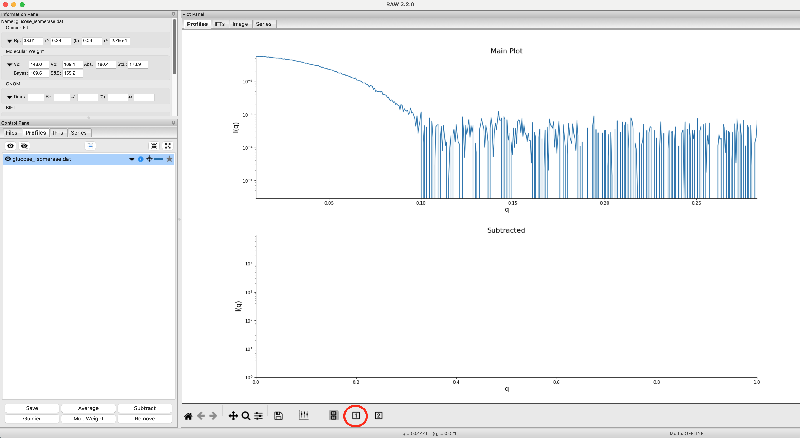

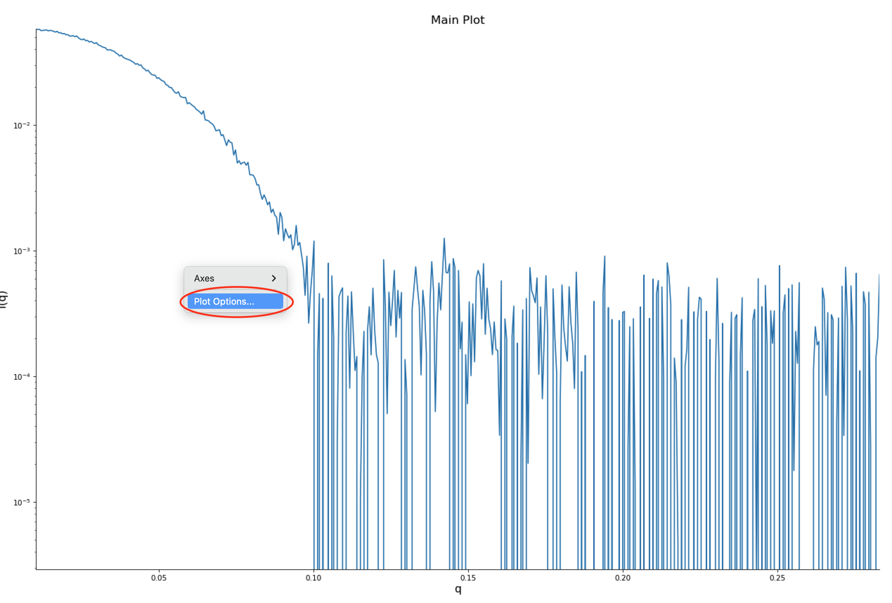

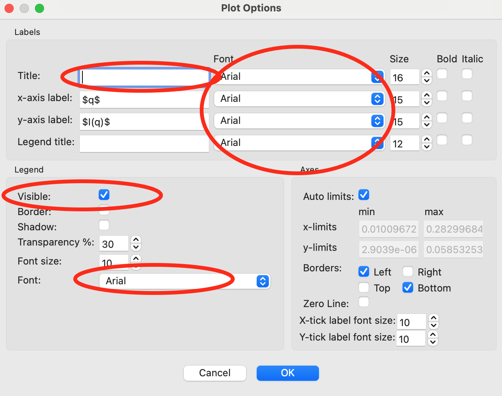

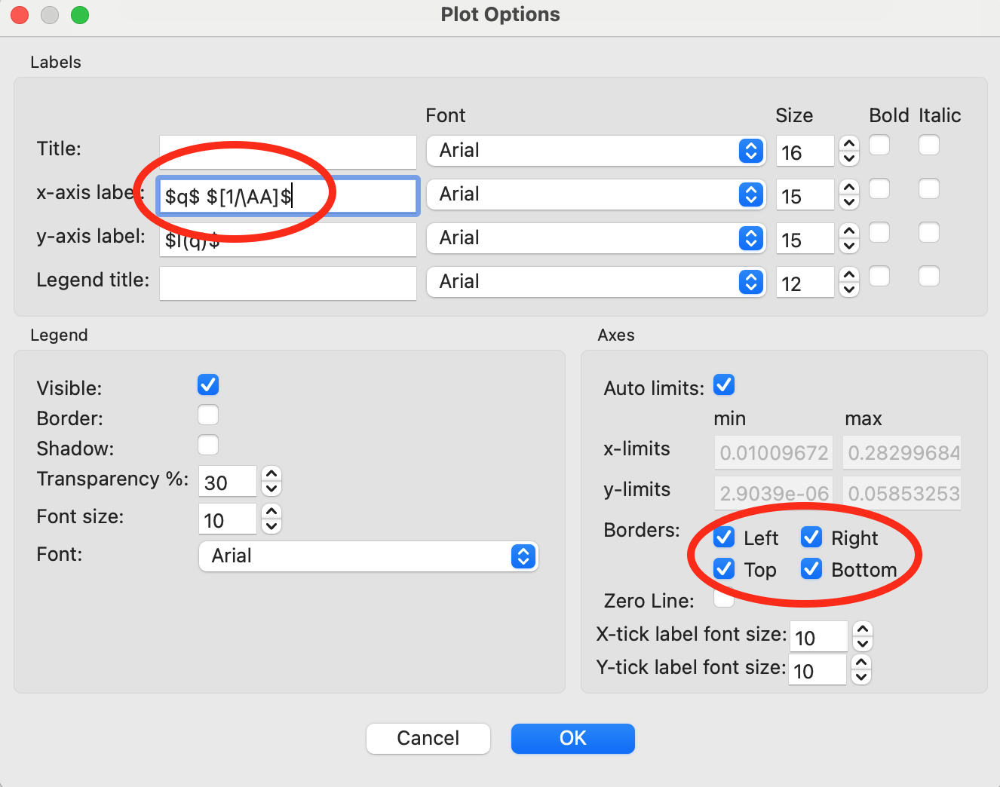

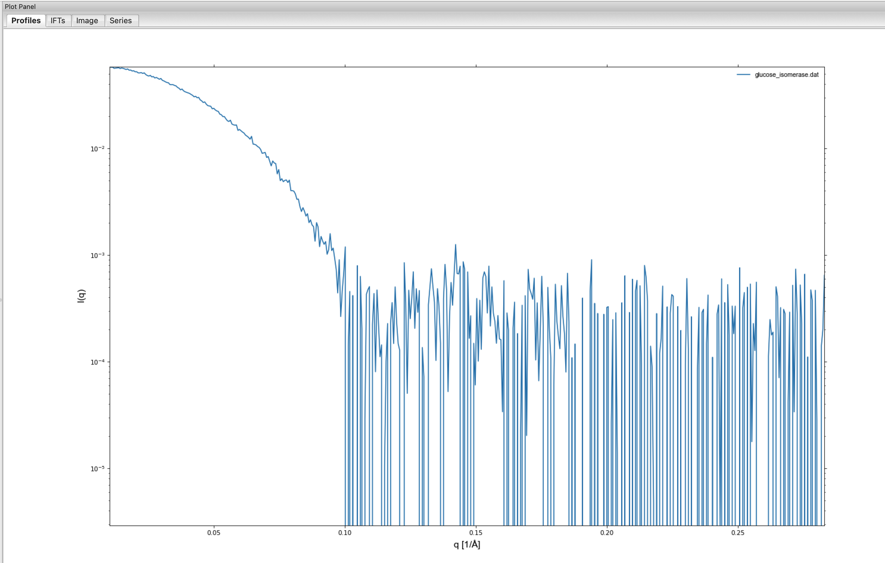

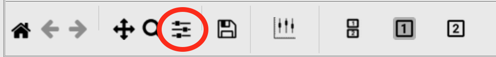

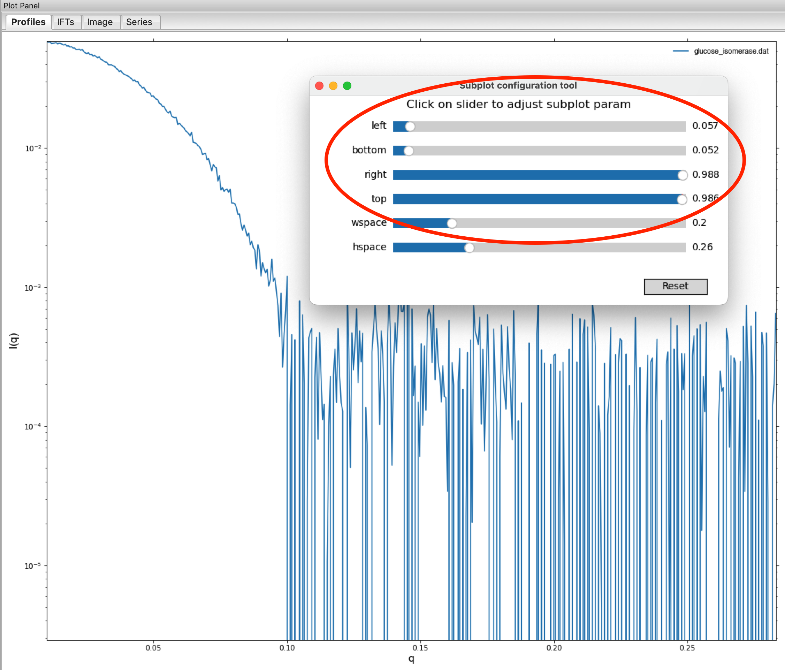

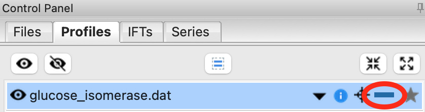

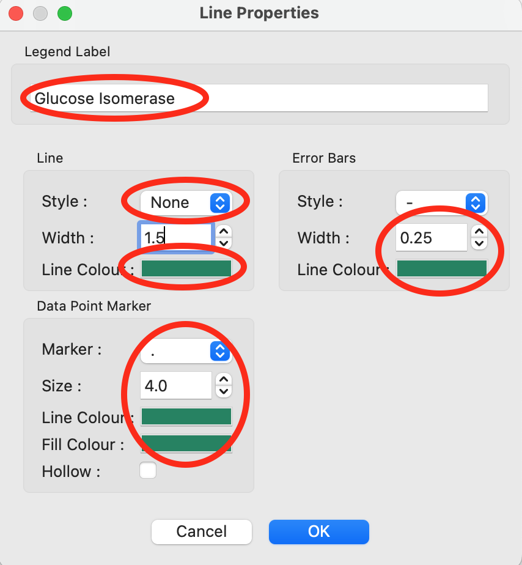

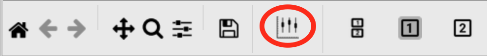

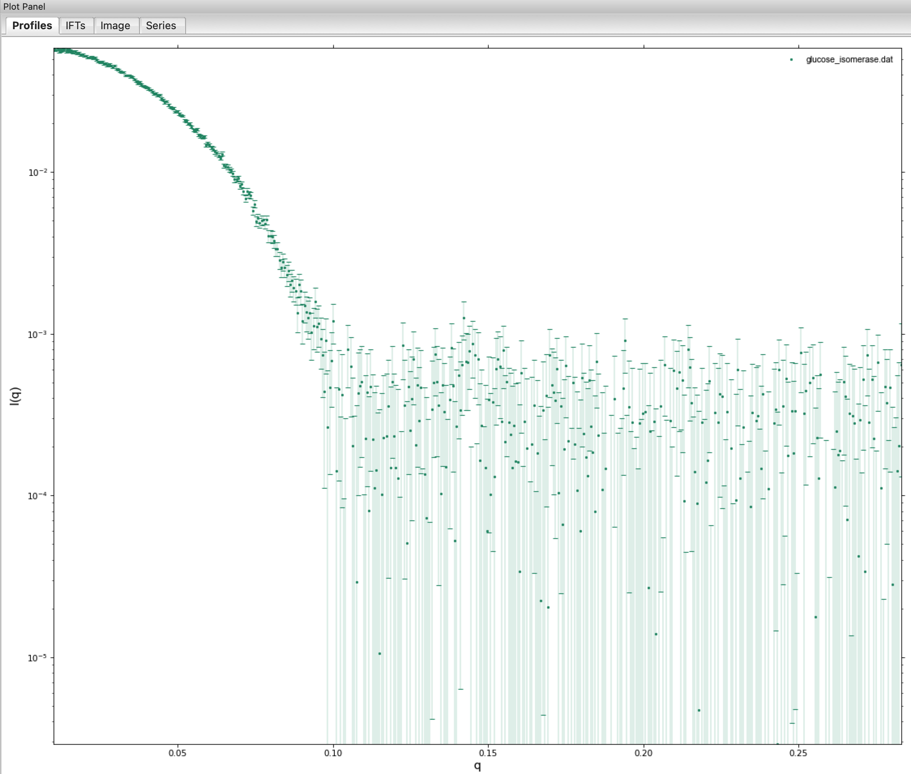

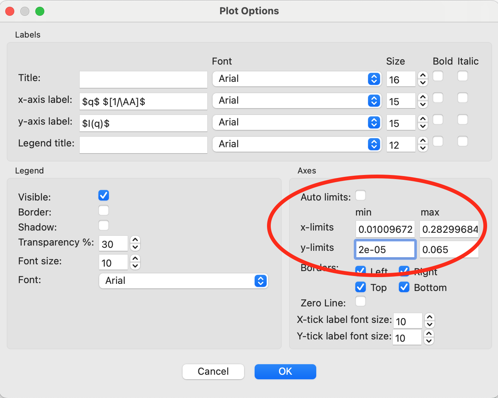

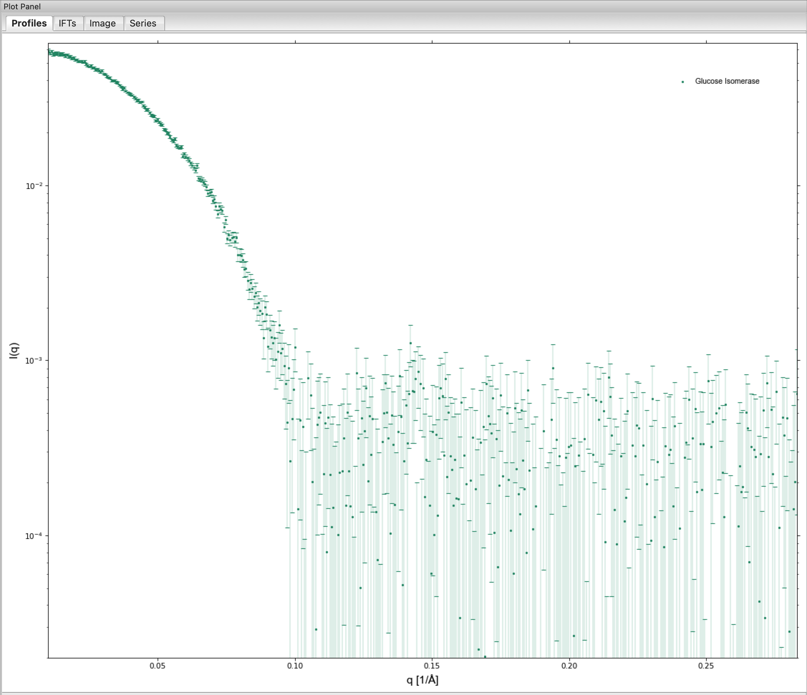
