Section 1: Basic processing
---------------------------
.. _section1:

This section will guide you through basic processing of files in RAW. It includes:
integrating images into scattering profiles, averaging and subtracting scattering
profiles, doing Guinier fits, MW analysis, processing SEC-SAXS data, processing
data from 2 detectors (SAXS and WAXS data), and a few other things. It refers to
the :ref:`RAW tutorial data <tutorialdata>`.

Part 1. Loading configuration files and images, creating subtracted scattering profiles, saving profiles
^^^^^^^^^^^^^^^^^^^^^^^^^^^^^^^^^^^^^^^^^^^^^^^^^^^^^^^^^^^^^^^^^^^^^^^^^^^^^^^^^^^^^^^^^^^^^^^^^^^^^^^^
.. _s1p1:

#.  Open RAW. The install instructions contain information on installing and running RAW.

#.  In the files tab, click on the folder button and navigate to the
    **Tutorial_Data/standards_data** folder. Click the open button to show that
    folder in the RAW file browser.

    |100002010000018F000000558E072296495A065F_png|

#.  At the bottom of the File tab in the Control Panel, use the dropdown menu to
    set the file type filter to “CFG files (\*.cfg)”.

    |100002010000018900000120F1FE156CD1C06C32_png|

#.  Double click on the **SAXS.cfg** file to load the SAXS configuration.
    This loads the beamline configuration into the program.

    *   *Note:* Any time you are going to process images, you need to load the appropriate configuration!

#.  Change the file type filter to “TIFF files (\*.tiff)”.

#.  At the CHESS G1 station, typically ~10 images are collected from a given sample. To load in the 10 images
    for the glucose isomerase (GI) sample, start by selecting the files
    **GI2_A9_19_001_xxxx.tiff**, where **xxxx** will range from **0000** to **0009**\ .
    These files are measured scattering from 0.47 mg/ml GI.

    *   *Tip:* you can hold down the ctrl key (apple key on macs) while clicking to select multiple files
        individually. You can also click on a file, and then shift click on another file to select those
        files and everything between them.

    *   *Warning:* Don’t load the files with **PIL3** in their name. Those are the wide-angle
        scattering (WAXS) data, which we will process separately later.

#.  Click the plot button to integrate all of the images and plot the integrated scattering profiles on the Main Plot.

    *   *Note:* Typically, once the images are integrated we work only with the scattering profiles.
        However, it is useful to keep the images around in case you want to reprocess the data.

    |1000020100000187000001E62B30741A90D8AB28_png|

#.  Plot the **GIbuf2** scattering profiles from the images. These are measured
    scattering from the matching buffer, without any protein, for the GI sample.

#.  Click on the Manipulation tab. This is where you can see what scattering
    profiles are loaded into RAW, and manipulate/analyze them.

    *   *Checkpoint:* If you’ve successfully loaded the images given, you should see twenty
        scattering profiles in the manipulation list, with names like **GI2_A9_19_001_0000.tiff**
        or **GIbuf2_A9_18_001_0000.tif**.

    |1000020100000400000002FDBA0AF8F207353F1C_png|

#.  Click on a filename to select the scattering profile. The background should turn gray, indicating it is selected.

    |1000020100000189000000C42B4CCF42641BC35E_png|

#.  Select all of the GI scattering profiles

    *   *Tip:* Again, the ctrl(/apple) key or the shift key can be used
        to select multiple scattering profiles.

    *   *Warning:* Select only the GI profiles, not the GI buffer profiles.

    |1000020100000191000002168932F455C75660D5_png|

#.  Use the average button to average all of the scattering profiles collected into a single curve.

    *   *Checkpoint:* The averaged scattering profile should appear at the bottom of
        the manipulation list. You may have to scroll down to see it. The filename
        will be in green, and will start with **A_**, indicating it is an average scattering profile.

#.  Average all of the GI buffer scattering profiles.

#.  In order to see the averaged scattering profiles, you will need to hide the
    individual profiles from the plot. Clicking on the check box to the left of
    the filename will show/hide a scattering profile. When the box is checked,
    the profile is shown on the plot, when it is unchecked, the profile is hidden.
    Hide all of the profiles except the two averaged curves.

    *   *Tip:* The eye and eye with the x through it at the top of the manipulation panel
        can be used to show/hide sets of loaded profiles at once. If no profiles are selected,
        these buttons show/hide all loaded profiles. If some profiles are selected, these buttons
        show/hide just the selected profiles. Try selecting all but the averaged files and using
        the show/hide all buttons.

    |1000020100000191000000A5B7B91A3F7EF281FE_png|

#.  Next you need to subtract the buffer scattering profile from the measured
    protein scattering (which is really the scattering of the protein plus the
    scattering of the buffer). Star the averaged buffer file, and select the
    averaged protein file, then click the subtract button.

    |100002010000018E0000009086C0F8001DCF0519_png|

    *   *Checkpoint:* The subtracted scattering profile should be shown in the lower plot. A new manipulation
        item should be shown in the manipulation menu, with the name in red and a **S_** prefix
        indicating it is a subtracted file.

    |1000020100000401000002FEBFCA80422CC6B9F5_png|

#.  You don’t need the individual image scattering profiles any more. Select all of those
    (but not your averaged or subtracted profiles!) and click remove.

    *   *Note:* This only removes the scattering profiles from RAW. The images on your
        hard drive are unaffected.

#.  Load in the **lys2** and **lysbuf2** files, average, and subtract to create a subtracted lysozyme
    scattering profile. The concentration of this sample was 4.27 mg/ml. Remove all of the profiles
    that are not averaged or subtracted profiles.

    *   *Tip:* In order to tell which curve is which in a plot, click on the target icon in
        the manipulation list. This should bold that curve in the plot. Click the target icon
        again to return the curve to normal.

    |raw_mainplot_png|

#.  We’re done with the averaged profiles. Select all of the averaged profiles and click the “Save”
    button to save them in the **standards_data** folder. Note that in the filename in the manipulation
    list, the * at the front goes away. This indicates there are no unsaved changes to those scattering
    profiles. You can now remove them.

    *   *Note:* This saves them with a **.dat** extension. This is the standard format for SAXS
        scattering profiles, and is also human readable.

    |100002010000018E00000212F5ECF2E1F283E9BE_png|

#.  Right click on the subtracted plot, move the cursor over ‘Axes’ and select the Log-Log option.
    Well-behaved globular proteins will intersect the intensity axis roughly perpendicularly.

    *   *Note:* It is best practice to display SAXS data, particularly in publications, on either
        a semi-log (Log-Lin, default option in RAW) or double-log plot (depending on the features
        of interest).

    |100002010000023300000136897A226F6B626581_png|

Part 2. Guinier analysis
^^^^^^^^^^^^^^^^^^^^^^^^
.. _s1p2:

Recall Guinier’s approximation at low-*q*\ : :math:`I(q)\approx I(0) \exp(-R_g^2 q^2 /3)`.

|Rg| and I(0) can be determined by performing a linear fit in the Guinier plot (a plot of
:math:`\ln(I)` vs. :math:`q^2`). The fitting region should normally have :math:`q_{max}R_g<1.3`
for globular proteins. This fitting region is called the “Guinier region.”

#.  In RAW, right click (ctrl click on macs without a right mouse button) on the
    subtracted GI scattering profile in the Manipulation list and select “Guinier fit”.
    In the plots on the right, the top plot shows you the Guinier plot and the fit,
    while the bottom plot shows you the residual of the fit.

    *   *Note:* RAW automatically tries to find the best Guinier region for you
        when the Guinier window is opened for the first time.

    *   *Note:* The |Rg| value is in Angstroms, while the two :math:`qR_g` boxes give, left to right,
        :math:`q_{min}R_g` and :math:`q_{max}R_g` respectively.

    |gi_guinier_png|

#.  In the “Control” panel, you’ll see that n_min is now 6. This means RAW has
    cut off the first six points of the scattering profile in the fit. Use the
    arrow buttons next to the n_min box to adjust that to zero. Check whether
    the |Rg| changes.

#.  In the “Parameters” panel, note that :math:`q_{max}R_g` is only ~1.26. Recall that for globular
    proteins like GI, it is typical to have :math:`q_{max}R_g` ~1.3. Adjust n_max until that is
    the case, watching what happens to the |Rg| and the residual.

    *   *Question:* The literature radius of gyration for GI is 32.7 Å. How does yours compare?

#.  RAW also provides an estimate of the uncertainty in both the |Rg| and I0 values for
    the Guinier fit, shown in the Uncertainty section.

    *   *Note:* This is the largest of the uncertainties from the fit (standard deviation
        of fit values calculated from the covariance matrix), and either the standard deviation of
        |Rg| and I(0) across all acceptable intervals found by the autorg function
        or an estimated uncertainty in |Rg| and I(0) based on variation of the selected
        interval start and end points.

#.  Click the “OK” button to keep the results.

    *   *Checkpoint:* If you now select the GI scattering profile, in the information panel
        at the top you should see the |Rg| and I(0) that you just found.

    *   *Note:* Clicking the “Cancel button will discard the results.

#.  Repeat the Guinier analysis for lysozyme.

    *   *Try:* Increase q\ :sub:`min` and/or decrease q\ :sub:`max` to verify that the |Rg|
        does not change significantly in the Guinier region.

    *   *Tip:* If you hover your mouse cursor over the info icon (just left of the target icon)
        for a given scattering profile it should show you the |Rg| and I(0) of your Guinier analysis.

    |lys_guinier_png|

Part 3. Molecular weight analysis
^^^^^^^^^^^^^^^^^^^^^^^^^^^^^^^^^
RAW provides four forms of molecular weight analysis:

*   Referencing I(0) to that of a known standard
*   From the volume of correlation using the method of Rambo and Tainer
*   From the adjusted Porod volume using the method of Fisher et al.
*   From the value of I(0) on an absolute scale.

#.  In RAW, right click on the subtracted GI scattering profile in the manipulation panel
    and select “Molecular weight.” At the top of the panel is a description of the methods
    used, and the results of your Guinier fit. All four methods require a good Guinier fit,
    so you can use that button to redo the fit if necessary. In the lower part of the panel,
    the results of the four estimates for MW are shown.

    *   *Note:* Neither the I(0) Ref. MW panel nor the Abs. MW panel should be reporting a MW.

    |mw_png|

#.  In either concentration box, enter the sample concentration of 0.47 mg/ml. Notice that you
    now get results from all four methods of MW calculation.

    *   *Question:* The expected MW value for GI is 172 kDa. How do your results compare?

#.  Click on the “Show Details” button for the Vc MW panel. You should see a graph, which shows
    the integrated area of :math:`qI(q)` vs. *q*\ . For this method to be accurate,
    this value needs to converge at high *q*\ .

    |mw_vc_png|

#.  Click the “OK” button to save your analysis.

    *   *Note:* The “Cancel” button discards the analysis.

#.  Repeat the MW analysis for the lysozyme sample, which had a concentration of 4.27 mg/ml.
    The expected MW of lysozyme is 14.3 kDa.

    *   *Question:* Does the Vc method work for the lysozyme data?

Part 4. Saving analysis information
^^^^^^^^^^^^^^^^^^^^^^^^^^^^^^^^^^^
#.  Save your subtracted scattering profiles in the **standards_data** folder.

#.  Select both subtracted profiles, right click on one of them, and select ‘Save all analysis
    info.’ Give it an appropriate name and save it in the **standards_data** folder.

    *   *Note:* This saves a **.csv** file with all of the analysis information for
        the selected scattering profiles.

    *   *Try:* Open the **.csv** file in Microsoft Excel or Libre/Open Office Calc. You should
        see all of the analysis that you just did.

#.  Remove the subtracted scattering profiles from RAW by selecting both of them and clicking the “Remove” button.

#.  Load the saved subtracted scattering profiles back into RAW. Note that if you select one
    in the Manipulation list, the information panel in the upper left corner of RAW populates
    with analysis information. The analysis information is saved with the scattering profile,
    so if you forget to save it in a **.csv**\ , you can load in the profiles later and do it then.

    *   *Note:* To get new files to show up in the file tab, you may have to click the refresh
        button. Also, make sure to that your file type filter is either All files or DAT files.

    |10000201000001880000007454FA55D402257E07_png|

    *   *Try:* Open the saved subtracted scattering profile **S_A_GI2_A9_19_001_0000.dat** in a
        text editor such as Notepad (windows) or TextEdit (mac). You should see all of the data
        in three columns, followed by header information. If you scroll down far enough, the
        header information contains all of the analysis information, as well as the files that
        were averaged and subtracted to make the scattering profile.

Part 5. Kratky analysis
^^^^^^^^^^^^^^^^^^^^^^^

A Kratky plot is a plot of :math:`q^2I(q)` vs. *q*\ . Kratky plots can qualitatively assess
the flexibility and/or degree of unfolding in samples. Unfolded (highly flexible) proteins
should have a plateau in the Kratky plot at high q, while compact, globular proteins will
have a bell-shaped (Gaussian) peak. A partially unfolded (flexible) protein may have a
combination of the bell-shape and plateau, or a plateau that slowly decays to zero.

Normalized Kratky plots are plots of :math:`q^2I(q)/I(0)` vs. *q*\ . This normalizes scattering profiles
by mass and concentration. Dimensionless Kratky plots are presented as either :math:`(qR_g)^2I(q)`
vs. :math:`qR_g`\ or :math:`(q^2V_c)I(q)` vs. :math:`q(V_c)^{1/2}`\ . These dimensionless plots
can provide semi-quantitative analysis of flexibility and disorder. More information about can
be found here and references therein: `http://www.bioisis.net/tutorial/21 <http://www.bioisis.net/tutorial/21>`_.

#.  Put the top plot on Kratky axes.

    * *Tip:* Right click on the plot to change the plot type.

#.  Show only the top plot by clicking on the 1 in the plot control bar below the plots.

    |1000020100000261000002D198EA0F5B06DFE72F_png|

#.  Both GI and lysozyme show the classic bell shape, indicating they are completely folded.

    *   *Warning:* Bad buffer subtraction can also result in a Kratky plot that appears to show
        some degree of flexibility. Excellent buffer subtraction is required for accurately
        analysis with this technique.

#.  Load the two scattering profiles in the **Tutorial_Data/flexibility_data** folder.

    *   *Note:* The **unfolded.dat** file is the scattering profile of an unfolded lysine
        riboswitch. The **partially_folded.dat** file is same lysine riboswitch, but in the
        biologically functional configuration. The data were downloaded from the
        `BIOISIS database <http://www.bioisis.net/>`_, and has the BIOISIS ids of 2LYSRR and 3LYSRR.

#.  SAXS data can be presented on an arbitrary scale, which is why these two profiles have
    intensity that is much larger than the lysozyme and GI data (which is on an absolute scale).
    Use the triangle button for each item in the manipulation menu to show more options. Hide one
    of the newly loaded data sets, and adjust the scale factor on the other until you can comfortably
    see it and your lysozyme and GI data. Repeat the scale adjustment for the other data set.

    *   *Tip:* The up and down arrows will only adjust the last digit of the scale factor.

    |100002010000018D000000E6174D733C1F4E44CD_png|

    |10000201000003FD000002FDBECFEBC4BFFF1C27_png|

#.  Kratky analysis can also be done on normalized or dimensionless data. RAW supports normalization
    by I(0), and non-dimensionalization by |Rg| and Vc (the volume of correlation).

#.  Select all four loaded scattering profiles, right click, and select the Normalized Kratky Plot option.

#.  Normalized Kratky plots require Guinier analysis to be done. If one or more profiles are missing
    this information, RAW will show the following window. You can either cancel, and do the fits manually,
    or you can proceed with RAW’s automatic determination.

    |10000201000001A40000009714A5986ACDCF0485_png|

#.  Click the Proceed using AutoRg button to proceed to the Normalized Kratky Plot window using
    RAW’s automatic fitting for |Rg|.

#.  By default, the plot is the Dimensionless |Rg| plot. Use the dropdown “Plot” menu at the top to
    select the Normalized (by I(0) and Dimensionless Vc plots.

    |100002010000031E000002558ABF7E7941F525B1_png|

#.  Return to the Dimensionless |Rg| plot. Use the check boxes to hide the partially_folded and
    unfolded data sets on the plot. Note that both the lysozyme and GI data look very similar
    on this plot, showing they have similar shapes and (lack of) flexibility.

    *   *Tip:* You can click on the colored line in the Color column to change the color of an item on the plot.

    |100002010000010E0000005F5824E2A36886EADC_png|

#.  Right click on the plot and select “Export Data As CSV” to save the dimensionless data
    for further processing or plotting with another program.

#.  Click the Close button to close the Normalized Kratky Plot window.

Part 6. Similarity Testing
^^^^^^^^^^^^^^^^^^^^^^^^^^
.. _s1p6:

RAW has the ability to test scattering profiles for statistical similarity. Currently, only one
test is available: the Correlation Map test. This can be done manually, and is also done
automatically when scattering profiles are averaged. This can be useful when you’re dealing
with data that may show changes in scattering from radiation damage or other possible sources.

#.  Clear any data loaded into RAW. Load all of the profiles in the **Tutorial_Data/damage_data**
    folder into the main plot. Show only the top plot.

    *   *Tip:* In the Files tab, click the “Clear All” button.

#.  Put the plot on a log-log scale. You should see that the profiles are different at low *q*\ .

    *   *Note:* These data are showing what radiation damage looks like in a data set. They
        are consecutive profiles from the same sample, and as total exposure of the sample
        increase (frame number increases), the sample damages. In this case, the damage
        is manifesting as aggregation, which shows up as an uptick in the profiles at low *q*\ .

    |10000201000003FD000002FEC6ABABA160C40969_png|

#.  Select all of the profiles and average them. You will get a warning message informing you
    that not all the files are statistically the same.

    *   *Note:* This is only as good as the statistical test being used, and the cutoff
        threshold selected. In the advanced options panel you can select the test, whether
        or not it is corrected for multiple testing, and the threshold used.

    |10000201000001D2000000EA0EBB8DE8A90AF844_png|

#.  Click the “Average Only Similar Files” button.

    *   Note: This averages only those profiles found to the same as the first file,
        for the given statistical test.

#.  Select all of the profiles except the new averaged one, and right click and
    select “Similarity Test”.

    |10000201000002560000018C615B7EB8DE916C34_png|

#.  The similarity testing window (above) shows the results of the pairwise tests
    done using the CorMap method. Expand the window and the Filename columns
    to allow you to see the full filenames along with the probabilities.

    |100002010000034C00000049FD162E82EB78E7ED_png|

#.  Using the menu at the top, turn off multiple testing correction. Change the
    highlight less than value to 0.15, and highlight those pairs.

    |10000201000002C900000115B88F915CDDC779D3_png|

#.  Without multiple testing correction, and using a less stringent threshold for similarity,
    we see that more profiles are selected here (profiles 6-10) than were excluded from the
    average using the automatic test. Because we know radiation damage increases with dose,
    it is reasonable to suspect that we should discard profiles 6-10, not just 8-10 as in
    the automated version.

#.  Save the similarity test data as a **.csv** by clicking the “Save” button.

#.  Close the similarity testing window by clicking the “Done” button.

#.  Average profiles 1-5.

#.  Hide all of the profiles except the two averaged profiles on the plot.

    *   *Question:* Is there a difference between the two? What about if you do a Guinier fit?

    *   *Note:* In this case, the differences are subtle, a ~1-2% increase in Rg. So
        the automated determination did a reasonable job. However, it is generally good
        to double check your set of profiles both visually and using the Similarity Test
        panel when the automated test warns you of outlier profiles.

Part 7. Basic SEC-SAXS processing
^^^^^^^^^^^^^^^^^^^^^^^^^^^^^^^^^
In a typical SEC-SAXS run, images are continuously collected while the eluate (outflow)
of a size exclusion column flows through the SAXS sample cell. As proteins scatter more
strongly than buffer, a plot of total scattered intensity vs. time, the so-called SAXS
chromatograph, will show a set of peaks similar to what is seen by UV absorption measurement
of the SEC system. RAW includes the capability to do routine processing of SEC-SAXS data.
This includes creating the SAXS chromatograph from the data, plotting |Rg|, MW, and I(0)
across the peaks, and extracting specific frames for further analysis.

*Note:* In RAW, this is called Series analysis, as the same tools  can be used for other
sequentially sampled data sets.

#.  Clear any data loaded into RAW. Click on the Series tab in the control panel. Click the
    “Select file in series” button. Navigate to the **Tutorial_Data/sec_data/sec_sample_1**
    folder and select any of the **.dat** files in the folder.

    *   *Tip:* In the Files tab, click the “Clear All” button.

    *   *Troubleshooting:* If you get an error message, it means you don't have
        a configuration file loaded. Load the SAXS.cfg file referenced :ref:`earlier <s1p1>`.

    |series_panel_png|

#.  The SEC run will automatically load. RAW should automatically show you the Series
    plot panel. If not, click on the Series tab in the plot panel.

    |series_plot_png|

    *   *Try:* Each point on this curve is the integrated intensity of a scattering profile.
        You can figure out which one by right clicking on the filename in the Series list and
        selecting ‘Show data’. This will show you the frame number and integrated intensity
        displayed on the plot, and the filename corresponding to the displayed frame number.

#.  Drag the plot so that you can clearly the see the first frame. You’ll notice it has a
    significantly lower intensity than the rest of the frames. This happens occasionally
    at the MacCHESS G1 beamline (where the data was taken). It can make it harder to tell
    what the data is doing.

    *   *Tip:* Select the crossed arrows in the plot control bar, and then click and drag on
        the plot to move the curve around on the screen.

#.  Go to the files tab and navigate to the **sec_sample_1** data directory. Click on
    the second data file, **profile_001_0001.dat**\ . Scroll down to the bottom of the
    file list, and shift click on the last file, **profile_001_0964.dat**\ . This should
    highlight all of the files in between, as well as the two you clicked on.

#.  Click on the “Plot Series” button. You will see the same curve plotted as before, but
    without the very first scattering profile. Remove the other loaded data set. Now
    you should have a curve where the baseline is very close to the bottom of the plot.

    |series_plot2_png|

#.  In some cases it is more useful to look at the mean intensity or the intensity at a
    specific *q* value than the total intensity. Right click on the plot and select mean
    intensity for the left axis y data. Then try the intensity at *q=0.02*\ .

    *   *Note:* You need to have the drag button in the plot control bar unselected to
        get a right click menu.

#.  Return to plotting the integrated intensity. Zoom in near the base of the peak. Notice
    that there are two smaller peaks on the left, likely corresponding to higher order
    oligomers that we don’t have the signal to properly resolve. Also notice that the
    baseline after the peak is not the same as the baseline before the peak. This can happen
    for several reasons, such as damaged protein sticking to the sample cell windows.

    *   *Tip:* Click on the magnifying glass at the bottom of the plot, then click
        and drag on the plot to select a region to zoom in on.

    |series_plot3_png|

#.  Zoom back out to the full plot.

    *   *Tip:* Click the Home (house) button at the bottom of the plot.

#.  In order to determine if we really have a single species across the peak, we will
    calculate the |Rg| and MW as a function of frame number. In the “Calculate/Plot
    Structural Parameters” section, enter a “Buffer Range” of 400 to 500 and a “Window Size”
    of 5. Star the SEC curve of interest and click the “Set/Update Parameters” button.
    This may take a while to calculate.

    |100002010000018800000095A9F99A4566D6E540_png|

    *   *Note:* All of the files in the given buffer range will be averaged and used as a buffer.
        A sliding average window is then moved across the SEC curve, of size specified by the
        Window Size parameter. So for a window of size five, the profiles corresponding to frames
        0-4, 1-5, 2-6, etc will be averaged. From each of these averaged set of curves, the average
        buffer will be subtracted, and RAW will attempt to calculate the |Rg|, MW, and I(0). These
        values are then plotted as a function of frame number.

    *   *Note:* If you had RNA instead of protein, you would use the Mol. Type menu
        to select that option. This affects the calculation of the molecular weight.

    *   *Warning:* It is important that the buffer range actually be buffer! In this case,
        we made sure to not include the small peaks before the main peak.

#.  Once the calculation is finished, you should see a set of markers, matching the color
    of the original curve. These points are plotted on the right Y axis. Click on the green
    line next to the star in the Series control panel. In the line properties control panel this
    brings up, change the Calc Marker color to something different. Add a line to the Calc
    Markers by selecting line style ‘-’ (solid), and adjust the line color to your liking.

    *   *Tip:* You can do the same thing to adjust the colors of the scattering profiles in
        the Manipulation and IFT control tabs.

    |series_color_png|

    |series_line_props_png|

#.  Zoom in on the peak region. You’ll notice a region of roughly constant |Rg| across the
    peak. To either side there are regions with higher or lower |Rg| values. These variations,
    particularly on the right side, are from scattering profiles near the edge of the peak
    with lower concentrations of sample, leading to more noise in determining the |Rg| values.

    *   *Note:* There may also be some effects from the small peaks on the leading (left)
        side of the peak, and from the baseline mismatch between left and right sides of the peak.

    |series_rg_png|

#.  You can move your mouse cursor across the |Rg| values on the plot, and the frame number
    and intensity and |Rg| at your cursor position are read out in the bar at the bottom
    of the RAW window. Use this to determine the range of frames over which the |Rg| is
    roughly constant.

    *   *Note:* For an automated determination of |Rg|, particularly with only 5 frames
        averaged together, a change of several percent is likely insignificant.

    |100002010000026300000034957322C176A93588_png|

#.  Zoom back out to the full plot. Right click on the plot and select molecular weight as
    the right axis Y data. Again zoom in on the peak region and find the set of frames for
    which the MW is roughly constant.

    *   *Try:* Vary the window size and/or the buffer range and see how that affects the
        constant |Rg| and MW regions.

#.  Enter the buffer range, 400 to 500, in the “Select Data Frames” boxes of the “Data
    to main plot” section, and then click the “Average to Main Plot” button.

    |100002010000013700000037882DFA03691018C8_png|

#.  Enter the range over which you found the |Rg| and MW to be constant (should be
    ~700-715) in the “Select Data Frames” section and click the “Average to Main Plot”
    button.

#.  Click on the Main Plot tab and the Manipulation tab. You should see two scattering
    profiles, one is the average of the buffer and one is the average across the peak.
    Carry out buffer subtraction and then do a Guinier and MW analysis.

    *   *Note:* The I(0) reference and absolute calibration will not be accurate for
        SEC-SAXS data, as the concentration is not accurately known.

    *   *Question:* How does the |Rg| and MW you get from the averaged curve compare
        to what RAW found automatically for the peak?

    *   *Tip:* Make sure your plot axes are Log-Lin or Log-Log. Make sure that both
        plots are shown by clicking the 1/2 button at the bottom of the plot window.

#.  Generate a new average buffer from the frames on the right side of the peak, 850-950.
    Generate a new subtracted curve and repeat the |Rg| and MW analysis.

    *   *Question:* Which curve looks best?

#.  Try taking a few small sections of the peak, 5-10 frames wide. Use one on the left
    side of the peak, one at the top, and one on the right side (e.g. 685-690, 700-705,
    725-730). Generate subtracted curves from the first buffer (frames 400-500). Carry
    out the |Rg| and MW analysis.

    *   *Question:* Are there any differences in these curves?

    *   *Try:* Apply a scale factor to these new subtracted curves. Can you scale them onto each other?

    *   *Note:* It is useful to analyze several regions on the peaks of the SEC-SAXS curve
        in this way to verify that they are the same. You could have species that failed to
        separate out completely. This kind of analysis will give you confidence in your final
        result.

#.  Load the Bovine Serum Albumin (BSA) SEC-SAXS data contained in the **sec_sample_2**
    data folder. Hide the first SEC-SAXS chromatograph.

#.  Select a good buffer region, and calculate the |Rg| and MW across the peak for the BSA.

    *   *Warning:* Don’t forget to star the curve you want to set/update parameters for!

    *   *Tip:* If you hover your mouse cursor over the info icon, you will see the buffer
        range and window size used to calculate the parameters.

    *   *Question:* Is the BSA peak one species?

#.  Find the useful region of the peak (constant |Rg|/MW), and send the buffer and sample
    data to the main plot. Carry out the standard |Rg| and MW analysis on the subtracted
    scattering profile. For BSA, we expect |Rg| ~28 Å and MW ~66 kDa.

    *   *Try:* As with the previous sample, take a few smaller regions along the peak
        and see if the subtracted scattering profile varies.

#.  In the Series control tab, right click on the name of BSA curve in the list. Select export
    data and save it in an appropriate location. This will save a CSV file with the frame
    number, integrated intensity, radius of gyration, molecular weight, filename for each
    frame number, and a few other items. This allows you to plot that data for publications,
    align it with the UV trace, or whatever else you want to do with it.

    *   *Try:* Open the **.csv** file you just saved in Excel or Libre/Open Office Calc.

#.  Select both items in the Series control panel list, and save them in the **sec_data**
    folder. This saves the Series plot data in a form that can be quickly loaded by RAW.

    *   *Try:* Clear the Series data and then open one of your saved files from the Files tab
        using either the “Plot” or “Plot Series” button.

Part 8. WAXS processing and merging
^^^^^^^^^^^^^^^^^^^^^^^^^^^^^^^^^^^
Several SAXS beamlines use two (or more) detectors to collect different q regions. The MacCHESS
G1 beamline uses dual Pilatus detectors to measure SAXS and WAXS from *q* ~0.008 – 0.75
Å\ :sup:`-1`\ . The SAXS detector has *q* ~< 0.25 Å\ :sup:`-1` and the wide-angle scattering
(WAXS) data has *q* >~ 0.25 Å\ :sup:`-1`\ . All of the data that you have been working with
so far has been SAXS data. Some experiments can make use of the WAXS data. In this part of the
tutorial you will learn the basics of processing it.

#.  Clear any data in RAW.

#.  Navigate to the **standards_data** and load the **WAXS.cfg** file.

#.  Plot the **lysbuff2** and **lys2** **PIL3** files. These are the images from the WAXS
    detector. Average these files and create a subtracted WAXS scattering profile.

#.  Load the saved subtracted SAXS scattering profile for the lysozyme standards data.

    *   *Note:* You should have saved it in the **standards_data** folder, and it is likely
        named **S_A_lys2_A9_17_001_0000.dat**\ .

#.  Move the SAXS scattering profile you just loaded to the bottom plot by right clicking
    on it in the Manipulation list and selecting “Move to bottom plot.”

#.  The WAXS data is not on the same scale as the SAXS data. For this data, the known scale
    factor to apply is 0.000014 to the WAXS data.

    *   *Note:* The scale factor can be calculated as the ratio of solid angles subtended
        by the pixels on the SAXS and WAXS detectors, plus any scale factor for absolute
        calibration and normalization included for one curve but not the other.

#.  Star the WAXS data. Right click on the SAXS data and select merge. This will create a
    new merged scattering profile. The new file will have the prefix **M_** to indicate it
    is a merged file.

    *   *Tip:* If you can’t see it, that’s probably because it appeared on the upper plot,
        and is hidden by the very large intensities of the averaged WAXS files. Either try
        hiding those, or move the Merged curve to the lower plot.

Part 9. A few additional tricks
^^^^^^^^^^^^^^^^^^^^^^^^^^^^^^^
Here are some additional tricks that may make your life easier while using RAW:

#.  If you click on a scattering profile in the main plot, the corresponding manipulation
    list item will be highlighted.

#.  You can save the workspace by going to File->Save Workspace. This will save all
    of the scattering profiles, IFT curves, and Series curves. These will all be loaded
    again when you load the workspace.

    *   *Note:* This does not save the settings!

#.  If you go to Options -> Advanced Options -> Molecular weight, you can change the default
    type of molecule used in the MW estimation from the volume of correlation. This affects
    the default option selected in the MW window.

#.  If you have the crossed arrows selected in the plot control bar to drag a plot, right
    clicking and dragging allows you to zoom a plot.

#.  You can turn error bars on and off for scattering profiles using the error bar button
    in the plot control (to the right of the save button).

#.  You can rename a curve by right clicking on the appropriate entry in the list and choosing rename.

#.  You can view the history of a scattering profile by right clicking on it and selecting
    Show History. For a curve that has been processed from an image, this will show you
    processing parameters such as normalization and any corrections applied to the scattering
    intensity. For a curve that is processed (such as an averaged of subtracted curve) it will
    show you the steps used to make that curve. For example, for an averaged curve, it will
    show you all of the files that were averaged.

.. |10000201000002560000018C615B7EB8DE916C34_png| image:: images/10000201000002560000018C615B7EB8DE916C34.png

.. |100002010000013700000037882DFA03691018C8_png| image:: images/100002010000013700000037882DFA03691018C8.png

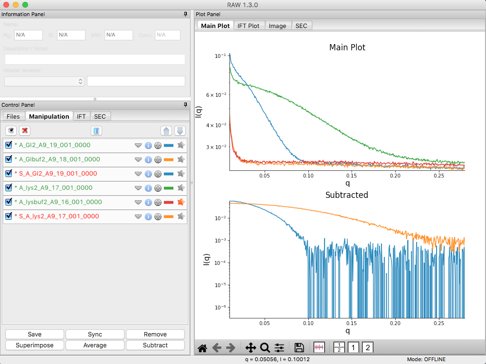

.. |series_color_png| image:: images/series_color.png

.. |100002010000018800000095A9F99A4566D6E540_png| image:: images/100002010000018800000095A9F99A4566D6E540.png

.. |10000201000001880000007454FA55D402257E07_png| image:: images/10000201000001880000007454FA55D402257E07.png

.. |mw_vc_png| image:: images/mw_vc.png

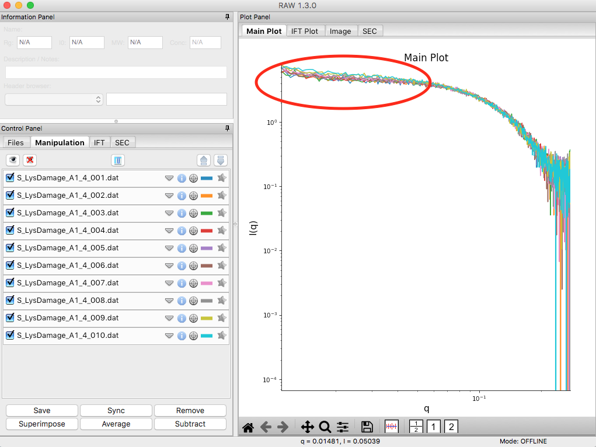

.. |100002010000018E00000212F5ECF2E1F283E9BE_png| image:: images/100002010000018E00000212F5ECF2E1F283E9BE.png

.. |1000020100000261000002D198EA0F5B06DFE72F_png| image:: images/1000020100000261000002D198EA0F5B06DFE72F.png

.. |1000020100000187000001E62B30741A90D8AB28_png| image:: images/1000020100000187000001E62B30741A90D8AB28.png

.. |series_line_props_png| image:: images/series_line_props.png

.. |series_panel_png| image:: images/series_panel.png

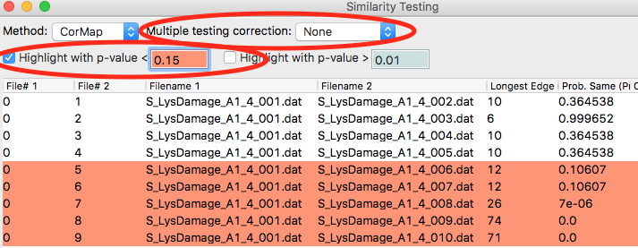

.. |series_plot2_png| image:: images/series_plot2.png

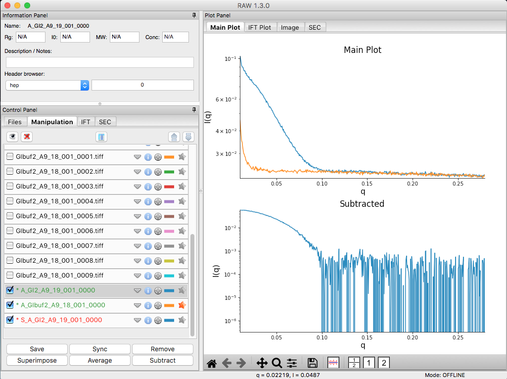

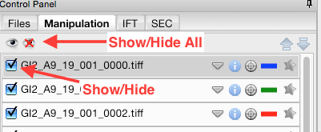

.. |1000020100000191000002168932F455C75660D5_png| image:: images/1000020100000191000002168932F455C75660D5.png

.. |gi_guinier_png| image:: images/guinier_gi.png

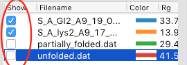

.. |series_rg_png| image:: images/series_rg.png

.. |10000201000003FD000002FDBECFEBC4BFFF1C27_png| image:: images/10000201000003FD000002FDBECFEBC4BFFF1C27.png

.. |mw_png| image:: images/mw.png

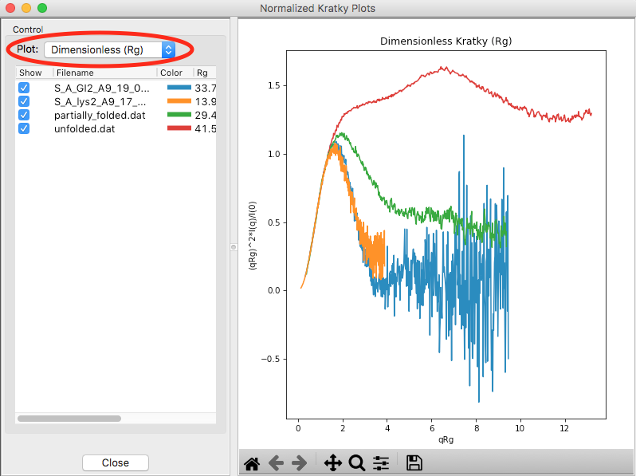

.. |100002010000034C00000049FD162E82EB78E7ED_png| image:: images/100002010000034C00000049FD162E82EB78E7ED.png

.. |100002010000018D000000E6174D733C1F4E44CD_png| image:: images/100002010000018D000000E6174D733C1F4E44CD.png

.. |lys_guinier_png| image:: images/guinier_lys.png

.. |100002010000018F000000558E072296495A065F_png| image:: images/100002010000018F000000558E072296495A065F.png

.. |series_plot3_png| image:: images/series_plot3.png

.. |series_plot_png| image:: images/series_plot.png

.. |1000020100000189000000C42B4CCF42641BC35E_png| image:: images/1000020100000189000000C42B4CCF42641BC35E.png

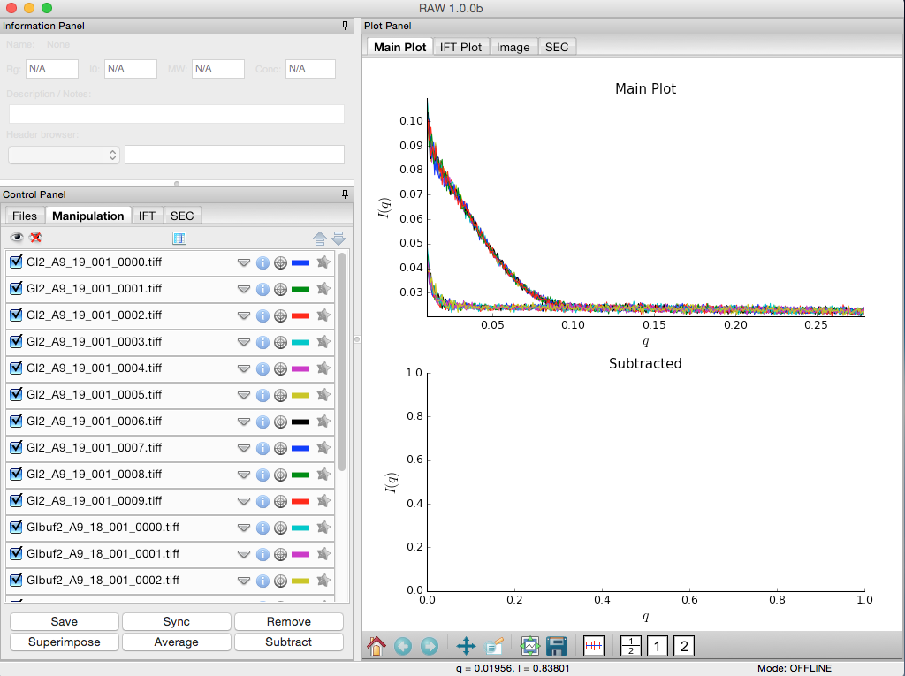

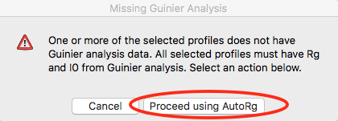

.. |100002010000026300000034957322C176A93588_png| image:: images/100002010000026300000034957322C176A93588.png

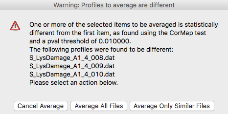

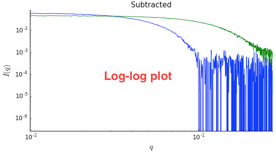

.. |100002010000018900000120F1FE156CD1C06C32_png| image:: images/100002010000018900000120F1FE156CD1C06C32.png

.. |100002010000018E0000009086C0F8001DCF0519_png| image:: images/100002010000018E0000009086C0F8001DCF0519.png

.. |Rg| replace:: R\ :sub:`g`

.. |Dmax| replace:: D\ :sub:`max`
