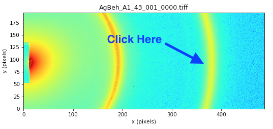
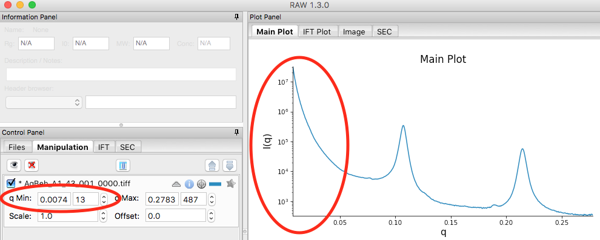
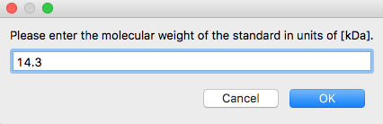
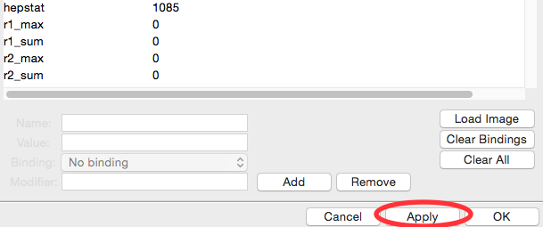
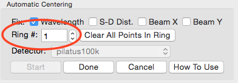
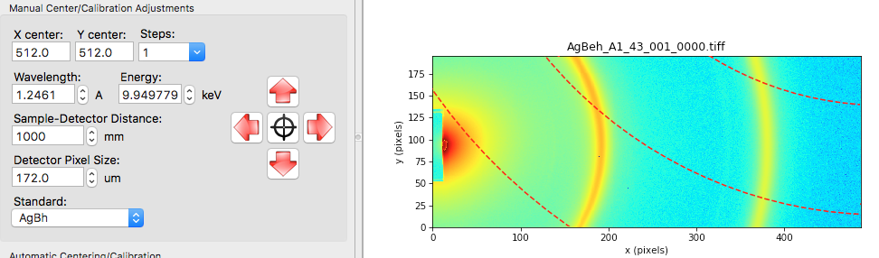
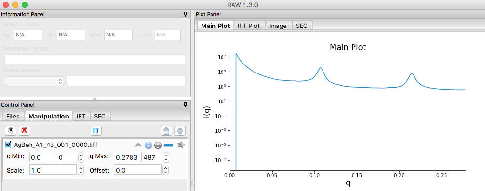
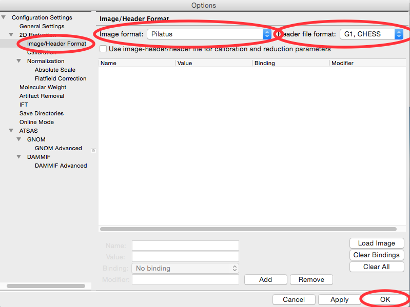
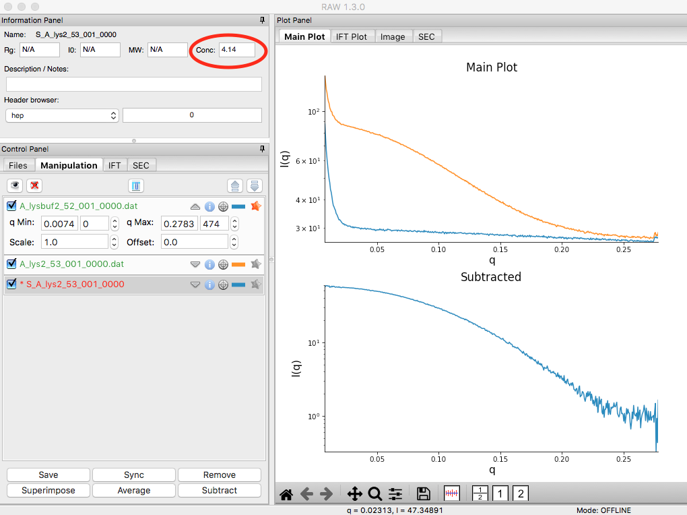
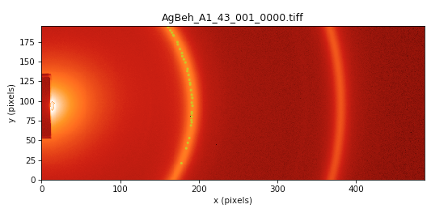

Section 3: Creating a configuration file
----------------------------------------
.. _section3:

This section will guide you through creating a configuration file for RAW that
allows you to integrate 2D images into 1D scattering profiles. It refers to
the :ref:`RAW tutorial data <tutorialdata>`.

Part 1. Centering and calibration – Automated method
^^^^^^^^^^^^^^^^^^^^^^^^^^^^^^^^^^^^^^^^^^^^^^^^^^^^
.. _s3p1:

The first step is to set the beam center, x-ray wavelength, and sample to detector distance.
Before this can be done, you have to set the image and file header type in the Options window.
The best way to find the beam center and sample to detector distance is using the automated
method in RAW.

#.  Open RAW. The install instructions contain information on installing and running RAW.

#.  Open the Options window by going to the Options menu (top of the RAW window or in the
    system bar, depending on your OS) and selecting “Advanced Options”

#.  In the options window, select the Image/Header Format section on the left.

#.  In the area on the right, set the Image format dropdown menu to “Pilatus” and the
    Header file format to “G1, CHESS”.

    |100002010000031F0000025747B53F96A563D942_png|

#.  Click the OK button to close the window and save the changes to the settings.

#.  In the files tab, click on the folder button and navigate to the
    **Tutorial_Data/calibration_data** folder.

    |100002010000018F000000558E072296495A065F_png|

#.  Select the **AgBeh_A1_43_001_0000.tiff** file by clicking on it once and click
    the show image button at the bottom of the screen.

    |100002010000018B00000045FE97BD7A5837DC96_png|

#.  In the Image Plot Panel that is now showing, click on the Image Display Settings
    button (looks like slider bars) at the bottom of the screen.

#.  In the window that appears, set the scale to logarithmic and and click “OK”.

    |10000201000003FE000002FDF08DF625AA9EDF08_png|

#.  Open the Centering/Calibration panel by going to the Tools menu and selecting
    “Centering/Calibration”.

#.  In the Centering/Calibration panel set the wavelength to 1.2461 Å. Set the detector
    pixel size to 172.0 μm.

    *   *Note:* The x-ray energy/wavelength and detector pixel size are previously
        known values, and are not found in RAW.

    *   *Tip:*  You can set the value in two ways. Either using the up/down arrows
        next to the box (spin controls) or directly typing the value into the box.

    |1000020100000189000001206B620B7F6AC688A3_png|

#.  The goal of centering and calibration is to find a beam center position and sample
    to detector distance that causes the displayed Silver-Behenate ring pattern to match
    up with the rings on the image.

    *   *Note:* The beamstop is the dark blue patch extending out from the center of
        the left edge of the detector.

#.  *Checkpoint:* You should currently have a screen that looks like the one below.

    |10000201000003CC0000011ECF61130B2786D9DE_png|

#.  In the “Manual Centering/Calibration Adjustments” panel, make sure the correct
    standard is selected, in this case, AgBh (silver behenate).

#.  In the Automatic Centering panel, make sure the correct detector is selected,
    in this case “pilatus100k”.

    *   *Note:* If you cannot find your detector in that list, select “detector”,
        and make sure that you have entered the correct detector pixel size in the
        manual centering panel.

#.  Click the “Start” button in the “Automatic Centering/Calibration” panel.

#.  Make sure the “Ring #” is set to 0. Click on a point with strong intensity in
    the Silver Behenate ring nearest the beamstop (left most ring, in this case,
    near x = 200).

    *   *Note:* For some experimental setups, one or more of the largest d-spacing
        rings may not be visible on the detector. In this case, you need to figure
        out what the first visible ring on the detector is, and set the ring number
        to that. So, if the third ring was the first one on the detector, the Ring #
        would be set to 2 (the ring number is zero index, so 0 corresponds to the first
        ring, 1 to the second ring, and so on).

    *   *Try:* If you set the Manual settings to approximately right, hover the mouse
        above the image and use the scroll wheel to zoom out. This will let you see all
        of the centering rings, and figure out which ring is the first one visible on the
        image. Once you’re done, hit the Home button to return to the zoom of the entire image.

    |100002010000022C00000107FBA2AABC2D5731D2_png|

#.  The peak intensity points in that ring will be automatically found, and labeled with
    yellow-green dots.

    *   *Note:* If it didn’t find very many points, try clicking again on another
        part of the ring, and it will add more points to your selection.

    *   *Note:* If you have the same ring separated by a gap (due to detector module gaps,
        beamstop shadow, or geometry, click on the separated parts of the rings to add
        points from all sections. The autofind algorithm will only find peaks in contiguous
        regions.

    *   *Tip:* Due to the color map selected, the points may be hard to see. Try changing
        to the heat map to see the selected points, like in the image below.

        |100002010000022A000001076346850D87A66EB7_png|

#.  Change the “Ring #” to 1.

    |10000201000001880000008A4B47BADBF8686C37_png|

#.  Click on a peak intensity point of the second visible ring.

    |1000020100000219000000FFE668DA920110965A_png|

#.  The peak intensity points in that ring will be automatically found, and labeled with
    blue dots.

    |10000201000002110000010213AF4EFB79D01E09_png|

#.  Click the “Done” button in the “Automatic Centering/Calibration” panel and beam
    position, sample to detector distance, and detector pixel size will all be automatically
    filled in.

    *   *Note:* If the automatic centering fails, carry out Steps 5-7 of Part 2. Giving the
        system starting points that are approximately in the right place can help it refine
        to the precise location.

#.  In the Image Display Settings, set the color scale back to Linear, and the Upper limit
    to 9000. You should now be able to easily see the centering rings and beam center on
    the image.

    |10000201000003FB000002FE1BF1DE5761FDD9F7_png|

#.  Click the OK button in the Centering/Calibration panel to save your settings and
    exit the panel.

Part 2. Centering and calibration – Manual method
^^^^^^^^^^^^^^^^^^^^^^^^^^^^^^^^^^^^^^^^^^^^^^^^^^^^^
.. _s3p2:

If the automated method fails, you can also carry out centering and calibration

#.  If you haven’t already, carry out Steps 1-9 of Part 1, so that the
    **AgBeh_A1_43_001_0000.tiff** file is shown in the Image Plot Panel with an upper
    limit of 90000 set for the image.

#.  In the Image Display settings (see Part 1, Step 8), set the upper limit to 9000 and
    click “OK” to close the settings window.

    |10000201000001C00000011359B0899F361B50F4_png|

#.  Open the Centering/Calibration panel by going to the Tools menu and selecting
    “Centering/Calibration”.

    |10000201000003FC000002FB4AC9E9FB85B6D0CA_png|

#.  In the Centering/Calibration panel set the wavelength to 1.2461 Å. Set the detector
    pixel size to 172.0 μm.

    *   *Note:* The x-ray energy/wavelength is a previously known value, and is not
        found in RAW.

    |1000020100000189000001206B620B7F6AC688A3_png|

#.  We know that the beam is probably near the center of the beamstop. Click on the
    crosshairs button and click in the center of the beamstop.

    *   *Note:* The beamstop is the dark blue patch extending out from the center of
        the left edge of the detector.

#.  *Checkpoint:* Once you have done that, three rings should be displayed on the
    image, and the current beam center is shown as a red dot on the image. This is shown below.

    |10000201000003D30000011DBB83199F9986606D_png|

#.  Set the Sample-Detector Distance to 1500 mm.

    *   *Note:* The rough sample to detector distance is known from direct measurement
        of the experimental setup. Calibration can be done without this knowledge, but
        will take longer.

#.  Using the zoom tool at the bottom of the Plot window, zoom in on the first ring
    shown on the detector.

    |1000020100000262000002D49D3E5CCAB5D20DEE_png|

#.  Using the red arrow buttons, move your beam center until the dashed red line (first
    silver behenate ring) matches with the hottest (most red) pixels of the first
    ring shown on the detector.

    |10000201000003FD000002FD63F3FE9B954A53E3_png|

#.  Use the home button to zoom out to the whole extent of the detector image.

    |100002010000019E0000002822CCA30221A5A768_png|

#.  Open the image display settings and set the upper limit to 2000. Zoom in on the
    second silver behenate ring on the image (near x=380). Use the spin controls
    (up/down arrows) on the sample detector distance to adjust the distance until
    the red dashed ring matches perfectly with the hottest pixels on the detector image.

#.  Zoom back out to the full extent of the image. Set the image display upper limit
    back to 9000. Zoom in on the first ring, and adjust the beam center position
    until that ring perfectly matches the hottest pixels on the detector.

    *   *Tip:* If you had the ring properly centered in y the first time, you should only
        need to adjust the x position (left/right).

#.  Iterate steps 10-13 until both rings are well aligned. You should find an X center
    of ~4, a Y center of ~ 92.5, and a sample-detector distance of ~1517 mm.

    *   *Tip:* You can adjust the step size for moving the beam center using the “Steps”
        menu. You can either pick a value from the dropdown menu, or enter your own value
        in the box.

    *   *Tip:* The spin controls adjust the last digit of the value in the box. So if you want
        to adjust the sample-detector distance more finely than 1 mm, set the distance to
        (for example) 1500.0 and then the spin controls will change the distance in steps
        of 0.1 mm.

#.  Compare the manually found center and sample detector distance with those you found
    automatically in Part 1 (if you did that). If you did a careful job in this part,
    they should compare well.

Part 3. Masking
^^^^^^^^^^^^^^^
.. _s3p3:

This section teaches you how to mask out unwanted portions of your image, such as the
beamstop and bad detector pixels. It assumes you have just done :ref:`Part 1 <s3p1>`
or :ref:`2 <s3p2>`. If not, open RAW as in Step 1 and set your data folder as
in Step 6 of :ref:`Part 1 <s3p1>`.

#.  In the Files tab, select the **MT2_48_001_0000.tiff** file and click the show image button.

#.  Set the image upper limit to 50.

#.  Open the masking panel by clicking “Masking” in the Tools menu.

#.  Zoom in around the beamstop.

    *   *Note:* The beamstop is the blue rectangular area on the left edge of the detector

#.  Select the Pan tool and left click and drag the image to the right until you can
    see a blank (white) canvas to the left of the beamstop.

    |10000201000003FF000002FFA1373650FAC1BA86_png|

#.  Click on the rectangle mask drawing button and click on a point in the white
    part of the canvas just above the edge of the beamstop.

#.  Move the cursor until the red outline of the rectangle covers the beamstop from
    top to bottom, and out to the right edge of the middle of the beamstop. Click
    again to make the rectangle mask.

    *   *Note:* There will still be a bit of the beamstop at the bottom right edge that
        is not covered by this rectangle.

    *   *Tip:* If you mess up drawing the mask, click on the masked region (shaded red)
        and click your backspace/delete key to remove it.

    |10000201000001590000023F0706EE751FB36A8E_png|

#.  This beamstop is quite square, so a simple square mask works. A circle is also easy to draw:

    *   Click on the Circle mask drawing button.
    *   Click at the center
    *   Move the mouse out to make it the size you want, and click again to finish the circle.

#.  If you need to draw another (non-square or circle) shape, you would do the following:

    *   Click on the Polygon mask drawing button. Left click to place the first vertex.
    *   Continue left clicking to place more vertices to draw the desired shape.
    *   Right click to connect the last point you put down to the first point, and finish
        drawing the polygon.

#.  Zoom back out to the full extent of the image.

#.  Set the image upper limit to 0, and the lower limit to -2 (should be the default lower limit).

#.  Look for any pixels that are blue, these are bad pixels. You should find one at (189, 80)

    *   *Note:* On this detector, bad pixels have values of -2.

    *   *Tip:* Finding a single pixel, even when you are looking for a blue on red, can
        be quite tricky. You might try a couple of ways to look for it. First, you can
        zoom in on the image, and use the Pan tool to drag the image around and look for
        bad pixels. Second, you can try changing the colormap in the Image Display Settings
        to Gray. Then the bad pixel will look like a black pixel on a white background,
        which might be easier to see.

#.  Zoom in on the bad pixel and apply a rectangular mask over the pixel.

    *   *Note:* Due to how the image displays, you may see a bit of blue edge beyond the
        pixel mask. Don’t worry, as the pixel is actually masked. If you want to be sure,
        you can mask a few pixels around it as well.

    |100002010000021E0000021365526F4D184B1EAD_png|

#.  In the masking panel, make sure that “Beamstop mask” is selected in the Mask Creation
    dropdown menu. Click the set button to set the mask you just made as the beamstop mask.

    |100002010000018500000048B4CFC92D12B1F018_png|

#.  Click the OK button to exit the masking panel.

Part 4. Setting normalization and other options
^^^^^^^^^^^^^^^^^^^^^^^^^^^^^^^^^^^^^^^^^^^^^^^
.. _s3p4:

This section teaches you how to set up normalization by a beamstop counter, and other options. It assumes you have completed :ref:`Parts 1 <s3p1>` (or :ref:`2 <s3p2>`\ ) and :ref:`3 <s3p3>`.

#.  Open the Options window by selecting “Advanced Options” in the Options menu.

#.  In the window that shows up select the Image/Header Format section on the left.
    In the area on the right click the Load Image button.

    |1000020100000321000002567002F3E445956D31_png|

#.  In the window that pops up, select the **AgBeh_A1_43_001_0000.tiff** file. Click
    the Open button.

    *   *Note:* You can select any image of the appropriate type, not just the behenate.

#.  In the Image/Header Format window you should now see header values loaded into the
    list. Click the Apply button at the bottom of the screen.

    |1000020100000261000000FF99D0DAD279E9E046_png|

#.  Click on the Normalization section in the options list on the left.

#.  In the fields at the bottom of the Normalization panel, make sure “/” is selected
    in the left dropdown menu, and enter I3/200000 in the large field.

    *   *Note:* It is typical in SAXS to normalize by the transmitted intensity. At the
        CHESS G1 beamline, the beamstop counter is name I3, which is why we are using
        that name in the normalization expression.

    |10000201000003200000025782A90D7B63DA90C9_png|

#.  Click the Calc button to evaluate the expression for the counter values loaded
    in the Image/Header Format tab. You should get a value of 0.02404.

#.  Click the Add button to add the expression to the normalization list.

#.  Make sure the “Enable Normalization” checkbox at the top of the page is checked.

#.  Click OK to exit the options window.

#.  In the file list, select the **AgBeh_A1_43_001_0000.tiff** file and click the Plot
    button. You will see a curve get plotted in the top panel of the Main Plot.

#.  Click on the manipulation tab. You will see a data item loaded in the manipulation list.

    |10000201000003FA00000193060E3A3AD503E41B_png|

#.  Adjust the start point for q Min to remove the points with zero value at the start of
    the curve (these are q points entirely in the mask). Set q Min so that the first point
    is the peak of the curve on the main plot. This should be around point 13 (depending
    on your mask).

    |10000201000003DE0000018D073F6458E51E1527_png|

#.  Open the Options window as in Step 1.

#.  Click on the Calibration section in the options list on the left. Set “Start plots
    at q-point number” to the number you just found in Step 13.

    *   *Note:* This makes it so that every curve loaded from now on will by default
        not display the first n points, which are covered by the beamstop.

    |1000020100000311000000E79A17725090A964FF_png|

#.  Click the OK button to exit the options window and save your changes.

#.  You have configured everything necessary, and are now ready to save your settings.
    Go to the File menu and select “Save Settings”.

#.  Save the settings as **SAXS.cfg**\ .

#.  These settings can now be used to process images, and can be reloaded when you
    open RAW by selecting “Load Settings” from the File menu.

Part 5. Setting absolute scale with water
^^^^^^^^^^^^^^^^^^^^^^^^^^^^^^^^^^^^^^^^^
.. _s3p5:

This section teaches you how to set up absolute scale using water as a reference. It assumes
you have completed :ref:`Parts 1 <s3p1>` (or :ref:`2 <s3p2>`\ ), :ref:`3 <s3p3>` and
:ref:`4 <s3p4>`. Note that you can use water or glassy carbon (:ref:`Part 6 <s3p6>`)
for absolute scale calibration in RAW.

#.  Using the settings from the previous parts of the tutorial, plot all of the
    **MT2_48_001_000x.tiff** files, where x is 0-9, on the main plot.

    *   *Tip:* :ref:`Section 1 Part 1 <s1p1>` of this tutorial document teaches you
        how to do this.

#.  Average the **MT2** files you just loaded. Save the average in the **calibration_data**
    folder.

    |10000201000003FD000002FDF405DABE73178919_png|

#.  Repeat steps 1 and 2, plotting, averaging and saving, for the **water2_49_001_000x.tiff**
    files.

#.  Open the Options window by selecting “Advanced Options” in the Options menu.

#.  Click on the Absolute Scale section in the options list on the left.

    |100002010000032000000255A94EE51014E73548_png|

#.  Click on the Empty cell “Set” button and select the **A_MT2_48_001_0000.dat**
    file.

#.  Click on the Water sample “Set” button and select the **A_water2_49_001_0000.dat**
    file.

#.  Set the Water temperature to 4 C.

    |100002010000024C000000B45B6C3F21D0977D19_png|

#.  Click the Calculate button to calculate the Absolute Scaling Constant. You should
    get a value near 0.00077.

    *   *Tip:* You can also use images to set the absolute scale. This may give worse
        results, as the signal to noise of the averaged file should be better than for
        a single image.

    *   *Note:* It is important that you not change your normalization settings once you
        have set the absolute scaling constant. If you do, you will have to recalculate
        the absolute scaling constant. Also, make sure absolute scale is turned off before
        you calculate the scale constant, otherwise you will get a bad scaling constant
        (see the manual for details).

    |100002010000017C0000002239FE4A9099163120_png|

#.  Check the “Normalize processed data to absolute scale” checkbox. Click “OK” to
    exit the advanced options window and save the changes.

    |100002010000031B0000025153E03F7B64A2BA9D_png|

#.  Save the settings for later use.

Part 6. Setting absolute scale with glassy carbon
^^^^^^^^^^^^^^^^^^^^^^^^^^^^^^^^^^^^^^^^^^^^^^^^^
.. _s3p6:

This section teaches you how to set up absolute scale using glassy carbon (NIST SRM 3600)
as a reference. It assumes you have completed :ref:`Parts 1 <s3p1>` (or :ref:`2 <s3p2>`\ ),
:ref:`3 <s3p3>` and :ref:`4 <s3p4>`\ . Note that you can use water (:ref:`Part 5 <s3p5>`) or
glassy carbon for absolute scale calibration in RAW.

There are two ways to use glassy carbon as a standard in RAW. One way follows the NIST
protocol, and will deliver the most accurate results. However, this method depends on
all measurements having reliable flux measurements upstream and downstream of the sample.
It also requires accurate measurements of the background of the glassy carbon measurement
and the sample measurements. The second way is more similar to that used by water, in that
it essentially ignores the background (assumes it to be small). This approach only requires
regular normalization and a single measurement of the background for the glassy carbon sample.

**The simple approach, “ignoring” background:**

#.  Load/use the settings from part 4 (without absolute scale set from water, part 5).

#.  Plot all of the **glassy_carbon_41_001_000x.tiff** files, where x is 0-9, on the main plot.

    *   *Tip:* :ref:`Section 1 Part 1 <s1p1>` of this tutorial document teaches you how to do this.

#.  Average the **glassy_carbon** files you just loaded. Save the average in
    the **calibration_data** folder.

#.  Open the Options window by selecting “Advanced Options” in the Options menu.

#.  Click on the Absolute Scale section in the options list on the left.

    |100002010000032000000255A94EE51014E73548_png|

#.  Click on the Glassy carbon “Set” button and select the **A_glassy_carbon_41_001_0000.dat** file.

#.  Set the Sample thickness to 1.5 mm.

    |100002010000024A0000010255684CF81FEA93EF_png|

#.  Click “Calculate” button. You should get something near 0.0014.

    *   *Note:* It is important that you not change your normalization settings once
        you have set the absolute scaling constant. If you do, you will have to recalculate
        the absolute scaling constant. Also, make sure absolute scale is turned off before
        you calculate the scale constant, otherwise you will get a bad scaling constant
        (see the manual for details).

#.  Check the “Normalize processed data to absolute scale using glassy carbon” checkbox.

#.  Click “OK” to exit the advanced options panel, saving the changes.

    |100002010000031E000002533D65082AC93CE448_png|

#.  Save the settings for future use.

**The NIST approach:**

*Important note:* All of the normalization (including flux, transmission, etc) happens
through the absolute scale panel. You shouldn’t have anything set in the Normalization
panel (unless you are doing something like subtracting off a constant pedestal from the
image).

#.  Load/use the settings from part 4 (without absolute scale set from water, part 5).

#.  Open the Options window by selecting “Advanced Options” in the Options menu.

#.  Click on the Normalization section in the options list on the left.

#.  Remove any/all items in the Normalization List by highlighting them in the list
    and clicking the “Delete” button.

    |100002010000031F0000025307BE652194AFBF84_png|

#.  Turn off any absolute scaling already in place.

#.  Click on the Calibration section in the options list on the left.

#.  Change the “Start plots at q-point number” to 0.

    |1000020100000319000000E3F41DC6D4D282F31B_png|

#.  Click “OK” to exit the advanced options window and save the changes.

#.  Plot the **glassy_carbon_41_001_0000.tiff** file.

    *   *Tip:* :ref:`Section 1 Part 1 <s1p1>` of this tutorial document teaches you how
        to do this.

#.  Save the **glassy_carbon** profile in the **calibration_data** folder.

#.  Plot, average, and save the **vac_37_001_000x.tiff** and ** MT2_48_001_000x.tiff **
    files, where x is 0-9.

    *   *Tip:* Because you aren’t normalizing by beam intensity, these averages may have
        profiles that are not similar (see :ref:`Section 1 Part 6 <s1p6>`). In that case,
        average just the similar profiles.

#.  Open the Options window and select the Absolute Scale section.

#.  Uncheck the Ignore background checkbox.

    |100002010000031E000002572EF4280A9EB5D279_png|

#.  Click the Glassy carbon “Set” button and select the **glassy_carbon_41_001_0000.dat** file.

#.  Click the Glassy carbon background “Set” button and select the **A_vac_37_001_0000.dat** file.

#.  Click the Sample background “Set” button and select the **A_MT2_48_001_0000.tiff** file.

#.  Set the Sample thickness to 1.5 mm.

#.  Set the Upstream counter to I1.

#.  Set the Downstream counter to I3.

#.  Click the “Calculate” button. You should get an absolute scaling constant near 198.

    *   *Note:* This approach will only work if the .dat files you select for the glassy
        carbon, glassy carbon background, and sample background contain the upstream and
        downstream counter values. This happens automatically with RAW. Otherwise, you should
        use images, which will have more noise, but should allow RAW to find all of the
        appropriate counter values.

    *   *Note:* It is important that you not change your normalization settings once you
        have set the absolute scaling constant. If you do, you will have to recalculate the
        absolute scaling constant. Also, make sure absolute scale is turned off before you
        calculate the scale constant, otherwise you will get a bad scaling constant (see the
        manual for details).

    |100002010000031F00000254EC8C0C5D987D9510_png|

#.  Check the “Normalize processed data to absolute scale using glassy carbon” checkbox.

#.  Click on the Calibration section in the options list on the left.

#.  Change the “Start plots at q-point number” to 13.

#.  Click “OK” to exit the advanced options panel, saving the changes.

#.  Save the settings for future use.

**Comparison note:**

We find that for the example data given here, the two methods of glassy carbon calibration
agree within ~1.5%. The best approach depends on how strong your background scattering is
relative to the rest of the scattering in the system.

Part 7. Setting a molecular weight standard
^^^^^^^^^^^^^^^^^^^^^^^^^^^^^^^^^^^^^^^^^^^
One method for determining molecular weight from a scattering profile is comparison to a known
scattering profile with known molecular weight. This part will teach you how to set that known
standard in RAW.

#.  Load/use the settings from :ref:`Parts 4 <s3p4>`\ , :ref:`5 <s3p5>`\ , or :ref:`6 <s3p6>`\ .

#.  Plot all of the **lysbuf2_52_001_000x.tiff** files, where x is 0-9, on the main plot.

    *   *Tip:* :ref:`Section 1 Part 1 <s1p1>` of this tutorial document teaches you how to do this.

#.  Average the **lysbuf2** files you just loaded. Save the average in the
    **calibration_data** folder.

#.  Repeat steps 2-3 for the **lys2_52_001_000x.tiff** files.

#.  Subtract the averaged buffer profile (**lysbuf2**\ ) from the averaged sample profile
    (**lys2**\ ).

    *   *Tip:* :ref:`Section 1 Part 1 <s1p1>` of this tutorial document teaches you how to do this.

#.  Select the subtracted profile by clicking on it. In the information panel, set the concentration
    in the Conc box to 4.14 (this is concentration in mg/ml).

    |10000201000003FC000002FC22DAF6DB760BD07E_png|

#.  Perform a Guinier fit on the subtracted profile.

    *   *Tip:* :ref:`Section 1 Part 2 <s1p2>` of this tutorial document teaches you how to do this.

#.  Right click on the subtracted profile and select the “Use as MW Standard” option.

#.  Enter the molecular weight of the standard in kDa in the box that appears. For this lysozyme
    sample, the molecular weight is 14.3 kDa.

    |10000201000001AA0000008AAFBCA8CD7629BDC4_png|

#.  Click “OK” to save the molecular weight standard.

#.  Save the settings for future use.

.. |1000020100000189000001206B620B7F6AC688A3_png| image:: images/1000020100000189000001206B620B7F6AC688A3.png

.. |100002010000031F00000254EC8C0C5D987D9510_png| image:: images/100002010000031F00000254EC8C0C5D987D9510.png

.. |100002010000024A0000010255684CF81FEA93EF_png| image:: images/100002010000024A0000010255684CF81FEA93EF.png

.. |1000020100000311000000E79A17725090A964FF_png| image:: images/1000020100000311000000E79A17725090A964FF.png

.. |10000201000001590000023F0706EE751FB36A8E_png| image:: images/10000201000001590000023F0706EE751FB36A8E.png

.. |10000201000003FD000002FD63F3FE9B954A53E3_png| image:: images/10000201000003FD000002FD63F3FE9B954A53E3.png

.. |100002010000021E0000021365526F4D184B1EAD_png| image:: images/100002010000021E0000021365526F4D184B1EAD.png

.. |10000201000003FC000002FB4AC9E9FB85B6D0CA_png| image:: images/10000201000003FC000002FB4AC9E9FB85B6D0CA.png

.. |10000201000001C00000011359B0899F361B50F4_png| image:: images/10000201000001C00000011359B0899F361B50F4.png

.. |10000201000003FD000002FDF405DABE73178919_png| image:: images/10000201000003FD000002FDF405DABE73178919.png

.. |100002010000017C0000002239FE4A9099163120_png| image:: images/100002010000017C0000002239FE4A9099163120.png

.. |100002010000019E0000002822CCA30221A5A768_png| image:: images/100002010000019E0000002822CCA30221A5A768.png

.. |1000020100000321000002567002F3E445956D31_png| image:: images/1000020100000321000002567002F3E445956D31.png

.. |100002010000031E000002572EF4280A9EB5D279_png| image:: images/100002010000031E000002572EF4280A9EB5D279.png

.. |10000201000003FE000002FDF08DF625AA9EDF08_png| image:: images/10000201000003FE000002FDF08DF625AA9EDF08.png

.. |10000201000002110000010213AF4EFB79D01E09_png| image:: images/10000201000002110000010213AF4EFB79D01E09.png

.. |100002010000031F0000025307BE652194AFBF84_png| image:: images/100002010000031F0000025307BE652194AFBF84.png

.. |100002010000022C00000107FBA2AABC2D5731D2_png| image:: images/100002010000022C00000107FBA2AABC2D5731D2.png

.. |10000201000003FF000002FFA1373650FAC1BA86_png| image:: images/10000201000003FF000002FFA1373650FAC1BA86.png

.. |10000201000003D30000011DBB83199F9986606D_png| image:: images/10000201000003D30000011DBB83199F9986606D.png

.. |100002010000018500000048B4CFC92D12B1F018_png| image:: images/100002010000018500000048B4CFC92D12B1F018.png

.. |100002010000018F000000558E072296495A065F_png| image:: images/100002010000018F000000558E072296495A065F.png

.. |100002010000018B00000045FE97BD7A5837DC96_png| image:: images/100002010000018B00000045FE97BD7A5837DC96.png

.. |100002010000031B0000025153E03F7B64A2BA9D_png| image:: images/100002010000031B0000025153E03F7B64A2BA9D.png

.. |100002010000032000000255A94EE51014E73548_png| image:: images/100002010000032000000255A94EE51014E73548.png

.. |1000020100000319000000E3F41DC6D4D282F31B_png| image:: images/1000020100000319000000E3F41DC6D4D282F31B.png

.. |10000201000003FB000002FE1BF1DE5761FDD9F7_png| image:: images/10000201000003FB000002FE1BF1DE5761FDD9F7.png

.. |1000020100000262000002D49D3E5CCAB5D20DEE_png| image:: images/1000020100000262000002D49D3E5CCAB5D20DEE.png

.. |100002010000031E000002533D65082AC93CE448_png| image:: images/100002010000031E000002533D65082AC93CE448.png

.. |10000201000003200000025782A90D7B63DA90C9_png| image:: images/10000201000003200000025782A90D7B63DA90C9.png

.. |100002010000024C000000B45B6C3F21D0977D19_png| image:: images/100002010000024C000000B45B6C3F21D0977D19.png

.. |Rg| replace:: R\ :sub:`g`

.. |Dmax| replace:: D\ :sub:`max`
