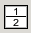
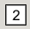
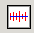

The Manipulation Panel and Main Plot Window
============================================

.. _manippanel:

When individual scattering profiles are loaded, they are placed in the Manipulation tab
of the Control Panel, and displayed in the Main Plot window. This section will cover the
features of the Manipulation panel and the Main Plot Panel.

The Manipulation Panel
----------------------

The Manipulation Panel refers to the panel that is shown in the Control Panel when the
Manipulation Tab is selected.

The panel consists of two parts. The top part is where individual scattering profiles
that are loaded into RAW are shown. The bottom part consists of buttons that allow you
to manipulation these scattering profiles. Further manipulation of the scattering profiles
can be done from the right click (context) menu and from the Tools menu.

An individual item in the Manipulation Panel list is called a manipulation data item.

All items loaded into the manipulation panel are initially displayed in the top plot of
the Main Plot.

Manipulation Data Items
~~~~~~~~~~~~~~~~~~~~~~~

When a new item is plotted, a data item is added to the manipulation list in the manipulation
tab. This allows you to control the properties of the data item, and
perform manipulations and analysis on it.

The name of the data item is displayed at the top of each item. If an item is given a
different name for the plot legend, this legend name is displayed in [square brackets]
next to the item name. On the same line as the item name, on the right side of the data
item, there are a :ref:`series of buttons <manipitembuttons>` that can be used for further
manipulation of the data item.

**Note:** If there is a \* to the left of the item name (between the checkbox and the item
name), it indicates there are unsaved changes to the item. This can occur if you change the
scale, offset, or q range of the item, if the item is a newly created scattering profile (such
as integrated from an image, or an averaged or subtracted item), if there is new analysis
information associated with the item (such as Rg and I0), and from binning and interpolating
the scattering profile.

Offsetting, scaling and adjusting the q-range of a data item
~~~~~~~~~~~~~~~~~~~~~~~~~~~~~~~~~~~~~~~~~~~~~~~~~~~~~~~~~~~~

Each data item lets the user interactively adjust the scaling, offset and q-range by using
the spin-buttons or entering values in the associated text field and hitting enter. These
changes will be updated on the scattering profile displayed on the main plot.

*Offset and Scale*

The spin-buttons in the scaling and offset boxes will adjust the last digit of the displayed
number by 1. So if the scale is 1.0, using the up spin button will adjust it 1.1, while the
down spin button will adjust it to 0.9. If the scale was set to 1.15, the up button would adjust
it to 1.16, while the down button would adjust it to 1.14.

The scale can never be set to zero by the spin buttons, so if it is adjusted down in a way that
would do so, it starts adjusting the next significant figure. For example, if you use the down
button on a scale of 0.1, the new scale will be 0.09. A negative scale factor is treated like
a positive scale factor (the absolute value of the scale factor is applied), thought it can
cause unexpected behavior from the spin buttons.

*Q-range*

Adjusting q Min and q Max can be done in two ways. Each q limit has two boxes associated
with it. The left box for each displays the actual q value, and a q value can be typed
into those boxes. As there are a finite set of points in q space, RAW will automatically
determine the nearest q point, and set the q value to this nearest point. The box on the
right is the (0 indexed) point in the q vector. That is, if for q Min the value reads 15,
then the scattering profile is being displayed starting at point number 15 in the q vector
(note that this is the 16th point of the q vector, because it is zero indexed). The spin
buttons adjust these point numbers, so if you use the up spinner on q Min, it will start
at the next point in the q vector.

Showing/Hiding data items on the Main plot
~~~~~~~~~~~~~~~~~~~~~~~~~~~~~~~~~~~~~~~~~~

To show/hide the scattering profile associated with a data item on the plot, click the
checkbox next to the sample filename. If the checkbox is checked, the item is currently
shown on the Main plot, if the checkbox is unchecked, the item is currently hidden on the
main plot.

Data item buttons
~~~~~~~~~~~~~~~~~

.. _manipitembuttons:

On the right of the top line of the data item (the same line as the item name and show/hide
checkbox) are a series of buttons for controlling the data item. In order of left to right,
these buttons have the following properties.

*Collapse/Expand item controls*

.. _manipcollapse:

In order to see more data items in the list, or to prevent accidental changes to the q Min,
q Max, Scale, or Offset values, the controls for a data item can be hidden using the triangle
button in the upper right of the data item. Note that the direction of the triangle switches
when it is toggled. If the triangle is pointing up, the controls are expanded, if the triangle
is pointing down the controls are collapsed.

*Extended Info*

By hovering the mouse over the i in the blue circle button, a tooltip will appear which shows
more information about the item, including Rg and MW.

*Locate Line*

The target button is used to highlight the scattering profile on the graph that is associated
with the data item. When the target is pressed, it ‘bolds’ the line of the scattering profile
(increases the line width by several points). When the target is pressed again, the line width
is set back to normal. You can tell if a line is currently bolded, as the target will be orange
instead of grey.

*Line Properties*

.. _maniplineprop:

The colored line button has two purposes. First, the color matches the current color of the
scattering profile in the Main Plot. Second, when pressed it opens a
:ref:`line properties dialog <lineproperties>` which allows you to set the legend label;
the line style, width, and color; the data point marker style, size, line color, and fill
color; and the error bar line style, width, and color.

*Mark*

The star button marks an item. This is used when doing operations such as subtraction, syncing,
superimposing or merging. In those cases, the marked (also referred to as starred) item has a
special significance.

Selecting data items
~~~~~~~~~~~~~~~~~~~~

.. _selectmanipitem:

A single data item can be selected by clicking on the item name in the Manipulation list
(similar to how you would select files in your system file browser). When an item is selected,
the color of the item background changes from white to gray. If the
item is currently selected, clicking on it will cause it to be unselected. Note that for a regular
click, all other selected items will be unselected when a new item is selected.

Multiple items may be selected in two ways. If the Control key (Command key on Macs) is held down
while clicking on items, each item that is clicked on will be added to the set of selected items.
If a single item is first selected and then the Shift key is held down and another item is selected,
all of the items in the list between the two items will be selected (including the second item that
is clicked on).

All of the items in the list can be selected in two ways. The first is using the
:ref:`select all button <manipselectall>`, the second is pressing Ctrl-A (Cmd-A),
the Control (Command) key and the A key at the same time when you are in the Manipulation
panel. All items can be unselected by clicking in a empty spot of the Manipulation list
(but not above or below the list), or by clicking on an already selected item.

**Note:** If you have a set of selected items and wish to remove some, holding down the Control
(Command) key and clicking on selected items will deselect them without affecting the other selected
items.

The top buttons of the Manipulation Panel
~~~~~~~~~~~~~~~~~~~~~~~~~~~~~~~~~~~~~~~~~

The Manipulation Panel has a set of five buttons at the top of the panel. These buttons have the
following effects, listed from left to right.

*Show All*

Clicking on the button that looks like an eye will show all scattering profiles. This is the
same as if you manually set all of the show/hide checkboxes in the data items to on.

*Hide All*

Clicking on the button that looks like an eye with a red x through it will hide all scattering
profiles. This is the same as if you manually set all of the show/hide checkboxes in the data
items to off.

*Select All*

.. _manipselectall:

Clicking on the button that looks like a spreadsheet with selected cells will select all of
the Manipulation items.

*Collapse All*

Clicking on the button that looks like an upward pointing arrow with a box under it will
collapse all of the data item controls. This is the same as if you manually toggled the
Expand/Collapse button for each data item to the collapse position.

*Expand All*

Clicking on the button that looks like a downward pointing arrow with a box over it will
expand all of the data item controls. This is the same as if you manually toggled the
Expand/Collapse button for each data item to the expand position.

Synchronizing settings for several data items
~~~~~~~~~~~~~~~~~~~~~~~~~~~~~~~~~~~~~~~~~~~~~

Settings for several data items can be easily synchronized.

#.  Click the star icon on the data item you want the other items synchronized to.

#.  :ref:`Select <selectmanipitem>` one or more data items, you wish to synchronize with
    the starred item.

#.  Click the “Sync” button

#.  Select what parameters you want synchronized

#.  Hit the “OK” button

Parameters that can be synchronized in this way are: q min, q max, n min, n max, scale, offset,
line style, line width, and line marker.

Renaming a data item
~~~~~~~~~~~~~~~~~~~~

Data items can be renamed by selecting the data item of interest and selecting “Rename” in the
right click popup menu.

**Note:** While no characters are expressly forbidden in the filename, RAW does not sanitize
file names before saving, and thus special characters such as ‘/’ and ‘\\’ are likely to cause
problems when the file is saved.

Saving data items
~~~~~~~~~~~~~~~~~

.. _savingdata:

All scattering profiles can be saved to a standard 3 column ASCII format with a header. To save:

#.  Select the item(s) to be saved.

#.  Click the “Save” button or select “Save selected file(s)” from the right click menu.

#.  In the window that pops up, navigate to the directory in which you want to save the files.

#.  If you are saving a single item, the window will give you an opportunity to rename
    your file if desired. Click “Save” when ready.

#.  If you are saving multiple items, you simply need to select the folder for the items to
    be saved in, and click “Open”. The items will be saved with the same names displayed
    in the Manipulation Panel, in the folder that you chose.

Items are saved in a standard format with three columns of data. These columns have listed headers,
and are Q, I, and Error in I respectively. Depending on your settings, at the bottom (default) or
top of the file there will be a “Header”. This header contains any information loaded as ‘Header’ i
nformation from the image or separate header file, the normalization factor, any notes you made in
the Notes section of the information box, any analysis results (such as Rg, MW), and the manipulation
history saved by the averaging, subtracting, merging, rebinning, and interpolating functions (see
following sections).

The files are saved with a “.dat” extension, which is the standard for scattering profiles and
can be read in by most standard SAXS processing software (including Scatter, Primus, and
programs in the ATSAS package). The files are simply text files, and can be opened and viewed
in any standard text editor. The header is saved in the JSON format.

Removing data items from the manipulation list
~~~~~~~~~~~~~~~~~~~~~~~~~~~~~~~~~~~~~~~~~~~~~~

To remove one or more data items, select them and do one of the following:

#.  Press the “Delete” key on the keyboard

#.  Click the “Remove” button

#.  Select “Remove” from the right click menu

Averaging data
~~~~~~~~~~~~~~

.. _average:

Averaging data is an important part of processing SAXS data. At the moment in RAW,
data can only be averaged if the q vectors match exactly. To average data:

#.  :ref:`Select <selectmanipitem>` two or more data items that should be averaged.

#.  Either click the “Average” button or right-click on a selected item and choose
    “Average” from the popup menu.

After averaging, a new data item will be displayed in the manipulation panel with the
filename in green and an 'A\_' prefix. All averaged items are initially displayed on
the top plot of the Main plot, regardless of where the items being averaged are displayed.

A record of which profiles were averaged is saved in the metadata for the averaged
profile. This can be viewed within RAW by right clicking on the item and selecting
“Show history”, or externally if the scattering profile is saved as a .dat file and
opened by an external text editor. This history contains all of the history of the
individual files, so if you average a set of averaged (or subtracted) files, you can
dig down through the metadata to see what files were used at each step.

Subtracting data
~~~~~~~~~~~~~~~~

.. _subtract:

Subtracting data is an important part of processing SAXS data. RAW can handle subtracting
data that has different q vectors, as long as there is a region of overlap between the q
vectors. Data subtraction is done in the following way:

#.  Click the star icon on the data item to mark the scattering profile that should be
    used for subtraction (typically the background or buffer scattering profile).

#.  :ref:`Select <selectmanipitem>` another data item, or multiple items.

#.  Either click the “Subtract” button or right-click and select “Subtract”
    from the popup menu. Note: this subtracts the marked item (step 1) from the
    selected items (step 2).

After subtraction, a new data item will be displayed in the Manipulation panel with the
filename in red and a 'S\_' prefix. All subtracted items are initially displayed on the
bottom plot of the main plot, regardless of where the items being subtracted are displayed.

A record of which profiles were involved in the subtraction is saved in the metadata for
the subtracted profile This can be viewed within RAW by right clicking on the item and
selecting “Show history”, or externally if the scattering profile is saved as a .dat file
and opened by an external text editor. This history contains all of the history of the
individual files, so if you subtract a set of averaged (or subtracted) files, you can dig
down through the metadata to see what files were used at each processing step.

Data with different q vectors is handled as follows. First, the range of overlap is established.
Second, RAW checks whether these overlapping regions have matching q vectors, if so, RAW carries
out the subtraction. If not, RAW bins both curves so that the q vectors in the overlapping region
match, and then carries out the subtraction.

Superimposing data
~~~~~~~~~~~~~~~~~~

.. _superimpose:

Scattering profiles can be superimposed on each other automatically. This function tries to
calculate a scale and an offset that minimizes difference between two or more curves using a
least-squares method. To superimpose:

#.  Click the star icon on the data item you want the other items superimposed to.

#.  :ref:`Select <selectmanipitem>` one or more data items, that you wish to superimpose onto
    the starred item.

#.  Click the “Superimpose” button

Merging data
~~~~~~~~~~~~

.. _merge:

Merging scattering profiles is typically done if you have measured multiple q ranges
using different detectors. RAW can merge these profiles into one single profile. To merge
profiles in RAW:

#.  Click the star icon on one of the curves. This items name will be used for the name
    of the merged item, otherwise it does not matter.

#.  :ref:`Select <selectmanipitem>` one or more data items, that you wish to merge together
    with the starred item

#.  Click the “Merge” button, select “Merge” from the right click menu, or select “Merge”
    from the Tools->Operations menu.

After merging, a new data item will be displayed in the Manipulation panel with a filename
with a 'M\_' prefix. All merged items are initially displayed on the top plot of the Main
plot, regardless of where the items being merged are displayed.

Merging will average together the overlapping regions, if any exist. It can be done on an
arbitrary number of data items, and is done in serial. So first the two items with the two
lowest q vectors are merged, then that item is merged with the data item with the next lowest
q vector, and so on. For example, if you had selected items with a minimum q vector of 0.01,
0.25, and 0.75, it would first merge the 0.01 and 0.25 items, and then merge that resulting
item with the 0.75 item.

A record of which profiles were merged is saved in the metadata for the averaged profile.
This can be viewed within RAW by right clicking on the item and selecting “Show history”,
or externally if the scattering profile is saved as a .dat file and opened by an external
text editor.

**Note:** If items are merged without an overlap region, there will simply be no data in
those intervening points.

Rebinning data
~~~~~~~~~~~~~~

.. _rebin:

Rebinning scattering profiles is typically done to improve signal to noise of individual
points. As most scattering profiles are significantly oversampled (compared to the Shannon
sampling frequency), there is no loss of information from doing this. To rebin curves in RAW:

#.  :ref:`Select <selectmanipitem>` one or more data items, that you wish to rebin with the
    same binning factor.

#.  Select “Rebin” from the right click menu, or select “Rebin” from the Tools->Operations menu.

#.  Select the bin reduction factor, and if you want logarithmic binning check the logarithmic
    box. Note: the log binning is log base 10.

#.  Click “OK”.

After rebinning, a new data item will be displayed in the Manipulation panel with a filename
with an 'R\_' prefix. All rebinned items are initially displayed on the top plot of the Main
plot, regardless of where the items being rebinned are displayed.

A record of which profiles were averaged is saved in the metadata for the rebinned profile.
This can be viewed within RAW by right clicking on the item and selecting “Show history”, or
externally if the scattering profile is saved as a .dat file and opened by an external text editor.

**Note:** The bin reduction factor can be thought of as how many q points will go into a single
bin in the new profile. So a bin reduction factor of 2 will result in half as many q points in
the new profile, with each q point being the average of two q points from the previous profile
(note that this may not quite be true for q points at the start and end of the profile). Rebinning
will slightly reduce the q range of the scattering profile, as the new q value will be less than
the extreme values in each bin.

Interpolating data
~~~~~~~~~~~~~~~~~~

.. _interpolate:

RAW can interpolate a scattering profile to find values at all points in a reference q vector. This
can be useful for creating scattering profiles with perfectly matched q-vectors. To interpolate
curves in RAW:

#.  Click the star icon on the scattering profile you wish to interpolate to. The q vector
    for this profile will be used as the interpolation points for the other profile(s).

#.  :ref:`Select <selectmanipitem>` one or more data items, that you wish to interpolate to match
    the q vector of the starred item

#.  Select “Interpolate” from the right click menu, or select “Interpolate” from the Tools->Operations menu.

After interpolating, a new data item will be displayed in the Manipulation panel with a
filename with an 'I\_' prefix. All interpolated items are initially displayed on the top
plot of the Main plot, regardless of where the items being merged are displayed.

Interpolation works as follows: The overlapping q region is found for the two curves.
Within this region, for every point in the q vector of the reference (starred) scattering
profile an intensity value is found from the item being interpolated via linear interpolation
(using the scipy.interpolate.interp1d function). A new scattering profile is then created
from these interpolated values and the reference q vector.

A record of which profiles were averaged is saved in the metadata for the averaged profile.
This can be viewed within RAW by right clicking on the item and selecting “Show history”,
or externally if the scattering profile is saved as a .dat file and opened by an external text editor.

Converting q-scale
~~~~~~~~~~~~~~~~~~

Q-values may sometimes be in inverse angstroms (1/Å), while others use inverse nanometers (1/nm).
The q vector can be multiplied or divided by 10 to accommodate for this difference when comparing
two curves on different q-scales.

#.  Select the data item(s) to be scaled and right-click on them.

#.  Select the “Convert q-scale” option and choose whether to adjust the q-scale upwards or
    downwards by a factor of 10.

**Note:** All of the processing in RAW assumes that the scattering profiles are in inverse angstroms.

Normalizing by concentration
~~~~~~~~~~~~~~~~~~~~~~~~~~~~

.. _normbyconc:

The overall intensity of the scattering profile should be proportional to the concentration,
so it can be useful to normalize scattering profiles by the measured concentration value. To do so:

#.  Set the concentration of the item in the :ref:`Information panel <infopanel>` or
    the :ref:`MW window <molweightwindow>`.

#.  Select the item to be normalized.

#.  Right click on the item and select “Normalize by conc”

**Note:** This function simply calculates 1/conc and sets that value as the scale factor. This is
equivalent to doing the same calculation and manually setting the scale factor of the scattering profile.

Saving analysis results
~~~~~~~~~~~~~~~~~~~~~~~
.. _saveresults:

After analyzing the data using the Guinier, MW, BIFT, or GNOM panels, the resulting parameters
such as Rg, I(0), MW, Dmax, and others can be saved to a comma separated format that easily loads
into a spreadsheet program such as Excel. To do so:

#.  Select the data items of interest.

#.  Right-click on a selected data item and select “Save all analysis info”

#.  Choose a name and a location for the .csv file

#.  Load the .csv file into a spreadsheet program.

This saves a spreadsheet where each row is an individual scattering profile, and each column
an analysis parameter.

Saving select data item information
~~~~~~~~~~~~~~~~~~~~~~~~~~~~~~~~~~~

Information about data items including any analysis parameters, header file information,
image header information, scale factor, offset, concentration, and notes can be selectively
saved to a comma separated format that easily loads into a spreadsheet program such as Excel.
To do so:

#.  Select the data items of interest

#.  Right-click on a selected data item and select “Save item info”

#.  A window will pop up with two panels. The panel on the left is all of the information available
    about the selected items, sorted into appropriate categories (such as Image Header and Guinier Analysis).

#.  In the window, select the information of interest in the left hand panel by clicking
    (including Ctrl and Shift clicking) on it.

#.  Once all of the variables of interest are selected (blue), click the “->” button to put them in the
    list of data that will be saved. They should appear in the right hand panel.

#.  If you accidentally selected an item, select the item and click the “<-“ button to remove it from
    the list of data to be saved.

#.  You can add additional items to the list by repeating steps 4 and 5 until everything you want
    to save is selected.

#.  Click the “OK” button.

#.  Choose a name and a location for the .csv file

#.  Load the .csv file into a spreadsheet program.

This saves a spreadsheet where each row is an individual scattering profile, and each column one of
the selected variables.

**Note:** This differs from the save function described :ref:`above <saveresults>` in two ways. First, it
allows you select which information you want to save. Second, it can save header information and
other parameters about the scattering profile beyond the analysis information.

Data point browsing
~~~~~~~~~~~~~~~~~~~

The q, I, and I error values for each individual point in a scattering profile on the data
curve can be inspected using the data browser. To do so:

#.  Right-click on the data item of interest.

#.  Select “Show data” in the popup menu.

Displaying the detector image
~~~~~~~~~~~~~~~~~~~~~~~~~~~~~

If the plotted data was loaded from an image, the image can be shown in the Image tab of
RAW. To do so, right-click on the data item of interest and click “Show image” in the popup menu.

Displaying the header information
~~~~~~~~~~~~~~~~~~~~~~~~~~~~~~~~~

If the plotted data has header information, either from an image header or separate
header file, this can be displayed in RAW. To do so, right-click on the data item of
interest and click “Show header” in the popup menu.

Displaying the history information
~~~~~~~~~~~~~~~~~~~~~~~~~~~~~~~~~~

If the plotted data has history information, either from integration of an image or from
manipulation inside RAW such averaging or subtraction, this can be displayed in RAW. To do
so, right-click on the data item of interest and click “Show history” in the popup menu.

The Manipulation data item right click menu options
~~~~~~~~~~~~~~~~~~~~~~~~~~~~~~~~~~~~~~~~~~~~~~~~~~~

.. _maniprightclick:

When you right click on a data item, a popup menu is shown. This section describes what
each item on the menu does.

*Subtract*

Carries out :ref:`subtraction <subtract>`.

*Average*

Carries out :ref:`averaging <average>`.

*Merge*

Carries out :ref:`merging <merge>`.

*Rebin*

Carries out :ref:`rebinning <rebin>`.

*Interpolate*

Carries out :ref:`interpolation <interpolate>`.

*Use as MW Standard*

.. _mwstandard:

Sets the selected item to be the MW standard used in the :ref:`I(0) reference MW <molweightmethods>`
calculation method. To do this the concentration must be set, for example
in the Information Panel (it can also be set in the MW panel). A Guinier fit must also
have been done, as this requires a known I(0) value for the reference scattering profile.
In the popup window that opens, enter the known protein MW in units of kDa.

*Normalize by conc*

:ref:`Normalizes the profile by the concentration <normbyconc>`.

*Remove*

Removes the item.

*Guinier fit*

Opens the Guinier fit analysis panel for the selected scattering profile.

*Molecular Weight*

Opens the molecular weight analysis panel for the selected scattering profile.

*BIFT*

Opens the Bayesian indirect Fourier transform (BIFT) analysis panel for the selected scattering profile.

*GNOM (ATSAS)*

Opens the GNOM analysis panel for the selected scattering profile. Note: this option is
only available if RAW has detected a valid ATSAS package installation.

*SVD*

Opens the singular value decomposition (SVD) analysis panel for the selected scattering
profiles (must have at least 2 profiles selected).

*EFA*

Opens the evolving factor analysis (EFA) panel for the selected scattering profiles
(must have at least 2 profiles selected).

*Convert q-scale*

Has a submenu with two options: **q * 10** which multiples the scattering profile q vector
by a factor of 10, and **q / 10** which divides the scattering profile q vector by a factor of 10.

*Show image*

If the scattering profile was integrated from an image, and the image is still in the same
location as when the profile was first integrated, it displays the image in the Image Plot
Panel.

*Show data*

Shows the q, I(q) and I_error(q) data.

*Show header*

Shows the header information.

*Show history*

This shows the history of the scattering profile.

*Move to top plot*

Moves the scattering profile to the top subplot of the Main plot (no effect if the
scattering profile is already plotted on the top plot).

*Move to bottom plot*

Moves the scattering profile to the bottom subplot of the Main plot (no effect if the
scattering profile is already plotted on the top plot).

*Save all analysis info*

Saves all of the analysis info of the selected data item(s).

*Save item info*

Saves select item info.

*Save selected file(s)*

Saves the selected data item(s).

The Manipulation panel bottom buttons
~~~~~~~~~~~~~~~~~~~~~~~~~~~~~~~~~~~~~

There are six buttons at the bottom of the Manipulation panel. They are:

*Save*

This button saves the selected data item(s).

*Sync*

This button syncs the settings of the selected data item(s) to the starred data item.

*Remove*

This button removes the selected data item(s) from the Manipulation panel.

*Superimpose*

This button superimposes the selected data item(s) onto the starred data
item.

*Average*

This button averages the selected data item(s).

*Subtract*

This button subtracts the selected data item(s).

The Main Plot window
--------------------

The Main Plot window displays individual scattering profiles associated with
items in the Manipulation panel. It has two subplots, which by default are
titled “Main Plot” (top) and “Subtracted” (bottom). Any item that is initially
loaded is plotted on the top plot.

The features that are general between all of the plots are described :ref:`elsewhere <genplotpanel>`.
This section will describe features unique to this plot.

Changing axes and plot types
~~~~~~~~~~~~~~~~~~~~~~~~~~~~

.. _manipplottypes:

Right-click in the plot window to view a pop-up menu with different axis settings.

The available plot modes are:

*   Lin-Lin

*   Log-Lin

*   Log-Log

*   Lin-Log

*   Guinier plot (ln(I(q)) vs. q\ :sup:`2`\ )

*   Porod plot (q\ :sup:`4`\ I(q) vs. q)

*   Kratky plot (q\ :sup:`2`\ I(q) vs. q)

The Main plot toolbar
~~~~~~~~~~~~~~~~~~~~~

In addition to the plot toolbar buttons :ref:`shared by all of the plots <navbar>`, the Main
plot has the following buttons:

|100000000000002200000021727FD1590D192861_png|

Toggle errorbars. Shows the errorbars on the plotted curves.

|100000000000001F00000021D9FCD008A5DADBD2_png|

Top/Bottom plot. Shows both the top and the bottom plot.

|100000000000001F00000020F81C3AA753AFD388_png|

Top plot. Shows only the top plot.

|1000000000000022000000213F375FFE6DB9D8A9_png|

Bottom plot. Shows only the bottom plot.

Moving profiles between plots
~~~~~~~~~~~~~~~~~~~~~~~~~~~~~

Scattering profiles can be moved between the top and bottom plots. To do so:

#.  Select the data item(s) of interest in the Manipulation panel.

#.  Right-click on a selected data item and select “Move to top plot” or
    “Move to bottom plot” from the popup menu.

Setting the legend label
~~~~~~~~~~~~~~~~~~~~~~~~

Instead of the filename showing in the legend, a special label can be created for that data item.

#.  Click on the :ref:`Line Properties <maniplineprop>` button of the data item.

#.  In the Line Properties window that pops up, enter the desired legend label in the Legend Label box.

#.  Click “OK”.

The new legend label will be shown in [square brackets] next to the data item name. To revert to t
he standard label (the filename), erase the custom label.

Locating data items
~~~~~~~~~~~~~~~~~~~

The data item associated with a plotted scattering profile can be quickly found by clicking
plotted curve. When a curve is clicked on, it will flash ‘bold’ (increased line weight), and
the associated data item will be selected in the Manipulation panel.

**Note:** If there are other selected items in the Manipulation panel, they will be unselected.

.. |100000000000001F00000020F81C3AA753AFD388_png| image:: images/100000000000001F00000020F81C3AA753AFD388.png

