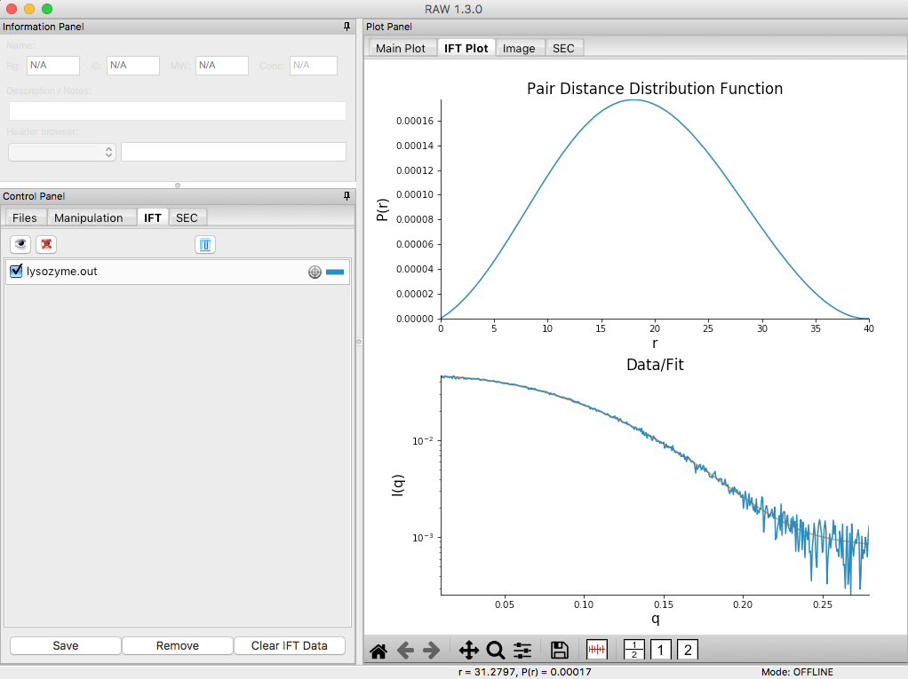
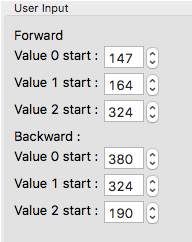
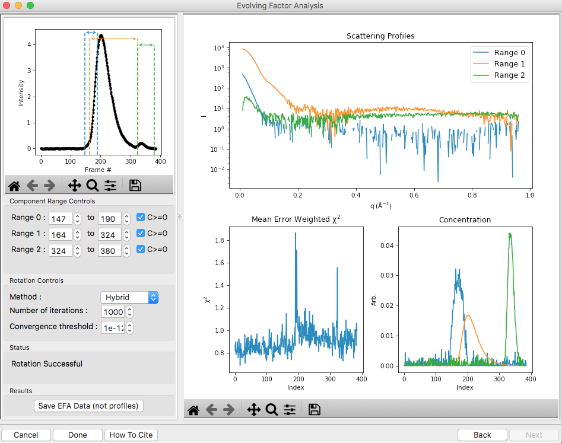
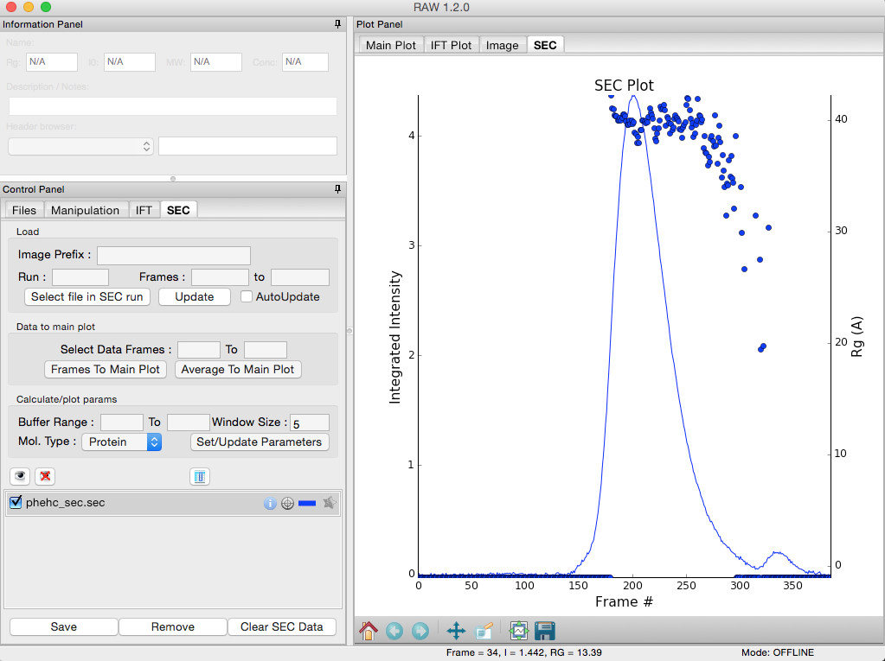
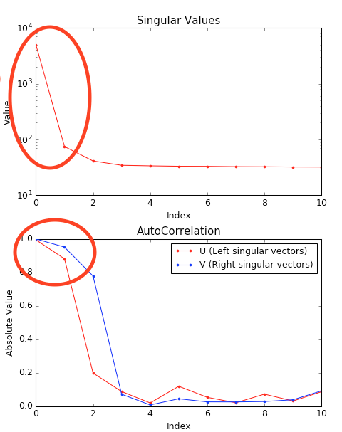
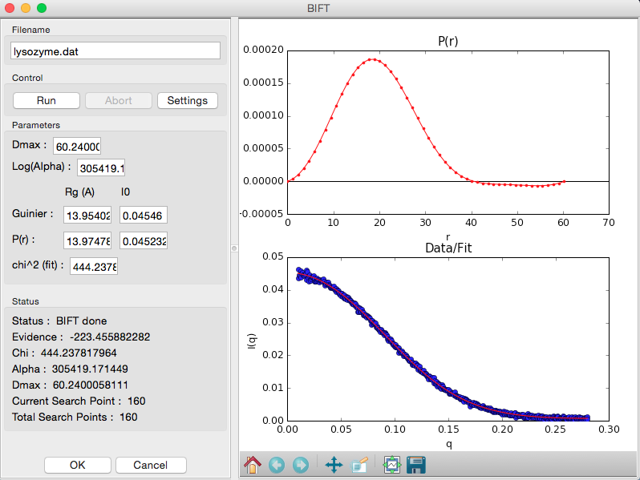

Section 2: Advanced processing
------------------------------
.. _section2:

Part 1. Pair-distance distribution analysis – GNOM in RAW
^^^^^^^^^^^^^^^^^^^^^^^^^^^^^^^^^^^^^^^^^^^^^^^^^^^^^^^^^
The first step in most advanced data processing is to calculate the P(r) function, the inverse
Fourier transform of I(q). This cannot be calculated directly from the scattering profile, so
indirect Fourier transform methods are typically used. The most common such method is implemented
in the GNOM program from the ATSAS package. We will use RAW to run GNOM. Note that you need ATSAS
installed to do this part of the tutorial (see page 1).

#.  Open RAW. The install instructions contain information on installing and running RAW.

#.  Open the **lysozyme.dat** file in the **Tutorial_Data/atsas_data** folder.

#.  Right click on the lysozyme profile in the Manipulation list and select “GNOM (ATSAS)”.

    *   *Note:* RAW will automatically try to find an appropriate maximum dimension (|Dmax|)
        by running the DATGNOM program from the ATSAS software package.

    *   *Troubleshooting:* If you do not have the GNOM option in the right click menu, RAW does
        not know where your ATSAS programs are installed. If you installed the ATSAS programs
        after starting RAW, restart RAW and it will attempt to automatically find them. If that
        has failed, go to the Options->Advanced Options menu and choose the ATSAS settings (“ATSAS”).
        Uncheck the option to “Automatically find the ATSAS bin location”, and specify the location
        manually.

    |100002010000031E00000256B12CDF409139F785_png|

#.  The GNOM panel has plots on the right. These show the P(r) function (top panel), the data
    (bottom panel, blue points) and the fit line (bottom panel, red line).

    *   *Note:* The fit line is the Fourier transform of the P(r) function, and is also
        called the regularized intensity.

#.  On the left of the GNOM panel are the controls and the resulting parameters. You can alter
    the data range used and the |Dmax| value.

    *   *Tip:* The Guinier and P(r) |Rg| and I(0) values should agree well. The total estimate
        varies from 0 to 1, with 1 being ideal. GNOM also provides an estimate of the quality of
        the solution. You want it to be at least a “REASONABLE” solution.

#.  Vary the |Dmax| value up and down in the range of 30-50 in steps of 1. Observe what
    happens to the P(r) and the quality of the solution.

    *   *Note:* |Dmax| is in units of Å.

    *   *Tip:* Recall that we want the following qualities in a P(R) function:

        #.  No negative values.

        #.  A gentle approach to |Dmax| (not suddenly forced down).

        #.   Minimal oscillation.

#.  Return the |Dmax| value to that found by DATGNOM by clicking the “DATGNOM” button.
    |Dmax| should be 40. By default, GNOM forces the P(r) function to zero at |Dmax|.
    For a high quality data set and a good choice of |Dmax|, P(r) should go to zero
    naturally. Change the “Force to 0 Dmax” option to “N”.

    *   *Try:* Vary |Dmax| with this option turned off.

#.  Change the advanced parameters so that the P(r) function is again being forced to zero
    at |Dmax|.

#.  Set the |Dmax| back to 40, and click OK. This saves the results into the RAW IFT panel.

#.  Click on the IFT Control and Plot tabs. This will display the GNOM output you just generated.
    Save the **lysozyme.out** item in the **atsas_data** folder.

    *   *Note:* This saved file is all of the GNOM output, in the GNOM format. It can be used
        as input for any program that needs a GNOM **.out** file.

Part 2. Pair-distance distribution analysis – BIFT in RAW
^^^^^^^^^^^^^^^^^^^^^^^^^^^^^^^^^^^^^^^^^^^^^^^^^^^^^^^^^
RAW also has a built in method for determining the P(r) function using a Bayesian IFT method.
This has the advantage of only have one possible solution. More information on this method can
be found in the RAW paper and manual and references therein.

#.  Right click on the lysozyme profile in the Manipulation list you loaded in Part 1 and
    select “BIFT”.

    |100002010000031E00000257E806280132469D47_png|

#.  The BIFT panel has plots on the right. These show the P(r) function (top panel),
    the data (bottom panel, blue points) and the fit line (bottom panel, red line).

#.  On the left of the BIFT panel are the controls and the resulting parameters. Note that
    in this case you do not control the |Dmax| value, the BIFT method finds that for you
    automatically.

#.  Click OK to exit the BIFT window. This saves the results into the RAW IFT panel.

#.  Click on the IFT Control and Plot tabs. This will display the BIFT output you just generated.
    Save the **lysozyme.ift** item in the **standards_data** folder.

*Note:* As of now, BIFT output from RAW is not compatible with DAMMIF or other ATSAS programs.

Part 3. Assessing ambiguity of 3D shape information - AMBIMETER in RAW
^^^^^^^^^^^^^^^^^^^^^^^^^^^^^^^^^^^^^^^^^^^^^^^^^^^^^^^^^^^^^^^^^^^^^^
It is impossible to determine a provably unique three-dimensional shape from a scattering
profile. This makes it important to determine what degree of ambiguity might be expected
in our reconstructions. The program AMBIMETER from the ATSAS package does this by comparing
the measured scattering profile to a library of scattering profiles from relatively simple
shapes. The more possible shapes that could have generated the scattering profile, the greater
ambiguity there will be in the reconstruction. We will use RAW to run AMBIMETER.

#.  Clear all of the data in RAW. Load the **lysozyme.out** file that you saved in the
    **atsas_data** folder in a previous part of the tutorial.

    *   *Note:* If you haven’t done the previous part of the tutorial, or forgot to save
        the results, you can find the **lysozyme.out** file in the **atsas_data/lysozyme_complete**
        folder.

    |10000201000003FE000002FDB0AAA2A1C8FE8A78_png|

#.  Right click on the **lysozyme.out** item in the IFT list. Select the “Run AMBIMETER” option.

#.  The new window will show the results of AMBIMETER. It includes the number of shape categories
    that are compatible with the scattering profile, the ambiguity score (log base 10 of the
    number of shape categories), and the AMBIMETER interpretation of whether or not you can
    obtain a unique 3D reconstruction.

    *   *Note:* AMBIMETER can also save the compatible shapes (either all or just the best
        fit). You can do that by selecting the output shapes to save, giving it a save
        directory, and clicking run. We won’t be using those shapes in this tutorial.

    |10000201000001C00000020ABF9AC84A21364E29_png|

#.  Click “OK” to exit the AMBIMETER window.

Part 4. 3D reconstruction by bead models – DAMMIF/N and DAMAVER in RAW
^^^^^^^^^^^^^^^^^^^^^^^^^^^^^^^^^^^^^^^^^^^^^^^^^^^^^^^^^^^^^^^^^^^^^^
Shape reconstruction in SAXS is typically done using bead models (also called dummy atom models,
or DAMs). The most common program used to generate these shapes is DAMMIF (and, to a lesser
degree, DAMMIN) from the ATSAS package. We will use RAW to run DAMMIF/N. Because the shape
reconstruction is not unique, a number of distinct reconstructions are generated, and then a
consensus shape is made from the average of these reconstructions. The program DAMAVER from
the ATSAS package is the most commonly used program for building consensus shapes.

#.  Clear all of the data in RAW. Load the **lysozyme.out** file that you saved in the
    **atsas_data** folder in a previous part of the tutorial.

    *   *Note:* If you haven’t done the previous part of the tutorial, or forgot to save
        the results, you can find the **lysozyme.out** file in the
        **atsas_data/lysozyme_complete** folder.

#.  Right click on the **lysozyme.out** item in the IFT list. Select the “Run DAMMIF/N” option.

#.  Running DAMMIF generates a lot of files. Click the “Select/Change Directory” button,
    make a new folder in the **atsas_data** directory called **lysozyme_dammif** and select
    that folder.

#.  Change the number of reconstructions to 5.

    *   *Note:* It is generally recommended that you do at least 10 reconstructions. However,
        for the purposes of this tutorial, 5 are enough.

    *   *Note:* For final reconstructions for a paper, DAMMIF should be run in Slow mode.
        For this tutorial, or for obtaining an initial quick look at results, Fast mode is fine.

    |10000201000002A1000002ECE5BA55E24E8AE493_png|

#.  Click the “Start” button.

    *   *Note:* The status panel will show you the overall status of the reconstructions.
        You can look at the detailed status of each run by clicking the appropriate tab in
        the log panel.

#.  Note that by default the envelopes are aligned and averaged using DAMAVER, and then the
    aligned and averaged profile is refined using DAMMIN.

    *   Some settings are accessible in the panel, and all settings can be changed in the
        advanced settings panel.

#.  Wait for all of the DAMMIF runs, DAMAVER, and DAMMIN refinement to finish. Depending
    on the speed of your computer this could take a bit.

#.  Once the reconstructions are finished, the window should automatically switch to the
    results tab. If it doesn’t, click on the results tab.

    |10000201000002A1000002EB2DC2393D9C13F386_png|

#.  The results panel summarizes the results of the reconstruction run. At the top of the
    panel there is the ambimeter evaluation of how ambiguous the reconstructions might be
    (see previous tutorial section). If DAMAVER was run, there are results from the normalized
    spatial discrepancy (NSD), showing the mean and standard deviation of the NSD, as well as
    how many of the reconstructions were included in the average. If DAMAVER was run on 3 or
    more reconstructions, and ATSAS >=2.8.0 is installed, there will be the output of SASRES
    which provides information on the resolution of the reconstruction. If DAMCLUST was run
    (not shown) there will be information on the clustering. Finally, there will be information
    on each individual model, including the model chi squared, Rg, Dmax, excluded volume,
    molecular weight estimated from the excluded volume, and, if appropriate, mean NSD
    of the model.

    *   *Tip:* Any models are rejected from the average by DAMAVER will be shown in red in
        the models list.

#.  Click the “Save Results Summary” button to save the results summary as a **.csv** file.

#.  Click on the Viewer tab to open the model viewer

    *   *Note:* The model viewer is intended for a fast first look at the results. It is
        not currently up to the standards of a program like pyMOL.

    |10000201000002A1000002EE0AD13F21436E8204_png|

#.  Click and drag the model to spin it.

    *   Note: For lysozyme, it should look more or less like a flattened sphere.

#.   Right click and drag the model to zoom in and out.

#.  Use the “Model to display” menu in the Viewer Controls box to change which
    reconstruction is displayed.

#.  Click the “Close” button when you are finished looking at the results and reconstructions.

Part 5. Advanced SEC-SAXS processing – Singular value decomposition (SVD) and evolving factor analysis (EFA)
^^^^^^^^^^^^^^^^^^^^^^^^^^^^^^^^^^^^^^^^^^^^^^^^^^^^^^^^^^^^^^^^^^^^^^^^^^^^^^^^^^^^^^^^^^^^^^^^^^^^^^^^^^^^
Sometimes SEC fails to fully separate out different species, and you end up with overlapping
peaks in your SEC-SAXS curve. It is possible to apply more advanced mathematical techniques
to determine if there are multiple species of macromolecule in a SEC-SAXS peak, and to attempt
to extract out scattering profiles for each component in an overlapping peak. Singular value
decomposition (SVD) can be used to help determine how many distinct scatterers are in a
SEC-SAXS peak. Evolving factor analysis (EFA) is an extension of SVD that can extract individual
components from overlapping SEC-SAXS peaks.

#.  Clear all of the data in RAW. Load the **phehc_sec.sec** file in the **sec_data** folder.

    *   *Note:* This data was provided by Dr. Steve Meisburger and is some of the data used
        in the paper: *Domain Movements upon Activation of Phenylalanine Hydroxylase
        Characterized by Crystallography and Chromatography-Coupled Small-Angle X-ray
        Scattering*\ . Steve P. Meisburger, Alexander B. Taylor, Crystal A. Khan, Shengnan
        Zhang, Paul F. Fitzpatrick, and Nozomi Ando. Journal of the American Chemical Society
        2016 138 (20), 6506-6516. DOI: 10.1021/jacs.6b01563

    |10000201000003FF000002FD2470C58A1E0F85A8_png|

#.  Right click on the **phehc_sec.sec** item in the SEC list. Select the “SVD” option.

#.  The SVD window will be displayed. On the left are controls, on the right are plots of
    the value of the singular values and the first autocorrelation of the left and right
    singular vectors.

    *   *Note:* Large singular values indicate significant components. What matters is the relative
        magnitude, that is, whether the value is large relative to the mostly flat/unchanging
        value of high index singular values.

    *   *Note:* A large autocorrelation indicates that the singular vector is varying smoothly,
        while a low autocorrelation indicates the vector is very noisy. Vectors corresponding to
        significant components will tend to have autocorrelations near 1 (roughly, >0.6-0.7) and
        vectors corresponding to insignificant components will tend to have autocorrelations near 0.

    |1000020100000320000002A2D123A77E23D67C60_png|

#.  Adjust the starting frame number to 100, the ending frame number to near 300, and switch
    to using Subtracted data.

    *   *Note:* The blue points are in the plot on the left are the region being used for SVD, while the red points shows the rest of the SEC-SAXS curve.

    |100002010000031F000002A41245FE3782B26A6C_png|

#.  We have now isolated the peak. Looking at the top plot, we see there are two singular
    values significantly above the baseline level, and from the autocorrelation we see two
    values with both left and right singular vectors autocorrelations near 1. This indicates
    that there are two scattering components in the peak, even though there are no obvious
    shoulders in the region we selected

    *   *Try:*  Adjust the starting and ending values and seeing how that changes the SVD
        results. Is there a region of the peak you can isolate that has just one significant
        component?

    *   *Note:* Normally, changing between Unsubtracted and Subtracted SEC-SAXS profiles
        should remove one significant singular value component, corresponding to the buffer
        scattering. In this data, you will not see any difference, as the profiles used to
        produce the SEC-SAXS curve were already background subtracted.

    *   *Note:* You can save the SVD plots by clicking the Save button, as with the plots
        in the main RAW window. You can save the SVD results, either just the plotted values
        or all of the values, using the two Save buttons in the SVD panel.

    |10000201000001E00000025F31616EF70FB0318B_png|

#.  Close the SVD window by clicking the OK button.

#.  We will now use EFA to attempt to extract out the two scattering components in the
    main peak in this data. Right click on the **phehc_sec.sec** item in the SEC list.
    Select the “EFA” option.

    |10000201000003B3000002ECA374DC717C28A0DA_png|

#.  For successful EFA, you want to use Subtracted data, and you typically want to have
    a long buffer region before and after the sample. For this data set, using the entire
    frame range (from 0 to 385) is appropriate. With other data sets, you may need to
    change the frame range to, for example, remove other, well separated, peaks from the
    analysis.

#.  RAW attempt to automatically determine how many significant singular values (SVs) there
    are in the selected range. At the bottom of the control panel, you should see that
    RAW thinks there are three significant SVs in our data. For this data set, that is accurate.

    *   *Note:* You should convince yourself of this by looking at the SVD results in
        the plots on this page, using the same approach as in Steps 3-5 above.

#.  Click the “Next” button in the lower right-hand corner of the window to advance to
    the second stage of the EFA analysis.

    *   *Note:* It may take some time to compute the necessary values for this next step,
        so be patient.

    |10000201000003B6000002EBE2BBC8749420E175_png|

#.  This step shows you the “Forward EFA” and “Backward EFA” plots. These plots represent
    the value of the singular values as a function of frame.

    *   *Note:* There is one more singular value displayed on each plot than available in
        the controls. This is so that in the following Steps you can determine where each
        component deviates from the baseline.

#.  In the User Input panel, tweak the “Forward” value start frames so that the frame
    number, as indicated by the open circle on the plot, aligns with where the singular
    value first starts to increase quickly. This should be around 148, 165, and 324.

    *   *Note:* For the Forward EFA plot, SVD is run on just the first two frames, then
        the first three, and so on, until all frames in the range are included. As more
        frames are added, the singular values change, as shown on the plot. When a singular
        values starts increasingly sharply, it indicates that there is a new scattering
        component in the scattering profile measured at that point. So, for the first ~150
        frames, there are no new scattering components (i.e. just buffer scattering). At
        frame ~151, we see the first singular value (the singular value with index 0, l
        abeled SV 0 on the plot) start to strongly increase, showing that we have gained
        a scattering component. We see SV 1 start to increase at ~167, indicating another
        scattering component starting to be present in the scattering profile.

#.  In the User Input panel, tweak the “Backward” value start frames so that the frame
    number, as indicated by the open circle on the plot, aligns with where the singular
    value first starts to increase quickly, reading the plot left to right (i.e. where
    it drops back to near the baseline). This should be values 380, 324, and 190.

    *   *Note:* For the Backward EFA plot, SVD is run on just the last two frames, then the
        last three, and so on, until all frames in the range are included. As more frames are
        added, the singular values change, as shown on the plot. When a singular values starts
        increasingly sharply (as seen from right to left), it indicates that there is a new
        scattering component in the scattering profile measured at that point.

    *   *Note:*
        The algorithm for determining the start and end points is not particularly advanced. For some datasets you may need to do significantly more adjustment of these values

    |10000201000000C0000000F27D3BE3AA11912468_png|

#.  Click the “Next” button in the bottom right corner to move to the last stage of the
    EFA analysis.

    |10000201000003B3000002EB8E792276E0CD8D88_png|

#.  This window shows controls on the left and results on the right. In the controls area,
    at the top is a plot showing the SEC-SAXS curve, along with the ranges occupied by
    each scattering component, as determined from the input on the Forward and Backward
    EFA curves in stage 2 of the analysis. The colors of the ranges correspond to the
    colors labeled in the Scattering Profiles plot on the top right and the Concentration
    plot in the lower right. This panel takes the SVD vectors and rotates them back into
    scattering vectors corresponding to real components.

    *   *Note:* This rotation is not guaranteed to be successful, or to give you valid
        scattering vectors. Any data obtained via this method should be supported in other
        ways, either using other methods of deconvolving the peak, other biophysical or
        biochemical data, or both!

#.  Fine tune the ranges using the controls in the “Component Range Controls” box. Adjust the
    start of Range 2 down until it overlaps with Range 1.

    *   *Question:* What is the effect on the chi-squared plot?

#.  Adjust the starts and ends of Range 0 and the start of Range 1 by a few points
    until the spikes in the chi-squared plot go away. After these adjustments, Range 0
    should be from 147 to 197, Range 1 from 161 to 324, and Range 2 from 323 to 380.

    |10000201000001200000006C3B50236567420D74_png|

#.  To see these changes on the Forward and Backward EFA plots, click the “Back” button
    at the bottom right of the page. Verify that all of your start and end values are
    close to where the components become significant, as discussed in Steps 12 and 13.

#.  Click the “Next” button to return to the final stage of the EFA analysis.

#.  In the Controls box, you can set the method, the number of iterations, and the
    convergence threshold. As you can see in the Status window, the rotation was
    successful for this data. If it was not, you could try changing methods or adjusting
    the number of iterations or threshold.

#.  Examine the chi-squared plot. It should be uniformly close to 1 for good EFA. For
    this data, it is.

#.  Examine the concentration plot. You’ll see three peaks, corresponding to the
    concentrations for the three components. In the Range Controls, uncheck the Range
    0 C>=0 box. That removes the constraint that the concentration must be positive.
    If this results in a significant change in the peak, your EFA analysis is likely
    poor, and you should not trust your results.

    *   *Note:* The height of the concentration peaks is arbitrary, all peaks are
        normalized to have an area of 1.

#.  Uncheck all of the C>=0 controls.

    *   *Question:* Do you observe any significant changes in the scattering profiles,
        chi-squared, or concentration when you do this? How about if you uncheck one and
        leave the others checked?

#.  Recheck all of the C>=0 controls. You have now verified, as much as you can, that
    the EFA analysis is giving you reasonable results.

    *   *Reminder:* Here are the verification steps we have carried out, and you should carry
        out every time you do EFA:

            #.  Confirm that your selected ranges correspond to the start points of the
                Forward and Backward EFA values (Steps 12-13).

            #.  Confirm that your chi-squared plot is close to 1, without any major
                spikes (Step 21).

            #.  Confirm that your concentrations are not significantly altered by
                constraining the concentration to be positive (Steps 22-23).

#.  Click the “Save EFA Data (not profiles)” to save the EFA data, including the SVD,
    the Forward and Backward EFA data, the chi-squared, and the concentration, along
    with information about the selected ranges and the rotation method used.

#.  Click the “Done” button to send the scattering profiles to the Main Plot.

#.  In the main RAW window, go to the Manipulation control tab and the Main plot. If
    it is not already, put the Main plot on a semi-Log or Log-Log scale.

    |1000020100000401000002FFB79B21A115149137_png|

#.  The three scattering profiles from EFA are in the manipulation list. The labels _0,
    _1, and _2 correspond to the 0, 1, and 2 components/ranges.

    *   *Note:* Regardless of whether you use subtracted or unsubtracted data, these
        scattering profiles will be buffer subtracted, as the buffer represents a
        scattering component itself, and so (in theory) even if it is present will be
        separated out by successful EFA.

.. |10000201000001C00000020ABF9AC84A21364E29_png| image:: images/10000201000001C00000020ABF9AC84A21364E29.png
    :width: 4.1602in
    :height: 4.8472in

.. |10000201000002A1000002ECE5BA55E24E8AE493_png| image:: images/10000201000002A1000002ECE5BA55E24E8AE493.png
    :width: 5.1193in
    :height: 5.6902in

.. |10000201000002A1000002EB2DC2393D9C13F386_png| image:: images/10000201000002A1000002EB2DC2393D9C13F386.png
    :width: 4.8693in
    :height: 5.4047in

.. |10000201000001200000006C3B50236567420D74_png| image:: images/10000201000001200000006C3B50236567420D74.png
    :width: 2.8693in
    :height: 1.0756in

.. |10000201000003B6000002EBE2BBC8749420E175_png| image:: images/10000201000003B6000002EBE2BBC8749420E175.png

.. |100002010000031E00000256B12CDF409139F785_png| image:: images/100002010000031E00000256B12CDF409139F785.png
    :width: 5.6193in
    :height: 4.211in

.. |1000020100000320000002A2D123A77E23D67C60_png| image:: images/1000020100000320000002A2D123A77E23D67C60.png

.. |1000020100000401000002FFB79B21A115149137_png| image:: images/1000020100000401000002FFB79B21A115149137.png

.. |10000201000002A1000002EE0AD13F21436E8204_png| image:: images/10000201000002A1000002EE0AD13F21436E8204.png
    :width: 4.6193in
    :height: 5.148in

.. |100002010000031F000002A41245FE3782B26A6C_png| image:: images/100002010000031F000002A41245FE3782B26A6C.png

.. |10000201000003B3000002ECA374DC717C28A0DA_png| image:: images/10000201000003B3000002ECA374DC717C28A0DA.png

.. |Rg| replace:: R\ :sub:`g`

.. |Dmax| replace:: D\ :sub:`max`
